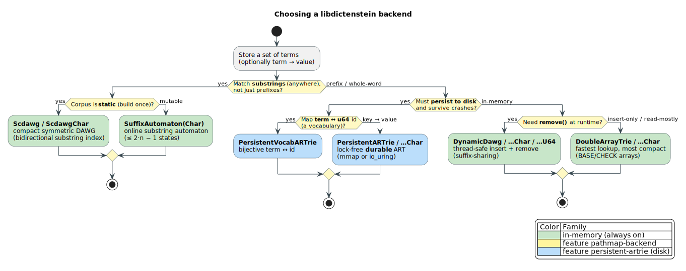
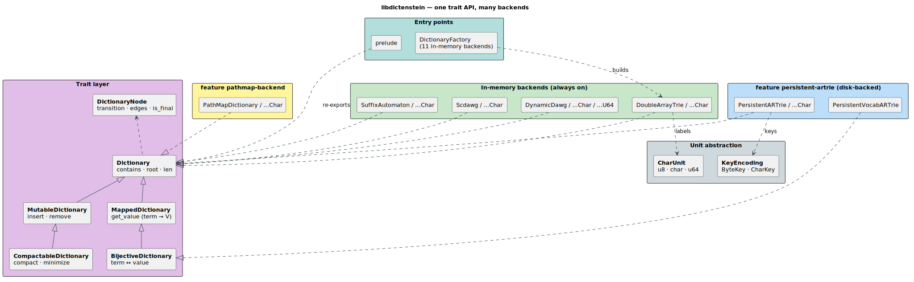
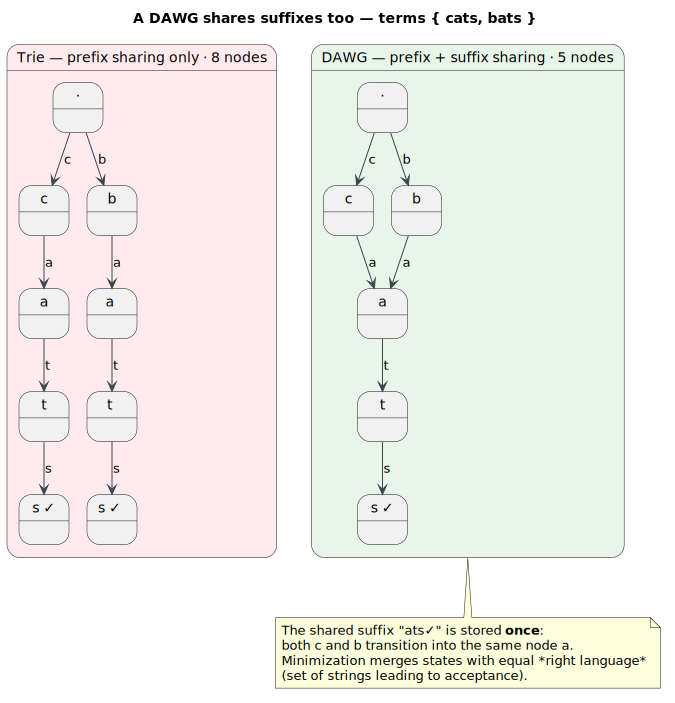
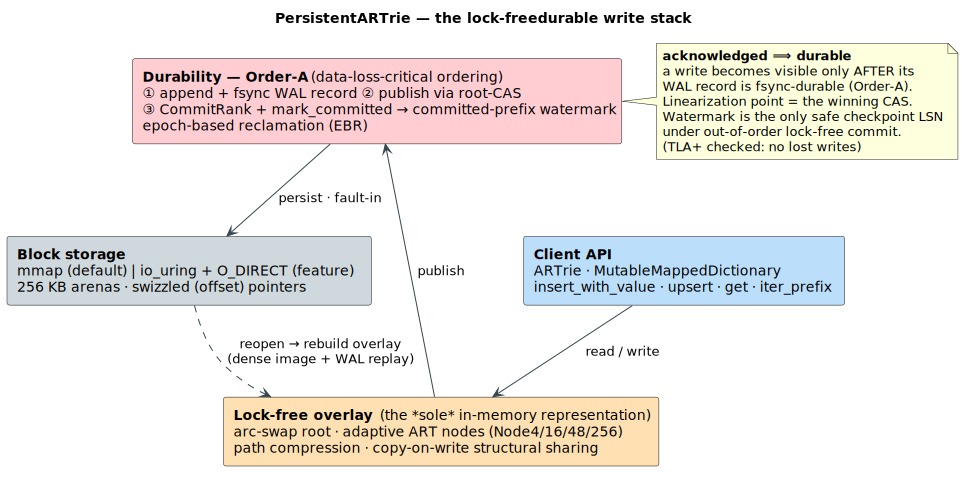

# libdictenstein

**A toolbox of high-performance dictionary data structures for Rust** — tries, DAWGs, double-array tries, suffix automata, and a lock-free **durable** Adaptive Radix Tree — unified behind one small trait API, and backed by machine-checked proofs.


---

## What is libdictenstein?

libdictenstein provides the **container** half of approximate string matching: efficient, traversable collections of terms (a *dictionary*), optionally mapping each term to a value. Every backend exposes a uniform [`Dictionary`](#core-traits) interface — `contains`, `root`, and node-by-node `transition` — so you can swap implementations without touching call sites.

It is the companion to **[liblevenshtein](https://github.com/universal-automata/liblevenshtein-rust)**, which supplies the *query* half: a Levenshtein-automaton transducer that walks any `Dictionary` to find all terms within an edit distance. libdictenstein itself contains **no** fuzzy-matching code — it focuses on being the fastest, most correct set of dictionaries that transducer can traverse.

> **Terminology.** A **term** is a string in the dictionary. A **prefix** is a leading substring (`"ca"` of `"cat"`); a **substring** occurs anywhere (`"at"` in `"cat"`). `Σ` (sigma) is the *alphabet* — the set of symbols an edge can carry (256 byte values, or all Unicode scalar values). A symbol is a **unit**; **fanout** is a node's child count; `∣x∣` is the length of `x`.

---

## Highlights

- **14 backends** spanning the time/space/durability frontier — pick by need, not by lock-in.
- **Three alphabets, one code path** — byte (`u8`), Unicode (`char`), and 64-bit token (`u64`) units via the [`CharUnit`](#core-traits) abstraction.
- **A lock-free, crash-durable Adaptive Radix Tree** — disk-backed (`mmap` or `io_uring`), write-ahead-logged, with `O(∣key∣)` lookups independent of dictionary size.
- **Set algebra over dictionaries** — union / intersection / difference / prefix *zippers* compose any two backends lazily.
- **Formally verified core** — 65 Rocq files (0 axioms, 0 admits), 51 TLA⁺ models, and a CI-gated `unsafe` contract inventory (see [Formal verification](#formal-verification)).

---

## Backend selector



| Backend                                                      | Best for                                          | Updates               | Unicode               | Lookup           |
|--------------------------------------------------------------|---------------------------------------------------|-----------------------|-----------------------|------------------|
| **DoubleArrayTrie** / `…Char`                                | general use; fastest lookup, most compact         | insert-only (rebuild) | `u8` / `char`         | `O(∣q∣)`       |
| **DynamicDawg** / `…Char` / `…U64`                           | runtime insert **and** remove; suffix sharing     | insert + remove       | `u8` / `char` / `u64` | `O(∣q∣)`       |
| **SuffixAutomaton** / `…Char`                                | **substring** search (match anywhere)             | insert + remove       | `u8` / `char`         | `O(∣q∣)`       |
| **Scdawg** / `…Char`                                         | static, compact **bidirectional** substring index | build-once            | `u8` / `char`         | `O(∣q∣)`       |
| **PathMapDictionary** / `…Char` *(feat. `pathmap-backend`)*  | shared-structure mutable trie                     | insert + remove       | `u8` / `char`         | `O(∣q∣)`       |
| **PersistentARTrie** / `…Char` *(feat. `persistent-artrie`)* | disk-backed, crash-durable key→value              | insert + remove       | `u8` / `char`         | `O(∣q∣)` + I/O |
| **PersistentVocabARTrie** *(feat. `persistent-artrie`)*      | durable **term ↔ u64** vocabulary (bijection)     | insert                | `char`                | `O(∣q∣)`       |

`∣q∣` is the query length; lookup cost is **independent of the number of stored terms** `n` for every backend — the defining property of trie-shaped indexes. The factory (below) constructs all **11** in-memory backends from one call; the 3 disk-backed variants take a file path.

---

## Architecture at a glance



The design is a thin **trait layer** over interchangeable **backend families**. Backends implement only the traits they can honor (a read-only static trie implements `Dictionary`; a DAWG also implements `MutableDictionary` and `CompactableDictionary`). The **unit abstraction** (`CharUnit` for edge labels, `KeyEncoding` for the persistent keys) lets one generic implementation serve `u8`, `char`, and `u64` alphabets. The **factory** and **prelude** are the ergonomic entry points.

---

## Quick start

```toml
[dependencies]
libdictenstein = "0.1"
```

**Build, query, traverse** (any in-memory backend):

```rust
use libdictenstein::prelude::*;            // Dictionary, DictionaryNode, Mutable*, …
use libdictenstein::double_array_trie::DoubleArrayTrie;

let dict = DoubleArrayTrie::from_terms(vec!["hello", "help", "world"]);

assert!(dict.contains("hello"));
assert!(!dict.contains("hel"));            // "hel" is a prefix, not a term

// Walk the automaton edge-by-edge (this is what a fuzzy transducer does):
let root = dict.root();
if let Some(next) = root.transition(b'h') {
    assert!(next.transition(b'e').is_some());
}
```

**Associate values with terms** (a *mapped* dictionary):

```rust
use libdictenstein::prelude::*;
use libdictenstein::dynamic_dawg::DynamicDawg;

// A byte-level DAWG mapping each term to a u64 value (the value type defaults to `()`).
let counts: DynamicDawg<u64> = DynamicDawg::new();
counts.insert_with_value("apple", 3);
counts.insert_with_value("apricot", 1);
assert_eq!(counts.get_value("apple"), Some(3));
```

**Persist to disk, durably** (feature `persistent-artrie`):

```rust,no_run
use libdictenstein::persistent_artrie_char::PersistentARTrieChar;

// Create + populate; values are u64 here.
let trie = PersistentARTrieChar::<u64>::create("words.artc")?;
for i in 0..1000 {
    trie.upsert(&format!("term{i:05}"), i as u64)?;   // durably logged, then published
}
trie.checkpoint()?;                                    // fold the overlay into a dense on-disk image

// Reopen in a later process — state survives a crash up to the last durable write.
let reopened = PersistentARTrieChar::<u64>::open("words.artc")?;
assert_eq!(reopened.get("term00500"), Some(500));
# Ok::<(), Box<dyn std::error::Error>>(())
```

---

## Core traits

The public surface is small and layered — implement only what a backend can support.

| Trait                         | Adds                                                  | Honored by                                 |
|-------------------------------|-------------------------------------------------------|--------------------------------------------|
| **`Dictionary`**              | `contains`, `root`, `len`, `is_empty`                 | every backend                              |
| **`DictionaryNode`**          | `transition(unit)`, `edges`, `is_final`               | every node type                            |
| **`MappedDictionary`**        | `get_value(term) → Option<V>`                         | valued backends                            |
| **`MutableDictionary`**       | `insert`, `remove`, `extend`                          | DAWG, PathMap, SuffixAutomaton, persistent |
| **`CompactableDictionary`**   | `compact`, `minimize`                                 | DAWG family                                |
| **`MutableMappedDictionary`** | `insert_with_value`, `union_with`, `update_or_insert` | valued + mutable                           |
| **`BijectiveDictionary`**     | reverse lookup `value → term`                         | `BijectiveMap`, vocab tries                |

Two **unit abstractions** let one implementation serve every alphabet:

- **`CharUnit`** — the edge-label type: `u8` (bytes; ASCII/Latin-1, smallest), `char` (Unicode scalar values; correct character-level semantics), or `u64` (token / time-series labels).
- **`KeyEncoding`** — the persistent-trie key model: `ByteKey` (`u8` spans) or `CharKey` (`u32` codepoint spans).

Values must implement **`DictionaryValue`** (`Clone + Send + Sync + 'static`); the blanket impls cover `()`, the integer types, `String`, `Vec<T>`, `HashSet<T>`, and `SmallVec`. `()` makes a *set* (membership only); any other `V` makes a *map*.

Construct any in-memory backend uniformly with [`DictionaryFactory`], or pull the common names from the [`prelude`].

---

## Algorithms (the interesting part)

Every backend answers a lookup in `O(∣q∣)` — but *how* they store terms, and what else they can do, differs sharply. Below, the load-bearing ideas in literate form. Deep dives live under [`docs/algorithms/`](docs/algorithms/) and [`docs/theory/`](docs/theory/).

### Double-Array Trie (DAT) — cache-resident static lookup

A **double-array trie** packs a trie into two parallel integer arrays, `BASE` and `CHECK`. The child of state `s` on unit `u` is found arithmetically — no pointer chase:

```text
t = BASE[s] + offset(u)
child exists  ⟺  CHECK[t] == s          # CHECK validates the parent that placed t
```

Because `BASE[s]` and the candidate slot sit adjacently, a transition is typically a **single cache line** touch — empirically ~3× faster than pointer-following structures, at ~8 bytes/state. The cost: it is *insert-only* (built from a sorted term list); use a DAWG when you need `remove`. — Aoe (1989); Yata et al. (2007).

### DAWG minimization via signature hashing

A **DAWG** (Directed Acyclic Word Graph) is a trie that *also* merges identical **suffixes**: the `"-tion"` shared by a million English words is stored once.



Two nodes are mergeable **iff** they have the same *right language*

> **Rᵤ** = { strings spelled out on paths from `u` to any final state }.

Comparing right-languages directly is expensive, so libdictenstein hashes them. Each node folds a 64-bit [`FxHash`](src/node_signature.rs) of its `is_final` flag and its **sorted** edges, bottom-up:

```text
signature(u) = FxHash( u.is_final, sort[ (label, signature(child)) : edge (label→child) of u ] )

# during incremental construction, after building the freshly-inserted path:
for each new node u (deepest first):
    if ∃ live node v with signature(v) == signature(u):
        if structurally_equal(u, v):      # guard against a 64-bit hash collision
            redirect u's parent edge to v # merge: u is discarded
```

Sorting the edges makes the signature independent of insertion order; the structural re-check defeats the birthday-paradox collision of a 64-bit hash. This replaces a recursive `Box<Signature>` (≈ 3000 allocations for a 1000-node graph) with a single allocation-free `u64` comparison. — Blumer et al. (1987); Daciuk (2000).

### Suffix automaton — substring search in `O(∣q∣)`

To match a pattern *anywhere* in a text (not just at a word boundary), build the minimal DFA recognizing **every substring**. Its states are equivalence classes of substrings sharing the same set of end-positions (**endpos**). It is built **online** — one character at a time, amortized `O(1)` each:

```text
extend(c):                              # append character c to the indexed text
    cur ← new state with len = last.len + 1
    p ← last
    while p ≠ ⊥ and p has no c-edge:    # walk the suffix-link chain, adding the new edge
        add edge  p --c--> cur ;  p ← suffix_link(p)
    if p = ⊥:
        suffix_link(cur) ← root
    else:
        q ← target of p's c-edge
        if len(q) = len(p) + 1:
            suffix_link(cur) ← q
        else:                            # endpos classes diverge — split q (the only costly step)
            clone q as q′ ; rewire the affected c-edges and suffix links to q′
    last ← cur
```

The automaton provably has `≤ 2·∣T∣ − 1` states and `≤ 3·∣T∣ − 4` transitions for text `T`, giving `O(∣T∣)` construction and `O(∣q∣)` substring queries. The **Scdawg** backend is a *symmetric compact* refinement that adds left-extension edges for bidirectional search at ~20–30% fewer states. — Blumer et al. (1985); Crochemore (1986); Inenaga et al. (2001, 2005).

### Complexity & memory at a glance

Let `∣q∣` = query length, `N` = number of terms, `n` = total indexed size in units. Every backend
answers membership in `O(∣q∣)`, **independent of `N`** — they diverge on updates and footprint
(bytes/state are approximate, order-of-magnitude):

| Backend              | Lookup                   | Insert           | Remove           | ~Bytes/state  | Construction               |
|----------------------|--------------------------|------------------|------------------|---------------|----------------------------|
| **DoubleArrayTrie**  | `O(∣q∣)`               | append-only      | —                | ~8            | `O(N log N)` (sort + pack) |
| **DynamicDawg**      | `O(∣q∣)`               | `O(∣q∣ log n)` | `O(∣q∣ log n)` | ~25–32        | incremental + minimize     |
| **SuffixAutomaton**  | `O(∣q∣)` *(substring)* | `O(1)` amortized | `O(n)` rebuild   | ~40–50        | `O(n)` online              |
| **Scdawg**           | `O(∣q∣)` *(substring)* | build-once       | —                | ~30–40        | `O(n)`                     |
| **PersistentARTrie** | `O(∣q∣)` + I/O         | `O(∣q∣)` + I/O | `O(∣q∣)` + I/O | ~30–50 + disk | incremental                |

The double-array trie's `O(N log N)` build buys the cheapest, most cache-resident lookup; the DAWG
family trades a `log n` insert factor for runtime mutation **and** suffix sharing; the suffix automaton
spends ~2× the memory to answer *substring* (not just prefix) queries; the persistent ART adds a bounded,
path-compressed number of disk I/Os per level.

---

## Persistent ARTrie — lock-free & durable

The flagship backend is a disk-backed **Adaptive Radix Tree (ART)**: a radix tree whose nodes adapt their representation to their fanout, paired with a **write-ahead log (WAL)** for crash durability and a lock-free (atomic **compare-and-swap**, *CAS*) in-memory overlay for concurrency.



### Adaptive nodes + SIMD

A radix-tree node's fanout ranges from 1 to `∣Σ∣ = 256`. A fixed 256-pointer array wastes ~98% of its slots on sparse nodes; a sorted list is slow on dense ones. **ART stores each node in one of four layouts, chosen by fanout** — so memory tracks the children actually present:

```text
find_child(node, byte):
    match node.kind:
        Node4   →  linear scan keys[0..4]            # ≤4 children; fits one cache line
        Node16  →  m   = cmpeq( splat(byte), keys )  # SSE: 16 byte-compares in ONE instruction
                   bit = movemask(m) & ((1<<n) − 1)  #   → 16-bit match mask
                   return bit ≠ 0 ? children[tzcnt(bit)] : ∅   # trailing-zero count = slot
        Node48  →  slot = index[byte] ; children[slot]   # 256-byte index → 48 pointer slots
        Node256 →  children[byte]                         # direct array; dense nodes
```

Per-node lookup is `O(1)` (bounded by `∣Σ∣`); the **Node16** path turns `≤ 16` scalar comparisons into one **SIMD** (single-instruction, multiple-data) `_mm_cmpeq_epi8` instruction. A node grows to the next layout when it overflows (Node4→16→48→256) and shrinks on removal — amortized `O(1)` per child. — Leis et al. (2013).

### Path compression

Storing `"metamorphosis"` as 14 single-child nodes wastes space and, on disk, **14 page faults**. ART collapses single-child chains, keeping a per-node *partial prefix*:

```text
check_prefix(node, key, depth):
    for i in 0 .. min(node.partial_len, 8):          # "pessimistic": compare stored bytes inline
        if key[depth + i] ≠ node.partial[i]:
            return Mismatch(i)
    # partial_len > 8 ("optimistic"): the prefix was truncated — defer full verification to the leaf
```

Tree height drops from `O(∣key∣)` to `O(∣key∣ / s̄)` for mean compressed span `s̄`, a ~2–4× reduction (hence ~2–4× fewer I/Os) on natural-language keys. — Morrison (1968).

### Durable writes: the Order-A protocol

The persistent ARTrie is **lock-free** (readers and writers never block on a global lock) yet **crash-durable** (an acknowledged write survives power loss). The reconciling invariant is `acknowledged ⟹ durable`, enforced by a strict, non-negotiable ordering ([`durable_write.rs`](src/persistent_artrie_core/overlay/durable_write.rs)):

```text
durable_insert(term, value):                  # requires durability ∈ { Immediate, GroupCommit }
  ① lsn  ← WAL.append_durable( Insert{term, value} )   #  fsync FIRST — before any visibility
  ② publish (term, value) by CAS on the overlay root   #  the visibility point = linearization point
  ③ rk   ← WAL.append_durable( CommitRank{lsn} )        #  fixes the order of concurrent commits
     mark_committed(lsn) ; mark_committed(rk)           #  advance the committed-prefix watermark
  ④ ACK                                                 #  now durable AND visible
```

Why the order is sacred:

- **Log before publish (Order A).** The opposite — publish-then-log (Order B) — can expose a write that is *visible but not yet durable*; a crash in that window loses an acknowledged write. Rejected.
- **One append per write.** The single WAL record covers *every* CAS retry; re-appending on retry would burn log-sequence numbers (**LSN**s) and punch holes in the committed prefix.
- **The watermark, not the frontier.** Under out-of-order lock-free commit, the only safe checkpoint LSN is the **committed-prefix watermark** (the largest `L` such that every `LSN ≤ L` is committed) — using the appended frontier instead would checkpoint an uncommitted write.

Freed nodes are reclaimed by **epoch-based reclamation (EBR)**: memory is released only after every reader that *could* hold a pointer to it has departed its epoch — bounded-latency, lock-free, and free of use-after-free. The on-disk substrate is `mmap` by default, or `io_uring` + `O_DIRECT` (feature `io-uring-backend`, Linux ≥ 5.1) for batched async I/O. — Mohan et al. (1992) for the WAL/recovery discipline; Driscoll et al. (1989) for the copy-on-write structural sharing.

---

## Feature flags

| Feature                       | Effect                                            | Notes                                                                                                                                                                                        |
|-------------------------------|---------------------------------------------------|----------------------------------------------------------------------------------------------------------------------------------------------------------------------------------------------|
| `default` = `["parking_lot"]` | `parking_lot::RwLock` for the dynamic backends    | faster than `std`                                                                                                                                                                            |
| `pathmap-backend`             | the `PathMap*` backends                           | structural-sharing trie                                                                                                                                                                      |
| `serialization`               | `serde` + `bincode` + JSON (de)serialization      |                                                                                                                                                                                              |
| `compression`                 | gzip the serialized form (`flate2`)               |                                                                                                                                                                                              |
| `protobuf`                    | Protobuf (de)serialization (`prost`)              |                                                                                                                                                                                              |
| `persistent-artrie`           | the disk-backed ART family                        | `mmap` + WAL                                                                                                                                                                                 |
| `io-uring-backend`            | `io_uring` + `O_DIRECT` block storage             | Linux ≥ 5.1                                                                                                                                                                                  |
| `parallel-merge`              | multi-core merge via `rayon`                      |                                                                                                                                                                                              |
| `group-commit`                | batched WAL group commit                          | ⚠️ **experimental** — measured ~1.5–2× *regression* on NVMe; intended only for slow storage. See [`docs/persistence/group_commit_regression.md`](docs/persistence/group_commit_regression.md) |
| `lling-llang`                 | WFST semiring integration for the `Lattice` trait |                                                                                                                                                                                              |
| `bench-internals`             | expose internal APIs to benchmarks                |                                                                                                                                                                                              |

---

## Formal verification

The persistent ARTrie carries an unusually strong correctness budget. All figures below are checked into the repository and re-derivable from the sources under [`formal-verification/`](formal-verification/).

| Tool | Scope | Status |
|---|---|---|
| **Rocq (Coq)** | functional correctness + refinement of the trie to an abstract map ADT | **65** `.v` files, **1,265** propositions (theorem/lemma/corollary), **0 `Admitted`, 0 `Axiom`, 0 `Parameter`** — fully constructive (every obligation closed by `Qed.`/`Defined.`) |
| **TLA⁺ / TLC** | concurrency & crash-recovery safety/liveness | **51** specification modules — e.g. `LockFreeARTrieLinearizability`, `CrashRecovery`, `LockFreeDurableCheckpoint`, `PublicDurabilityPolicy`; the composed model explores multi-million-state spaces (PART ≈ 4.2 M distinct states) |
| **loom** | exhaustive interleaving of the lock-free CAS paths | root-CAS, overlay value/index CAS, counter-merge, EBR |
| **`unsafe` inventory** | every `unsafe` site bound to a reviewed contract + coverage class | **43** inventory rows / **31** contracts, CI-gated by `scripts/verify-unsafe-boundary-inventory.sh` (set-equality — no silent drift) |

Headline properties proven or model-checked: **linearizability** of the lock-free root, **no lost writes** (the Order-A watermark discipline), **crash-recovery completeness** (durable-prefix replay), and **no use-after-free** under EBR. Out-of-scope boundaries (e.g. the upstream Levenshtein transducer, kernel `io_uring` internals, certified compilation) are stated explicitly in [`formal-verification/GAP_LEDGER.md`](formal-verification/GAP_LEDGER.md).

---

## Performance

Indicative figures for a 10,000-word English corpus (build once, then query) — **relative** behavior matters more than absolute times, which vary by CPU, allocator, and corpus. Run `cargo bench` for your platform; full result logs live under [`docs/benchmarks/`](docs/benchmarks/).

```text
                       DoubleArrayTrie     DynamicDawg
   construction              ~3.2 ms          ~7.2 ms
   exact-match lookup        ~6.6 µs          ~19.8 µs
   contains (cached)         ~0.22 µs         ~6.7 µs
```

The takeaway: a static double-array trie wins read-heavy workloads; a DAWG pays a constant factor for runtime `insert`/`remove` and suffix-sharing. Disk-backed throughput (mmap vs io_uring) is characterized in [`docs/io_uring_migration/benchmark_results.md`](docs/io_uring_migration/).

---

## Documentation map

| Topic                                            | Where                                                                            |
|--------------------------------------------------|----------------------------------------------------------------------------------|
| Per-backend algorithm walkthroughs               | [`docs/algorithms/`](docs/algorithms/)                                           |
| Theory: disk tries, ART, SCDAWG (with citations) | [`docs/theory/`](docs/theory/)                                                   |
| Persistent-ARTrie mmap architecture              | [`docs/persistence/mmap-architecture.md`](docs/persistence/mmap-architecture.md) |
| Eviction design                                  | [`docs/eviction/`](docs/eviction/)                                               |
| Proof scope, results, gap ledger                 | [`formal-verification/`](formal-verification/)                                   |
| Diagram sources (PlantUML)                       | [`docs/diagrams/`](docs/diagrams/)                                               |
| Changelog                                        | [`CHANGELOG.md`](CHANGELOG.md)                                                   |

---

## References

All DOIs below were verified against Crossref to resolve to the cited work.

1. Fredkin, E. (1960). *Trie Memory.* Communications of the ACM 3(9). [10.1145/367390.367400](https://doi.org/10.1145/367390.367400)
2. Morrison, D. R. (1968). *PATRICIA — Practical Algorithm To Retrieve Information Coded in Alphanumeric.* Journal of the ACM 15(4). [10.1145/321479.321481](https://doi.org/10.1145/321479.321481)
3. Blumer, A., et al. (1985). *The Smallest Automaton Recognizing the Subwords of a Text.* Theoretical Computer Science 40. [10.1016/0304-3975(85)90157-4](https://doi.org/10.1016/0304-3975(85)90157-4)
4. Crochemore, M. (1986). *Transducers and Repetitions.* Theoretical Computer Science 45(1). [10.1016/0304-3975(86)90041-1](https://doi.org/10.1016/0304-3975(86)90041-1)
5. Blumer, A., et al. (1987). *Complete Inverted Files for Efficient Text Retrieval and Analysis.* Journal of the ACM 34(3). [10.1145/28869.28873](https://doi.org/10.1145/28869.28873)
6. Aoe, J. (1989). *An Efficient Digital Search Algorithm by Using a Double-Array Structure.* IEEE Transactions on Software Engineering 15(9). [10.1109/32.31365](https://doi.org/10.1109/32.31365)
7. Driscoll, J. R., et al. (1989). *Making Data Structures Persistent.* Journal of Computer and System Sciences 38(1). [10.1016/0022-0000(89)90034-2](https://doi.org/10.1016/0022-0000(89)90034-2)
8. Mohan, C., et al. (1992). *ARIES: A Transaction Recovery Method Supporting Fine-Granularity Locking and Partial Rollbacks Using Write-Ahead Logging.* ACM Transactions on Database Systems 17(1). [10.1145/128765.128770](https://doi.org/10.1145/128765.128770)
9. Crochemore, M., & Vérin, R. (1997). *Direct Construction of Compact Directed Acyclic Word Graphs.* CPM, LNCS 1264. [10.1007/3-540-63220-4_55](https://doi.org/10.1007/3-540-63220-4_55)
10. Daciuk, J., et al. (2000). *Incremental Construction of Minimal Acyclic Finite-State Automata.* Computational Linguistics 26(1). [10.1162/089120100561601](https://doi.org/10.1162/089120100561601)
11. Inenaga, S., et al. (2001). *On-line Construction of Symmetric Compact Directed Acyclic Word Graphs.* SPIRE. [10.1109/SPIRE.2001.989743](https://doi.org/10.1109/SPIRE.2001.989743)
12. Schulz, K. U., & Mihov, S. (2002). *Fast String Correction with Levenshtein Automata.* International Journal on Document Analysis and Recognition 5(1). [10.1007/s10032-002-0082-8](https://doi.org/10.1007/s10032-002-0082-8) — the basis of the companion `liblevenshtein`.
13. Inenaga, S., et al. (2005). *On-line Construction of Compact Directed Acyclic Word Graphs.* Discrete Applied Mathematics 146(2). [10.1016/j.dam.2004.04.012](https://doi.org/10.1016/j.dam.2004.04.012)
14. Yata, S., et al. (2007). *A Compact Static Double-Array Keeping Character Codes.* Information Processing & Management 43(1). [10.1016/j.ipm.2006.04.004](https://doi.org/10.1016/j.ipm.2006.04.004)
15. Askitis, N., & Zobel, J. (2008). *B-tries for Disk-based String Management.* The VLDB Journal 18(1). [10.1007/s00778-008-0094-1](https://doi.org/10.1007/s00778-008-0094-1)
16. Leis, V., Kemper, A., & Neumann, T. (2013). *The Adaptive Radix Tree: ARTful Indexing for Main-Memory Databases.* IEEE ICDE. [10.1109/ICDE.2013.6544812](https://doi.org/10.1109/ICDE.2013.6544812)

---

## Migration from liblevenshtein

The dictionary types moved out of `liblevenshtein` into this crate. Update imports:

```rust
// Old
use liblevenshtein::dictionary::double_array_trie::DoubleArrayTrie;
// New
use libdictenstein::double_array_trie::DoubleArrayTrie;
// …or just
use libdictenstein::prelude::*;
```

---

## License

Licensed under **Apache-2.0**. Minimum supported Rust version: **1.70**.

[`DictionaryFactory`]: https://docs.rs/libdictenstein/latest/libdictenstein/factory/struct.DictionaryFactory.html
[`prelude`]: https://docs.rs/libdictenstein/latest/libdictenstein/prelude/index.html
