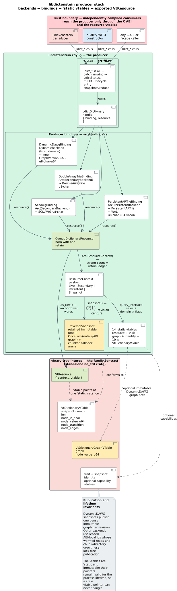

# Vinary Tree libdictenstein for Lua

A C extension module over libdictenstein's stable `ldict_*` C ABI. The LuaRocks
package is `vinary-tree-libdictenstein`; the module loads as
`vinary_tree.libdictenstein`. It exposes DynamicDAWG CRUD, immutable
DoubleArrayTrie construction, SCDAWG substring search, persistent ARTrie
CRUD/checkpoint/reopen, and persistent vocabulary reverse lookup.

## Building

The rockspec compiles `bindings/lua/src/libdictenstein_lua.c` and links the
shared library `libdictenstein`. Build the native library first:

```sh
cargo build --release --no-default-features --features ffi
luarocks make bindings/lua/vinary-tree-libdictenstein-0.2.1-1.rockspec
export LD_LIBRARY_PATH="$PWD/target/release:$LD_LIBRARY_PATH"
```

## Quickstart

```lua
local ld = require("vinary_tree.libdictenstein")

local dictionary = ld.dynamic_dawg()          -- "unicode" domain by default
dictionary:put("cat", 1)
dictionary:put("cot", 2)
dictionary:put("cut")                          -- valueless term
assert(dictionary:len() == 3)

local hit = dictionary:get("cot")
assert(hit.found and hit.value == 2)

local suffixes = ld.scdawg()
suffixes:put("cat")
suffixes:put("cot")
assert(suffixes:contains_substring("ot"))
assert(suffixes:frequency("t") == 2)
dictionary:close()
suffixes:close()
```

## Constructors and methods

Module constructors: `dynamic_dawg([domain])`, `scdawg([domain])`,
`double_array_trie(entries[, domain])`,
`create_persistent_artrie(path[, domain])`, `open_persistent_artrie(path[, domain])`,
`create_persistent_vocabulary(path)`, `open_persistent_vocabulary(path)`.

Dictionary methods: `put`, `remove`, `get`, `contains`, `contains_u64`, `term`,
`clear`, `compact`, `checkpoint`, `contains_substring`, `frequency`, `len`,
`kind`, `capabilities`, `close`.

The `domain` argument is the string `"byte"`, `"unicode"`, or `"u64"` (default
`"unicode"`). `get` returns a table `{found = <bool>[, value = <int>]}`; the
`value` field is absent for a valueless term.

## Backends and capabilities

| Constructor | Kind | Unit domains | Capabilities |
|-------------|------|--------------|--------------|
| `dynamic_dawg` | 1 | byte, unicode, u64 | read, insert, remove, clear, compact |
| `double_array_trie` | 2 | byte, unicode | read (immutable) |
| `scdawg` | 3 | byte, unicode | read, insert, substring |
| `create/open_persistent_artrie` | 4 | byte, unicode, u64 | read, insert, remove, checkpoint |
| `create/open_persistent_vocabulary` | 5 | unicode | read, insert, checkpoint |

## Values and domains

The Unicode-scalar backends validate UTF-8 and reject invalid input. Mapped
values are non-negative Lua integers or canonical decimal strings. Values above
`math.maxinteger` are returned as decimal strings, so the full `u64` range is
lossless. A `nil` value and a value of `0` are distinct.

## Error handling

Failing calls raise a Lua error whose message is the thread-local
`ldict_last_error_message()`. Backend-unsupported operations surface the
`UNSUPPORTED` status; wrong-domain terms surface `DOMAIN_MISMATCH` (9).

## Retained resource handoff

Each dictionary userdata carries the shared `VtResource`, so an independently
packaged liblevenshtein transducer retains it in constant time and keeps its
query-start revision valid after `close`.

## Ordered entry collections

`dictionary:entries()` materializes one immutable revision and its metadata;
`pairs(snapshot)` yields `(key, value, has_value)` in native lexicographic
order. `dictionary:entries_iter(limits)` is the bounded generic-for form and
uses Lua 5.4's closing value to release on EOF, `break`, or error. An explicit
`dictionary:entry_cursor(limits)` offers `:metadata()`, `:next()`, and
`:close()`. Limits are a table with positive `max_entries`, `max_units`, and
`max_values` fields.

The Lua benchmark supports `materialized`, `stream`, and `stream-cancel` and
prints one `libdictenstein.host-collection-traversal.v1` record:

```sh
lua bindings/lua/examples/collection_traversal_profile.lua \
  --arm stream-cancel --entries 65536 --batch-size 64 --early-cancel 64
```

<!-- BEGIN GENERATED BINDING OPERATIONS; DO NOT EDIT -->

## Support and package contract

| Property | Contract |
|---|---|
| Binding | Lua |
| Languages/runtime | Lua 5.4+ |
| Support tier | Tier 3 |
| Distribution | LuaRocks `vinary-tree-libdictenstein` |
| Native boundary | C userdata module over the ABI |
| Canonical facade source | [`bindings/lua/src/libdictenstein_lua.c`](../../bindings/lua/src/libdictenstein_lua.c) |

All tiers implement the same ownership, snapshot, status, and compatibility
laws. The tier controls release gating rather than semantic quality. Start with
the [producer documentation hub](../../docs/bindings/README.md), then use the
[`ldict_*` C ABI reference](../../docs/bindings/c-abi-reference.md) for exact
preconditions, statuses, thread-safety, and complexity.



## Installation and native loading

Install the distribution named above and its exact `vinary-tree-interop`
dependency. Published managed packages carry or resolve supported native
artifacts; source builds use the release library from `target/release` or the
installed CMake/pkg-config package. Diagnose loading in this order: toolchain
version, OS/CPU artifact, dependent package pin, loader path, then ABI/API
handshake. Never silently load an arbitrary same-named system library.

## Executable example and verification

The canonical checked example is [`bindings/lua/test/conformance.lua`](../../bindings/lua/test/conformance.lua). CI runs
the public package path with:

```sh
lua bindings/lua/test/conformance.lua
```

The example is also conformance evidence: it uses public constructors, checks
membership/value behavior, exports a retained resource, and closes every owned
handle. Cross-project suites pass that resource to liblevenshtein without
serialization.

## Public API, backends, and data domains

| Concept | Semantics |
|---|---|
| Dictionary handle | Owns one mutable or immutable backend instance and exposes kind/capability introspection. |
| CRUD and batch mutation | Text and `u64` operations preserve optional values; empty-batch and partial-failure behavior follows the C reference. |
| Persistent maintenance | `checkpoint`, `compact`, and `clear` are capability-gated and report unsupported operations explicitly. |
| Retained resource | `resource()` lends `vt.dictionary.v1`; a consumer retains and snapshots it independently. |
| Snapshot | Immutable revision with stable node identifiers, exact domains, bounded edge pages, and optional mapped values. |

Dynamic DAWG supports mutable finite-term dictionaries; double-array tries are
read-optimized static structures; SCDAWG indexes substrings; persistent ARTrie
and vocabulary stores provide durable byte/Unicode/`u64` domains. Select by
reported kind and capabilities rather than assuming every operation exists.

Text APIs validate UTF-8 and traverse Unicode scalar values. Byte APIs retain
arbitrary octets. Token APIs preserve the full `u64` range. Optional dictionary
values are represented separately from terminal membership, so `None` is not a
sentinel and empty terms remain valid when supported.

## Native collection surface

`dictionary:entries()` materializes one immutable
revision for ordinary table iteration, while `dictionary:entries_iter()`
provides the idiomatic generic-for triple. `dictionary:entry_cursor(limits)`
exposes explicit `:next()`, metadata, and idempotent `:close()` for bounded
streaming. Lua 5.4 to-be-closed variables provide lexical cleanup and `__gc`
only contains abandoned userdata.


The pure Rust producer is the semantic and performance baseline: generic
snapshot traversal, borrowed and snapshot-owning `IntoIterator`, optimized bulk
`FromIterator`/`Extend` where infallible, named fallible variants for persistent
stores, deterministic order, and reusable fold/visitor paths. Read the local
[Rust API audit](../../docs/bindings/rust-api-idioms.md) and the family
[collection-protocol design](https://github.com/vinary-tree/liblevenshtein-rust/blob/master/docs/bindings/collection-protocols.md).

Public spelling must remain native to this ecosystem. The shared engine
standardizes laws and batching; it does not expose C handles, vtables, leases,
or status codes to ordinary application code. Documentation may mark a protocol
as shipped only after its language conformance and performance gates pass.

## Ownership, snapshots, and resource handoff

Use to-be-closed variables or `:close()`; `__gc` is fallback cleanup.

An exported resource is borrowed until its base-vtable `retain` succeeds. A
captured snapshot arrives owning one retain and may outlive the mutable
dictionary. Later inserts, updates, removals, compaction, or checkpoints do not
alter a pinned revision. Every successful retain has exactly one release, and
failed construction transfers no ownership.

## Errors and failure containment

Failures become Lua errors carrying the symbolic status and diagnostic. Branch on the typed status or exception, not diagnostic text.
Invalid UTF-8, domain mismatch, unsupported capability, closed handle, bad
path, allocation failure, provider fault, I/O failure, and contained panic are
distinct cases. Copy thread-local diagnostics before another native call.

## Concurrency and reentrancy

Independent handles and immutable snapshots are reentrant. Mutations follow
the backend's advertised synchronization strategy; one host wrapper must not
invent a stronger promise. Snapshot capture is a linearization point and never
permits a torn root/count pair. Do not race close against another operation on
the same handle, and do not retain callback/paging buffers after return.

## Performance, durability, and marshalling

- Use bulk construction for an initially empty dictionary and presorted input
  when available; unordered construction uses the optimized sort-plus-minimal
  path.
- Batch mutations to amortize foreign-boundary crossings.
- Export retained resources instead of serializing dictionaries between
  Vinary packages.
- Keep byte, Unicode, and `u64` domains explicit to avoid transcoding.
- Treat `checkpoint` as durability, `compact` as representation maintenance,
  and `close` as ownership release; they are not interchangeable.

## Security model

Treat paths, terms, values, page offsets, serialized files, and foreign callers
as untrusted. Validate lengths before allocation, contain panics at the ABI,
bound diagnostics and batches, prevent path traversal, and reject unknown enum
values. See the [FFI boundary analysis](../../docs/security/ffi-boundary.md) and
[family security model](https://github.com/vinary-tree/liblevenshtein-rust/blob/master/vinary-tree-interop/docs/security-model.md).

## Compatibility and troubleshooting

The project ABI, project API revision, family ABI, interface version, package
version, and persistent format version are separate counters. Negotiate each
at its documented boundary. For unexpected behavior, record dictionary kind,
capabilities, unit domain, persistence path, exact status, and copied diagnostic
before reducing the operation sequence.

## Maintainer checklist

1. Update `bindings/api.json` before changing a public facade or package pin.
2. Regenerate headers/constants and run the binding contract gate.
3. Extend the executable, negative-path, leak, and cross-project tests.
4. Update this guide when ownership, errors, capabilities, or platforms change.
5. Render PlantUML headlessly and run math/link/documentation checks.
6. Verify staged registry artifacts contain the guide and coherent pins.

<!-- END GENERATED BINDING OPERATIONS -->
