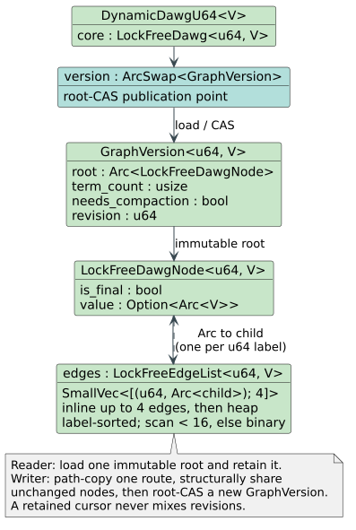

# DynamicDawgU64 — the 64-bit-token sequence DAWG

**Navigation**: [← Implementation guides](README.md) | [Algorithms home](../README.md)

`DynamicDawgU64<V>` is the member of the [dynamic DAWG](dynamic-dawg.md) family whose edge-label
alphabet is the full 64-bit integer space rather than bytes or Unicode scalar values. It indexes
**sequences of `u64` tokens** — interned vocabulary IDs, hashes, packed records, or the bit patterns
of `f64` samples in a time series — and, like its byte and `char` siblings, answers membership in
$`O(\lvert q\rvert)`$ for a query sequence `q`, independent of how many sequences are stored.

It lives at [`src/dynamic_dawg/u64.rs`](../../../src/dynamic_dawg/u64.rs) and is re-exported as
`libdictenstein::dynamic_dawg::u64::DynamicDawgU64`.

Notation follows [`docs/notation.md`](../../notation.md).

---

## When to use it

- ✅ Keys are **already integers** — token IDs from a vocabulary, feature hashes, or fixed-width
  packed records — and you want prefix/sequence sharing without paying to re-encode them as bytes.
- ✅ **Time series**: a run of `f64` samples, indexed by their IEEE-754 bit patterns via
  `f64::to_bits`, so that exact-match and prefix queries over numeric sequences become trie walks.
- ✅ You need **runtime insertion** with lock-free readers (see [Concurrency](#concurrency)).
- ⚠️ Prefer [`DynamicDawg`](dynamic-dawg.md) (`u8`) or [`DynamicDawgChar`](dynamic-dawg-char.md)
  (`char`) when the keys are genuinely text — a byte or `char` DAWG is more compact for those.
- ⚠️ For a *durable* `u64` sequence index, use the persistent
  [`PersistentARTrieU64Compact`](../native-u64-and-cx.md) instead; `DynamicDawgU64` is volatile.

## Why a distinct public type

The byte, `char`, and `u64` DAWGs now share the unit-generic immutable-revision core
`LockFreeDawg<U, V>`. `DynamicDawgU64` remains a distinct public type because its primary API accepts
token slices and exposes sequence/time-series conveniences rather than UTF-8 strings:

- **No byte expansion.** A `char`/`u64` label is stored natively as one edge, not spread across up
  to four byte-edges, so per-transition work stays $`O(1)`$ amortized without a byte-decoding step.
- **Native token APIs.** Insert, lookup, zipper, and iteration operate on `&[u64]` / `Vec<u64>`
  without encoding or decoding through text.

Its `Clone` remains a detached $`O(1)`$ snapshot: the new handle begins from the same immutable
`GraphVersion` but has its own publication cell, so later writes to either clone are independent.
Use an outer `Arc<DynamicDawgU64<_>>` when threads should mutate one shared dictionary.

## Node representation



```rust
struct LockFreeDawg<U: CharUnit, V: DictionaryValue> {
    version: ArcSwap<GraphVersion<U, V>>,
}

struct LockFreeDawgNode<U: CharUnit, V: DictionaryValue> {
    edges: SmallVec<[(U, Arc<LockFreeDawgNode<U, V>>); 4]>,
    is_final: bool,
    value: Option<Arc<V>>,
}
```

Child lookup within a node scans linearly while the edge count is below
`EDGE_LINEAR_SCAN_LIMIT` (16) and binary-searches the label-sorted list at or above it — the same
adaptive crossover the byte/`char` DAWGs use, which keeps small nodes branch-predictable and large
nodes logarithmic.

## Concurrency

Reads are **wait-free**: `contains`, `contains_sequence`, iterators, and node traversal retain one
immutable root and walk it without a lock. Writes are **lock-free**: an insert/update/remove
path-copies the touched route and publishes one replacement `GraphVersion` with a root-CAS retry
loop (`CasBackoff`). A cursor cannot observe partially linked state or mix revisions. This is the
**path-copy plus root CAS** strategy described in
[the in-memory architecture doc](../../architecture/in-memory-dictionaries.md).

## Complexity

Let `q` be a query sequence and `n` the total number of `u64` tokens stored.

| Operation | Cost |
|-----------|------|
| `contains_sequence(q)` | $`O(\lvert q\rvert)`$ |
| `insert_sequence(q)` | $`O(\lvert q\rvert)`$ amortized |
| `update_or_insert_sequence(q, …)` | $`O(\lvert q\rvert)`$ amortized (may re-run the update closure on CAS conflict) |
| `compact()` | $`O(n)`$ |
| space | near-minimal after `compact()`; unchanged paths and retained revisions share immutable `Arc` nodes |

## Trait support

`DynamicDawgU64<V>` implements [`Dictionary`](../README.md), [`MutableDictionary`](../README.md)
(`insert` / `remove` / `extend` over the string projection), and
[`CompactableDictionary`](../README.md) (`compact` / `minimize`). It deliberately does **not**
implement `MappedDictionary` or `MutableMappedDictionary`: values are attached with
`insert_sequence_with_value` / `insert_with_value` and read back through the type's
[`ValuedDictZipper`](../zippers.md), not through `get_value`. See the
[trait-support matrix](README.md#trait-support-matrix-in-memory-backends) for how this compares to
the rest of the family.

## Usage

### Sequences of tokens

```rust,ignore
use libdictenstein::dynamic_dawg::u64::DynamicDawgU64;

let dict = DynamicDawgU64::<i64>::new();
dict.insert_sequence(&[1, 2, 3]);
dict.insert_sequence_with_value(&[10, 20], 7);
assert!(dict.contains_sequence(&[10, 20]));

// Accumulate into the value already stored at a sequence (or seed it, then update):
dict.update_or_insert_sequence(&[10, 20], 0, |v| *v += 1);   // value at [10,20] is now 8
```

### Numeric time series via `f64::to_bits`

```rust,ignore
use libdictenstein::dynamic_dawg::u64::DynamicDawgU64;

// A window of samples is indexed by the bit patterns of its f64 values, so exact-match and
// prefix queries over the numeric series become trie walks.
let series: DynamicDawgU64 = DynamicDawgU64::new();
series.insert_f64(&[42.5, 43.0, 42.5]);
assert!(series.contains_f64(&[42.5, 43.0, 42.5]));
```

`insert_f64` / `contains_f64` are thin wrappers that map each `f64` through `f64::to_bits` and
delegate to the `u64`-sequence path, so `+0.0` and `-0.0` (distinct bit patterns) are distinct keys,
and `NaN` payloads are preserved bit-for-bit — the exact behavior you want for a lossless index and
the behavior you must account for if you expect IEEE-754 numeric equality.

## Related

- [dynamic-dawg.md](dynamic-dawg.md) — the byte DAWG and the shared minimization theory.
- [DAWG minimization theory](../../theory/volatile-automata/01-dawg-minimization.md) — why suffix
  sharing keeps the graph small.
- [native-u64-and-cx.md](../native-u64-and-cx.md) — the *durable* `u64` sequence index.
- [zippers.md](../zippers.md) — how to read values and enumerate sequences from this backend.
