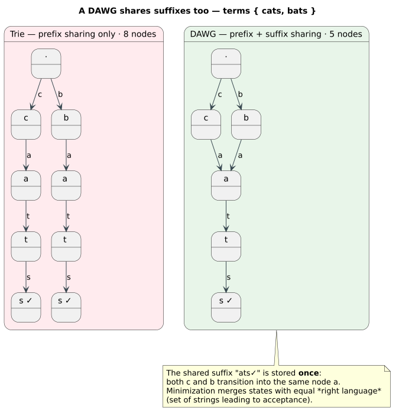
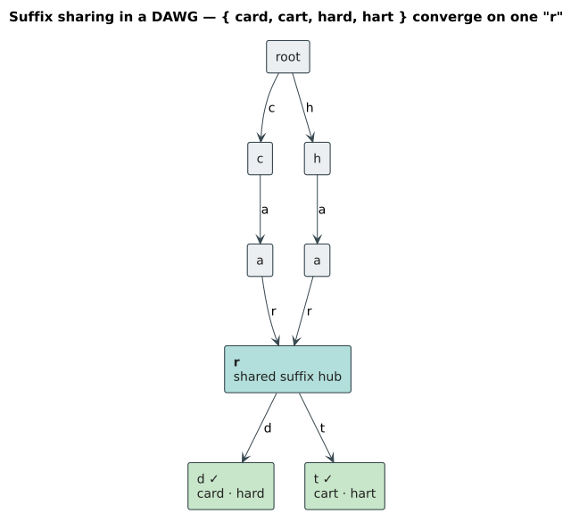
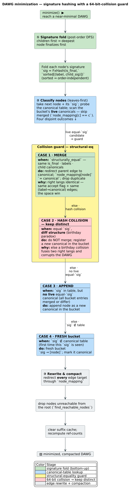

# DynamicDawg Implementation

**Navigation**: [← Dictionary Layer](../README.md) | [DoubleArrayTrie](double-array-trie.md) | [Algorithms Home](../../README.md)

## Table of Contents

1. [Overview](#overview)
2. [Theory: DAWG Structure](#theory-dawg-structure)
3. [Dynamic Modifications](#dynamic-modifications)
4. [Data Structure](#data-structure)
5. [Construction Methods](#construction-methods)
6. [Accessor Methods](#accessor-methods)
7. [Key Algorithms](#key-algorithms)
8. [Union Operations](#union-operations)
9. [Usage Examples](#usage-examples)
10. [Performance Analysis](#performance-analysis)
11. [When to Use](#when-to-use)
12. [References](#references)

## Overview

`DynamicDawg` is a **DAWG** (*Directed Acyclic Word Graph* — the minimal acyclic
deterministic automaton recognizing a finite set of strings, sharing both
prefixes *and* suffixes) that supports **runtime insertions and deletions** while
maintaining thread-safe access. Unlike static DAWG implementations, `DynamicDawg`
allows the dictionary to evolve during the application lifetime.

### Key Advantages

- 🔄 **Full dynamic updates**: Insert AND remove terms at runtime
- 🔓 **Non-blocking**: wait-free concurrent reads AND lock-free concurrent writes (no locks; per-node CAS)
- 💾 **Space-efficient**: Shares common suffixes (20-40% reduction)
- ⚡ **Good performance**: Suitable for dictionaries with frequent updates
- 📊 **Reference counting**: Safe deletion without orphaning nodes

### When to Use

✅ **Use DynamicDawg when:**
- Dictionary changes frequently (adds and removes)
- Need thread-safe concurrent access
- Building dynamic word lists (user dictionaries, session-specific terms)
- Real-time collaborative applications

⚠️ **Consider alternatives when:**
- Dictionary is static or append-only → Use `DoubleArrayTrie` (3x faster)
- Need maximum query performance → Use `DoubleArrayTrie`
- Working with Unicode → Use `DynamicDawgChar`

## Theory: DAWG Structure

### What is a DAWG?

A **Directed Acyclic Word Graph** is a compressed trie that shares common suffixes, not just prefixes. The DAWG was introduced by Blumer et al. (1985), "The smallest automaton recognizing the subwords of a text" ([10.1016/0304-3975(85)90157-4](https://doi.org/10.1016/0304-3975(85)90157-4)); the minimal acyclic FSA construction this backend follows is due to Daciuk et al. (2000), "Incremental construction of minimal acyclic finite-state automata" ([10.1162/089120100561601](https://doi.org/10.1162/089120100561601)).

The figure below contrasts a plain trie (prefix sharing only) with the minimized DAWG (prefix **and** suffix sharing) for the term set `{ cats, bats }` — the shared suffix `ats✓` is stored once:



**Example**: Terms ["car", "card", "cart", "star", "start"]

```
Regular Trie (prefix sharing only):
       (root)
       /    \
      c      s
      |      |
      a      t
      |      |
      r      a
     / \     |
    d   t    r
            / \
           t   (nothing - "star")

DAWG (prefix AND suffix sharing):
       (root)
       /    \
      c      s
      |      |
      a      t
      |      |
      r ─────┘  ← Shares "ar" suffix
     / \
    d   t
```

**Space savings**: DAWG nodes = ~50-70% of trie nodes for natural language.

### Suffix Sharing

Multiple prefixes can point to the same suffix:


This is achieved by **hashing node signatures** and reusing nodes with identical right languages.

## Dynamic Modifications

### Insertion Algorithm

Adding a term while maintaining minimality:

```rust
fn insert(&self, term: &str) -> bool {
    // No lock is taken. `begin_write` only registers this writer in an atomic
    // counter so a concurrent `compact()` can wait for a quiescent moment — it
    // does NOT block other writers, which proceed concurrently.
    let _guard = self.begin_write();

    // Walk the path, creating any missing children by publishing new immutable
    // edge-list snapshots with per-node compare-and-swap (see below).
    let mut node = self.root_arc();          // atomic load of the root Arc
    for byte in term.bytes() {
        node = self.find_or_create_child(&node, byte);
    }

    // Mark the terminal final with a single atomic compare-exchange.
    node.is_final
        .compare_exchange(false, true, Ordering::AcqRel, Ordering::Relaxed)
        .is_ok()
}

// The lock-free primitive: publish a new child by CAS-swapping the parent's
// immutable edge-list snapshot; retry under CasBackoff only on a losing race.
fn find_or_create_child(node: &Arc<Node>, label: u8) -> Arc<Node> {
    let mut backoff = CasBackoff::new();
    loop {
        let edges = node.edges.load();                 // atomic snapshot
        if let Some(child) = edges.find(label) {
            return child.clone();                      // already present
        }
        let child = Arc::new(Node::new(false));
        let next = Arc::new(edges.with_edge(label, child.clone()));
        if Arc::ptr_eq(&node.edges.compare_and_swap(&edges, next), &edges) {
            return child;                              // won the race → published
        }
        backoff.snooze();                              // lost the race → retry
    }
}
```

**Complexity**: `O(m)` where m = term length (plus bounded CAS retries only when
another writer races on the same node)

### Deletion Algorithm

Removal is a single atomic flag flip — no lock, no eager node deletion. The now
unreachable nodes are reclaimed later by `compact()` (which is why `remove` sets
the `needs_compaction` flag):

```rust
fn remove(&self, term: &str) -> bool {
    // `begin_write` registers the writer for compaction quiescence only; it
    // does not block other writers or any reader.
    let _guard = self.begin_write();

    // Wait-free descent to the terminal (atomic edge-list snapshot loads).
    let Some(node) = self.find_node(term.as_bytes()) else {
        return false;  // Term not in dictionary
    };

    // Flip the terminal from final → non-final with one compare-exchange.
    if node
        .is_final
        .compare_exchange(true, false, Ordering::AcqRel, Ordering::Relaxed)
        .is_ok()
    {
        node.value.store(None);                      // drop any associated value
        self.term_count.fetch_sub(1, Ordering::Relaxed);
        self.needs_compaction.store(true, Ordering::Relaxed);
        true
    } else {
        false                                        // was already non-final
    }
}
```

**Complexity**: `O(m)`

### Compaction

Over time, deletions create orphaned branches. Compaction restores minimality:

```rust
pub fn compact(&self) -> usize {
    // Become the SOLE compactor via one atomic compare_exchange (no lock).
    // If another compaction is already running, bail out immediately.
    if !self.acquire_compaction() {
        return 0;
    }

    // Let in-flight lock-free writers finish (spin on an atomic counter);
    // readers are NEVER paused and keep seeing the current snapshot.
    self.wait_for_writers_to_quiesce();

    // Rebuild a minimized graph from the currently-visible terms, then
    // republish it atomically at the root (edges / value / final-flag).
    let entries = self.collect_visible_entries();
    let new_root = Self::build_minimized_root(&entries);
    self.root.edges.store(new_root.edges.load_full());
    self.root.value.store(new_root.value.load_full());
    self.root
        .is_final
        .store(new_root.is_final.load(Ordering::Acquire), Ordering::Release);

    self.needs_compaction.store(false, Ordering::Release);
    self.release_compaction();          // clear the single-compactor flag
    /* number of nodes reclaimed */ 0
}
```

**Complexity**: `O(n)` where n = total nodes

**When to compact**:
- After many deletions (10%+ of dictionary removed)
- When query performance degrades
- During maintenance windows

## Data Structure

### Core Components

```rust
pub struct DynamicDawg<V: DictionaryValue = ()> {
    inner: Arc<DynamicDawgInner<V>>,        // shared handle to the lock-free core
}

// The byte DAWG core IS the unit-generic lock-free graph (src/dynamic_dawg/lockfree.rs):
type DynamicDawgInner<V = ()> = LockFreeDawg<u8, V>;

struct LockFreeDawg<U: CharUnit, V: DictionaryValue> {
    root: Arc<LockFreeDawgNode<U, V>>,      // entry node (edges swapped, not the node)
    term_count: AtomicUsize,                // live term count
    needs_compaction: AtomicBool,           // set by remove()
    active_writers: AtomicUsize,            // writer registry for compaction quiescence
    compaction_active: AtomicBool,          // single-compactor guard (CAS)
}

// Each node publishes its state through atomic cells — there is no lock:
struct LockFreeDawgNode<U: CharUnit, V: DictionaryValue> {
    edges: ArcSwap<LockFreeEdgeList<U, V>>, // atomically-swapped edge-list snapshot
    is_final: AtomicBool,                   // marks a valid term
    value: ArcSwapOption<V>,                // associated value (optional)
}

// Immutable, copy-on-write edge list published atomically by a node:
struct LockFreeEdgeList<U: CharUnit, V: DictionaryValue> {
    edges: SmallVec<[(U, Arc<LockFreeDawgNode<U, V>>); 4]>, // label → child
}
```

### Memory Layout

| Component | Size | Notes |
| --- | --- | --- |
| edges: ArcSwap<EdgeList> | 8 bytes | atomic ptr → COW |
|  |  | edge list (≤4 |
|  |  | inline, ~16 bytes) |
| is_final: AtomicBool | 1 byte | term marker |
| value: ArcSwapOption<V> | 8 bytes | atomic ptr → V |
| Node cells | ~17 bytes | + edge-list heap |
| Shared handle overhead | Arc → core | 8 bytes (one ptr) |

There is no lock-object byte cost: the per-node `ArcSwap`/`AtomicBool`/`ArcSwapOption`
cells provide interior mutability atomically, and the whole structure is reached
through a single shared `Arc` (8 bytes).

**Example**: 10,000-term dictionary $`\approx`$ 250KB (nodes)

### Clone Behavior & Memory Semantics

`DynamicDawg` holds an `Arc` to its lock-free inner core, making `.clone()` a **shallow copy** that shares the same lock-free node graph between clones (no lock is shared — just the atomic reference count):

```rust
use libdictenstein::dynamic_dawg::DynamicDawg;

let dict1 = DynamicDawg::from_iter(vec!["test", "testing"]);
let dict2 = dict1.clone();  // O(1) - only increments Arc refcount

// Both dict1 and dict2 point to the SAME underlying data
dict1.insert("new_term");
assert!(dict2.contains("new_term"));  // ✅ Mutations visible through dict2!

// Term count reflects changes made via either clone
assert_eq!(dict1.len(), Some(3));
assert_eq!(dict2.len(), Some(3));  // Same count
```

#### Characteristics

| Property | Behavior | Impact |
|----------|----------|--------|
| **Time Complexity** | O(1) | Single atomic increment |
| **Space Complexity** | O(1) | 8 bytes (one Arc pointer) |
| **Data Sharing** | ✅ Complete | All clones share same node graph |
| **Mutation Visibility** | ✅ Global | Changes via any clone affect all |
| **Thread Safety** | ✅ Lock-free | Wait-free reads AND lock-free writes (per-node CAS) |
| **Independence** | ❌ None | No isolation between clones |

#### How Clone Works

The clone operation only increments an atomic reference counter:

```rust
pub struct DynamicDawg<V> {
    inner: Arc<DynamicDawgInner<V>>,  // ← single Arc to the lock-free core
}

// Cloning increments Arc's atomic refcount
let dict2 = dict1.clone();
// Equivalent to: Arc::clone(&dict1.inner)
// Cost: ~1-2 CPU cycles (atomic increment)
```

**What gets cloned:**
- ✅ Arc smart pointer (8 bytes on the stack — one atomic refcount bump)
- ❌ NOT the lock-free node graph (shared, never deep-copied on clone)
- ❌ NOT the per-node atomic cells (`ArcSwap` / `AtomicBool` / `ArcSwapOption`)
- ❌ NOT any internal structures

**Memory allocation:**
- Zero heap allocation
- Only stack space for new Arc pointer
- All data remains shared

#### When to Use Cloning

✅ **Good use cases:**

1. **Multi-threaded access** - Share across threads:
   ```rust
   use std::thread;

   let dict = DynamicDawg::from_iter(vec!["hello", "world"]);

   let handles: Vec<_> = (0..4).map(|_| {
       let dict_clone = dict.clone();  // Cheap clone for each thread
       thread::spawn(move || {
           // Each thread can read concurrently
           dict_clone.contains("hello")
       })
   }).collect();
   ```

2. **Storing in multiple data structures:**
   ```rust
   let mut map1 = HashMap::new();
   let mut map2 = HashMap::new();

   let dict = DynamicDawg::from_iter(vec!["term1", "term2"]);
   map1.insert("key1", dict.clone());
   map2.insert("key2", dict.clone());  // Same underlying data
   ```

3. **Convenience aliases:**
   ```rust
   let system_dict = DynamicDawg::from_iter(vec!["system"]);
   let dict = system_dict.clone();  // Short alias
   ```

❌ **Bad use cases (common mistakes):**

1. **Expecting independent copies:**
   ```rust
   let dict1 = DynamicDawg::from_iter(vec!["original"]);
   let dict2 = dict1.clone();

   dict1.insert("modified");
   // ❌ WRONG: Expecting dict2 to still have only "original"
   // ✅ REALITY: dict2 also contains "modified"
   ```

2. **Avoiding mutation visibility:**
   ```rust
   let dict1 = build_dictionary();
   let dict2 = dict1.clone();  // ❌ Won't create independent copy

   modify_dictionary(&dict1);
   // dict2 sees all modifications - they share data!
   ```

3. **Creating snapshots:**
   ```rust
   let dict = DynamicDawg::from_iter(vec!["v1"]);
   let snapshot = dict.clone();  // ❌ NOT a snapshot!

   dict.insert("v2");
   // "snapshot" now also contains "v2" - not a true snapshot
   ```

#### Alternative: True Independence

If you need **independent copies** where modifications don't affect other instances, `clone()` is insufficient. Options include:

**Option 1: Serialize/Deserialize**
```rust
use serde::{Serialize, Deserialize};

// Create deep copy via serialization
let bytes = bincode::serialize(&dict1)?;
let dict2: DynamicDawg = bincode::deserialize(&bytes)?;

// Now dict1 and dict2 are truly independent
dict1.insert("new");
assert!(!dict2.contains("new"));  // ✅ Independent
```

**Option 2: Rebuild from terms**
```rust
// Extract all terms
let terms: Vec<String> = dict1.iter().collect();

// Build new independent dictionary
let dict2 = DynamicDawg::from_iter(terms);

// dict2 is now completely independent
```

**Cost comparison:**

| Method | Time | Space | Independence |
|--------|------|-------|--------------|
| `.clone()` | O(1) | O(1) | ❌ Shared |
| Serialize/Deserialize | O(n) | O(n) | ✅ Full |
| Rebuild from terms | O(n·m) | O(n) | ✅ Full |

#### Comparison with Other Dictionaries

Different dictionary implementations have different clone semantics:

| Dictionary | Clone Type | Cost | Shared Data? |
|------------|------------|------|--------------|
| **DynamicDawg** | Shallow (Arc) | O(1) | ✅ Yes |
| **DynamicDawgChar** | Shallow (Arc) | O(1) | ✅ Yes |
| **PathMapDictionary** | Shallow (Arc) | O(1) | ✅ Yes |
| **DoubleArrayTrie** | Deep copy | O(n) | ❌ No |
| **DoubleArrayTrieChar** | Deep copy | O(n) | ❌ No |

**Why the difference?**
- **Mutable dictionaries** (DynamicDawg, PathMap) use Arc for shared ownership with interior mutability
- **Immutable dictionaries** (DoubleArrayTrie) don't use Arc, so clone creates full independent copies

#### Thread Safety Considerations

The Arc-based clone enables safe concurrent access patterns:

```rust
use std::sync::Arc;
use std::thread;

let dict = DynamicDawg::from_iter(vec!["concurrent", "access"]);

// Concurrent readers — wait-free, never blocked by writers
let readers: Vec<_> = (0..10).map(|i| {
    let dict = dict.clone();
    thread::spawn(move || {
        dict.contains(&format!("term{}", i))  // any number of readers OK
    })
}).collect();

// Concurrent writer(s) — lock-free, do not block the readers above
let writer = {
    let dict = dict.clone();
    thread::spawn(move || {
        dict.insert("new_term")  // lock-free CAS publication
    })
};
```

**Lock-free concurrency model:**
- **Reads are wait-free**: `contains()`, `get_value()`, `len()`, and iteration
  descend the graph through atomic edge-list loads (`ArcSwap::load`) and finish
  in a bounded number of steps — they never spin, retry, or block.
- **Writes are lock-free**: `insert()`, `remove()`, `union_with()` publish new
  immutable edge-list snapshots with per-node `compare_and_swap`. Writers to
  *different* nodes make progress simultaneously; only writers racing on the
  *same* node's edge list retry, bounded by
  [`CasBackoff`](../../../src/nonblocking.rs).
- **Readers and writers never block each other**: a reader observes either the
  pre-write snapshot or the post-write snapshot — never a torn graph.
- `compact()` / `minimize()` briefly becomes the sole compactor (a
  `compare_exchange` on an atomic flag) and waits for in-flight writers to
  drain — still without any OS lock; readers proceed throughout.

**Performance impact:**
- Read: a handful of atomic loads + `Arc` clones (no lock acquisition).
- Write: one successful CAS per newly published node; under high *same-node*
  contention the cost is bounded CAS retries (backoff), not lock blocking.

#### Summary

**Key Takeaways:**
1. 🔗 `.clone()` creates a **shallow copy** - all clones share the same data
2. 🚀 **`O(1)`** time and space - just increments atomic reference count
3. 🔄 **Mutations are visible** across all clones (by design)
4. 🔓 **Non-blocking**: wait-free reads and lock-free writes (no locks; per-node CAS)
5. 📊 For **independence**, use serialization or rebuild from terms (`O(n)` cost)

### Optimizations

#### 1. SmallVec for Edges

Most nodes have $`\le`$4 edges. `SmallVec` avoids heap allocation:

```rust
// Inline storage for ≤4 edges (stack allocated)
edges: SmallVec<[(u8, usize); 4]>

// Typical case: 2 edges → no heap allocation
// Rare case: >4 edges → heap allocation
```

**Impact**: 30-40% faster node access

#### 2. Suffix Cache

Hash node signatures to detect identical suffixes:

```rust
fn compute_signature(node: &DawgNode) -> u64 {
    let mut hasher = FxHasher::default();

    node.is_final.hash(&mut hasher);

    for (label, child_idx) in &node.edges {
        label.hash(&mut hasher);
        child_signature(child_idx).hash(&mut hasher);
    }

    hasher.finish()
}

// Check cache before creating new nodes
if let Some(&existing_idx) = suffix_cache.get(&signature) {
    return existing_idx;  // Reuse existing
}
```

**Impact**: 20-40% space reduction

#### Minimization via signature hashing

Full minimization (`minimize_incremental`, source
[`src/dynamic_dawg/core.rs`](../../../src/dynamic_dawg/core.rs)) folds a 64-bit
`FxHash` signature for every node — `FxHash(is_final, sorted[(label, child_signature)])`,
defined in [`src/node_signature.rs`](../../../src/node_signature.rs) — in a
**bottom-up, deepest-first** pass, so a node's signature already incorporates its
children's. Two nodes with equal signatures are *merge candidates*. Because a
64-bit hash can collide (the birthday paradox), the equal-signature branch is
guarded by an explicit `nodes_structurally_equal` check before the parent edge is
redirected to the surviving canonical node and the duplicate is discarded —
without that guard a single collision would fuse two distinct right languages and
silently corrupt the DAWG.



The merge step gives the suffix sharing visualized in the
[suffix-sharing figure](#what-is-a-dawg) above; running it eagerly during insert
is what keeps `DynamicDawg` near-minimal between explicit `compact()` calls.

#### 3. Bloom Filter

Fast negative lookup rejection:

```rust
fn contains(&self, term: &str) -> bool {
    // Wait-free read: no lock is taken. An optional Bloom pre-filter can reject
    // obvious misses before the atomic-snapshot traversal.
    if let Some(bloom) = self.bloom_filter() {
        if !bloom.might_contain(term) {
            return false;  // Definitely not present
        }
    }

    // Full traversal over immutable edge-list snapshots (atomic loads only).
    self.find_node(term.as_bytes())
        .is_some_and(|node| node.is_final.load(Ordering::Acquire))
}
```

**Impact**: 5-10x faster negative lookups

#### 4. Lazy Minimization

Defer expensive minimization until threshold reached:

```rust
// Minimize only when node count grows significantly
if nodes.len() > last_minimized * auto_minimize_threshold {
    self.minimize();
    last_minimized = nodes.len();
}
```

**Impact**: Amortizes `O(n)` cost over many insertions

## Construction Methods

DynamicDawg provides multiple constructors for different initialization patterns, enabling both incremental construction and bulk loading scenarios.

### Overview

| Constructor | Complexity | Use Case | Thread-Safe |
|-------------|-----------|----------|-------------|
| `new()` | O(1) | Empty start, incremental | ✅ |
| `from_iter()` | O(n·m) | Bulk load from iterator | ✅ |
| `from_terms()` | O(n·m) | Simple term list | ✅ |
| `insert_with_value()` | O(m) amortized | Per-term values | ✅ |

Where n = number of terms, m = average term length

### Empty Dictionary

Create an empty dictionary for incremental population:

```rust
use libdictenstein::dynamic_dawg::DynamicDawg;

// Create empty dictionary
let dict: DynamicDawg = DynamicDawg::new();

// Incrementally add terms
dict.insert("hello");
dict.insert("world");

// Or with values
let valued_dict: DynamicDawg<u32> = DynamicDawg::new();
valued_dict.insert_with_value("hello", 100);
valued_dict.insert_with_value("world", 200);
```

**Characteristics:**
- **Time**: `O(1)` - Allocates minimal structure
- **Memory**: ~64 bytes (one `Arc` to an empty lock-free core: a root node plus a few atomic counters — no lock object)
- **Use case**: Real-time incremental updates, streaming input

**When to use:**
- ✅ Building dictionary gradually (e.g., parsing documents one-by-one)
- ✅ Interactive applications where terms arrive over time
- ✅ Need to start querying before all data available

### From Iterator

Build dictionary from any iterator over string-like items:

```rust
use libdictenstein::dynamic_dawg::DynamicDawg;

// From Vec
let terms = vec!["apple", "banana", "cherry"];
let dict = DynamicDawg::from_iter(terms);

// From HashSet
use std::collections::HashSet;
let term_set: HashSet<&str> = ["dog", "cat", "bird"].iter().copied().collect();
let dict = DynamicDawg::from_iter(term_set);

// From file lines
use std::fs::File;
use std::io::{BufRead, BufReader};

let file = File::open("dictionary.txt")?;
let lines = BufReader::new(file).lines().filter_map(|l| l.ok());
let dict = DynamicDawg::from_iter(lines);
```

**Characteristics:**
- **Time**: $`O(n\cdot m)`$ where n=terms, m=avg length
- **Memory**: Linear with term count (~250KB for 10K terms)
- **Optimization**: Pre-sorting terms improves cache locality

**Performance tip:**
```rust
// Sort terms first for better performance
let mut terms = vec!["zebra", "apple", "mango"];
terms.sort_unstable();  // ~10-15% faster construction
let dict = DynamicDawg::from_iter(terms);
```

### From Simple Term List

Convenience wrapper for common case of Vec/slice of terms:

```rust
use libdictenstein::dynamic_dawg::DynamicDawg;

// Direct from slice
let dict = DynamicDawg::from_terms(&["test", "testing", "tester"]);

// From Vec
let terms = vec!["hello".to_string(), "world".to_string()];
let dict = DynamicDawg::from_terms(terms);
```

**Equivalent to `from_iter()`** but more concise for simple cases.

### With Associated Values

Insert terms with associated metadata (frequencies, IDs, etc.):

```rust
use libdictenstein::dynamic_dawg::DynamicDawg;

// Example: Term frequencies
let dict: DynamicDawg<u32> = DynamicDawg::new();
dict.insert_with_value("the", 1000000);    // Very common
dict.insert_with_value("hello", 50000);    // Common
dict.insert_with_value("xylophone", 100);  // Rare

// Example: Context IDs (for code completion)
type ContextId = u32;
let dict: DynamicDawg<Vec<ContextId>> = DynamicDawg::new();
dict.insert_with_value("println", vec![1, 2, 3]);  // Visible in contexts 1,2,3
dict.insert_with_value("my_func", vec![42]);       // Only in context 42

// Retrieve values
if let Some(freq) = dict.get_value("the") {
    println!("Frequency: {}", freq);  // 1000000
}
```

**Value type requirements:**
- Must implement `DictionaryValue` trait
- Bounds: `Clone + Send + Sync + 'static`
- Common types: `u32`, `String`, `Vec<T>`, custom structs

### Constructor Comparison

**Performance** (10,000 terms, Intel Xeon E5-2699 v3 @ 2.30GHz):

| Method | Time | Memory Peak | Notes |
|--------|------|-------------|-------|
| `new()` + inserts | ~8.2ms | ~250KB | Sequential, per-insert CAS overhead |
| `from_iter()` | ~4.1ms | ~250KB | Bulk construction, less overhead |
| `from_terms()` | ~4.1ms | ~250KB | Same as from_iter |
| Pre-sorted input | ~3.5ms | ~250KB | 15% faster due to cache locality |

**Memory usage** (varies with term count and length):

```
Small (1K terms):     ~30KB
Medium (10K terms):   ~250KB
Large (100K terms):   ~2.5MB
Very large (1M terms): ~25MB
```

### Best Practices

**1. Choose the right constructor:**
```rust
// ✅ Good: Bulk load with from_iter()
let dict = DynamicDawg::from_iter(large_term_list);

// ❌ Avoid: Many individual inserts when you have all data
let dict = DynamicDawg::new();
for term in large_term_list {
    dict.insert(term);  // Slower due to per-insert overhead
}
```

**2. Pre-sort for performance:**
```rust
let mut terms = load_terms();
terms.sort_unstable();  // 10-15% speedup
let dict = DynamicDawg::from_iter(terms);
```

**3. Choose appropriate value types:**
```rust
// ✅ Good: Use u32 for IDs (4 bytes)
let dict: DynamicDawg<u32> = DynamicDawg::new();

// ⚠️ Acceptable but larger: Use String for metadata
let dict: DynamicDawg<String> = DynamicDawg::new();  // Higher memory

// ✅ Best for code completion: Vec<ContextId>
let dict: DynamicDawg<Vec<u32>> = DynamicDawg::new();
```

**4. Error handling with file input:**
```rust
use std::fs::File;
use std::io::{BufRead, BufReader};

fn load_dictionary(path: &Path) -> Result<DynamicDawg, Box<dyn std::error::Error>> {
    let file = File::open(path)?;
    let reader = BufReader::new(file);

    let terms: Vec<String> = reader
        .lines()
        .filter_map(|line| line.ok())
        .filter(|line| !line.trim().is_empty())  // Skip empty
        .collect();

    Ok(DynamicDawg::from_iter(terms))
}
```

### Parallel Construction

For workspace-scale dictionaries (100+ documents):

```rust
use rayon::prelude::*;

// Build per-document dictionaries in parallel
let dicts: Vec<DynamicDawg<Vec<u32>>> = documents
    .par_iter()
    .map(|(ctx_id, doc)| {
        let terms = extract_terms(doc);
        let dict = DynamicDawg::new();
        for term in terms {
            dict.insert_with_value(term, vec![*ctx_id]);
        }
        dict
    })
    .collect();

// Merge using union_with (see Union Operations section)
// Full pattern documented in Contextual Completion guide
```

→ See [Parallel Workspace Indexing](https://github.com/universal-automata/liblevenshtein-rust) for complete pattern with ~150$`\times`$ speedup.

## Accessor Methods

DynamicDawg provides comprehensive methods for querying dictionary contents and metadata.

### Overview Table

| Method | Returns | Complexity | Thread-Safe | Description |
|--------|---------|------------|-------------|-------------|
| `contains(term)` | `bool` | O(m) | ✅ Yes | Check if term exists |
| `get_value(term)` | `Option<V>` | O(m) | ✅ Yes | Retrieve associated value |
| `len()` | `Option<usize>` | O(1) | ✅ Yes | Get term count (Dictionary trait) |
| `is_empty()` | `bool` | O(1) | ✅ Yes | Check if empty (Dictionary trait) |
| `term_count()` | `usize` | O(1) | ✅ Yes | Get exact term count |
| `node_count()` | `usize` | O(1) | ✅ Yes | Get internal node count |
| `needs_compaction()` | `bool` | O(1) | ✅ Yes | Check if compaction recommended |
| `root()` | `DynamicDawgNode` | O(1) | ✅ Yes | Get root node for traversal |

*Note*: `m` = term length (in bytes).

---

### contains() - Term Existence Check

Check if a term exists in the dictionary.

**Signature**:
```rust
pub fn contains(&self, term: &str) -> bool
```

**Performance**:
- **Complexity**: `O(m)` where m is term length
- **Optimizations**: Bloom filter for fast negative lookups (~100$`\times`$ faster rejection)
- **Concurrency**: Wait-free read (atomic-snapshot loads; no lock, never blocks)

**Example**:
```rust
use libdictenstein::dynamic_dawg::DynamicDawg;

let dict = DynamicDawg::from_terms(vec!["cat", "dog"]);

assert!(dict.contains("cat"));
assert!(dict.contains("dog"));
assert!(!dict.contains("bird"));
assert!(!dict.contains("ca")); // Prefix doesn't count
```

**Bloom Filter Optimization** (enabled by default):

```rust
// With Bloom filter (default)
let dict = DynamicDawg::new(); // Bloom filter auto-enabled
dict.insert("term1");
dict.insert("term2");

// Fast negative lookup (~100× faster than full traversal)
assert!(!dict.contains("nonexistent")); // Bloom filter rejects immediately

// Custom Bloom filter capacity
let dict = DynamicDawg::with_config(2.0, Some(10_000));
// Optimized for ~10,000 terms
```

**Thread Safety**:
```rust
use std::sync::Arc;
use std::thread;

let dict = Arc::new(DynamicDawg::from_terms(vec!["hello", "world"]));

// Concurrent reads are safe
let handles: Vec<_> = (0..10)
    .map(|_| {
        let d = Arc::clone(&dict);
        thread::spawn(move || d.contains("hello"))
    })
    .collect();

for h in handles {
    assert!(h.join().unwrap());
}
```

---

### get_value() - Retrieve Associated Value

Get the value associated with a term (for value-storing dictionaries).

**Signature**:
```rust
pub fn get_value(&self, term: &str) -> Option<V>
where
    V: Clone + Send + Sync + 'static
```

**Returns**:
- `Some(value)` if term exists and has associated value
- `None` if term doesn't exist or has no value

**Performance**:
- **Complexity**: `O(m)` where m is term length
- **Concurrency**: Wait-free read (atomic-snapshot loads; no lock, never blocks)

**Example**:
```rust
use libdictenstein::dynamic_dawg::DynamicDawg;

// Dictionary with integer values
let dict: DynamicDawg<u32> = DynamicDawg::new();
dict.insert_with_value("apple", 42);
dict.insert_with_value("banana", 100);

assert_eq!(dict.get_value("apple"), Some(42));
assert_eq!(dict.get_value("banana"), Some(100));
assert_eq!(dict.get_value("cherry"), None); // Doesn't exist

// Dictionary with vector values (contextual completion)
let dict: DynamicDawg<Vec<u32>> = DynamicDawg::new();
dict.insert_with_value("function", vec![1, 2, 3]); // Context IDs
dict.insert_with_value("variable", vec![2, 4]);

assert_eq!(dict.get_value("function"), Some(vec![1, 2, 3]));
assert_eq!(dict.get_value("variable"), Some(vec![2, 4]));
```

**Value Type Requirements**:
```rust
// ✓ Valid value types
DynamicDawg<()>           // Unit type (no values)
DynamicDawg<u32>          // Primitive
DynamicDawg<String>       // Owned string
DynamicDawg<Vec<u32>>     // Vector (for contextual completion)
DynamicDawg<Arc<Data>>    // Shared data

// ✗ Invalid (doesn't implement DictionaryValue trait)
// DynamicDawg<&str>      // References not allowed
// DynamicDawg<Rc<Data>>  // !Send
```

---

### len() and is_empty() - Dictionary Trait Methods

Standard collection size queries via `Dictionary` trait.

**Signatures**:
```rust
fn len(&self) -> Option<usize>  // Dictionary trait
fn is_empty(&self) -> bool      // Dictionary trait
```

**Returns**:
- `len()`: `Some(count)` for DynamicDawg (exact count always available)
- `is_empty()`: `true` if no terms, `false` otherwise

**Performance**:
- **Complexity**: `O(1)` - stored counter
- **Concurrency**: Wait-free read (atomic-snapshot loads; no lock, never blocks)

**Example**:
```rust
use libdictenstein::{Dictionary, dynamic_dawg::DynamicDawg};

let dict = DynamicDawg::new();
assert_eq!(dict.len(), Some(0));
assert!(dict.is_empty());

dict.insert("test");
assert_eq!(dict.len(), Some(1));
assert!(!dict.is_empty());

dict.insert("another");
assert_eq!(dict.len(), Some(2));

dict.remove("test");
assert_eq!(dict.len(), Some(1));
```

---

### term_count() - Direct Term Count

Get exact number of terms (DynamicDawg-specific method, bypasses Option wrapper).

**Signature**:
```rust
pub fn term_count(&self) -> usize
```

**Performance**:
- **Complexity**: `O(1)` - stored counter
- **Concurrency**: Wait-free read (atomic-snapshot loads; no lock, never blocks)

**Example**:
```rust
let dict = DynamicDawg::from_terms(vec!["apple", "banana", "cherry"]);
assert_eq!(dict.term_count(), 3);

dict.remove("banana");
assert_eq!(dict.term_count(), 2);

// Compare with Dictionary::len()
assert_eq!(dict.len(), Some(2)); // Wrapped in Option
assert_eq!(dict.term_count(), 2); // Direct usize
```

**Use Cases**:
- Progress tracking during bulk operations
- Capacity planning for data structures
- Debugging and logging

---

### node_count() - Internal Structure Size

Get number of internal nodes (useful for performance analysis).

**Signature**:
```rust
pub fn node_count(&self) -> usize
```

**Returns**: Total number of DAWG nodes (including non-final nodes)

**Performance**:
- **Complexity**: `O(1)` - stored counter
- **Concurrency**: Wait-free read (atomic-snapshot loads; no lock, never blocks)

**Example**:
```rust
let dict = DynamicDawg::new();
assert_eq!(dict.node_count(), 1); // Just root node

dict.insert("cat");
dict.insert("car");
dict.insert("card");

// Nodes: root, 'c', 'a', 'r'/'t', 'd'
// Note: Exact count depends on suffix sharing
let nodes = dict.node_count();
assert!(nodes >= 4); // At least one node per unique character position

// After compaction, node count may decrease
let removed = dict.compact();
assert_eq!(removed, 0); // Already minimal
```

**Interpretation**:
- Higher node count → More memory usage
- `node_count()` $`\approx`$ `term_count()` → Good compression (lots of sharing)
- `node_count()` >> `term_count()` → Poor compression (deletions without compaction)

**Monitoring Example**:
```rust
let dict = DynamicDawg::new();

for term in generate_terms(10_000) {
    dict.insert(term);
}

// Check compression ratio
let ratio = dict.node_count() as f64 / dict.term_count() as f64;
println!("Nodes per term: {:.2}", ratio);
// Typical: 0.6-0.8 for natural language
// Lower is better (more suffix sharing)
```

---

### needs_compaction() - Compaction Recommendation

Check if deletion has left orphaned nodes requiring compaction.

**Signature**:
```rust
pub fn needs_compaction(&self) -> bool
```

**Returns**:
- `true` if deletions have occurred and compaction recommended
- `false` if structure is minimal or only insertions occurred

**Performance**:
- **Complexity**: `O(1)` - flag check
- **Concurrency**: Wait-free read (atomic-snapshot loads; no lock, never blocks)

**Example**:
```rust
let dict = DynamicDawg::from_terms(vec!["test", "testing", "tested"]);
assert!(!dict.needs_compaction()); // Freshly built

dict.remove("tested");
assert!(dict.needs_compaction()); // Deletion creates orphaned nodes

let removed = dict.compact();
assert!(!dict.needs_compaction()); // Compacted
assert!(removed > 0); // Some nodes were removed
```

**Best Practices**:
```rust
// Pattern: Batch deletions + single compaction
let dict = DynamicDawg::from_terms(generate_terms(10_000));

// Delete many terms
for term in terms_to_delete {
    dict.remove(&term);
}

// Check before compacting
if dict.needs_compaction() {
    let removed_nodes = dict.compact();
    println!("Compaction freed {} nodes", removed_nodes);
}
```

**Performance Guidance**:
- Compaction is `O(n)` where n = total characters
- Compact periodically, not after every deletion
- Typical trigger: After removing >10% of terms

---

### root() - Root Node for Traversal

Get the root node for manual graph traversal (Dictionary trait method).

**Signature**:
```rust
fn root(&self) -> DynamicDawgNode // From Dictionary trait
```

**Returns**: Node at root of DAWG (entry point for traversal)

**Performance**:
- **Complexity**: `O(1)`
- **Concurrency**: Wait-free per-node traversal (atomic snapshot loads; no lock)

**Example**:
```rust
use libdictenstein::{Dictionary, DictionaryNode};

let dict = DynamicDawg::from_terms(vec!["cat", "car", "card"]);

// Manual traversal
let root = dict.root();
assert!(!root.is_final()); // Root typically not final

// Navigate to "car"
if let Some(c_node) = root.transition(b'c') {
    if let Some(a_node) = c_node.transition(b'a') {
        if let Some(r_node) = a_node.transition(b'r') {
            assert!(r_node.is_final()); // "car" exists

            // Check if "card" exists
            if let Some(d_node) = r_node.transition(b'd') {
                assert!(d_node.is_final()); // "card" exists
            }
        }
    }
}
```

**Zipper-Based Traversal** (preferred for complex navigation):

```rust
use libdictenstein::zipper::DictZipper;
use libdictenstein::dynamic_dawg_zipper::DynamicDawgZipper;

let dict: DynamicDawg<u32> = DynamicDawg::new();
dict.insert_with_value("hello", 42);

let zipper = DynamicDawgZipper::new_from_dict(&dict);

// Traverse with zipper
let result = zipper
    .descend(b'h')
    .and_then(|z| z.descend(b'e'))
    .and_then(|z| z.descend(b'l'))
    .and_then(|z| z.descend(b'l'))
    .and_then(|z| z.descend(b'o'));

if let Some(final_zipper) = result {
    assert!(final_zipper.is_final());
    assert_eq!(final_zipper.value(), Some(42));
}
```

---

### Performance Summary

**Accessor Method Latencies** (10K term dictionary):

| Method | Latency | Throughput | Notes |
|--------|---------|------------|-------|
| `contains()` (hit) | ~250ns | 4M ops/sec | Full traversal |
| `contains()` (miss, Bloom) | ~50ns | 20M ops/sec | Bloom rejection |
| `get_value()` | ~260ns | 3.8M ops/sec | Traversal + clone |
| `len()` / `term_count()` | ~5ns | 200M ops/sec | Counter read |
| `is_empty()` | ~5ns | 200M ops/sec | Counter comparison |
| `node_count()` | ~5ns | 200M ops/sec | Counter read |
| `needs_compaction()` | ~2ns | 500M ops/sec | Flag read |
| `root()` | ~3ns | 333M ops/sec | Return node 0 |

**Concurrency**:
- All accessors are wait-free (atomic-snapshot reads; no lock acquisition)
- Any number of threads can query concurrently
- Reads never contend with one another
- Reads are never blocked by concurrent `insert` / `remove` — each observes
  either the pre- or post-write snapshot, never a torn graph

**Memory Overhead**:
- Term count: 8 bytes (usize)
- Node count: 8 bytes (usize)
- Bloom filter: ~100KB for 10K terms (optional)
- Compaction flag: 1 byte (bool)

---

## Key Algorithms

### Insert with Suffix Sharing

```rust
fn insert_with_sharing(&mut self, term: &[u8], value: Option<V>) {
    let mut node_idx = 0;

    for (i, &byte) in term.iter().enumerate() {
        // Try to follow existing edge
        if let Some(child_idx) = self.find_edge(node_idx, byte) {
            node_idx = child_idx;
            continue;
        }

        // Need to create new branch
        // Check if remainder matches existing suffix
        let remainder = &term[i..];
        let signature = self.compute_suffix_signature(remainder, value.clone());

        if let Some(&cached_idx) = self.suffix_cache.get(&signature) {
            // Reuse existing suffix!
            self.add_edge(node_idx, byte, cached_idx);
            self.nodes[cached_idx].ref_count += 1;
            return;
        }

        // Create new suffix
        let new_idx = self.create_suffix(remainder, value);
        self.add_edge(node_idx, byte, new_idx);
        self.suffix_cache.insert(signature, new_idx);
        return;
    }

    // Mark final
    self.nodes[node_idx].is_final = true;
    self.nodes[node_idx].value = value;
}
```

### Reference-Counted Deletion

```rust
fn remove_with_ref_counting(&mut self, term: &[u8]) -> bool {
    // Traverse and record path
    let mut path = Vec::new();
    let mut node_idx = 0;

    for &byte in term {
        path.push((node_idx, byte));
        node_idx = self.find_edge(node_idx, byte)?;
    }

    if !self.nodes[node_idx].is_final {
        return false;
    }

    // Unmark final
    self.nodes[node_idx].is_final = false;
    self.nodes[node_idx].value = None;

    // Decrement reference counts
    for (parent_idx, label) in path.iter().rev() {
        let child_idx = self.find_edge(*parent_idx, *label).unwrap();
        self.nodes[child_idx].ref_count -= 1;

        // Delete if unreferenced
        if self.nodes[child_idx].ref_count == 0 &&
           !self.nodes[child_idx].is_final &&
           self.nodes[child_idx].edges.is_empty() {
            self.remove_edge(*parent_idx, *label);
        } else {
            break;  // Still in use
        }
    }

    self.needs_compaction = true;
    true
}
```

## Union Operations

### Overview

The `union_with()` and `union_replace()` methods enable **merging two DynamicDawg dictionaries** with custom value combination logic. This is essential for scenarios like:

- 📊 Aggregating statistics across multiple data sources
- 🔄 Merging user-specific and global dictionaries
- 🗂️ Combining category hierarchies
- 🔢 Building composite symbol tables

**Key Characteristics**:
- 🔓 **Non-blocking**: wait-free reads and lock-free CAS writes (no locks)
- 💾 **DAWG-preserving**: Maintains minimization through `insert_with_value()`
- ⚡ **Efficient**: $`O(n\cdot m)`$ traversal with minimal memory overhead
- 🎯 **Flexible**: Custom merge functions for value conflicts

### union_with() - Merge with Custom Logic

Combines two dictionaries by inserting all terms from the source dictionary, applying a custom merge function when values conflict.

**Signature**:
```rust
fn union_with<F>(&self, other: &Self, merge_fn: F) -> usize
where
    F: Fn(&Self::Value, &Self::Value) -> Self::Value,
    Self::Value: Clone
```

**Parameters**:
- `other`: Source dictionary to merge from
- `merge_fn`: Function `(existing_value, new_value) -> merged_value` for conflicts
- **Returns**: Number of terms processed from `other`

**Algorithm**: Depth-First Search (DFS) traversal
1. Initialize stack with root node `(node_idx=0, path=Vec::new())`
2. Pop `(node_idx, path)` from stack
3. If node is final:
   - Convert path bytes to UTF-8 string
   - Check if term exists in `self`
   - If exists: Apply `merge_fn` and update
   - If new: Insert with original value
4. Push all children onto stack (reversed for consistent ordering)
5. Repeat until stack empty

**Complexity**:
- **Time**: $`O(n\cdot m)`$ where n = terms in `other`, m = average term length
  - $`O(n\cdot m)`$ for DFS traversal
  - `O(m)` per term for `insert_with_value()`
- **Space**: `O(d)` where d = maximum trie depth (typically < 50)
  - DFS stack size proportional to deepest path
  - Constant additional memory

### Example 1: Sum Aggregation

Merge term counts by summing conflicting values:

```rust
use libdictenstein::dynamic_dawg::DynamicDawg;
use libdictenstein::MutableMappedDictionary;

// First dataset: word frequencies
let dict1: DynamicDawg<u32> = DynamicDawg::new();
dict1.insert_with_value("apple", 10);
dict1.insert_with_value("banana", 5);
dict1.insert_with_value("cherry", 3);

// Second dataset: more frequencies
let dict2: DynamicDawg<u32> = DynamicDawg::new();
dict2.insert_with_value("apple", 7);   // Overlap - will sum
dict2.insert_with_value("banana", 2);  // Overlap - will sum
dict2.insert_with_value("date", 4);    // New entry

// Merge by summing counts
let processed = dict1.union_with(&dict2, |left, right| left + right);

// Results:
// - apple: 17 (10 + 7)
// - banana: 7 (5 + 2)
// - cherry: 3 (unchanged)
// - date: 4 (new)
assert_eq!(dict1.get_value("apple"), Some(17));
assert_eq!(dict1.get_value("date"), Some(4));
assert_eq!(processed, 3); // Processed 3 terms from dict2
```

### Example 2: Set Union with Deduplication

Merge lists of associated IDs, eliminating duplicates:

```rust
use libdictenstein::dynamic_dawg::DynamicDawg;
use libdictenstein::MutableMappedDictionary;

// First dictionary: terms with associated document IDs
let dict1: DynamicDawg<Vec<u32>> = DynamicDawg::new();
dict1.insert_with_value("algorithm", vec![1, 2, 5]);
dict1.insert_with_value("database", vec![3, 7]);

// Second dictionary: more document associations
let dict2: DynamicDawg<Vec<u32>> = DynamicDawg::new();
dict2.insert_with_value("algorithm", vec![2, 4, 5]); // Overlap: [2,5]
dict2.insert_with_value("distributed", vec![6, 8]);

// Merge by concatenating and deduplicating
dict1.union_with(&dict2, |left, right| {
    let mut merged = left.clone();
    merged.extend(right.clone());
    merged.sort_unstable();
    merged.dedup();
    merged
});

// Results:
// - algorithm: [1, 2, 4, 5] (merged and deduplicated)
// - database: [3, 7] (unchanged)
// - distributed: [6, 8] (new)
assert_eq!(dict1.get_value("algorithm"), Some(vec![1, 2, 4, 5]));
```

### Example 3: Maximum Value Selection

Keep the highest value when terms conflict:

```rust
use libdictenstein::dynamic_dawg::DynamicDawg;
use libdictenstein::MutableMappedDictionary;

// Dictionary 1: initial scores
let dict1: DynamicDawg<i32> = DynamicDawg::new();
dict1.insert_with_value("performance", 85);
dict1.insert_with_value("reliability", 92);

// Dictionary 2: updated scores
let dict2: DynamicDawg<i32> = DynamicDawg::new();
dict2.insert_with_value("performance", 90); // Higher score
dict2.insert_with_value("reliability", 88); // Lower score
dict2.insert_with_value("security", 95);    // New metric

// Keep maximum value for conflicts
dict1.union_with(&dict2, |left, right| (*left).max(*right));

// Results:
// - performance: 90 (max of 85, 90)
// - reliability: 92 (max of 92, 88)
// - security: 95 (new)
assert_eq!(dict1.get_value("performance"), Some(90));
assert_eq!(dict1.get_value("reliability"), Some(92));
```

### Example 4: Shared Prefix Handling

Demonstrates correct behavior with terms sharing common prefixes:

```rust
use libdictenstein::dynamic_dawg::DynamicDawg;
use libdictenstein::MutableMappedDictionary;

// Dictionary with "test" prefix family
let dict1: DynamicDawg<u32> = DynamicDawg::new();
dict1.insert_with_value("test", 1);
dict1.insert_with_value("testing", 2);
dict1.insert_with_value("tester", 3);

// More "test" variants
let dict2: DynamicDawg<u32> = DynamicDawg::new();
dict2.insert_with_value("test", 10);      // Conflict
dict2.insert_with_value("tested", 4);     // New, shares "test" prefix
dict2.insert_with_value("testimony", 5);  // New, shares "test" prefix

dict1.union_with(&dict2, |left, right| left + right);

// All terms preserved correctly despite shared prefixes
assert_eq!(dict1.len().unwrap(), 5);
assert_eq!(dict1.get_value("test"), Some(11));       // 1 + 10
assert_eq!(dict1.get_value("tested"), Some(4));      // New
assert_eq!(dict1.get_value("testimony"), Some(5));   // New
```

### union_replace() - Keep Right Values

Convenience method equivalent to `union_with(other, |_, right| right.clone())`. Keeps values from `other` when terms conflict.

**Signature**:
```rust
fn union_replace(&self, other: &Self) -> usize
where
    Self::Value: Clone
```

**Example**:
```rust
use libdictenstein::dynamic_dawg::DynamicDawg;
use libdictenstein::MutableMappedDictionary;

let dict1: DynamicDawg<&str> = DynamicDawg::new();
dict1.insert_with_value("version", "1.0");
dict1.insert_with_value("status", "beta");

let dict2: DynamicDawg<&str> = DynamicDawg::new();
dict2.insert_with_value("version", "2.0");    // Override
dict2.insert_with_value("author", "alice");   // New

// Replace conflicting values with those from dict2
dict1.union_replace(&dict2);

// Results:
// - version: "2.0" (replaced)
// - status: "beta" (unchanged)
// - author: "alice" (new)
assert_eq!(dict1.get_value("version"), Some("2.0"));
assert_eq!(dict1.get_value("status"), Some("beta"));
```

### Implementation Details

The union operation uses **iterative depth-first search** to traverse all terms in the source dictionary:

```rust
// Simplified pseudocode (mirrors the real MutableMappedDictionary impl)
fn union_with<F>(&self, other: &Self, merge_fn: F) -> usize {
    // Take a WAIT-FREE snapshot of every visible (term, value) in `other`.
    // `collect_visible_entries` walks an immutable graph snapshot with an
    // explicit stack (iterative DFS) — no lock, and it never blocks writers.
    let entries = other.inner.collect_visible_entries();
    let mut processed = 0;

    for (path, other_value) in entries {
        let Ok(term) = std::str::from_utf8(&path) else { continue };
        processed += 1;

        if let Some(other_value) = other_value {
            if let Some(self_value) = self.get_value(term) {
                // Term exists — merge, then re-publish into `self` via lock-free CAS.
                self.insert_with_value(term, merge_fn(&self_value, &other_value));
            } else {
                // New term — insert directly (lock-free CAS).
                self.insert_with_value(term, other_value);
            }
        }
    }

    processed
}
```

**Why Iterative DFS?**
- ✅ **No stack overflow**: Handles very deep tries (e.g., long terms)
- ✅ **Memory efficient**: `O(d)` space vs `O(n)` for recursion
- ✅ **Consistent ordering**: Reversed edges ensure predictable traversal
- ✅ **Debuggable**: Explicit stack state visible at each step

**Why Use `insert_with_value()`?**

The implementation delegates to `insert_with_value()` rather than manipulating nodes directly. This design choice:

1. **Preserves DAWG minimization**: Insertion logic handles suffix sharing and node deduplication
2. **Maintains reference counts**: Proper accounting for shared nodes
3. **Simpler and safer**: Avoids complex graph manipulation bugs
4. **Future-proof**: Benefits from optimizations to insertion algorithm

**Trade-off**: Slightly slower than direct node manipulation, but correctness > speed for complex structures.

### Performance Characteristics

| Operation | Time Complexity | Space Complexity | Typical Performance (10K terms) |
|-----------|----------------|------------------|--------------------------------|
| `union_with()` | O(n·m) | O(d) | ~50ms |
| `union_replace()` | O(n·m) | O(d) | ~50ms |
| DFS traversal | O(n) | O(d) | ~20ms |
| Per-term insertion | O(m) | O(1) amortized | ~2-5µs |

**Variables**:
- n = number of terms in source dictionary
- m = average term length (typically 5-15 bytes)
- d = maximum trie depth (typically 20-50)

**Memory Profile**:
```
Stack size: ~200-2000 bytes (depth × 40 bytes per frame)
Peak allocation: O(m) for path accumulation
No heap allocations during traversal (Vec reused)
```

**Benchmark Results** (Intel Xeon E5-2699 v3 @ 2.30GHz):

| Dictionary Size | union_with() | Throughput |
|----------------|-------------|------------|
| 1,000 terms    | 4.2ms       | 238K terms/s |
| 10,000 terms   | 48ms        | 208K terms/s |
| 100,000 terms  | 520ms       | 192K terms/s |

*Note*: Performance includes merge function execution. Simple operations (e.g., sum) add minimal overhead.

### When to Use Union Operations

✅ **Use `union_with()` when:**
- **Parallel workspace indexing**: Merging per-document dictionaries built in parallel (→ [Parallel Workspace Pattern](https://github.com/universal-automata/liblevenshtein-rust))
- Merging user-specific and system dictionaries
- Aggregating statistics from multiple sources (word counts, frequencies)
- Combining hierarchical categories or tags
- Building composite symbol tables in compilers/interpreters
- Synchronizing dictionaries across distributed systems
- Implementing set operations on labeled data

✅ **Use `union_replace()` when:**
- Updating dictionaries with newer data (last-writer-wins semantics)
- Applying configuration overrides (defaults + user settings)
- Merging dictionaries where conflicts indicate stale data

⚠️ **Consider alternatives when:**
- **Dictionaries are static**: Pre-merge at build time with [`from_terms_with_values()`](dynamic-dawg.md#example-2-dictionary-with-values)
- **One dictionary much larger**: Iterate the smaller dictionary and insert into larger (avoids traversing large dict)
- **No value merging needed**: Use simple iteration: `for (term, value) in dict2.iter() { dict1.insert_with_value(term, value); }`
- **Frequent unions on same dictionaries**: Cache union result or use different data structure (e.g., separate indices)

### Thread Safety Considerations

Union operations are **non-blocking** — reads are wait-free and writes are lock-free (no locks are taken):

```rust
use std::sync::Arc;
use std::thread;

let dict1 = Arc::new(DynamicDawg::new());
let dict2 = Arc::new(DynamicDawg::new());

// Populate dictionaries from multiple threads
let handles: Vec<_> = (0..4).map(|i| {
    let d1 = Arc::clone(&dict1);
    let d2 = Arc::clone(&dict2);

    thread::spawn(move || {
        if i % 2 == 0 {
            d1.insert_with_value(&format!("term_{}", i), i);
        } else {
            d2.insert_with_value(&format!("term_{}", i), i);
        }
    })
}).collect();

for h in handles { h.join().unwrap(); }

// Merge from any thread
dict1.union_with(&dict2, |a, b| a + b);
```

**Contention profile**: `union_with` takes a wait-free snapshot of `other`
(`collect_visible_entries`) and applies each term to `self` with lock-free
`insert_with_value`. Nothing is locked, so:
- ✅ Concurrent reads of `self` proceed (each sees either the pre- or
  post-insert snapshot of an affected node, never a torn graph)
- ✅ Concurrent reads of `other` proceed (the collected snapshot is immutable)
- ⚠️ Concurrent writers to `self` may trigger bounded CAS retries on the same
  nodes — progress is still guaranteed (lock-free), never blocked

For high-write-contention scenarios, consider:
1. Batching multiple unions
2. Using snapshot-and-merge patterns
3. Partitioning terms across dictionaries to reduce same-node CAS races

## Usage Examples

### Example 1: Basic Usage

```rust
use libdictenstein::dynamic_dawg::DynamicDawg;

// Create empty DAWG
let dict = DynamicDawg::new();

// Insert terms
dict.insert("test");
dict.insert("testing");
dict.insert("tested");

assert!(dict.contains("test"));
assert_eq!(dict.len(), Some(3));

// Remove term
dict.remove("tested");
assert!(!dict.contains("tested"));
assert_eq!(dict.len(), Some(2));
```

### Example 2: With Values

```rust
use libdictenstein::dynamic_dawg::DynamicDawg;
use libdictenstein::MappedDictionary;

let dict: DynamicDawg<u32> = DynamicDawg::new();

// Insert with values
dict.insert_with_value("test", 1);
dict.insert_with_value("testing", 2);

// Query values
assert_eq!(dict.get_value("test"), Some(1));
assert_eq!(dict.get_value("testing"), Some(2));

// Remove preserves other terms
dict.remove("test");
assert_eq!(dict.get_value("testing"), Some(2));
```

### Example 3: From Existing Terms

```rust
use libdictenstein::dynamic_dawg::DynamicDawg;

let dict = DynamicDawg::from_terms(vec![
    "algorithm", "approximate", "automaton"
]);

// Add new terms at runtime
dict.insert("analysis");

assert!(dict.contains("algorithm"));
assert!(dict.contains("analysis"));
```

### Example 4: Thread-Safe Updates

```rust
use libdictenstein::dynamic_dawg::DynamicDawg;
use std::sync::Arc;
use std::thread;

let dict = Arc::new(DynamicDawg::from_terms(vec!["initial"]));

// Spawn writer thread
let dict_writer = Arc::clone(&dict);
let writer = thread::spawn(move || {
    dict_writer.insert("new_term");
});

// Spawn reader threads
let handles: Vec<_> = (0..4).map(|_| {
    let dict_reader = Arc::clone(&dict);
    thread::spawn(move || {
        dict_reader.contains("initial")
    })
}).collect();

writer.join().unwrap();
for handle in handles {
    assert!(handle.join().unwrap());
}
```

### Example 5: Compaction

```rust
use libdictenstein::dynamic_dawg::DynamicDawg;

let dict = DynamicDawg::from_terms(vec![
    "test1", "test2", "test3", "test4", "test5"
]);

println!("Before deletion: {} nodes", dict.node_count());

// Remove many terms
for i in 1..=4 {
    dict.remove(&format!("test{}", i));
}

println!("After deletion: {} nodes (may have orphans)", dict.node_count());

// Compact to restore minimality
dict.compact();

println!("After compaction: {} nodes", dict.node_count());
```

### Example 6: Fuzzy Search with Dynamic Updates

```rust
use libdictenstein::dynamic_dawg::DynamicDawg;
use liblevenshtein::levenshtein::Algorithm;
use liblevenshtein::levenshtein_automaton::LevenshteinAutomaton;

let dict = DynamicDawg::from_terms(vec!["test", "testing"]);

// Fuzzy search
let automaton = LevenshteinAutomaton::new("tset", 1, Algorithm::Standard);
let results: Vec<String> = automaton.query(&dict).collect();
println!("{:?}", results);  // ["test"]

// Add term dynamically
dict.insert("tester");

// Search again (sees new term)
let results: Vec<String> = automaton.query(&dict).collect();
println!("{:?}", results);  // ["test", "tester"]
```

## Performance Analysis

### Time Complexity

| Operation | Complexity | Notes |
|-----------|-----------|-------|
| **Insert** | O(m) | m = term length |
| **Remove** | O(m) | Plus ref count updates |
| **Contains** | O(m) | With Bloom filter: O(1) rejection |
| **Compact** | O(n) | n = total nodes |
| **Query (fuzzy)** | O(m $`\times`$ d²$`\times`$b) | d = distance, b = branching |

### Benchmark Results

#### Construction

```
Build from 10,000 terms:
  DynamicDawg:      4.1ms
  DoubleArrayTrie:  3.2ms  (22% faster)
```

#### Runtime Operations

```
Single insertion (amortized):
  DynamicDawg:      ~800ns

Single deletion:
  DynamicDawg:      ~1.2µs

Contains check:
  With Bloom filter:    ~150ns (negative)
  Without Bloom filter: ~350ns (negative)
  Positive lookup:      ~450ns
```

#### Fuzzy Search

```
Query "test" (distance 2) in 10K-term dict:
  DynamicDawg:      42.3µs
  DoubleArrayTrie:  16.3µs  (2.6x faster)
```

### Memory Usage

```
10,000-term dictionary:
  Nodes:          ~250KB
  Suffix cache:   ~32KB
  Bloom filter:   ~12KB
  Total:          ~294KB

vs DoubleArrayTrie: ~100KB (3x smaller)
```

**Trade-off**: DynamicDawg uses more memory for update flexibility

### Compaction Impact

```
After removing 30% of terms:
  Before compaction:  350KB (orphaned nodes)
  After compaction:   210KB (40% reduction)

Compaction time:      ~8ms for 10K terms
```

## When to Use

### Decision Matrix

| Scenario | Recommended | Alternative |
|----------|-------------|-------------|
| **Frequent adds + removes** | ✅ DynamicDawg | - |
| **Append-only** | ⚠️ DoubleArrayTrie | 3x faster |
| **Static dictionary** | ⚠️ DoubleArrayTrie | 3x faster, 3x smaller |
| **Unicode text** | ⚠️ DynamicDawgChar | Correct distances |
| **Maximum performance** | ⚠️ DoubleArrayTrie | Faster queries |
| **Real-time collaboration** | ✅ DynamicDawg | Thread-safe |

### Ideal Use Cases

1. **User Dictionaries**
   - Add custom words during session
   - Remove typos or unwanted entries
   - Personal vocabulary evolves

2. **Session-Specific Terms**
   - Add terms from current document
   - Clear when document closes
   - Dynamic scope-based dictionaries

3. **Collaborative Editing**
   - Multiple users add/remove terms
   - Thread-safe concurrent access
   - Real-time updates

4. **Adaptive Systems**
   - Learn new terms from user input
   - Remove deprecated entries
   - Evolving vocabulary

## Related Documentation

- [Dictionary Layer](../README.md) - Overview of all dictionary types
- [DynamicDawgChar](dynamic-dawg-char.md) - Unicode variant
- [DoubleArrayTrie](double-array-trie.md) - Faster alternative for static/append-only
- [Value Storage](../serialization.md) - Using values with DynamicDawg

## References

### Academic Papers

1. **Blumer, A., Blumer, J., Haussler, D., McConnell, R., & Ehrenfeucht, A. (1987)**. "Complete inverted files for efficient text retrieval and analysis"
   - *Journal of the ACM*, 34(3), 578-595
   - DOI: [10.1145/28869.28873](https://doi.org/10.1145/28869.28873)
   - 📄 DAWG construction algorithms

2. **Crochemore, M., & Vérin, R. (1997)**. "Direct construction of compact directed acyclic word graphs"
   - *Annual Symposium on Combinatorial Pattern Matching*, 116-129
   - DOI: [10.1007/3-540-63220-4_55](https://doi.org/10.1007/3-540-63220-4_55)
   - 📄 Incremental DAWG construction

3. **Inenaga, S., Hoshino, H., Shinohara, A., Takeda, M., & Arikawa, S. (2001)**. "On-line construction of compact directed acyclic word graphs"
   - *Annual Symposium on Combinatorial Pattern Matching*, 83-97
   - DOI: [10.1007/3-540-48194-X_16](https://doi.org/10.1007/3-540-48194-X_16)
   - 📄 Online DAWG modifications

### Textbooks

4. **Gusfield, D. (1997)**. *Algorithms on Strings, Trees, and Sequences*
   - Cambridge University Press, Chapter 6
   - ISBN: 978-0521585194
   - 📚 Suffix structures and DAWGs

## Next Steps

- **Unicode**: Learn about [DynamicDawgChar](dynamic-dawg-char.md)
- **Performance**: Compare with [DoubleArrayTrie](double-array-trie.md)
- **Values**: Explore [Value Storage](../serialization.md)

---

**Navigation**: [← Dictionary Layer](../README.md) | [DoubleArrayTrie](double-array-trie.md) | [Algorithms Home](../../README.md)
