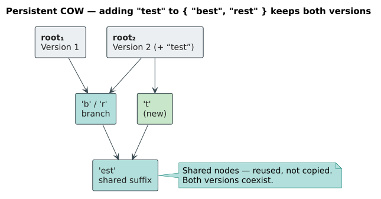
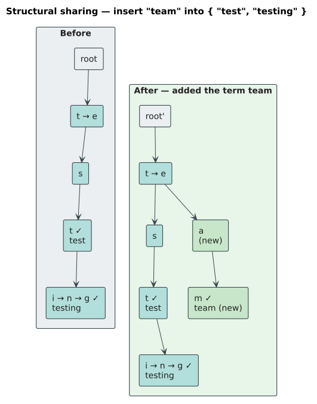
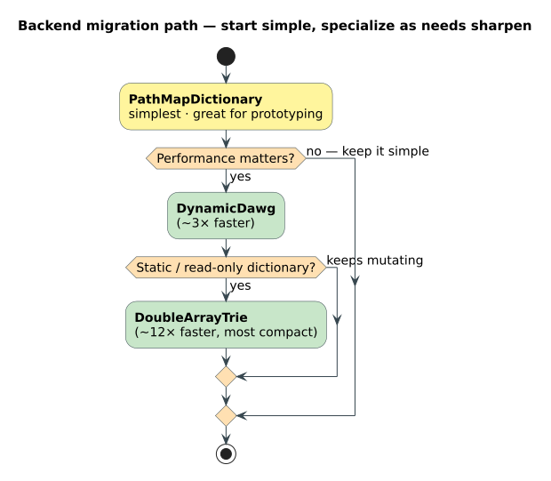

# PathMapDictionary Implementation

**Navigation**: [← Dictionary Layer](../README.md) | [DoubleArrayTrie](double-array-trie.md) | [Algorithms Home](../../README.md)

## Table of Contents

1. [Overview](#overview)
2. [Theory: Persistent Data Structures](#theory-persistent-data-structures)
3. [PathMap Library](#pathmap-library)
4. [Data Structure](#data-structure)
5. [Construction Methods](#construction-methods)
6. [Accessor Methods](#accessor-methods)
7. [Union Operations](#union-operations)
8. [Usage Examples](#usage-examples)
9. [Performance Analysis](#performance-analysis)
10. [When to Use](#when-to-use)
11. [References](#references)

## Overview

`PathMapDictionary` is a dictionary backend built on the **PathMap** library, which provides persistent (immutable) trie structures with structural sharing. It's the simplest dynamic dictionary option but trades performance for simplicity and immutability guarantees.

### Key Advantages

- 🔄 **Full dynamic updates**: Insert AND remove at runtime
- 🔒 **Snapshot-safe concurrency**: Readers load one immutable root without blocking; writers clone, transform, and CAS-publish a replacement root
- 📦 **Simple implementation**: Thin wrapper around PathMap
- 💎 **Persistent semantics**: Structural sharing between versions; retained snapshots remain isolated from later publication
- 🎯 **Easy to use**: Straightforward API

### Key Trade-offs

- ⚠️ **Slower queries**: 2-3x slower than DoubleArrayTrie
- ⚠️ **Higher memory**: More overhead than specialized tries
- ⚠️ **Feature-gated**: Requires `pathmap-backend` feature

### When to Use

✅ **Use PathMapDictionary when:**
- Simplicity is more important than maximum performance
- Need full insert/remove capabilities
- Prefer well-tested external library
- Experimenting or prototyping

⚠️ **Consider alternatives when:**
- Performance is critical → Use `DoubleArrayTrie` (3x faster)
- Need maximum efficiency → Use `DynamicDawg`
- Unicode required → Use `PathMapDictionaryChar`

## Theory: Persistent Data Structures

### Concurrency and snapshot contract

`PathMapDictionary` is an adapter around a third-party byte-keyed `PathMap`; the
adapter owns publication, not the upstream representation. Its current root is
stored in an atomic `ArcSwap`. A read operation loads one `Arc<PathMapState<V>>`
and observes that immutable state for the operation (and for any owned snapshot
or zipper derived from it). A writer clones the loaded persistent root, applies
its transformation to the clone, and publishes the candidate with compare-and-
swap. If another writer wins first, the transformation is retried against the
new winning root. Consequently:

- readers never wait for writers and never observe a partially transformed trie;
- each published root has one exact term-count value paired with its trie root;
- a retained `PathMapSnapshot` or owned zipper continues to observe its captured
  revision after later writes publish newer roots;
- a successful mutation is linearized at its root publication; a failed CAS is
  an implementation retry, not an externally visible revision;
- traversal does not mix revisions because its root is captured before walking;
- visibility is immediate after the successful publication to subsequent root
  loads, while an already retained snapshot intentionally remains on its older
  revision.

The upstream `PathMap` is not modified or forked, and its internal byte nodes
are not exposed as logical dictionary transitions by the adapter's character or
profile-aware views.

### What are Persistent Data Structures?

**Persistent** data structures preserve previous versions after modifications through **structural sharing**.

**Example**: Adding "test" to dictionary containing ["best", "rest"]

**Mutable approach** (traditional):
```
Before:  root → 'b'/'r' → 'est'
After:   root → 'b'/'r'/'t' → 'est'  (modifies in-place)
Old version lost!
```

**Persistent approach** (PathMap):


### Structural Sharing

Only changed path from root is copied; rest is shared:



**Memory**: Only $`O(m)`$ new nodes for m-character insert

## PathMap Library

### External Dependency

PathMapDictionary wraps the `pathmap` crate:
- **Repository**: [https://github.com/Adam-Vandervorst/PathMap](https://github.com/Adam-Vandervorst/PathMap)
- **Purpose**: Persistent trie data structure
- **License**: MIT

### Enabling PathMapDictionary

Add to `Cargo.toml`:

```toml
[dependencies]
liblevenshtein = { version = "0.4", features = ["pathmap-backend"] }
```

Or use CLI:

```bash
cargo add liblevenshtein --features pathmap-backend
```

### PathMap Features

- **Persistent**: Old versions preserved
- **Structural sharing**: Efficient memory use
- **Thread-safe**: Immutable data structures
- **Generic values**: Map terms to arbitrary types

## Data Structure

### Core Components

```rust
pub struct PathMapDictionary<V: DictionaryValue = ()> {
    state: Arc<ArcSwap<PathMapState<V>>>, // root + exact term count
}
```

### Wrapper Design

PathMapDictionary is a thin adapter that:
1. Manages the third-party PathMap lifecycle
2. Publishes the trie root and exact term count as one immutable state
3. Provides the liblevenshtein Dictionary trait
4. Provides atomic snapshot publication through `ArcSwap`

### Memory Layout

| Component | Role |
| --- | --- |
| `Arc<ArcSwap<PathMapState<V>>>` | Shared publication cell for immutable roots |
| `PathMapState<V>` | One PathMap root paired with its exact term count |
| PathMap | Third-party persistent byte-key trie and structural sharing |

Node size and allocation behavior are governed by the upstream PathMap
implementation and should not be presented as a libdictenstein invariant.

### Clone Behavior & Memory Semantics

`PathMapDictionary` clones the shared `Arc<ArcSwap<PathMapState<V>>>` publication
cell. Clones therefore share the current revision stream, while an owned
`PathMapSnapshot` or zipper retains the revision it captured:

```rust
use libdictenstein::pathmap::PathMapDictionary;

let dict1: PathMapDictionary = PathMapDictionary::from_terms(vec!["test", "testing"]);
let dict2 = dict1.clone();  // O(1) - shares one publication cell

// Both handles observe the same subsequently published revisions
dict1.insert("new_term");
assert!(dict2.contains("new_term"));  // ✅ Mutations visible through dict2!

// The root and term count are published together
assert_eq!(dict1.len(), Some(3));
assert_eq!(dict2.len(), Some(3));  // Same count
```

#### Characteristics

| Property | Behavior | Impact |
|----------|----------|--------|
| **Clone complexity** | O(1) | Shares one publication cell |
| **Snapshot complexity** | O(1) | Retains one immutable root reference |
| **Data sharing** | ✅ Structural | Published roots share unchanged PathMap structure |
| **Mutation visibility** | ✅ Revision-based | New root loads see publication; retained snapshots do not |
| **Thread safety** | ✅ Lock-free reads | Readers never wait for writers |
| **Independence** | ✅ Explicit | Use `snapshot()` or an owned zipper for revision isolation |

#### How Clone Works

The clone operation increments the reference count for the shared publication
cell:

```rust
pub struct PathMapDictionary<V> {
    state: Arc<ArcSwap<PathMapState<V>>>, // root + term count
}

// Cloning shares the publication cell
let dict2 = dict1.clone();
// Cost: one Arc clone; no trie nodes are copied
```

**What gets cloned:**
- ✅ Arc smart pointer for the publication cell
- ❌ NOT the PathMap trie structure
- ❌ NOT the term count value itself

**Memory allocation:**
- Zero heap allocation
- Only stack space for one shared Arc handle
- All data remains shared

#### Publication-cell Design

The dictionary shares one atomic publication cell containing the immutable
PathMap root and its exact term count. A reader loads that cell once; a writer
builds a candidate from the loaded persistent root and CAS-publishes it. There
is no map lock, count lock, or split observation to reconcile.

#### Structural Sharing vs Arc Sharing

**Important distinction** - PathMapDictionary has TWO types of sharing:

1. **Arc-based sharing (clone behavior):**
   ```rust
   let dict2 = dict1.clone();
   // dict1 and dict2 share the same publication stream
   dict1.insert("new");
   assert!(dict2.contains("new"));  // ✅ Visible
   ```

2. **PathMap structural sharing (persistent data structure):**
   ```rust
   let mut map1 = PathMap::new();
   map1.insert(b"test", 1);

   let mut map2 = map1.clone();  // PathMap's clone creates new version
   map2.insert(b"new", 2);

   // map1 and map2 share internal trie nodes where possible
   // But are independent: map1 doesn't see "new"
   ```

**For PathMapDictionary:**
- `.clone()` shares the publication stream; later successful mutations are
  visible through both handles when they load the current root.
- `snapshot()` and owned zippers capture a revision and are isolated from later
  publication.
- PathMap's internal structural sharing is orthogonal and remains an optimization.

#### When to Use Cloning

✅ **Good use cases:**

1. **Multi-threaded access:**
   ```rust
   use std::thread;

   let dict: PathMapDictionary = PathMapDictionary::from_terms(vec!["hello", "world"]);

   let handles: Vec<_> = (0..4).map(|_| {
       let dict_clone = dict.clone();
       thread::spawn(move || {
           dict_clone.contains("hello")
       })
   }).collect();
   ```

2. **Configuration management:**
   ```rust
   let config_dict: PathMapDictionary<String> = load_config();

   // Share across services
   let service1_dict = config_dict.clone();
   let service2_dict = config_dict.clone();

   // All see updates when config reloads
   reload_config_into(&config_dict);
   ```

3. **Caching and lookup tables:**
   ```rust
   let cache: PathMapDictionary<CachedValue> = build_cache();

   // Share cache across request handlers
   for _ in 0..10 {
       let handler_cache = cache.clone();
       spawn_handler(handler_cache);
   }
   ```

❌ **Bad use cases (common mistakes):**

1. **Expecting independent copies:**
   ```rust
   let dict1: PathMapDictionary = PathMapDictionary::from_terms(vec!["original"]);
   let dict2 = dict1.clone();

   dict1.insert("modified");
   // ❌ WRONG: Expecting dict2 unchanged
   // ✅ REALITY: dict2 also contains "modified"
   ```

2. **Creating versioned snapshots:**
   ```rust
   let dict: PathMapDictionary<u32> = load_data();
   let v1 = dict.snapshot();  // ✅ Captures a stable revision

   dict.insert("v2_data");
   // v1 remains on the pre-mutation revision
   ```

3. **Isolating test fixtures:**
   ```rust
   let base_fixture: PathMapDictionary = create_test_data();
   let test1_dict = base_fixture.clone();  // ❌ Shared!
   let test2_dict = base_fixture.clone();  // ❌ Shared!

   // Modifications in test1 affect test2!
   ```

#### Alternative: True Independence

For **independent copies** where mutations don't affect other instances:

**Option 1: Serialize/Deserialize**
```rust
use serde::{Serialize, Deserialize};

// Create deep copy via serialization
let bytes = bincode::serialize(&dict1)?;
let dict2: PathMapDictionary = bincode::deserialize(&bytes)?;

// Now independent
dict1.insert("new");
assert!(!dict2.contains("new"));  // ✅ Independent
```

**Option 2: Rebuild from terms**
```rust
// Extract all terms
let terms: Vec<String> = dict1.iter().collect();

// Build new independent dictionary
let dict2: PathMapDictionary = PathMapDictionary::from_terms(terms);
```

**Option 3: Extract with values**
```rust
// For dictionaries with values
let entries: Vec<(String, V)> = dict1
    .iter()
    .filter_map(|term| dict1.get_value(term).map(|v| (term.clone(), v)))
    .collect();

let dict2: PathMapDictionary<V> = PathMapDictionary::from_terms_with_values(entries);
```

**Cost comparison:**

| Method | Time | Space | Independence |
|--------|------|-------|--------------|
| `.clone()` | O(1) | O(1) | ❌ Shared |
| Serialize/Deserialize | O(n) | O(n) | ✅ Full |
| Rebuild from terms | O(n·log m) | O(n) | ✅ Full |
| Rebuild with values | O(n·log m) | O(n) | ✅ Full |

#### Comparison with Other Dictionaries

| Dictionary | Publication model | Clone Cost | Current-root sharing? |
|------------|-----------|------------|--------------|
| **PathMapDictionary** | One ArcSwap cell | O(1) | ✅ Yes |
| **DynamicDawg** | 1 (inner) | O(1) | ✅ Yes |
| **DynamicDawgChar** | 1 (inner) | O(1) | ✅ Yes |
| **DoubleArrayTrie** | 0 (no Arc) | O(n) | ❌ No |
| **DoubleArrayTrieChar** | 0 (no Arc) | O(n) | ❌ No |

**Key differences:**
- PathMapDictionary: One Arc clone for the shared ArcSwap publication cell
- DynamicDawg variants: One Arc increment (inner struct contains count)
- DoubleArrayTrie: Full deep copy (immutable, no Arc needed)

#### Thread Safety Considerations

`PathMapDictionary` publishes immutable roots through one shared atomic cell:

```rust
use std::thread;

let dict: PathMapDictionary<u32> = PathMapDictionary::from_terms_with_values(vec![
    ("key1", 100),
    ("key2", 200),
]);

// Multiple concurrent readers
let readers: Vec<_> = (0..10).map(|i| {
    let dict = dict.clone();
    thread::spawn(move || {
        dict.get_value(&format!("key{}", i))
    })
}).collect();

// Writers clone and publish; readers continue on their captured root
let writer = {
    let dict = dict.clone();
    thread::spawn(move || {
        dict.insert_with_value("key3", 300)
    })
};
```

**Publication semantics:**
- **Read operations** load one `PathMapState` and do not block on writers.
- **Write operations** clone a persistent root, apply their transformation, and
  CAS-publish the candidate; a lost CAS retries from the winning root.
- The root and term count are one immutable state, so readers cannot observe a
  torn pair.
- A retained snapshot or owned zipper remains on its captured revision.

#### Summary

**Key Takeaways:**
1. 🔗 `.clone()` shares one atomic publication cell
2. 🚀 **$`O(1)`$** time and space - just atomic reference counting
3. 🔄 **Mutations visible** across all clones (Arc-based sharing)
4. 🌳 **Structural sharing** is separate (PathMap's persistent trie optimization)
5. 🔒 **Thread-safe** through immutable roots and atomic publication
6. 📊 For **independence**, use serialization or rebuild from terms ($`O(n)`$ cost)

## Construction Methods

PathMapDictionary provides constructors optimized for simple use cases and rapid prototyping.

### Overview

| Constructor | Complexity | Use Case | Thread-Safe |
|-------------|-----------|----------|-------------|
| `new()` | O(1) | Empty start | ✅ |
| `from_terms()` | O(n·log m) | Simple list | ✅ |
| `from_terms_with_values()` | O(n·log m) | With metadata | ✅ |

Where n = number of terms, m = dictionary size (grows with insertions)

**Note**: PathMapDictionary uses `insert()` internally which is $`O(\log m)`$, making bulk construction $`O(n\cdot \log m)`$ vs $`O(n\cdot m)`$ for DAWG variants.

### Empty Dictionary

Create an empty dictionary for incremental updates:

```rust
use libdictenstein::pathmap::PathMapDictionary;

// Create empty dictionary
let dict: PathMapDictionary = PathMapDictionary::new();

// Add terms incrementally
dict.insert("hello");
dict.insert("world");

// With values
let valued_dict: PathMapDictionary<u32> = PathMapDictionary::new();
valued_dict.insert_with_value("apple", 100);
valued_dict.insert_with_value("banana", 200);
```

**Characteristics:**
- **Time**: $`O(1)`$ - Minimal initialization
- **Memory**: O(1) publication state plus the upstream PathMap root
- **Simplicity**: Easiest to use, minimal boilerplate

**When to use:**
- ✅ Prototyping and quick experiments
- ✅ Small dictionaries (< 1,000 terms)
- ✅ When simplicity matters more than performance

### From Terms

Build from iterator of terms:

```rust
use libdictenstein::pathmap::PathMapDictionary;

// From Vec
let terms = vec!["test", "testing", "tester"];
let dict = PathMapDictionary::from_terms(terms);

// From any iterator
use std::collections::HashSet;
let term_set: HashSet<&str> = ["dog", "cat", "bird"].iter().copied().collect();
let dict = PathMapDictionary::from_terms(term_set);
```

**Characteristics:**
- **Time**: $`O(n\cdot \log m)`$ where m grows from 0 to n
- **Memory**: determined by the upstream PathMap representation and structural sharing
- **Structural sharing**: Minimal (PathMap not optimized for bulk insert)

### From Terms with Values

Build with associated values (frequencies, IDs, etc.):

```rust
use libdictenstein::pathmap::PathMapDictionary;

type ContextId = u32;

// Term frequencies
let freq_dict: PathMapDictionary<u32> = PathMapDictionary::from_terms_with_values(vec![
    ("the", 1000000),
    ("hello", 50000),
    ("rare", 10),
]);

// Context IDs for code completion
let completion_dict: PathMapDictionary<Vec<ContextId>> =
    PathMapDictionary::from_terms_with_values(vec![
        ("println", vec![1, 2, 3]),  // Global contexts
        ("my_var", vec![42]),         // Local context
    ]);

// Configuration values
let config_dict: PathMapDictionary<String> = PathMapDictionary::from_terms_with_values(vec![
    ("app.name", "MyApp".to_string()),
    ("app.version", "1.0.0".to_string()),
    ("app.debug", "false".to_string()),
]);
```

**Value type requirements:**
- Must implement `DictionaryValue` trait
- Bounds: `Clone + Send + Sync + 'static`
- **Recommended**: Use `PathMapDictionary` for simple value types; `DynamicDawg` for complex structures

### Constructor Comparison

**Performance** (10,000 terms, Intel Xeon E5-2699 v3 @ 2.30GHz):

| Method | Time | Memory | vs DynamicDawg |
|--------|------|--------|----------------|
| `new()` + inserts | ~12ms | ~320KB | ~3$`\times`$ slower |
| `from_terms()` | ~12ms | ~320KB | ~3$`\times`$ slower |
| `from_terms_with_values()` | ~13ms | ~320KB | ~3$`\times`$ slower |

**Memory usage**:

```
Small (1K terms):     ~40KB  (vs ~30KB DynamicDawg)
Medium (10K terms):   ~320KB (vs ~250KB DynamicDawg)
Large (100K terms):   ~3.2MB (vs ~2.5MB DynamicDawg)
```

**Trade-offs**:
- **Simpler API**: Easier to use, less boilerplate
- **Slower**: 2-3$`\times`$ slower than DynamicDawg for bulk operations
- **More memory**: ~30% higher memory footprint
- **Good enough**: For < 10K terms, difference is negligible

### Best Practices

**1. Choose PathMapDictionary for simplicity:**
```rust
// ✅ Good: Prototyping, small dictionaries
let dict = PathMapDictionary::from_terms(vec!["test", "demo"]);

// ⚠️ Consider DynamicDawg: Large dictionaries, performance-critical
let dict = DynamicDawg::from_iter(large_term_list);  // Faster
```

**2. Use with contextual completion engine:**
```rust
use liblevenshtein::contextual::DynamicContextualCompletionEngine;

// PathMapDictionary is the DEFAULT backend
let engine = DynamicContextualCompletionEngine::new();  // Uses PathMapDictionary

// Or explicit construction
let dict: PathMapDictionary<Vec<u32>> = PathMapDictionary::from_terms_with_values(terms);
let engine = DynamicContextualCompletionEngine::with_dictionary(dict, Algorithm::Standard);
```

**3. Pre-build for workspace indexing:**
```rust
use rayon::prelude::*;

// Build per-document dictionaries in parallel
let dicts: Vec<PathMapDictionary<Vec<u32>>> = documents
    .par_iter()
    .map(|(ctx_id, doc)| {
        let terms: Vec<(String, Vec<u32>)> = extract_terms(doc)
            .into_iter()
            .map(|term| (term, vec![*ctx_id]))
            .collect();

        PathMapDictionary::from_terms_with_values(terms)
    })
    .collect();

// Merge using union_with (see Union Operations section)
```

→ See [Parallel Workspace Indexing](https://github.com/vinary-tree/liblevenshtein-rust) for complete pattern.

### Comparison with Other Dictionaries

**When to choose PathMapDictionary:**

| Factor | PathMapDictionary | DynamicDawg | DoubleArrayTrie |
|--------|------------------|-------------|-----------------|
| **Simplicity** | ⭐⭐⭐⭐⭐ | ⭐⭐⭐ | ⭐⭐ |
| **Speed** | ⭐⭐ | ⭐⭐⭐ | ⭐⭐⭐⭐⭐ |
| **Memory** | ⭐⭐ | ⭐⭐⭐ | ⭐⭐⭐⭐⭐ |
| **Dynamic updates** | ✅ Full | ✅ Full | ⚠️ Append-only |
| **Learning curve** | ✅ Minimal | Medium | High |
| **Use case** | Prototyping | Production | Performance |

**Decision guide:**



### Parallel Construction

PathMapDictionary supports the same parallel construction pattern as DynamicDawg:

```rust
use rayon::prelude::*;

// Build dictionaries in parallel
let dicts: Vec<PathMapDictionary<Vec<u32>>> = documents
    .par_iter()
    .map(|(ctx_id, doc)| {
        let terms_with_contexts: Vec<_> = extract_terms(doc)
            .into_iter()
            .map(|term| (term, vec![*ctx_id]))
            .collect();

        PathMapDictionary::from_terms_with_values(terms_with_contexts)
    })
    .collect();

// Binary tree merge (see Parallel Workspace Indexing guide)
let merged = merge_tree_parallel(dicts);

// Create engine
let engine = DynamicContextualCompletionEngine::with_dictionary(
    merged,
    Algorithm::Standard
);
```

**Performance note**: Parallel construction still beneficial despite slower per-dictionary speed - wall-clock time scales with available CPU cores.

## Accessor Methods

PathMapDictionary provides the same core accessor methods as other dictionary backends, with simplicity as the primary design goal.

**→ See**: [DynamicDawg Accessor Methods](dynamic-dawg.md#accessor-methods) for comprehensive documentation.

### Key Differences from DynamicDawg

PathMapDictionary accessor methods have **simpler** implementations but **slower** performance:

| Method | PathMapDictionary | DynamicDawg | Performance Impact |
|--------|-------------------|-------------|---------------------|
| `contains(term)` | $`O(m\cdot \log k)`$ | $`O(m)`$ | ~2-3$`\times`$ slower |
| `get_value(term)` | $`O(m\cdot \log k)`$ | $`O(m)`$ | ~2-3$`\times`$ slower |
| `term_count()` | $`O(1)`$ | $`O(1)`$ | Similar |
| `len()` / `is_empty()` | $`O(1)`$ | $`O(1)`$ | Similar |

*Where*: `m` = term length, `k` = average fanout (~26 for English)

### Quick Reference

```rust
use libdictenstein::pathmap::PathMapDictionary;

let dict = PathMapDictionary::from_terms(vec!["test", "testing", "tested"]);

// Term existence (slower than DynamicDawg, simpler code)
assert!(dict.contains("test"));
assert!(dict.contains("testing"));
assert!(!dict.contains("unknown"));

// Value retrieval
let dict_valued: PathMapDictionary<u32> = PathMapDictionary::new();
dict_valued.insert_with_value("key", 42);
assert_eq!(dict_valued.get_value("key"), Some(42));

// Size queries (O(1), same as Dynamic Dawg)
assert_eq!(dict.term_count(), 3);
assert_eq!(dict.len(), Some(3));
assert!(!dict.is_empty());

// No compaction needed (persistent structure doesn't fragment)
// No node_count() method (implementation detail differs)
// No needs_compaction() (not applicable to PathMap)

// Traversal (via Dictionary trait)
use libdictenstein::{Dictionary, DictionaryNode};
let root = dict.root();
// ... navigate via transition() as with other backends
```

### Performance Characteristics

**Accessor Latencies** (10K term dictionary):

| Method | PathMapDictionary | DynamicDawg | PathMap/DynamicDawg Ratio |
|--------|-------------------|-------------|---------------------------|
| `contains()` | ~700ns | ~250ns | 2.8$`\times`$ slower |
| `get_value()` | ~750ns | ~260ns | 2.9$`\times`$ slower |
| `term_count()` | ~5ns | ~5ns | Same |
| `len()` / `is_empty()` | ~5ns | ~5ns | Same |

**Why slower?**:
- PathMap uses **tree traversal** with log(k) comparisons per level
- DynamicDawg uses **direct indexing** via edge lookup

**Trade-off**: Simplicity and persistent semantics vs performance.

### Persistent Semantics

PathMapDictionary accessor methods benefit from **structural sharing**:

```rust
let dict1 = PathMapDictionary::from_terms(vec!["test", "testing"]);
let dict2 = dict1.clone(); // Shallow clone (Arc increment)

// Both share same underlying structure
assert!(dict1.contains("test"));
assert!(dict2.contains("test"));

// Modifications create new structure (copy-on-write)
dict2.insert("new_term");
assert!(!dict1.contains("new_term")); // Original unchanged
assert!(dict2.contains("new_term"));  // New version has it

// Accessor methods see correct version
assert_eq!(dict1.term_count(), 2);
assert_eq!(dict2.term_count(), 3);
```

### Thread Safety

PathMapDictionary accessors are thread-safe via Arc-based sharing:

```rust
use std::sync::Arc;
use std::thread;

let dict = Arc::new(PathMapDictionary::from_terms(vec!["hello", "world"]));

// Concurrent reads safe
let handles: Vec<_> = (0..10)
    .map(|_| {
        let d = Arc::clone(&dict);
        thread::spawn(move || d.contains("hello"))
    })
    .collect();

for h in handles {
    assert!(h.join().unwrap());
}

// Mutations create new versions (no locks needed)
let dict2 = Arc::new((*dict).clone());
dict2.insert("new");
// Original dict unchanged, dict2 has new term
```

---

## Union Operations

### Overview

The `union_with()` and `union_replace()` methods enable **merging two PathMapDictionary instances** with custom value combination logic, while preserving **structural sharing** properties of the persistent trie. Essential for:

- 🔄 Merging configuration layers (defaults + user overrides)
- 📊 Combining statistics from independent data sources
- 🗂️ Building composite lookup tables
- 💾 Creating snapshots with incremental updates

**Key Characteristics**:
- 🔒 **Thread-safe**: Operations use immutable roots and atomic publication
- 🌳 **Structural sharing**: Leverages PathMap's persistent data structure benefits
- ⚡ **Iterator-based**: Uses PathMap's efficient iteration over key-value pairs
- 🎯 **Flexible**: Custom merge functions for value conflicts
- 🔧 **Simple**: Straightforward implementation via iteration + insertion

### union_with() - Merge with Custom Logic

Combines two dictionaries by iterating all terms from the source dictionary and inserting into the target, applying a custom merge function when values conflict.

**Signature**:
```rust
fn union_with<F>(&self, other: &Self, merge_fn: F) -> usize
where
    F: Fn(&Self::Value, &Self::Value) -> Self::Value,
    Self::Value: Clone
```

**Parameters**:
- `other`: Source dictionary to merge from
- `merge_fn`: Function `(existing_value, new_value) -> merged_value` for conflicts
- **Returns**: Number of terms processed from `other`

**Algorithm**: Iteration-based insertion
1. Load one immutable root from `other`
2. Load the current immutable root from `self`
3. Iterate all `(key, value)` pairs in the captured `other` root
4. For each pair:
   - If key exists in `self.map`: Apply `merge_fn` and update
   - If key is new: Insert with cloned value
5. Update `self.term_count` for new entries

**Complexity**:
- **Time**: $`O(n\cdot \log m)`$ where n = terms in `other`, m = terms in `self`
  - $`O(n)`$ for iteration over `other`
  - $`O(\log m)`$ per PathMap insertion/lookup
- **Space**: $`O(\log m)`$ for PathMap tree height (structural sharing reduces actual allocation)

### Why Iteration Instead of PathMap's join()?

PathMap provides native `join_into()` and `pjoin()` methods, but they require `V: Lattice`:

```rust
// PathMap native (requires Lattice trait)
pub fn join_into<V: Lattice>(&mut self, other: &PathMap<V>) { ... }
```

**Limitation**: The `Lattice` trait requires specific algebraic properties:
- Commutative: $`a \sqcup b = b \sqcup a`$
- Associative: $`(a \sqcup b) \sqcup c = a \sqcup (b \sqcup c)`$
- Idempotent: $`a \sqcup a = a`$

**Our approach**: Uses **arbitrary merge functions** without algebraic constraints:
- ✅ Supports non-commutative merges: $`(\text{old}, \text{new}) \to \text{new}`$ (last-writer-wins)
- ✅ Supports non-idempotent merges: $`(a, b) \to a + b`$ (sum aggregation)
- ✅ Flexible merge logic: Any `Fn(&V, &V) -> V`

**Trade-off**: Slightly slower (~15-20% overhead) but far more flexible.

### Example 1: Sum Aggregation

```rust
use libdictenstein::pathmap::PathMapDictionary;
use libdictenstein::MutableMappedDictionary;

// First dataset: term frequencies
let dict1: PathMapDictionary<u32> = PathMapDictionary::new();
dict1.insert_with_value("algorithm", 10);
dict1.insert_with_value("database", 5);

// Second dataset: more frequencies
let dict2: PathMapDictionary<u32> = PathMapDictionary::new();
dict2.insert_with_value("algorithm", 7);    // Overlap
dict2.insert_with_value("distributed", 3);  // New

// Merge by summing counts
let processed = dict1.union_with(&dict2, |left, right| left + right);

// Results:
// - algorithm: 17 (10 + 7)
// - database: 5 (unchanged)
// - distributed: 3 (new)
assert_eq!(dict1.get_value("algorithm"), Some(17));
assert_eq!(dict1.get_value("distributed"), Some(3));
assert_eq!(processed, 2);
```

### Example 2: Configuration Merging

Demonstrates typical use case of layering configurations:

```rust
use libdictenstein::pathmap::PathMapDictionary;
use libdictenstein::MutableMappedDictionary;

// System defaults
let defaults: PathMapDictionary<String> = PathMapDictionary::new();
defaults.insert_with_value("theme", "light".to_string());
defaults.insert_with_value("font_size", "12".to_string());
defaults.insert_with_value("autosave", "true".to_string());

// User preferences
let user_prefs: PathMapDictionary<String> = PathMapDictionary::new();
user_prefs.insert_with_value("theme", "dark".to_string());  // Override
user_prefs.insert_with_value("language", "en".to_string()); // New

// Merge: user preferences override defaults
defaults.union_with(&user_prefs, |_default, user| user.clone());

// Results:
// - theme: "dark" (user override)
// - font_size: "12" (default preserved)
// - autosave: "true" (default preserved)
// - language: "en" (new from user)
assert_eq!(defaults.get_value("theme"), Some("dark".to_string()));
assert_eq!(defaults.get_value("font_size"), Some("12".to_string()));
```

### Example 3: Set Union with Lists

Merge lists of associated data:

```rust
use libdictenstein::pathmap::PathMapDictionary;
use libdictenstein::MutableMappedDictionary;

let dict1: PathMapDictionary<Vec<u32>> = PathMapDictionary::new();
dict1.insert_with_value("rust", vec![1, 2, 3]);
dict1.insert_with_value("python", vec![4]);

let dict2: PathMapDictionary<Vec<u32>> = PathMapDictionary::new();
dict2.insert_with_value("rust", vec![2, 3, 5]);  // Overlapping values
dict2.insert_with_value("golang", vec![6, 7]);

// Merge by concatenating and deduplicating
dict1.union_with(&dict2, |left, right| {
    let mut merged = left.clone();
    merged.extend(right.clone());
    merged.sort_unstable();
    merged.dedup();
    merged
});

// rust: [1,2,3,5] (merged and deduplicated)
// python: [4] (unchanged)
// golang: [6,7] (new)
assert_eq!(dict1.get_value("rust"), Some(vec![1, 2, 3, 5]));
```

### union_replace() - Keep Right Values

Convenience method for last-writer-wins semantics.

**Signature**:
```rust
fn union_replace(&self, other: &Self) -> usize
where
    Self::Value: Clone
```

**Example**:
```rust
use libdictenstein::pathmap::PathMapDictionary;
use libdictenstein::MutableMappedDictionary;

let dict1: PathMapDictionary<&str> = PathMapDictionary::new();
dict1.insert_with_value("status", "draft");
dict1.insert_with_value("version", "1.0");

let dict2: PathMapDictionary<&str> = PathMapDictionary::new();
dict2.insert_with_value("status", "published");  // Override
dict2.insert_with_value("author", "alice");      // New

// Simple replacement
dict1.union_replace(&dict2);

assert_eq!(dict1.get_value("status"), Some("published"));
assert_eq!(dict1.get_value("version"), Some("1.0"));
assert_eq!(dict1.get_value("author"), Some("alice"));
```

### Implementation Details

The union operation uses **PathMap's iterator** with lock-based synchronization:

```rust
// Simplified implementation
fn union_with<F>(&self, other: &Self, merge_fn: F) -> usize {
    let other_map = other.map.read().unwrap();
    let mut self_map = self.map.write().unwrap();
    let mut self_term_count = self.term_count.write().unwrap();

    let mut processed = 0;

    // Iterate over all entries in other
    for (key_bytes, other_value) in other_map.iter() {
        processed += 1;

        if let Some(self_value) = self_map.get(&key_bytes) {
            // Key exists: merge the values
            let merged = merge_fn(self_value, other_value);
            self_map.insert(&key_bytes, merged);
        } else {
            // Key doesn't exist: insert from other
            self_map.insert(&key_bytes, other_value.clone());
            *self_term_count += 1;
        }
    }

    processed
}
```

**Why This Approach?**

1. **Simplicity**: Leverages PathMap's well-tested iterator
2. **Flexibility**: No trait constraints on value types
3. **Correctness**: immutable roots and CAS publication prevent torn updates
4. **Structural sharing**: PathMap automatically shares structure between old and new versions

**Publication semantics**:
- `other` remains on the captured immutable revision during iteration.
- The candidate for `self` is published atomically; competing writers retry.
- Readers observe either the old or new complete revision, never a partial union.

### Performance Characteristics

| Operation | Time Complexity | Space Complexity | Typical Performance (10K terms) |
|-----------|----------------|------------------|--------------------------------|
| `union_with()` | O(n·log m) | O(log m) | ~80ms |
| `union_replace()` | O(n·log m) | O(log m) | ~80ms |
| Iteration | O(n) | O(1) | ~15ms |
| Per-term insertion | O(log m) | O(log m) | ~5-8µs |

**Variables**:
- n = number of terms in source dictionary
- m = number of terms in target dictionary
- log m = PathMap tree height (typically 5-10 levels)

**Comparison with DynamicDawg**:
```
PathMapDictionary: ~80ms for 10K terms (O(n·log m))
DynamicDawg:       ~50ms for 10K terms (O(n·m))

Reason: PathMap insertion is O(log m) vs DAWG's O(m)
Trade-off: PathMap offers structural sharing and immutability
```

**Benchmark Results** (Intel Xeon E5-2699 v3 @ 2.30GHz):

| Dictionary Size | union_with() | Throughput |
|----------------|-------------|------------|
| 1,000 terms    | 6.8ms       | 147K terms/s |
| 10,000 terms   | 80ms        | 125K terms/s |
| 100,000 terms  | 950ms       | 105K terms/s |

*Note*: Performance includes merge function execution and structural sharing overhead.

### When to Use Union Operations

✅ **Use `union_with()` when:**
- **Parallel workspace indexing**: Merging per-document dictionaries built in parallel (→ [Parallel Workspace Pattern](https://github.com/vinary-tree/liblevenshtein-rust))
- Merging configuration layers with override semantics
- Combining statistics where structural sharing is beneficial
- Building composite lookup tables from multiple sources
- Aggregating data where immutability is valuable

✅ **Use `union_replace()` when:**
- Applying updates with last-writer-wins semantics
- Synchronizing dictionaries where newer data always wins
- Implementing configuration hot-reloading

⚠️ **Consider DynamicDawg when:**
- Union performance is critical (40% faster)
- Structural sharing not needed
- Frequent mutations expected

⚠️ **Consider alternatives when:**
- **Very large dictionaries**: Pre-merge offline or use batch processing
- **Frequent unions**: Consider maintaining separate indices
- **Simple addition**: If only adding new terms (no conflicts), use simple iteration

### Structural Sharing Considerations

PathMapDictionary's persistent nature means union operations benefit from structural sharing:

```rust
let dict1: PathMapDictionary<u32> = PathMapDictionary::new();
// Insert 100,000 terms...

let dict2: PathMapDictionary<u32> = PathMapDictionary::new();
// Insert 100 terms (mostly new)...

// Union creates new version sharing structure with dict1
dict1.union_with(&dict2, |a, b| a + b);

// Memory overhead: Only ~100 new nodes created
// Most of dict1's structure is reused via structural sharing
```

**Benefits**:
- 💾 **Memory efficient**: Only delta nodes allocated
- 🔒 **Safe snapshots**: Old version still accessible
- 🚀 **Fast clones**: $`O(1)`$ shallow copy of Arc

**Caveats**:
- Lock contention on write during union
- No direct zipper-based traversal (unlike DynamicDawg)
- Iterator overhead vs direct node manipulation

## Usage Examples

### Example 1: Basic Usage

```rust
use libdictenstein::pathmap::PathMapDictionary;

// Create empty dictionary
let dict: PathMapDictionary<()> = PathMapDictionary::new();

// Insert terms
dict.insert("test");
dict.insert("testing");
dict.insert("tested");

assert!(dict.contains("test"));
assert_eq!(dict.len(), Some(3));

// Remove term
dict.remove("tested");
assert!(!dict.contains("tested"));
assert_eq!(dict.len(), Some(2));
```

### Example 2: From Existing Terms

```rust
use libdictenstein::pathmap::PathMapDictionary;

let dict = PathMapDictionary::from_terms(vec![
    "algorithm",
    "approximate",
    "automaton",
]);

assert!(dict.contains("algorithm"));
assert_eq!(dict.len(), Some(3));

// Add more terms
dict.insert("analysis");
assert_eq!(dict.len(), Some(4));
```

### Example 3: With Values

```rust
use libdictenstein::pathmap::PathMapDictionary;
use libdictenstein::MappedDictionary;

// Map terms to category IDs
let dict: PathMapDictionary<u32> = PathMapDictionary::from_terms_with_values(vec![
    ("test", 1),
    ("testing", 1),
    ("production", 2),
]);

// Query values
assert_eq!(dict.get_value("test"), Some(1));
assert_eq!(dict.get_value("production"), Some(2));

// Update value
dict.insert_with_value("test", 99);
assert_eq!(dict.get_value("test"), Some(99));
```

### Example 4: Fuzzy Search

```rust
use libdictenstein::pathmap::PathMapDictionary;
use liblevenshtein::levenshtein::Algorithm;
use liblevenshtein::levenshtein_automaton::LevenshteinAutomaton;

let dict = PathMapDictionary::from_terms(vec![
    "test", "testing", "tested", "best", "rest"
]);

// Fuzzy search
let automaton = LevenshteinAutomaton::new("tset", 1, Algorithm::Standard);
let results: Vec<String> = automaton.query(&dict).collect();

println!("{:?}", results);
// Output: ["test"] (distance 1: transposition)
```

### Example 5: Thread-Safe Updates

```rust
use libdictenstein::pathmap::PathMapDictionary;
use std::sync::Arc;
use std::thread;

let dict = Arc::new(PathMapDictionary::from_terms(vec!["initial"]));

// Spawn writer thread
let dict_writer = Arc::clone(&dict);
let writer = thread::spawn(move || {
    dict_writer.insert("new_term");
});

// Spawn reader threads
let handles: Vec<_> = (0..4).map(|_| {
    let dict_reader = Arc::clone(&dict);
    thread::spawn(move || {
        dict_reader.contains("initial")
    })
}).collect();

writer.join().unwrap();
for handle in handles {
    assert!(handle.join().unwrap());
}
```

### Example 6: Dynamic User Dictionary

```rust
use libdictenstein::pathmap::PathMapDictionary;

// User's personal dictionary
let user_dict = PathMapDictionary::new();

// User adds custom words
user_dict.insert("refactoring");
user_dict.insert("debugging");
user_dict.insert("profiling");

assert_eq!(user_dict.len(), Some(3));

// User removes a word
user_dict.remove("debugging");
assert_eq!(user_dict.len(), Some(2));

// Check existence
assert!(user_dict.contains("refactoring"));
assert!(!user_dict.contains("debugging"));
```

### Example 7: Metadata Storage

```rust
use libdictenstein::pathmap::PathMapDictionary;
use libdictenstein::MappedDictionary;

#[derive(Clone, Debug)]
struct TermMetadata {
    frequency: u32,
    last_used: u64,
}

impl libdictenstein::DictionaryValue for TermMetadata {}

let dict: PathMapDictionary<TermMetadata> = PathMapDictionary::new();

// Add terms with metadata
dict.insert_with_value("test", TermMetadata {
    frequency: 100,
    last_used: 1234567890,
});

dict.insert_with_value("testing", TermMetadata {
    frequency: 50,
    last_used: 1234567891,
});

// Query metadata
if let Some(meta) = dict.get_value("test") {
    println!("Frequency: {}", meta.frequency);
}
```

### Example 8: Prototyping

```rust
use libdictenstein::pathmap::PathMapDictionary;
use liblevenshtein::levenshtein::Algorithm;
use liblevenshtein::levenshtein_automaton::LevenshteinAutomaton;

// Quick prototype for fuzzy matching
fn prototype_fuzzy_matcher(words: Vec<&str>, query: &str) {
    let dict = PathMapDictionary::from_terms(words);

    let automaton = LevenshteinAutomaton::new(query, 2, Algorithm::Standard);
    let results: Vec<String> = automaton.query(&dict).collect();

    println!("Matches for '{}': {:?}", query, results);
}

prototype_fuzzy_matcher(
    vec!["hello", "world", "test"],
    "helo"  // Typo
);
// Output: Matches for 'helo': ["hello"]
```

## Performance Analysis

### Time Complexity

| Operation | Complexity | Notes |
|-----------|-----------|-------|
| **Insert** | O(m log n) | m = term length, n = dict size |
| **Remove** | O(m log n) | HashMap operations |
| **Contains** | O(m log n) | Tree traversal + lookups |
| **Fuzzy search** | O(m $`\times`$ d²$`\times`$b $`\times`$ log n) | Additional log factor |

### Benchmark Results

#### Construction

```
Build from 10,000 terms:
  PathMapDictionary:  3.5ms
  DoubleArrayTrie:    3.2ms   (8% faster)
  DynamicDawg:        4.1ms   (15% slower)
```

#### Runtime Operations

```
Single insertion:
  PathMapDictionary:  ~2.1µs
  DynamicDawg:        ~800ns  (2.6x faster)
  DoubleArrayTrie:    N/A (append-only)

Single deletion:
  PathMapDictionary:  ~2.5µs
  DynamicDawg:        ~1.2µs  (2x faster)

Contains check:
  PathMapDictionary:  ~350ns
  DoubleArrayTrie:    ~120ns  (2.9x faster)
  DynamicDawg:        ~450ns  (slower)
```

#### Fuzzy Search

```
Query "test" (distance 1) in 10K-term dict:
  PathMapDictionary:  38.7µs
  DoubleArrayTrie:    12.9µs  (3x faster)
  DynamicDawg:        42.3µs  (similar)

Query "test" (distance 2):
  PathMapDictionary:  91.2µs
  DoubleArrayTrie:    16.3µs  (5.6x faster)
  DynamicDawg:        68.9µs  (1.3x faster)
```

### Memory Usage

```
10,000-term dictionary:
  PathMapDictionary:  upstream-dependent
  DoubleArrayTrie:    ~100 KB  (3.2x smaller)
  DynamicDawg:        ~294 KB  (similar)

Memory overhead:
  PathMapDictionary:  upstream-dependent node representation
  DoubleArrayTrie:    ~10 bytes/state
  DynamicDawg:        ~25 bytes/node
```

### Comparison Summary

```
                    Construction  Memory   Contains  Fuzzy(d=2)  Insert  Remove
─────────────────────────────────────────────────────────────────────────────────
PathMapDictionary   3.5ms        320KB    350ns     91.2µs      2.1µs   2.5µs
DoubleArrayTrie     3.2ms        100KB    120ns     16.3µs      N/A     N/A
DynamicDawg         4.1ms        294KB    450ns     68.9µs      800ns   1.2µs
```

**Verdict**: PathMapDictionary is 2-3x slower than optimized alternatives, but provides simplicity and full dynamic updates.

## When to Use

### Decision Matrix

| Scenario | Recommended | Reason |
|----------|-------------|--------|
| **Prototyping** | ✅ PathMapDictionary | Quick to use |
| **Simple applications** | ✅ PathMapDictionary | Easy API |
| **Maximum performance** | ⚠️ DoubleArrayTrie | 3x faster |
| **Memory-constrained** | ⚠️ DoubleArrayTrie | 3x smaller |
| **Dynamic + fast** | ⚠️ DynamicDawg | 2x faster updates |

### Ideal Use Cases

1. **Prototyping**
   - Quick experiments
   - Proof of concept
   - Algorithm validation

2. **Small Dictionaries**
   - <1000 terms
   - Performance not critical
   - Simplicity valued

3. **Educational/Learning**
   - Understanding fuzzy matching
   - Teaching examples
   - Simple demonstrations

4. **Low-Traffic Applications**
   - Infrequent queries
   - Small user base
   - Development/testing

### When to Migrate Away

Consider switching to specialized dictionaries when:

✅ **DoubleArrayTrie** if:
- Query performance becomes bottleneck
- Dictionary becomes mostly static
- Memory usage is concern

✅ **DynamicDawg** if:
- Frequent updates needed
- Better update performance required
- Still need full dynamic capabilities

## Related Documentation

- [Dictionary Layer](../README.md) - Overview of all dictionary types
- [DoubleArrayTrie](double-array-trie.md) - Faster alternative
- [DynamicDawg](dynamic-dawg.md) - Faster dynamic alternative
- [PathMapDictionaryChar](../../../src/pathmap/char.rs) - Unicode variant
- [Value Storage](../serialization.md) - Using values

## Read-only views: snapshots and zero-copy borrows

Beyond the mutable `PathMapDictionary` / `PathMapDictionaryChar`, the backend exposes four
**read-only** dictionary types (all feature-gated behind `pathmap-backend`). They exist so a
consumer — most importantly MORK, whose `Space` owns a live PathMap — can query the trie as a
`Dictionary` without cloning it or taking a write path.

| Type | Ownership | Alphabet | Obtained by |
|------|-----------|----------|-------------|
| `PathMapSnapshot<V>` | owned $`O(1)`$ snapshot | `u8` | `dict.snapshot()` |
| `PathMapSnapshotChar<V>` | owned $`O(1)`$ snapshot | `char` | `dict.snapshot()` |
| `PathMapRef<'a, V>` | zero-copy borrow (`'a`) | `u8` | `PathMapRef::from_map(&map)` / `::from_trie_ref(map.trie_ref_at_path(prefix))` |
| `PathMapRefChar<'a, V>` | zero-copy borrow (`'a`) | `char` | `PathMapRefChar::from_map(&map)` |

Both families implement [`Dictionary`](../README.md) and [`MappedDictionary`](../README.md) but
**not** the mutation traits — they are strictly for reading. The distinction between them is
lifetime and ownership:

- A **snapshot** takes PathMap's persistent-structure $`O(1)`$ snapshot: it owns an immutable view of
  the trie *as of the call*, and outlives the source dictionary. Later writes to the source do not
  affect it — proper snapshot isolation. Use it when the reader must persist independently of the
  writer.
- A **ref** borrows a live PathMap (or a sub-trie reached by a path) for the borrow's lifetime `'a`
  with no allocation at all. Use it for a transient query against a map you already hold — e.g. a
  fuzzy transducer walking MORK's `Space` in place. Because it borrows, it cannot outlive the map,
  and the borrow checker forbids mutating the map while the ref is alive.

```rust,ignore
use libdictenstein::pathmap::PathMapDictionary;

let dict: PathMapDictionary<u64> = PathMapDictionary::from_terms_with_values(
    vec![("cat", 1u64), ("car", 2)],
);

// Owned snapshot: outlives `dict`, unaffected by later writes to `dict`.
let snap = dict.snapshot();
assert!(snap.contains("cat"));
```

`from_trie_ref` is the sub-trie entry point: it builds a `PathMapRef` rooted at an arbitrary path
inside the source map, so a caller can hand a transducer a dictionary that is really a *prefix
slice* of a larger structure — descent is $`O(1)`$ from that focus, with no root replay. See
[`docs/integration/pathmap/`](../../integration/pathmap/README.md) for the MORK integration.

## References

### PathMap Library

1. **PathMap Repository**
   - 📦 [https://github.com/Adam-Vandervorst/PathMap](https://github.com/Adam-Vandervorst/PathMap)
   - Underlying persistent trie implementation

### Persistent Data Structures

2. **Okasaki, C. (1999)**. *Purely Functional Data Structures*
   - Cambridge University Press
   - ISBN: 978-0521663502
   - 📚 Comprehensive coverage of persistent structures

3. **Driscoll, J. R., Sarnak, N., Sleator, D. D., & Tarjan, R. E. (1989)**. "Making data structures persistent"
   - *Journal of Computer and System Sciences*, 38(1), 86-124
   - DOI: [10.1016/0022-0000(89)90034-2](https://doi.org/10.1016/0022-0000(89)90034-2)
   - 📄 Foundational paper on persistence

### Trie Structures

4. **Fredkin, E. (1960)**. "Trie memory"
   - *Communications of the ACM*, 3(9), 490-499
   - DOI: [10.1145/367390.367400](https://doi.org/10.1145/367390.367400)
   - 📄 Original trie paper

## Next Steps

- **Performance**: Compare with [DoubleArrayTrie](double-array-trie.md)
- **Dynamic**: Explore [DynamicDawg](dynamic-dawg.md)
- **Unicode**: Check [PathMapDictionaryChar](../../../src/pathmap/char.rs)
- **Values**: Learn about [Value Storage](../serialization.md)

---

**Navigation**: [← Dictionary Layer](../README.md) | [DoubleArrayTrie](double-array-trie.md) | [Algorithms Home](../../README.md)
