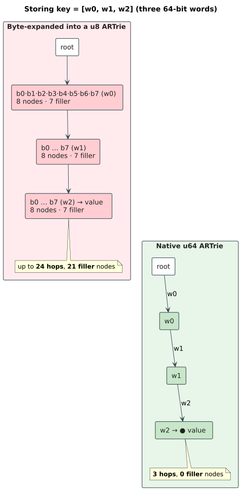
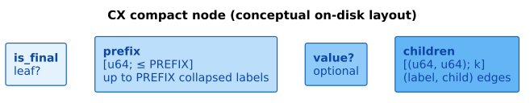

# Native `u64` keys and the CX compact snapshot

**Navigation**: [↑ Dictionary layer](README.md) · [Crate README → persistent ARTrie](../../README.md#persistent-artrie--lock-free--durable) · [Order-A writes →](../../README.md#durable-writes-the-order-a-protocol) · [Persistence architecture →](../persistence/README.md)

> **Scope.** This document describes the **native `u64` sequence/time-series
> profile** of the persistent ARTrie — `PersistentARTrieU64` and its two
> ready-made aliases `PersistentARTrieU64Compact` (the default) and
> `PersistentARTrieU64Prefix3Compat` — and the **CX compact snapshot format**
> through which it checkpoints. It explains *why* native 64-bit edge labels beat
> byte-expanding the key, *what* the `U64Key<PREFIX>` encoding is, and *how* the
> two profiles (prefix-4 disk-compact vs. prefix-3 compatibility) differ. The
> general persistent-ARTrie machinery (lock-free overlay, WAL, Order-A writes,
> recovery) is shared with the byte/char families and documented under
> [`../persistence/`](../persistence/README.md); this page is the
> `u64`-specific layer.

---

## 1. Purpose — sequence and time-series keys, kept whole

The byte (`PersistentARTrie`) and Unicode (`…Char`) ARTries key on **text**: a
term is a sequence of `u8` or `char` units. But many durable indexes are keyed on
sequences whose natural unit is a **64-bit word**, not a character:

- **Token sequences** — n-grams of vocabulary ids, instruction streams, opcode
  traces, event-type sequences.
- **Time series** — quantized samples, where each `f64` reading is mapped to its
  bit pattern (`f64::to_bits`) and the series becomes a `&[u64]` key.
- **Composite keys** — any tuple of 64-bit fields (timestamps, hashes, ids)
  concatenated into one sequence.

`PersistentARTrieU64` is the durable Adaptive Radix Trie for exactly these: a
crash-safe, lock-free, write-ahead-logged $`\text{\&[u64]} \to V`$ map where **one trie edge
carries one whole `u64`**.

---

## 2. Intuition — why native `u64` labels beat byte expansion

You *could* store a `u64` sequence in a byte ARTrie by serializing each word into
8 bytes. That "byte-expansion" is tempting but quietly expensive, and the native
profile exists to avoid it.

Consider a key of `n` sixty-four-bit words.

| Aspect | Byte-expanded into a `u8` ARTrie | Native `u64` ARTrie |
|--------|----------------------------------|---------------------|
| **Edges traversed per lookup** | up to $`8 \cdot n`$ (one per byte) | `n` (one per word) |
| **Interior nodes on the spine** | up to $`8 \cdot n`$ node hops | `n` node hops |
| **Label comparison** | byte-at-a-time descent | one 64-bit equality test per hop |
| **Fan-out alphabet** | 256 (byte values) | the set of distinct next-words |
| **Wasted structure** | 7 "filler" nodes per word for non-branching bytes | none — words are atomic |

Byte expansion turns every key into an $`8\times`$-longer path and forces the trie to
spend interior nodes resolving *within* a word that never actually branches there.
Native `u64` labels keep each transition **atomic**: the descent length is the
number of *words*, the per-hop test is a single machine-word compare, and the
adaptive node only grows when there is genuine **word-level** branching. This is
the same reasoning the Adaptive Radix Tree paper
([Leis et al. 2013](https://doi.org/10.1109/ICDE.2013.6544812)) gives for using
native-width labels and SIMD/indexed lookup once fan-out outgrows inline storage —
here applied at 64-bit granularity.



---

## 3. The `U64Key<PREFIX>` encoding

The `u64` variant is one instantiation of the crate's generic key-encoding seam.
The `KeyEncoding` trait (`src/persistent_artrie/core/key_encoding.rs`) lets the
shared overlay node, adaptive edge store, dictionary-node handles, and the CX
checkpoint serializer all be generic over the **unit width** of a variant. Three
marker types implement it:

| Marker | `Unit` | Used by |
|--------|--------|---------|
| `ByteKey` | `u8` | `PersistentARTrie` (text bytes) |
| `CharKey` | `u32` (`char`) | `PersistentARTrieChar` (Unicode) |
| `U64Key<const PREFIX = 4>` | `u64` | `PersistentARTrieU64` (native sequences) |

`U64Key` carries a **const generic `PREFIX`** — the *CX path-compression prefix
budget* (see §4). The same overlay-node shape is reused for all three unit widths;
only the unit type and a handful of associated constants differ. The native `u64`
keys therefore inherit the *entire* lock-free overlay + Order-A durability stack
for free, while keeping their native 64-bit labels.

```text
type U64Node<V, const PREFIX: usize> = OverlayNode<U64Key<PREFIX>, V>;

pub struct PersistentARTrieU64<V = (), S = MmapDiskManager, const PREFIX: usize = 4> {
    root: AtomicNodePtr<U64Key<PREFIX>, V>,   // lock-free overlay root (CAS-published)
    term_count: AtomicUsize,
    committed_watermark: CommittedWatermark,  // Order-A durable frontier
    commit_seq: AtomicU64,                     // CommitRank generation counter
    checkpoint_lock: Arc<Mutex<()>>,           // serializes checkpoints, not reads
    /* … wal_writer, path, … */
}
```

Each interior transition stores its child as a `(u64, u64)` pair — `(label,
child)` — i.e. **one native `u64` edge per transition**, exactly as the intuition
in §2 requires.

---

## 4. The CX compact snapshot — checkpointing through a compressor

A **checkpoint** folds the live overlay into a dense on-disk image so that reopen
is $`O(\text{image}) + O(\text{WAL tail})`$ rather than $`O(\text{history})`$. For the `u64` variant that
image is the **CX compact snapshot** (magic `AR64CX01`, `SNAPSHOT_VERSION = 1`):

- It is a **dense, path-compressed** serialization. Long non-branching runs of
  `u64` labels are collapsed into a single node carrying a **prefix** of up to
  `PREFIX` words, instead of one node per word. The `PREFIX` budget is the maximum
  number of `u64` labels a compressed node may absorb before a new node is forced.
- It is keyed by the **committed watermark** so the image is a coherent,
  fully-durable cut of the trie.
- It is **intentionally not** the old native `bincode` snapshot/WAL format. The
  CX compact format replaced it; the historical bincode controls live **only in
  git history** and are not a supported on-disk format. (Hence
  `PersistentARTrieU64Compact::open` reads CX images, not bincode.)
- A disk child pointer carries a 22-bit record offset. Therefore a version-1
  image admits at most $`2^{22}`$ records, with indices from $`0`$ through
  $`2^{22}-1`$. The writer validates the index before appending a record, and
  the reader applies the identical cardinality bound; release builds never rely
  on a `debug_assert` before pointer encoding.



The `PREFIX` budget is the *only* knob that distinguishes the two shipped
profiles. The systems-level description of the `u64` on-disk image — the `AR64CX01`
snapshot, the `b"AR64"` file magic, and how the CX format sits beside the byte/char
formats and the two block backends — is in
[`../persistence/storage-backends.md#u64-profile-formats`](../persistence/storage-backends.md#u64-profile-formats).

### 4.1 The two profiles

| Alias | `PREFIX` | Role |
|-------|----------|------|
| **`PersistentARTrieU64Compact`** | `4` (`U64_CX_PREFIX_COMPACT`) | **Default.** One `u64` edge per transition; the wider prefix budget was measured to **reduce checkpoint bytes** while preserving lookup performance. Use this for new indexes. |
| **`PersistentARTrieU64Prefix3Compat`** | `3` (`U64_CX_PREFIX_COMPAT`) | **Compatibility / baseline.** Opens or benchmarks **prefix-3 CX images** explicitly, and serves as the baseline the prefix-4 budget is compared against. |

Both are thin type aliases over the same `PersistentARTrieU64<V, S, PREFIX>`
generic; they differ *only* in the const `PREFIX`. A wider budget (4) packs more
labels per compressed node, shrinking the image; the prefix-3 alias exists so that
images written under the older budget remain openable and so benchmarks can hold
the budget fixed when comparing.

> **Profile = on-disk compatibility.** Because `PREFIX` shapes how many labels a
> CX node absorbs, a CX image is read back with the alias whose budget it was
> written with. Choose `…Compact` (prefix-4) for everything new; reach for
> `…Prefix3Compat` only to open legacy prefix-3 images or to reproduce prefix-3
> benchmark baselines.

---

## 5. Durable writes — the same Order-A protocol, native labels

The `u64` profile follows the crate-wide **Order-A "log before publish"** rule
([crate README](../../README.md#durable-writes-the-order-a-protocol)), with shared
WAL records and lock-free root publication:

```text
insert_sequence_with_value(seq, value):
    data_lsn := WAL.append_and_sync(upsert(seq, value))  # log before publish
    loop:
        generation := commit_seq.fetch_add(1) + 1    # claim once per CAS attempt
        root      := self.root.load()                # snapshot the overlay
        new_root  := build_insert_path(root, seq, value)   # copy-on-write spine
        if self.root.compare_exchange(root, new_root).is_ok():   # CAS publish (linearize)
            term_count.fetch_add(1) on first insert
            break
    WAL.append_and_sync(CommitRank { data_lsn, generation }) # durable rank
    committed_watermark.mark_committed(data_lsn …)           # durable frontier
```

- **Copy-on-write spine + CAS publish.** `build_insert_path` clones only the nodes
  along the affected spine and the root is swapped with `compare_exchange`; losers
  retry on the newer root. Reads traverse the immutable overlay with no lock.
- **CommitRank generations.** A durable global `commit_seq` stamps each write with
  a generation; on recovery `reconcile_lww` replays survivors in
  `(generation, lsn)` order so concurrent out-of-order commits resolve to the
  last-writer-wins result. This is the identical machinery the byte/char families
  use — the `u64` variant simply rides on it.
- **`checkpoint_lock`.** Held only to serialize *checkpoints* against each other;
  it does **not** gate reads, which stay lock-free against the overlay.

Recovery, then, is the standard redo-only path: load the CX image at the committed
watermark, replay the durable WAL tail past it in `(generation, lsn)` order, drop
un-acknowledged/orphan records, rebuild the overlay, resume. See
[`../persistence/README.md`](../persistence/README.md) and
the recovery flow under [`../persistence/wal-format.md`](../persistence/wal-format.md).

### 5.1 Stack-safe mutation and reopen machines

A sequence may be much deeper than a native thread stack. Consequently, key
depth and checkpoint-graph depth are represented by explicit, bounded-inline
machines that spill to heap storage; neither is represented by recursive Rust
call frames. The fixed inline capacity affects only a constant native-stack
term and is subject to the performance experiment described below.

Mutation is a three-phase pushdown machine:

```text
DESCEND(root, key):
    current := root
    frames  := []
    for unit in key:
        if current has no child at unit:
            child := create_spine(remaining_suffix, requested_leaf)
            return UNWIND(frames, current.with_child(unit, child))
        frames.push(current)              # unit remains in key[matched_prefix]
        current := current.child(unit)
    terminal := transform_finality_and_value(current)
    return UNWIND(frames, terminal)

UNWIND(frames, matched_prefix, child):
    while (parent, unit) := zip_reverse(frames, matched_prefix):
        child := parent.with_child(unit, child)
    return child
```

`create_spine` folds the missing suffix in reverse, while `UNWIND` folds the
matched prefix in reverse. Let $`k`$ be key length, $`m`$ matched-prefix length,
and $`d(v)`$ the fanout of copied ancestor $`v`$. Immutable adaptive child stores
make the exact mutation bound
$`O\!\left(k + \sum_{v \in \text{copied path}} d(v)\right)`$, not merely $`O(k)`$:
each copied ancestor rebuilds its own child-store representation. The machine
creates $`O(k)`$ path-copy nodes in the worst case, stores $`O(m)`$ borrowed
parent references, and uses $`O(1)`$ native call-stack space. Labels are recovered
from the input sequence rather than duplicated in frames. A root miss leaves the
frame vector unallocated and builds the suffix directly. The candidate remains
unreachable until the root compare-and-swap succeeds; a losing candidate is
dismantled by the overlay node's iterative `Drop` worklist.

Checkpoint writing already uses the shared iterative CX post-order serializer.
Reopen uses a separate explicit depth-first-search machine over disk-node indices:

```text
PARSE:
    validate declared extents before every fallible reservation
    decode each pointer once into a canonical 22-bit node index
    prove each child-label vector strictly ascending and unique

VALIDATE:
    color[node] := UNSEEN | VISITING | DONE
    push(root)
    while frames is not empty:
        frame := frames.top()
        if frame has an unprocessed child:
            child := frame.next_child_index()
            if color[child] == UNSEEN:   color[child] := VISITING; push(child)
            if color[child] == VISITING: return Corrupted(Cycle)
        else:
            postorder.push(frame.node)
            color[frame.node] := DONE
            pop(frame)
    compute checked path-sensitive final count and compare with the header

CONSTRUCT:
    deserialize reachable values in the historical parent-before-child order
    for node in postorder:
        children := map validated indices through memo
        completed := bulk_build_sorted_node(children)  # O(fanout), once
        memo[node] := wrap_prefix_in_reverse(completed)
```

Every input-sized decoded vector and sparse child index uses a fallible reservation. Resource
failure returns the transient `PersistentARTrieError::AllocationFailed` variant; it is not reported
as checkpoint corruption. Poisoned checkpoint locks and violated publication preconditions likewise
return typed errors instead of unwinding through the library boundary.

For $`n`$ reachable disk nodes, $`e`$ child edges, and $`p`$ total prefix units,
reopen takes $`O(n + e + p)`$ time, uses $`O(n)`$ memo/color storage and
$`O(\text{graph depth})`$ explicit frames, and consumes $`O(1)`$ native call-stack
space. A pointer to a `VISITING` node is rejected before an `Arc` edge is created,
so a malformed snapshot cannot create an in-memory reference cycle. As in the
version-1 reader before this machine was introduced, only records reachable from
the declared root are materialized. Every record's encoded extent, pointer
canonicality/range, and local child order are checked during parsing; unreachable
records do not participate in reachability, cycle, value, or term-count semantics.

The structural stack-safety guarantee covers trie-owned traversal, candidate
cleanup, checkpointing, reconstruction, and destruction. A generic value type
`V` still controls its own `Clone`, serialization, deserialization, and `Drop`;
the trie cannot make an arbitrary third-party value implementation stack-safe.
Theorygraph's native sequence indexes use scalar values and therefore remain
inside the proven structural boundary.

Enumeration is a fourth explicit, lazy machine. It retains one `(node,
next-child, path-length, emitted)` frame per active ancestor and one mutable path
buffer. A path is cloned only when a final node is yielded; partial paths are
never cloned merely to descend, and the complete result set is never retained by
the iterator. Sixteen frames are stored inline and arbitrary additional depth
spills to heap storage; this is a bounded native-stack constant, not one call
frame per input unit. Because every adaptive child tier exposes its canonical
ascending edge sequence, depth-first traversal emits prefix terms before
extensions and lower labels before higher labels. The stream is already
lexicographic and requires no terminal sort.

The inline capacity is measured rather than arbitrary. On the seeded 12-unit
workload, compile-time capacities 0, 4, 8, and 16 produced iterator object sizes
of 48, 168, 296, and 552 bytes. Relative to 16, capacity 0 regressed construction
by about 94% and first-yield/drop by 41%; capacity 4 regressed first-yield/drop by
22% and prefix-hit traversal by 21%; capacity 8 narrowed those regressions to
about 1.2% and 4.4%. Complete/deep traversal results were mixed or effectively
unchanged, but the common lazy and prefix paths favor avoiding the first spill,
so 16 remains the production capacity. These Criterion comparisons select a
compile-time constant; they are not treated as independent base-versus-treatment
campaign samples.

A literal `Vec<U64SequenceFrame<...>>` control was also compiled and measured;
the capacity-zero `SmallVec` result is not used as a substitute for that control.
An S--V--V--S process order (selected `SmallVec<16>`, `Vec`, `Vec`, restored
`SmallVec<16>`) produced the following point-estimate ranges:

| Operation | `SmallVec<16>` | `Vec` | Interpretation |
|---|---:|---:|---|
| construct, then drop | 11.33--11.36 ns | 27.10--29.16 ns | Inline frames avoid the first allocation. |
| first item, then drop | 245.15--283.04 ns | 341.67--365.87 ns | Inline frames reduce first-result latency. |
| matching prefix | 262.53--285.17 ns | 332.46--364.12 ns | A 12-unit prefix stays entirely inline. |
| take 16, then drop | 3.74--3.95 us | 3.73--4.13 us | Mixed within run-to-run drift; no `Vec` advantage. |
| complete 8,192-term traversal | 11.06--14.12 ms | 12.81--15.49 ms | Drift-sensitive, but no repeatable `Vec` advantage. |

The `Vec` object occupies 48 bytes and the selected inline object 552 bytes. That
object-size cost is bounded and independent of input depth. It buys the
allocation-free constructor and common depth-12 traversal while arbitrary depth
still spills to heap storage, so it does not reintroduce a native-stack slope.

### 5.2 Base-to-treatment performance correspondence

The regression control is detached commit
`6a1b267a60fe9c445a0c8c7c8136e6dd40aedbf5`. Both worktrees compiled benchmark
source SHA-256
`99eda96bae7984bec030be3868cd9e1d4f61546b5bcafee588ee065734a96ba6`
with the locked Criterion 0.8.2 dependency. Pair A ran base then treatment; pair
B reversed the process order. The iterator groups used 30 samples, insertion 51,
update/removal 20, and checkpoint/reopen 10. Update, removal, and checkpoint
population ran in `iter_batched` setup and was therefore excluded from the timed
region. All values below are Criterion point estimates and lower is better.

| Operation | Base A | Treatment A | Base B | Treatment B | Result |
|---|---:|---:|---:|---:|---|
| complete 8,192-term traversal | 14.868 ms | 11.795 ms | 17.277 ms | 11.057 ms | Faster in both orders. |
| iterator construct/drop | 16.132 ms | 11.566 ns | 16.159 ms | 11.356 ns | Eager full collection removed. |
| first item/drop | 15.781 ms | 241.21 ns | 14.580 ms | 245.15 ns | First-result work is proportional to the traversed prefix. |
| take 16/drop | 15.086 ms | 3.844 us | 15.510 ms | 3.736 us | Early cancellation no longer builds all results. |
| matching prefix | 14.819 ms | 271.78 ns | 13.781 ms | 285.17 ns | Prefix-local traversal replaces full scan/filter. |
| missing prefix | 14.607 ms | 18.883 ns | 15.512 ms | 19.638 ns | Missing prefixes terminate during lookup. |
| 16,384 point lookups | 5.407 ms | 4.951 ms | 5.895 ms | 5.819 ms | No material regression; intervals overlap in pair B. |
| insert 8,192 terms | 444.80 ms | 245.38 ms | 456.97 ms | 253.24 ms | Borrowed zipper is faster in both orders. |
| update 2,048 existing terms | 92.305 ms | 48.043 ms | 89.331 ms | 48.309 ms | Borrowed zipper is faster in both orders. |
| remove 2,048 existing terms | 93.821 ms | 47.659 ms | 88.807 ms | 48.280 ms | Borrowed zipper is faster in both orders. |
| checkpoint and reopen 2,048 terms | 35.700 ms | 19.625 ms | 36.521 ms | 20.138 ms | Linear reconstruction is faster in both orders. |

Both arms emitted exactly 929,277 bytes for the prefix-4 fixture. More strongly,
the pinned prefix-4 and prefix-3 hashes, respectively
`b7adf877da1a6bc1` and `4155bf8b54f62a3a`, were independently reproduced by the
detached base implementation and by the treatment correspondence test. Thus the
performance gains do not trade away version-1 checkpoint compatibility.

For $`n_u`$ unfolded node occurrences, $`e_u`$ unfolded edge occurrences, and
emitted sequence lengths $`\ell_1,\ldots,\ell_t`$, complete enumeration takes
$`O(n_u + e_u + \sum_{i=1}^{t}\ell_i)`$ time and $`O(\text{depth})`$ auxiliary
storage beyond sequences retained by the caller. “Unfolded” is important: a
checkpoint may share a suffix as a DAG, but each differently labeled incoming
path remains a distinct dictionary term, so the logical output can be
exponentially larger than the number of unique materialized nodes. Prefix
enumeration first resolves the prefix node and runs the same machine only over
that subtree; it does not scan and filter the complete dictionary.

Native-u64 roots are resident by construction: reopen validates the reachable
image and materializes every child before publication. The `try_iter_*` methods
make this boundary executable and return `PersistentARTrieError::Corrupted` if an
internal unresolved `OnDisk` edge is ever observed; no branch is silently
omitted. Existing infallible `iter_*` methods are compatibility adapters over
that invariant. Iterator creation captures the root but clones no values. A
value clone and output-path allocation occur only when `next()` yields that term,
so allocation or user-defined `V::clone` failure timing is lazy rather than
constructor-time.

---

## 6. Usage

The durable native-`u64` quick start (mirrors the crate README, compile-checked
there as `rust,no_run`): create a prefix-4 CX file, insert a 3-word series keyed by
the `f64` bit patterns of a time-series sample, checkpoint, reopen.

```rust,no_run
use libdictenstein::persistent_artrie::PersistentARTrieU64Compact;

// Prefix-4 CX profile: the default compact native-u64 representation.
let series = PersistentARTrieU64Compact::<u64>::create("series.ar64")?;
series.insert_sequence_with_value(
    &[0x1000_0000_0000_002a, 0x3000_0000_0000_0100, f64::to_bits(42.5)],
    f64::to_bits(42.5),
);
series.checkpoint()?;   // fold the overlay into a dense CX image

let reopened = PersistentARTrieU64Compact::<u64>::open("series.ar64")?;
assert!(reopened.contains_sequence(
    &[0x1000_0000_0000_002a, 0x3000_0000_0000_0100, f64::to_bits(42.5)]
));
# Ok::<(), Box<dyn std::error::Error>>(())
```

Membership without values uses `insert_sequence` / `contains_sequence`:

```rust,no_run
use libdictenstein::persistent_artrie::PersistentARTrieU64Compact;

let ngrams = PersistentARTrieU64Compact::<()>::create("ngrams.ar64")?;
ngrams.insert_sequence(&[10, 42, 7]);    // a token-id 3-gram
ngrams.checkpoint()?;
assert!(ngrams.contains_sequence(&[10, 42, 7]));
assert!(!ngrams.contains_sequence(&[10, 42, 8]));
# Ok::<(), Box<dyn std::error::Error>>(())
```

Opening a **legacy prefix-3** CX image uses the compatibility alias so the budget
matches what the file was written with:

```text
use libdictenstein::persistent_artrie::PersistentARTrieU64Prefix3Compat;

// Only for prefix-3 images / prefix-3 benchmark baselines.
let legacy = PersistentARTrieU64Prefix3Compat::<u64>::open("legacy_p3.ar64")?;
```

---

## 7. Properties at a glance

| Property | Native `u64` profile | Mechanism |
|----------|----------------------|-----------|
| **Lookup hops** | $`O(\text{words})`$, not $`O(\text{bytes})`$ | one native `u64` edge per transition |
| **Per-hop test** | single 64-bit compare | atomic word labels, no byte descent |
| **Reads lock-free** | wait-free per traversal | immutable overlay, CAS-published root |
| **Writes durable & linearizable** | Order-A log-before-publish | copy-on-write spine + `compare_exchange` + WAL `CommitRank` |
| **Bounded reopen** | $`O(\text{CX image}) + O(\text{WAL tail})`$ | CX compact checkpoint at the committed watermark |
| **Input-independent native stack** | $`O(1)`$ call-stack use in trie-owned deep paths | explicit mutation spine, tri-color disk worklist, iterative serializer and destructor |
| **Exact lazy enumeration** | lexicographic, prefix-local, DAG path-sensitive | one mutable path + explicit frames; fallible resident-edge boundary |
| **Compact images** | prefix-budgeted path compression | `U64Key<PREFIX>`; default `PREFIX = 4` |
| **Format discipline** | CX only (not legacy bincode) | `AR64CX01` snapshot; bincode controls live in git history |

---

## 8. Relationship to the rest of the crate

- The **shared** persistent-ARTrie substrate — lock-free overlay, WAL framing,
  Order-A writes, checkpoint/recovery, `mmap`/`io_uring` storage:
  [`../persistence/README.md`](../persistence/README.md) and
  [`../persistence/wal-format.md`](../persistence/wal-format.md).
- The **on-disk** side of this profile — the `u64` CX image format and the
  `BlockStorage` backends it is written through:
  [`../persistence/storage-backends.md#u64-profile-formats`](../persistence/storage-backends.md#u64-profile-formats).
- The byte/char ARTrie family this generalizes (same overlay, `ByteKey`/`CharKey`
  instead of `U64Key`): [crate README → persistent variants](../../README.md#persistent-artrie--lock-free--durable).
- The sibling durable substring and vocabulary backends:
  [`persistent-suffix-graphs.md`](persistent-suffix-graphs.md) and
  [`vocab-trie.md`](vocab-trie.md).

---

## References

1. Leis, V., Kemper, A., & Neumann, T. (2013). *The Adaptive Radix Tree: ARTful
   Indexing for Main-Memory Databases.* IEEE ICDE.
   [10.1109/ICDE.2013.6544812](https://doi.org/10.1109/ICDE.2013.6544812) — the
   case for native-width labels and adaptive nodes that the `u64` profile applies
   at 64-bit granularity.
2. Driscoll, J. R., Sarnak, N., Sleator, D. D., & Tarjan, R. E. (1989). *Making
   Data Structures Persistent.* Journal of Computer and System Sciences 38(1).
   [10.1016/0022-0000(89)90034-2](https://doi.org/10.1016/0022-0000(89)90034-2) —
   the immutable-versioned overlay the CAS publish builds on.
3. Mohan, C., Haderle, D., Lindsay, B., Pirahesh, H., & Schwarz, P. (1992). *ARIES:
   A Transaction Recovery Method …Using Write-Ahead Logging.* ACM TODS 17(1).
   [10.1145/128765.128770](https://doi.org/10.1145/128765.128770) — the
   log-before-publish / redo-on-recovery foundation of the Order-A protocol.

---

**Navigation**: [↑ Dictionary layer](README.md) · [Crate README → persistent ARTrie](../../README.md#persistent-artrie--lock-free--durable) · [Order-A writes →](../../README.md#durable-writes-the-order-a-protocol) · [Persistence architecture →](../persistence/README.md)
