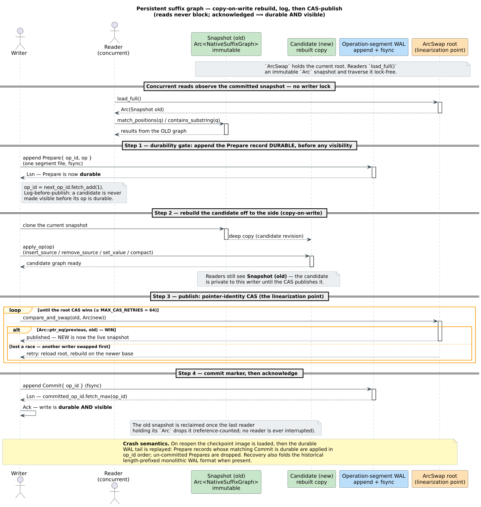

# Persistent Suffix Graphs — durable substring indexes

**Navigation**: [↑ Dictionary layer](README.md) · [Crate README → persistent ARTrie](../../README.md#persistent-artrie--lock-free--durable) · [SCDAWG theory →](../theory/scdawg/) · [Persistence architecture →](../persistence/README.md)

> **Scope.** This document explains the three **persistent substring-index**
> backends in `libdictenstein`: `PersistentSuffixAutomaton`,
> `PersistentSuffixTree`, and `PersistentScdawg`, each with a byte (`u8`) and a
> Unicode (`…Char`, `char`/`u32`) variant. It covers *what* they index, the
> *snapshot + operation-segment-WAL* durability model, *how* a write rebuilds a
> candidate graph and publishes it by pointer-identity CAS, and *why* this design
> gives lock-free reads with crash-durable writes. The *in-memory* substring
> structures these mirror — the suffix automaton, CDAWG, and SCDAWG themselves —
> are developed from first principles in [`../theory/scdawg/`](../theory/scdawg/);
> this page is the *persistence* layer over them.

---

## 1. Purpose — what these backends are for

A **prefix** dictionary (a trie / ARTrie / DAWG) answers *"is this term — or a
term within edit distance `k` of it — present?"* by walking from the root. It can
only match from the **start** of a key. A **substring index** answers the
strictly harder question *"does this pattern occur* **anywhere** *inside any
indexed text, and where?"*. The classic structures for that are:

| Structure | What it indexes | Navigation | In-memory backend |
|-----------|-----------------|------------|-------------------|
| **Suffix automaton** (DAWG of all suffixes) | every substring of a text | right-extension | [`SuffixAutomaton`](README.md#5-suffixautomaton) |
| **Suffix tree** (compacted trie of suffixes) | every substring + leaf positions | root-to-leaf | suffix-tree-compatible API |
| **SCDAWG** (symmetric compact DAWG) | every substring, both directions | right *and* left extension | [`Scdawg`](../theory/scdawg/04-scdawg.md) |

The three **persistent** variants give each of these a **durable, crash-safe,
concurrently-readable** home on disk, under the `persistent-artrie` feature. They
are the substring counterpart to the persistent ARTrie key→value family: where
`PersistentARTrie` durably stores $`\text{term} \to \text{value}`$, these durably store *a text and
an index over all of its substrings*.

Typical uses: full-text search over a corpus that must survive process restarts;
incremental document indexing where new documents are added online and the index
must never be lost; fuzzy substring matching (a Levenshtein automaton from the
companion [`liblevenshtein`](https://github.com/vinary-tree/liblevenshtein-rust)
crate walks the persistent graph exactly as it would an in-memory one).

---

## 2. Intuition — a snapshot you read, a candidate you publish

The whole design rests on one idea: **separate the thing readers traverse from
the thing a writer is building.**

- The **live graph** is an *immutable* value held behind an atomic pointer (an
  `arc_swap::ArcSwap` over the family's native graph). A reader takes a reference-counted
  **snapshot** (`load_full()`) and traverses it with **no lock** — the snapshot
  it holds can never change underneath it.
- A **writer** never mutates the live graph in place. It clones the current
  snapshot into a private **candidate**, applies its operation to the candidate,
  and then atomically swaps the root pointer from the old snapshot to the
  candidate. Because the swap is a single pointer store guarded by a
  compare-and-swap (CAS), it is **atomic and linearizable**: every reader sees
  *either* the whole old graph *or* the whole new graph, never a half-built one.

This is the
[**persistent data structure**](https://doi.org/10.1016/0022-0000(89)90034-2)
discipline (Driscoll et al. 1989) — "persistent" in the *immutable-versioned*
sense — applied at the granularity of the **entire graph**. Copying the whole
graph per write is deliberately simple: substring graphs are rebuilt from
operation logs anyway, the copy is $`O(\text{graph size})`$ but happens off the read path,
and it buys a read path that is completely lock-free.

Durability is layered on top with a **write-ahead log of operations** (not of
bytes): before a candidate is published, the *operation that produced it* is
appended to the WAL and `fsync`'d. "Log before publish" — an acknowledged write
is always recoverable.

---

## 3. The durable representation — graph snapshot + operation-segment WAL

Each persistent suffix graph on disk is **two artifacts**:

```
<path>              ← the snapshot image: a serialized native suffix graph. Each
                      family stamps its own 8-byte magic (byte / char): "PSUFU8N1" /
                      "PSUFCHR1" (suffix automaton), "PSTREEB1" / "PSTREEC1" (suffix
                      tree), "PSCDAWG8" / "PSCDAWGC" (SCDAWG) — each with its own
                      SNAPSHOT_VERSION (3 for the automaton, 2 for the tree and the
                      SCDAWG), with older versions accepted.
<path>.<fam>wal.d/  ← the operation-segment WAL directory (its extension is derived
                      from the image path — suffixwal.d / streewal.d / scdawgwal.d):
                      one durably-appended segment file per Prepare / Commit record
                      since the last checkpoint
```

### 3.1 The operation WAL — Prepare / Commit, by `op_id`

Writes are logged as **operations**, not as page diffs. The record alphabet
(`NativeSuffixWalOp`) is:

| Operation | Meaning |
|-----------|---------|
| `Insert { text, value }` | add a source text (and optional value) to the index |
| `Remove { text }` | mark a source text inactive |
| `SetValue { text, value }` | update the value associated with a text |
| `Clear` | empty the index |
| `Compact` | drop inactive sources, shrinking the graph |

Each mutation is wrapped in a two-phase **`Prepare` → `Commit`** envelope keyed by
a monotonically increasing **`op_id`**:

- `Prepare { op_id, op }` is appended **and `fsync`'d before the candidate is
  published** — this is the durability point.
- `Commit { op_id }` is appended **after** the pointer-identity CAS wins — this is
  the *acknowledgement* point. The in-memory `committed_op_id` advances by
  `fetch_max(op_id)`.

On recovery, an operation is replayed **iff** its `Commit` is durable; a `Prepare`
with no durable `Commit` is dropped. This is why a torn or un-`fsync`'d tail can
never resurrect a write no caller ever saw succeed.

> **Why one segment file per record?** Appending each Prepare/Commit as its own
> small file in the WAL segment directory (`…wal.d/`) makes a write **atomic at the
> filesystem level** (the file either exists in full or not at all) and lets a
> checkpoint prune the entire directory in one sweep once those ops are folded into
> the image. This is the *segment* WAL. For backward compatibility, recovery
> **also** reads a historical **length-prefixed monolithic WAL** format (a single
> `…wal` file of length-framed records) — older files still open.

### 3.2 The snapshot image — the folded base

A **checkpoint** writes the current committed graph to `<path>` as a dense
serialized image and prunes every WAL segment whose `op_id` is now folded in. The
image is the **base**; the WAL tail past it is the **delta**. Reopening loads the
image, then replays only the durable committed tail — $`O(\text{image}) + O(\text{tail})`$, not
$`O(\text{history})`$.

---

## 4. How a write works — rebuild, log, CAS-publish

The published mechanism (`mutate_retryable` — one implementation per family, on
`NativeSuffixIndex` / `NativeSuffixTreeIndex` / `NativeScdawgIndex`, all following
the same protocol) is a CAS-retry loop with the WAL append on the *outside* of the
publish:

```text
mutate_retryable(op):
    for attempt in 0 .. MAX_CAS_RETRIES (= 64):
        op_id   := next_op_id.fetch_add(1)          # claim an operation id
        WAL.append(Prepare { op_id, op }); fsync    # ── DURABILITY GATE (log first)
        current := root.load_full()                 # snapshot the live graph
        candidate := (*current).clone()             # copy-on-write off to the side
        result := apply_op(&mut candidate, op)       # mutate the PRIVATE candidate
        previous := root.compare_and_swap(current, Arc::new(candidate))
        if Arc::ptr_eq(previous, current):           # ── LINEARIZATION POINT (we won)
            WAL.append(Commit { op_id }); fsync      # acknowledge durably
            committed_op_id.fetch_max(op_id)
            return result
        # else: another writer published first → retry on the newer base
    error("CAS failed after 64 retries")
```

Two invariants make this correct:

1. **Log before publish (Order-A).** The `Prepare` is durable *before* the CAS can
   make the candidate visible. There is no window in which a reader could observe a
   write that is not yet on disk. (The reverse order — publish then log — is
   rejected for exactly this reason; it is the same Order-A rule the byte/char
   ARTrie family uses, see [the crate README](../../README.md#durable-writes-the-order-a-protocol).)
2. **Pointer-identity CAS is the single linearizer.** `Arc::ptr_eq(previous,
   current)` succeeds for **exactly one** racing writer; the losers observe a
   different `previous` pointer and rebuild on the now-newer snapshot. The winner's
   CAS *is* the moment the write becomes visible — the visibility point and the
   linearization point coincide.

The figure traces one write end-to-end while a concurrent reader keeps traversing
the old snapshot:

<p align="center">
  
</p>

### 4.1 The in-memory (path-less) fast path

When a persistent suffix graph is constructed **without** a file path (e.g.
`PersistentSuffixAutomaton::from_text(...)`), there is no WAL: `mutate_retryable`
degenerates to a pure copy-on-write CAS loop (clone → `apply_op` → `compare_and_swap`
until `Arc::ptr_eq` wins). The reader/writer separation is identical; only the
durability gate is elided. This makes the same type usable as a fast in-RAM index
and as a durable one, switching purely on whether a path was given.

### 4.2 Checkpoints quiesce in-flight publications

`checkpoint()` must serialize a *coherent* committed graph. It spins until
`inflight_publications == 0` and the `committed_op_id` is stable across the clone,
then writes the image for that committed frontier and prunes the WAL segments up to
it. Concurrent readers are never blocked by a checkpoint — they keep loading the
live snapshot.

---

## 5. Crash recovery — image, then committed tail

On `open_with_recovery(path)`:

1. **Load the snapshot image** at `<path>` (a dense native suffix graph) as the
   base. The accepted magic and `SNAPSHOT_VERSION` are the family's own (e.g.
   `PSUFU8N1` / `PSUFCHR1` at version 3 for the suffix automaton; `PSTREEB1` /
   `PSTREEC1` and `PSCDAWG8` / `PSCDAWGC` at version 2 for the tree and the SCDAWG);
   the loader also handles each family's older compact/legacy versions.
2. **Scan the durable WAL tail.** Read the segment directory (`…wal.d/`) segments
   (and, for legacy files, the monolithic `…wal` file), collecting `Prepare` ops
   into a pending map and recording which `op_id`s have a durable `Commit`.
3. **Replay committed ops in `op_id` order.** Only ops whose `op_id` exceeds the
   image's checkpoint and whose `Commit` is durable are applied, sorted by `op_id`
   (= the CAS/commit order). Legacy monolithic records are folded first when the
   file predates segmentation.
4. **Resume serving** the reconstructed graph — its state equals the
   committed-visible index at crash time.

A `RecoveryReport` records how many records were replayed and whether the open was
a clean image load or a WAL rebuild.

---

## 6. The three families — same engine, different graph

All three implement the same snapshot+WAL+CAS engine — one index type per family
(`NativeSuffixIndex` / `NativeSuffixTreeIndex` / `NativeScdawgIndex`); they differ
only in the `apply_op`/traversal semantics of the underlying graph.

| Type (byte / char) | Underlying graph | Headline query API | Returns |
|--------------------|------------------|--------------------|---------|
| `PersistentSuffixAutomaton` / `…Char` | suffix automaton (DAWG of suffixes) | `match_positions(substring)` | `Vec<(usize, usize)>` (source id, end) |
| `PersistentSuffixTree` / `…Char` | compacted suffix tree | `locations(pattern)` | `Vec<(String, usize)>` (text, offset) |
| `PersistentScdawg` / `…Char` | symmetric compact DAWG | `contains_substring`, `locations` | `bool` / `Vec<(String, usize)>` |

The deep theory of each graph — construction, suffix links, minimality, the
$`O(\lvert \text{pattern} \rvert)`$ substring bound, and the symmetric (bidirectional) extension that
makes the SCDAWG special — is in [`../theory/scdawg/`](../theory/scdawg/):
[suffix automaton](../theory/scdawg/02-suffix-automaton.md),
[CDAWG](../theory/scdawg/03-cdawg.md), and [SCDAWG](../theory/scdawg/04-scdawg.md).

### 6.1 Why the persistent SCDAWG is the workhorse

The **SCDAWG** is the most space-efficient of the three ($`\approx`$ 20–30% fewer states than
a plain suffix automaton) and the only one supporting **left** extension as well as
**right**. Its on-line symmetric construction is due to
[Inenaga et al. (2005)](https://doi.org/10.1016/j.dam.2004.04.012), *On-line
Construction of Compact Directed Acyclic Word Graphs* (Discrete Applied Mathematics
146(2)), building on the CDAWG of
[Crochemore & Vérin (1997)](https://doi.org/10.1007/3-540-63220-4_55) and the
symmetric on-line form of
[Inenaga et al. (2001)](https://doi.org/10.1109/SPIRE.2001.989743). Bidirectional
growth is what algorithms like WallBreaker need for dictionary-based fuzzy matching;
making it **durable** lets such an index be built once over a large corpus and
reopened cheaply.

---

## 7. Usage

The in-memory, path-less constructors are guaranteed-correct and need no feature
gating beyond `persistent-artrie`:

```rust
use libdictenstein::persistent_artrie::PersistentSuffixAutomaton;

// Build an in-memory substring index over one text (copy-on-write, lock-free reads).
let index = PersistentSuffixAutomaton::<()>::from_text("the quick brown fox");

// Substring search returns (source-id, end-offset) pairs — "quick" occurs even
// though it is not a prefix of the text.
let hits = index.match_positions("quick");
assert!(!hits.is_empty());
```

Several texts at once:

```rust
use libdictenstein::persistent_artrie::PersistentSuffixAutomaton;

let index = PersistentSuffixAutomaton::<()>::from_texts([
    "the quick brown fox",
    "jumped over the lazy dog",
]);
assert!(!index.match_positions("lazy").is_empty());
```

The **durable** path (mirrors the crate-README quick-start, compile-checked there
as `rust,no_run`): create a file-backed SCDAWG, insert with a value, checkpoint to
fold the WAL into a dense image, then reopen in a later process.

```rust,no_run
use libdictenstein::persistent_artrie::PersistentScdawgChar;

let index = PersistentScdawgChar::<u64>::create("docs.pscdawg")?;
index.insert_with_value("the quick brown fox", 7);  // logged durably, then published
index.checkpoint()?;                                 // fold committed ops into the image

let reopened = PersistentScdawgChar::<u64>::open("docs.pscdawg")?;
assert!(reopened.contains_substring("quick"));
assert_eq!(reopened.locations("brown"), vec![("the quick brown fox".to_string(), 10)]);
# Ok::<(), Box<dyn std::error::Error>>(())
```

Recovery after an unclean shutdown is explicit via `open_with_recovery`, which
returns the reopened index plus a `RecoveryReport`:

```text
let (index, report) = PersistentSuffixTreeChar::<()>::open_with_recovery("docs.pst")?;
// report.records_replayed = number of committed WAL ops folded past the image.
```

---

## 8. Properties at a glance

| Property | Guarantee | Mechanism |
|----------|-----------|-----------|
| **Reads never block writes** | lock-free, wait-free per traversal | immutable `Arc` snapshot via `ArcSwap::load_full` |
| **Writes are atomic & linearizable** | all-or-nothing snapshot swap | pointer-identity CAS (`Arc::ptr_eq`), single winner |
| **Acknowledged $`\implies`$ durable** | survives crash up to last `Commit` | `Prepare` `fsync`'d before publish; replay needs durable `Commit` |
| **Bounded reopen cost** | $`O(\text{image}) + O(\text{committed tail})`$ | checkpoint folds ops into a dense image, prunes segments |
| **Backward-compatible recovery** | old files still open | also replays the historical monolithic WAL format |
| **One native graph, two encodings** | byte (`u8`) and Unicode (`char`) | each family's unit trait (`PersistentSuffixUnit` / `PersistentSuffixTreeUnit` / `PersistentScdawgUnit`) selects suffix splitting + magic |

---

## 9. Relationship to the rest of the crate

- The **in-memory** substring backends and their algorithmic theory:
  [`SuffixAutomaton` / `Scdawg`](README.md#substring--static-compact) and
  [`../theory/scdawg/`](../theory/scdawg/).
- The shared **persistence substrate** (WAL framing, checkpointing, ARIES-style
  redo recovery, `mmap`/`io_uring` block storage) used by the whole
  `persistent-artrie` feature: [`../persistence/README.md`](../persistence/README.md)
  and [`../persistence/wal-format.md`](../persistence/wal-format.md). Note that the
  suffix-graph WAL is an **operation** log (Prepare/Commit by `op_id`) over a
  whole-graph snapshot, distinct from the per-node record WAL of the ARTrie family —
  but both obey the same **log-before-publish** rule.
- The **family split** that this divergence defines — the snapshot-per-write
  suffix-graph family versus the overlay-plus-checkpoint ARTrie family, over one
  shared durability kernel — is catalogued in
  [`../persistence/families.md#suffix-graph-family--native-graph-snapshots`](../persistence/families.md#suffix-graph-family--native-graph-snapshots).
- The sibling durable key→value and vocabulary backends:
  [`native-u64-and-cx.md`](native-u64-and-cx.md) (native `u64` sequence keys) and
  [`vocab-trie.md`](vocab-trie.md) (the term ↔ id bijection).

---

## References

1. Driscoll, J. R., Sarnak, N., Sleator, D. D., & Tarjan, R. E. (1989). *Making
   Data Structures Persistent.* Journal of Computer and System Sciences 38(1).
   [10.1016/0022-0000(89)90034-2](https://doi.org/10.1016/0022-0000(89)90034-2)
   — the immutable-versioning discipline behind the snapshot-per-write model.
2. Crochemore, M., & Vérin, R. (1997). *Direct Construction of Compact Directed
   Acyclic Word Graphs.* CPM, LNCS 1264.
   [10.1007/3-540-63220-4_55](https://doi.org/10.1007/3-540-63220-4_55)
3. Inenaga, S., Hoshino, H., Shinohara, A., Takeda, M., Arikawa, S., Mauri, G., &
   Pavesi, G. (2001). *On-line Construction of Symmetric Compact Directed Acyclic
   Word Graphs.* SPIRE.
   [10.1109/SPIRE.2001.989743](https://doi.org/10.1109/SPIRE.2001.989743)
4. Inenaga, S., Hoshino, H., Shinohara, A., Takeda, M., & Arikawa, S. (2005).
   *On-line Construction of Compact Directed Acyclic Word Graphs.* Discrete Applied
   Mathematics 146(2). [10.1016/j.dam.2004.04.012](https://doi.org/10.1016/j.dam.2004.04.012)
   — the on-line symmetric SCDAWG construction these backends persist.
5. Mohan, C., Haderle, D., Lindsay, B., Pirahesh, H., & Schwarz, P. (1992). *ARIES:
   A Transaction Recovery Method Supporting Fine-Granularity Locking and Partial
   Rollbacks Using Write-Ahead Logging.* ACM TODS 17(1).
   [10.1145/128765.128770](https://doi.org/10.1145/128765.128770) — the
   log-before-publish / redo-on-recovery foundation.

---

**Navigation**: [↑ Dictionary layer](README.md) · [Crate README → persistent ARTrie](../../README.md#persistent-artrie--lock-free--durable) · [SCDAWG theory →](../theory/scdawg/) · [Persistence architecture →](../persistence/README.md)
