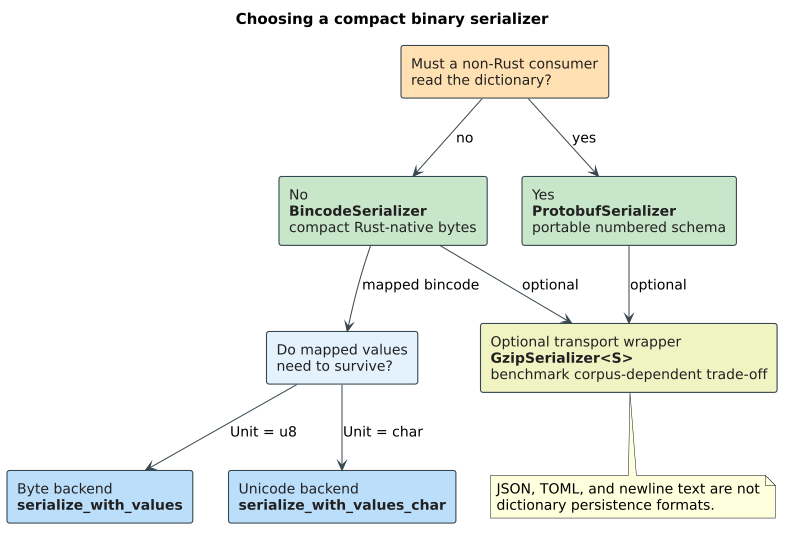

# Serialization & values

**Navigation**: [↑ Dictionary layer](README.md) · [↑ Documentation index](../README.md) · [Abstractions →](../architecture/abstractions.md) · [Persistence →](../persistence/) · [Query half: liblevenshtein →](https://github.com/universal-automata/liblevenshtein-rust)

## Overview

This document describes how **in-memory** `libdictenstein` dictionaries are
*serialized* — converted to a stream of bytes for storage or transport — and
*deserialized* — reconstructed from such a stream. It also covers the
**value-preserving** variants that carry each term's associated value across the
round trip, not just the term itself.

> **Scope.** This is the on-demand serializer for the in-memory backends
> (`DoubleArrayTrie`, `DynamicDawg`, `SuffixAutomaton`, `Scdawg`, `PathMap`, and
> their `Char` / `U64` siblings). It is distinct from the *persistent* ARTrie
> family, which is **continuously** durable on disk via a write-ahead log and
> checkpoint images rather than a one-shot `serialize` call — see
> [the persistence docs](../persistence/) and
> [WAL format](../persistence/wal-format.md). When you call `serialize` here you
> get a single self-contained byte stream you own; when you use a persistent
> backend the durability is managed for you.

### Terms of art (defined before first use)

| Term | Definition |
|------|-----------|
| **serialize / deserialize** | Encode an in-memory value into a byte stream (serialize) and decode a byte stream back into an equivalent in-memory value (deserialize). |
| **round trip** | The composition *deserialize $\circ$ serialize*: serialize a dictionary, then deserialize the bytes. A serializer is *lossless* for a property if the round trip preserves it. |
| **[serde](https://serde.rs/)** | Rust's de-facto serialization *framework*. A type that is `#[derive(Serialize, Deserialize)]` can be encoded by any serde-compatible *format* (bincode, JSON, …). `libdictenstein`'s value types only need to be serde-serializable to survive a value-preserving round trip. |
| **[bincode](https://docs.rs/bincode)** | A compact binary serde *format* (not human-readable). Fast and space-efficient; the recommended production format here. |
| **wire format** | The exact byte layout a serializer emits. Two serializers with different wire formats are mutually unreadable even if they carry the same logical data. |
| **term** | A key string stored in the dictionary (e.g. `"apple"`). |
| **value** | The datum a [`MappedDictionary`](README.md#3-mappeddictionary-trait) associates with a term (the `V` in `DoubleArrayTrie<V>`). For a pure *set* dictionary the value type is `()` (the unit type) and there is nothing to preserve beyond membership. |

## The two serialization contracts

`libdictenstein` exposes **two** parallel serialization paths. Choosing the right
one is the single most important decision in this subsystem, because the two
paths emit **incompatible wire formats** — a file written by one cannot be read
by the other.

| Path | Trait / entry point | Wire payload | Preserves values? | Use when |
|------|--------------------|--------------|-------------------|----------|
| **Terms-only** | `DictionarySerializer::serialize` / `deserialize` | a list of terms (`Vec<String>`) | ❌ no — values are dropped | the dictionary is a *set* (`V = ()`), or you only need the keys back |
| **Value-preserving** | the `*_with_values` methods | a list of `(term, value)` pairs (`Vec<(String, V)>`) | ✅ yes | the dictionary is a *map* ($V \ne ()$) and the values must survive |

The terms-only path is governed by the `DictionarySerializer` trait:

```rust
pub trait DictionarySerializer {
    fn serialize<D, W>(dict: &D, writer: W) -> Result<(), SerializationError>
    where
        D: Dictionary,
        D::Node: DictionaryNode<Unit = u8>,
        W: Write;

    fn deserialize<D, R>(reader: R) -> Result<D, SerializationError>
    where
        D: DictionaryFromTerms,
        R: Read;
}
```

Reconstruction on deserialize is delegated to one of two construction traits the
backend implements:

- `DictionaryFromTerms` — `from_terms(terms)`; used by the terms-only path.
- `DictionaryFromTermsWithValues` — `from_terms_with_values(entries)`, with an
  associated `type Value`; used by the value-preserving path. Backends that
  implement [`MappedDictionary`](README.md#3-mappeddictionary-trait) implement
  this so values survive the round trip.

> **Why two construction traits?** The terms-only wire format (`Vec<String>`)
> has *no slot* for a value, so the older `extract_terms` + `from_terms` path
> silently dropped values for `MappedDictionary` backends. The
> `*_with_values` path was added precisely to close that data-loss gap; it
> serializes `Vec<(String, V)>` and reconstructs via `from_terms_with_values`.

## Formats

The serializer is parameterized by *format*. Each format is a zero-sized type
implementing `DictionarySerializer` (and, where applicable, the `*_with_values`
inherent methods). All formats are feature-gated under the `serialization`
feature except where noted.

| Format | Type | Feature | Human-readable? | Compactness | When to use |
|--------|------|---------|-----------------|-------------|-------------|
| **Bincode** | `BincodeSerializer` | `serialization` | ❌ binary | ⭐⭐⭐⭐⭐ smallest | **Default for production** — fastest load, smallest files. |
| **JSON** | `JsonSerializer` | `serialization` | ✅ text | ⭐⭐ | Debugging, manual inspection, interop with non-Rust tools. Pretty-printed. |
| **Plain text** | `PlainTextSerializer` | `serialization` | ✅ text | ⭐⭐⭐ | One term per line; ideal for version control, manual editing, `grep`. |
| **Protobuf** | `ProtobufSerializer`, `OptimizedProtobufSerializer`, `DatProtobufSerializer`, `SuffixAutomatonProtobufSerializer` | `protobuf` | ❌ binary | ⭐⭐⭐⭐ | Cross-language interchange via a stable `.proto` schema. |
| **Gzip wrapper** | `GzipSerializer<S>` | `compression` | ❌ binary | ⭐⭐⭐⭐⭐⭐ | Wraps *any* `DictionarySerializer` `S` and gzip-compresses its output ($\approx$40–60% smaller). |

### Bincode — the production default

`BincodeSerializer` uses the [bincode](https://docs.rs/bincode) binary format
for fast, space-efficient output. It is the recommended choice when storage and
load time matter.

```rust,no_run
use libdictenstein::prelude::*;
use libdictenstein::serialization::{BincodeSerializer, DictionarySerializer};
# fn main() -> Result<(), Box<dyn std::error::Error>> {
let dict = DoubleArrayTrie::from_terms(vec!["test", "testing"]);

// Serialize to an in-memory buffer (any `std::io::Write` works).
let mut bytes = Vec::new();
BincodeSerializer::serialize(&dict, &mut bytes)?;

// Reconstruct (any `std::io::Read` works).
let loaded: DoubleArrayTrie = BincodeSerializer::deserialize(&bytes[..])?;
assert!(loaded.contains("test"));
# Ok(())
# }
```

### JSON — human-readable

`JsonSerializer` emits pretty-printed JSON. The terms-only payload is a JSON
array of strings; the value-preserving payload is a JSON array of `[term, value]`
pairs. Slower and larger than bincode, but inspectable in any text editor.

### Plain text — line-oriented

`PlainTextSerializer` writes **one term per line**, UTF-8 encoded. Empty lines
are skipped on read. This is the simplest, most diffable format:

```text
apple
banana
cherry
```

Its value-preserving variant writes one `term<TAB><JSON value>` per line (so
each value is a tiny embedded JSON document); tabs inside a term itself are not
supported by the format.

### Protobuf — cross-language

With the `protobuf` feature, four serializers target a generated `.proto`
schema for language-neutral interchange:

- `ProtobufSerializer` — V1 node-graph encoding (implements `DictionarySerializer`).
- `OptimizedProtobufSerializer` — V2 encoding (delta + packed); strictly
  smaller than V1 (the test suite asserts `V2 < V1`).
- `DatProtobufSerializer` — `serialize_dat` / `deserialize_dat`: term-extraction encoding specialized for the double-array trie.
- `SuffixAutomatonProtobufSerializer` — `serialize_suffix_automaton` /
  `deserialize_suffix_automaton`: persists a suffix automaton from its *source
  texts* (see the suffix-automaton note below).

### Gzip — compose with any format

With the `compression` feature, `GzipSerializer<S>` is a *wrapper*: it
gzip-compresses the output of any inner serializer `S`. It is itself a
`DictionarySerializer`, so it composes transparently:

```text
use libdictenstein::prelude::*;
use libdictenstein::serialization::{GzipSerializer, BincodeSerializer, DictionarySerializer};
use std::fs::File;

let dict = DoubleArrayTrie::from_terms(vec!["test", "testing"]);

// Bincode payload, gzip-compressed.
let file = File::create("dict.bin.gz")?;
GzipSerializer::<BincodeSerializer>::serialize(&dict, file)?;

let file = File::open("dict.bin.gz")?;
let loaded: DoubleArrayTrie = GzipSerializer::<BincodeSerializer>::deserialize(file)?;
```

## The value-preserving API (`*_with_values`)

Every concrete byte-unit serializer exposes a value-preserving pair of inherent
methods alongside the terms-only trait methods. For `BincodeSerializer`,
`JsonSerializer`, and `PlainTextSerializer`:

```rust,no_run
use libdictenstein::prelude::*;
use libdictenstein::serialization::BincodeSerializer;
# fn main() -> Result<(), Box<dyn std::error::Error>> {
// A *map*: each term carries a u32 value (e.g. a scope id or frequency).
let dict: DoubleArrayTrie<u32> = DoubleArrayTrie::from_terms_with_values(vec![
    ("println".to_string(), 1u32),
    ("my_var".to_string(), 42u32),
]);

// Value-preserving serialize → wire payload is `Vec<(String, u32)>`.
let mut bytes = Vec::new();
BincodeSerializer::serialize_with_values(&dict, &mut bytes)?;

// Value-preserving deserialize reconstructs the map, values intact.
let loaded: DoubleArrayTrie<u32> =
    BincodeSerializer::deserialize_with_values(&bytes[..])?;
assert_eq!(loaded.get_value("my_var"), Some(42));
# Ok(())
# }
```

- `serialize_with_values<D, W>` requires `D: MappedDictionary`,
  `D::Node: DictionaryNode<Unit = u8>`, and `D::Value: serde::Serialize`.
- `deserialize_with_values<D, R>` requires `D: DictionaryFromTermsWithValues`
  and `D::Value: serde::de::DeserializeOwned`.

### Unicode (`char`-unit) backends

The byte-unit methods above bound `D::Node: DictionaryNode<Unit = u8>`. For the
Unicode (`char`-unit) backends — `DoubleArrayTrieChar`, `DynamicDawgChar`,
`ScdawgChar`, `PathMapDictionaryChar`, … — use the `_char` siblings, which bound
`Unit = char`:

- `BincodeSerializer::serialize_with_values_char` (same `Vec<(String, V)>`
  wire format as the byte path; deserialize via the shared
  `deserialize_with_values`),
- `JsonSerializer::serialize_with_values_char`,
- `PlainTextSerializer::serialize_with_values_char`.

The free functions `extract_terms_char` and `extract_terms_with_values_char`
back these, mirroring the byte-unit `extract_terms` /
`extract_terms_with_values`.

## How extraction works

Both serialization paths are *structure-agnostic*: rather than encode a backend's
internal node arrays, they **enumerate the dictionary's terms by traversal**, so
the same serializer works across every trie/DAWG/automaton backend.

- `extract_terms(dict) -> Vec<String>` performs an **iterative**
  depth-first traversal of the dictionary trie, collecting every final-node
  term. The traversal is deliberately iterative (an explicit `Vec` stack, not
  recursion) so that a pathological single-child chain — a term forming an
  N-edge path — cannot overflow the thread stack at depths in the ~50k-edge
  range. The crate's test suite exercises this with a 50,000-character
  single-child term.
- `extract_terms_with_values(dict) -> Vec<(String, D::Value)>` first runs
  `extract_terms`, then looks up each term's value via
  `MappedDictionary::get_value`. A term whose value is unexpectedly `None` at
  lookup time (which would signal a soundness bug in the backend) is dropped
  from the result rather than fabricated.

> **Suffix automata are special.** A `SuffixAutomaton` recognizes *every
> substring* of its source texts, so a naive term enumeration would emit all
> substrings rather than the original inputs. Serialize a suffix automaton via
> its dedicated source-text path —
> `BincodeSerializer::serialize_suffix_automaton` (or the protobuf
> equivalent), which persists `source_texts()` and rebuilds with `from_texts`,
> round-tripping the *source texts*, not the substring closure.

## The round-trip guarantee

The serialization contract is a **membership / mapping round trip**, not a
byte-for-byte structural one. Concretely:

- **Terms-only path.** For any dictionary `dict` and format `F`,
  `F::deserialize(F::serialize(dict))` contains exactly the same set of terms as
  `dict` (`contains(t)` agrees for every `t`). The *internal layout* of the
  reconstructed dictionary (node ids, array packing, minimization state) is
  whatever `from_terms` builds and is **not** guaranteed identical to the
  original — only the recognized language is.
- **Value-preserving path.** Additionally, `get_value(t)` agrees for every term
  `t` (the `(term, value)` pairs survive).
- **Suffix automaton.** The reconstructed automaton recognizes the same
  substrings *and* exposes the same `source_texts()`.

This "language and mapping are preserved; representation may differ" guarantee is
exactly why one serializer serves every backend: the wire format describes the
*contents* (terms, optionally values), and the *target* backend's constructor
re-derives an efficient representation on load. The crate's
`serialization_value_roundtrip.rs` and `serialization_correspondence.rs` test
suites pin these guarantees.

## The bincode 1 → 2 byte-compatibility note

The crate depends on **bincode 2.x**, which removed the bincode 1.x crate-root
`serialize` / `deserialize` / `serialize_into` / `deserialize_from` functions in
favor of a `bincode::serde` sub-module that takes an explicit `Config`. To avoid
re-architecting every call site, a thin shim —
`serialization::bincode_compat` — re-exposes the old 1.x function shapes on top
of bincode 2.x.

The shim pins the config to **`bincode::config::legacy()`**, which is
**fixed-int little-endian** (every integer is written as its full
little-endian byte image — a `u64` or `i64` is exactly 8 LE bytes), with
bincode 1.x's strict trailing-bytes check. The practical consequences:

- **Wire format is byte-for-byte identical to bincode 1.x.** Files written by a
  pre-migration build of this crate still deserialize, and vice-versa; the
  upgrade is invisible on disk.
- This is *not* bincode 2.x's default `standard()` varint encoding — picking
  `standard()` would have silently broken compatibility.
- The fixed-int-LE layout is **load-bearing** beyond this module: the persistent
  ARTrie counter leaf decodes its value as exactly 8 little-endian bytes, so a
  non-negative `u64` and an `i64` of the same magnitude are byte-identical on
  disk. See [WAL format](../persistence/wal-format.md).

Errors from the shim are wrapped in `bincode_compat::BincodeError` (unifying
bincode 2.x's separate `EncodeError` / `DecodeError`), which the top-level
`SerializationError::Bincode` variant carries via `#[from]`.

## Errors

All entry points return `Result<_, SerializationError>`. The variants are:

| Variant | Cause |
|---------|-------|
| `Bincode` | a bincode encode/decode failure (wraps `bincode_compat::BincodeError`) |
| `Json` | a `serde_json` failure |
| `Protobuf` | a protobuf decode failure (feature `protobuf`) |
| `Io` | an underlying `std::io::Error` from the reader/writer |
| `DictionaryError(String)` | a semantic failure during (de)serialization (e.g. a malformed plaintext line missing its tab separator, or a protobuf graph that is cyclic or non-UTF-8) |

## Choosing a serializer — quick guide



## Related documentation

- [Dictionary layer](README.md) — the traits (`Dictionary`, `MappedDictionary`,
  `DictionaryNode`) these serializers operate over.
- [Abstractions: `CharUnit` & `KeyEncoding`](../architecture/abstractions.md) —
  why the byte/char split shows up as `Unit = u8` vs `Unit = char` bounds here.
- [Persistence](../persistence/) and [WAL format](../persistence/wal-format.md) —
  the *continuously durable* alternative to one-shot serialization, and the
  fixed-int-LE on-disk codec the bincode shim is consistent with.
- [Query half: liblevenshtein](https://github.com/universal-automata/liblevenshtein-rust) —
  the transducer that walks the deserialized dictionary.

---

**Navigation**: [↑ Dictionary layer](README.md) · [↑ Documentation index](../README.md) · [Abstractions →](../architecture/abstractions.md) · [Persistence →](../persistence/) · [Query half: liblevenshtein →](https://github.com/universal-automata/liblevenshtein-rust)
