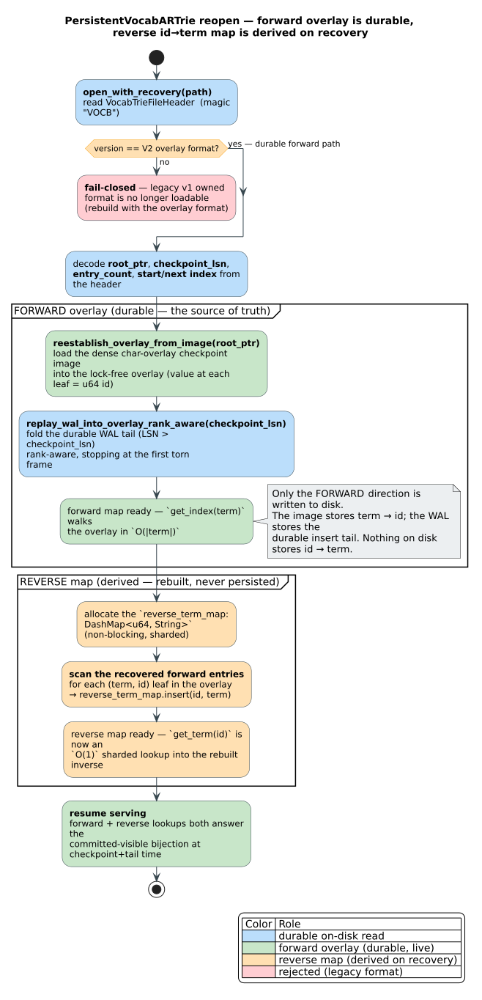

# The Vocabulary Trie — a durable term ↔ id bijection

**Navigation**: [↑ Dictionary layer](README.md) · [Crate README → persistent ARTrie](../../README.md#persistent-artrie--lock-free--durable) · [Native u64 / CX →](native-u64-and-cx.md) · [Persistence architecture →](../persistence/README.md)

> **Scope.** This document describes `PersistentVocabARTrie` (re-exported as
> `IndexedVocabularyPersistent`): a durable, lock-free **bijection** between
> string terms and dense `u64` ids. It explains the two directions —
> **forward** ($`\text{term} \to \text{id}`$, served by the lock-free char overlay, durable) and
> **reverse** ($`\text{id} \to \text{term}`$, served by an in-memory map that is **rebuilt from the
> recovered forward entries on reopen** rather than separately persisted) — *what*
> each is, *how* recovery reconstructs them, and *why* the asymmetry is the right
> design. The shared persistence substrate is documented under
> [`../persistence/`](../persistence/README.md).

---

## 1. Purpose — interning strings to dense ids, durably

A **vocabulary** maps a stream of distinct strings to **dense, sequential `u64`
ids**: the first term interned gets id `0`, the next new term `1`, and so on, with
duplicates returning the existing id. This $`\text{term} \leftrightarrow \text{id}`$ bijection is the backbone of:

- **Tokenizers / embeddings** — map tokens to contiguous ids for table lookup.
- **Dictionary encoding** — replace repeated strings in a column store with small
  ids and decode them back on read.
- **Symbol interning** — assign stable ids to identifiers, then refer to them by id.

`PersistentVocabARTrie` makes this bijection **crash-durable** and **lock-free for
concurrent inserts and lookups**, under the `persistent-artrie` feature. It is the
recommended type whenever a vocabulary must survive process restarts.

```text
insert("hello") → 0      get_index("hello") → Some(0)      get_term(0) → Some("hello")
insert("world") → 1      get_index("world") → Some(1)      get_term(1) → Some("world")
insert("hello") → 0      get_index("absent") → None        get_term(99) → None
   (duplicate → existing id; the bijection is stable across a checkpoint + reopen)
```

---

## 2. Intuition — one direction is the truth, the other is derived

A bijection has two directions, but they are **not equally expensive to persist**,
and exploiting that asymmetry is the central design choice.

- The **forward** direction, $`\text{term} \to \text{id}`$, is a **trie**: walk the term's characters
  from the root to a leaf whose stored value is the id. This is the natural,
  prefix-shareable representation, and it is what `get_index` and membership
  (`contains`) need. It is the **source of truth** and the only thing written to
  disk.
- The **reverse** direction, $`\text{id} \to \text{term}`$, is just a **flat map** from each id back
  to its string. Crucially, **every (id, term) reverse entry is already implied by
  a forward leaf**: the reverse map is a pure *function of* the forward trie. So it
  does **not** need its own durable copy — it can be **reconstructed by scanning
  the forward entries** whenever the trie is loaded.

Hence: persist the forward trie; **derive** the reverse map on reopen. The reverse
map is a *rebuildable accelerator*, not independent state. This keeps the on-disk
format smaller and, more importantly, makes it **impossible** for the two
directions to disagree after a crash — the reverse map is regenerated *from* the
authoritative forward image every time, so it is consistent by construction.

---

## 3. The forward direction — the lock-free char overlay (durable)

The forward map is a **lock-free char overlay trie** whose leaf **value is the
`u64` id**. It is the same immutable, copy-on-write, CAS-published overlay node
used by `PersistentARTrieChar` — instantiated here at `V = u64`:

- **Insert** ($`\text{insert}(\text{term}) \to \text{id}`$) claims the next id (`next_index`), builds a
  copy-on-write path that marks the term's leaf final with that id as its value,
  and publishes the new root by compare-and-swap. A duplicate term short-circuits
  and returns the existing leaf's id without consuming a new id. This is the same
  Order-A "log before publish" durability rule as the rest of the family: the
  insert is appended to the WAL and made durable, then the overlay root is
  published.
- **Forward lookup** (`get_index(term)`) walks the overlay character-by-character
  in $`O(\lvert \text{term} \rvert)`$ and reads the leaf value. Membership (`contains`) is the same walk
  without reading the value. Reads take **no lock** — the lock-free
  CAS-publish/snapshot-read discipline the forward direction inherits is specified in
  [`../persistence/lock-free-overlay.md`](../persistence/lock-free-overlay.md) and
  [`../persistence/concurrency-model.md`](../persistence/concurrency-model.md).
- A lock-free `lockfree_cache: DashMap<String, u64>` accelerates repeated forward
  lookups; like the reverse map, it is a derived accelerator over the overlay.

On disk the forward direction is **two artifacts**:

```
vocabulary.vocab        ← VocabTrieFileHeader (magic "VOCB", version 2 = overlay
                          format) + a DENSE char-overlay checkpoint image
                          (the folded forward trie: term → id at each leaf)
vocabulary.vocab.wal    ← the write-ahead log: the durable insert tail past the
                          last checkpoint
```

The header records `root_ptr`, `checkpoint_lsn`, `entry_count`, and the
`start_index` / `next_index` id watermarks. (The legacy *v1 "owned"* format is no
longer loadable — files must be in the v2 overlay format.)

---

## 4. The reverse direction — `reverse_term_map`, rebuilt on recovery

The reverse map is `reverse_term_map: DashMap<u64, String>` — described in the
source as *"the NON-BLOCKING derived inverse of the forward overlay … the overlay
is the source of truth; this is a rebuildable accelerator."*

- During **live operation**, the lock-free insert path populates it alongside the
  forward overlay (`insert_overlay` writes both), so `get_term(id)` is an $`O(1)`$
  sharded lookup with no lock.
- On **reopen**, it is **not read from disk**. It is **rebuilt by scanning the
  recovered forward entries**: for each `(term, id)` leaf in the reconstructed
  forward overlay, insert $`\text{id} \to \text{term}`$ into a fresh `DashMap`. Because it is derived
  from the authoritative forward image, it is exactly consistent with the forward
  direction by construction.
- A **`clone()`** of the trie likewise carries no reverse map (`reverse_term_map:
  None`); the clone rebuilds it from the overlay on first use. The reverse map is
  *never* the thing that defines the data — it is always reconstructed from the
  forward truth.

> **Why derive instead of persist the reverse map?** Three reasons. **(1)
> Consistency by construction** — a separately-persisted reverse map could become
> torn or stale relative to the forward image after a crash; a *derived* one cannot,
> because it is regenerated from the forward image every load. **(2) Smaller
> on-disk format** — the id→term mapping is redundant with the forward leaves, so
> storing it would duplicate every term. **(3) Non-blocking** — a `DashMap` rebuilt
> in memory keeps both the live insert path and the reverse lookup fully
> lock-free.

---

## 5. Recovery — forward durable, reverse derived

`open_with_recovery(path)` reconstructs both directions, but only the forward one
touches disk:

1. **Read & validate the header** (`VocabTrieFileHeader`, magic `VOCB`). Reject
   anything but the **v2 overlay** format (legacy v1 owned files are no longer
   loadable).
2. **Reestablish the forward overlay from the image** —
   `reestablish_overlay_from_image(header.root_ptr)` loads the dense char-overlay
   checkpoint image into the live lock-free overlay (each leaf's value is its id).
3. **Replay the durable WAL tail rank-aware** —
   `replay_wal_into_overlay_rank_aware(wal_path, checkpoint_lsn)` folds inserts with
   `LSN > checkpoint_lsn` into the overlay, stopping at the first torn frame, in
   commit-generation order. The forward bijection is now exactly the
   committed-visible state at crash time.
4. **Rebuild the reverse map from the recovered forward entries** — allocate a
   fresh `reverse_term_map` and scan the forward overlay's `(term, id)` leaves into
   it. Nothing on disk stored $`\text{id} \to \text{term}`$; it is materialized here.
5. **Resume serving** — `get_index` / `contains` walk the overlay; `get_term` reads
   the rebuilt reverse map; both answer the same bijection.

The figure shows the split explicitly — forward (durable, blue/green) vs. reverse
(derived on recovery, amber):

<p align="center">
  
</p>

A `RecoveryReport` is returned alongside the reopened trie; `report.mode.is_normal()`
indicates a clean image load (no WAL replay needed) and `report.records_replayed`
counts the WAL inserts folded past the image.

---

## 6. Usage

The durable round-trip (mirrors the in-source doctest, compile-checked as
`rust,no_run`): create, intern terms, checkpoint, reopen — the bijection survives,
and the reverse direction works immediately because it is rebuilt during recovery.

```rust,no_run
use libdictenstein::persistent_artrie::vocab::PersistentVocabARTrie;

// Create a new vocabulary.
let vocab = PersistentVocabARTrie::create("vocab.vocab")?;

// Intern terms — sequential ids; duplicates return the existing id.
let hello = vocab.insert("hello")?;   // 0
let world = vocab.insert("world")?;   // 1
assert_eq!(vocab.insert("hello")?, hello);   // duplicate → existing id 0
assert_eq!((hello, world), (0, 1));

// Forward lookup (overlay walk) and reverse lookup (derived map).
assert_eq!(vocab.get_index("hello"), Some(0));
assert_eq!(vocab.get_term(0), Some("hello".to_string()));

// Fold the overlay into the dense image, then close.
vocab.checkpoint()?;
drop(vocab);

// Reopen: forward is loaded from the image + WAL; reverse is rebuilt by scanning it.
let (vocab, _report) = PersistentVocabARTrie::open_with_recovery("vocab.vocab")?;
assert_eq!(vocab.get_index("hello"), Some(0));   // forward, durable
assert_eq!(vocab.get_term(0), Some("hello".to_string()));  // reverse, rebuilt on recovery
# Ok::<(), Box<dyn std::error::Error>>(())
```

`IndexedVocabularyPersistent` is the recommended alias for the same type:

```rust,no_run
use libdictenstein::persistent_artrie::vocab::IndexedVocabularyPersistent;

let mut vocab = IndexedVocabularyPersistent::create("vocab.vocab")?;
vocab.insert("hello")?;                 // 0
vocab.checkpoint()?;
let (vocab, _report) = IndexedVocabularyPersistent::open_with_recovery("vocab.vocab")?;
assert_eq!(vocab.get_term(0), Some("hello".to_string()));   // reverse works post-recovery
# Ok::<(), Box<dyn std::error::Error>>(())
```

Concurrent interning through a shared `Arc` is fully lock-free — every term still
resolves in **both** directions:

```text
let vocab = Arc::new(PersistentVocabARTrie::create("concurrent.vocab")?);
// N threads each insert("t{thread}_{i}") through Arc::clone(&vocab) with NO external lock.
// After joining: get_index(term) → id  and  get_term(id) → term  for every term.
```

The bijection round-trips edge cases too: the **empty string** `""` is a valid term
mapping to id `0` and survives checkpoint + reopen (forward image branch + rebuilt
reverse-map root branch), as do long strings, embedded nulls, and full Unicode
(CJK, emoji, combining marks).

---

## 7. Properties at a glance

| Property | Forward $`\text{term} \to \text{id}`$ | Reverse $`\text{id} \to \text{term}`$ |
|----------|---------------------|---------------------|
| **Representation** | lock-free char overlay trie (leaf value = id) | `DashMap<u64, String>` |
| **Persisted?** | **yes** — dense overlay image + WAL tail | **no** — derived |
| **Reconstructed on reopen by** | loading the image + replaying the WAL | **scanning the recovered forward entries** |
| **Lookup cost** | $`O(\lvert \text{term} \rvert)`$ overlay walk | $`O(1)`$ sharded |
| **Concurrency** | lock-free CAS-published root | lock-free `DashMap` |
| **Consistency after crash** | committed-visible at crash time | consistent *by construction* (rebuilt from forward) |
| **Source of truth?** | **yes** | no — a rebuildable accelerator |

---

## 8. Relationship to the rest of the crate

- **Built on** the persistent char ARTrie overlay (the forward direction is that
  overlay at `V = u64`) and the shared persistence substrate — WAL, Order-A writes,
  checkpoint/recovery, `mmap`/`io_uring` storage:
  [`../persistence/README.md`](../persistence/README.md) and
  [`../persistence/wal-format.md`](../persistence/wal-format.md).
- **Catalogued** as the `PersistentVocabARTrie` row of the ARTrie family — its place
  among the byte/char/`u64` profiles, and the forward/reverse cost model, are
  tabulated in [`../persistence/families.md#profiles`](../persistence/families.md#profiles);
  the shared lock-free concurrency contract (snapshot reads, CAS publication, the F4
  lock hierarchy) is in
  [`../persistence/concurrency-model.md`](../persistence/concurrency-model.md).
- **Compared with** the native-`u64` profile, which stores $`\text{\&[u64]} \to V`$ with native
  64-bit edge labels: [`native-u64-and-cx.md`](native-u64-and-cx.md). The vocab trie
  goes the *other* way — $`\text{String} \to \text{u64}`$ — and is keyed on characters, not `u64`
  words.
- **Sibling** durable substring indexes:
  [`persistent-suffix-graphs.md`](persistent-suffix-graphs.md).

---

## References

1. Driscoll, J. R., Sarnak, N., Sleator, D. D., & Tarjan, R. E. (1989). *Making
   Data Structures Persistent.* Journal of Computer and System Sciences 38(1).
   [10.1016/0022-0000(89)90034-2](https://doi.org/10.1016/0022-0000(89)90034-2) —
   the immutable-versioned overlay the forward direction publishes.
2. Mohan, C., Haderle, D., Lindsay, B., Pirahesh, H., & Schwarz, P. (1992). *ARIES:
   A Transaction Recovery Method …Using Write-Ahead Logging.* ACM TODS 17(1).
   [10.1145/128765.128770](https://doi.org/10.1145/128765.128770) — the
   checkpoint-image + redo-WAL-tail recovery the forward direction follows.
3. Leis, V., Kemper, A., & Neumann, T. (2013). *The Adaptive Radix Tree: ARTful
   Indexing for Main-Memory Databases.* IEEE ICDE.
   [10.1109/ICDE.2013.6544812](https://doi.org/10.1109/ICDE.2013.6544812) — the
   adaptive-node trie the forward char overlay is an instance of.

---

**Navigation**: [↑ Dictionary layer](README.md) · [Crate README → persistent ARTrie](../../README.md#persistent-artrie--lock-free--durable) · [Native u64 / CX →](native-u64-and-cx.md) · [Persistence architecture →](../persistence/README.md)
