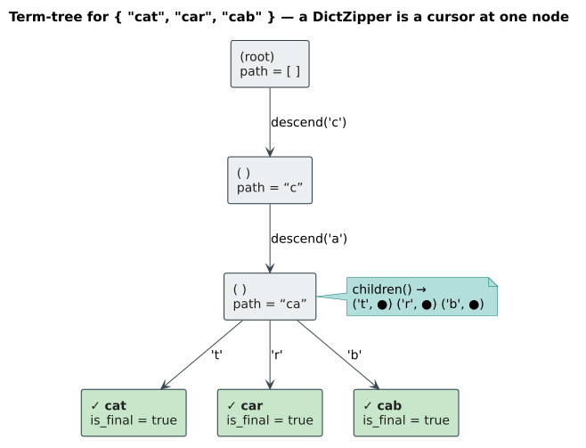
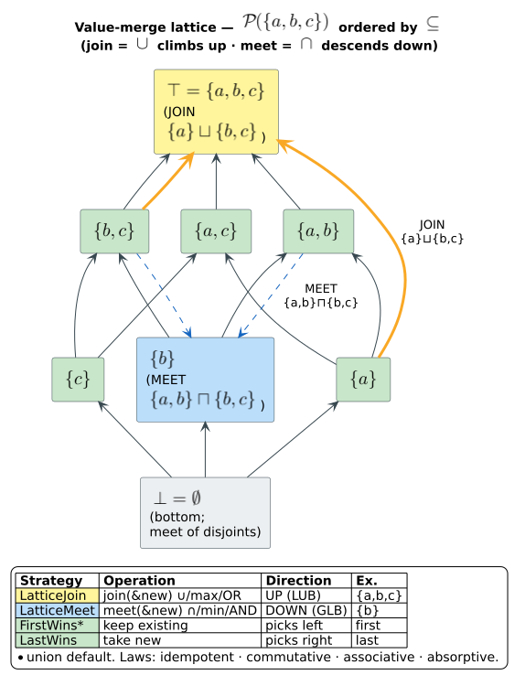
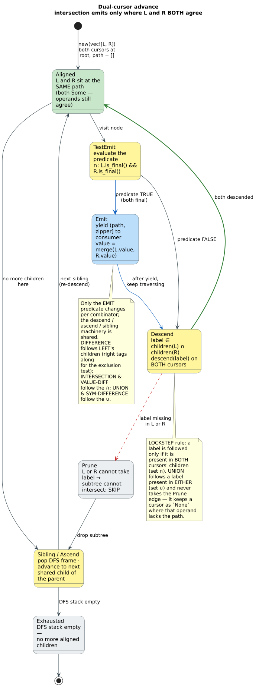

# Zipper Set-Algebra — lazy navigable cursors that compose dictionaries

**Navigation**: [↑ Documentation index](../README.md) · [Dictionary Layer →](README.md) · [Serialization & values →](serialization.md) · [Theory →](../theory/) · [Query half: liblevenshtein →](https://github.com/universal-automata/liblevenshtein-rust)

> The crate README advertises: *"Set algebra over dictionaries — union / intersection / difference / prefix zippers compose any two backends lazily."* This document is the conceptual and reference manual for that subsystem: what a **zipper** is, how the **set-combinators** layer over one or two operand cursors **without materializing** the combined set, and how associated **values merge** when the same term appears in more than one operand (the lattice / semilattice model).

---

## Table of contents

1. [What is a zipper?](#1-what-is-a-zipper)
2. [Why lazy composition?](#2-why-lazy-composition)
3. [The trait surface: `DictZipper` and `ValuedDictZipper`](#3-the-trait-surface-dictzipper-and-valueddictzipper)
4. [How combinators compose](#4-how-combinators-compose)
5. [The combinator catalog](#5-the-combinator-catalog)
   - [Union](#51-union--anyof) · [Intersection](#52-intersection--allof) · [Difference](#53-difference--a--b) · [Symmetric difference](#54-symmetric-difference--a--b) · [Prefix](#55-prefix--scoped-subtree) · [Excluding-prefix](#56-excluding-prefix--pruned-subtree) · [Value-diff](#57-value-diff--changed-values)
6. [The value-merge lattice](#6-the-value-merge-lattice)
7. [The dual-cursor advance model](#7-the-dual-cursor-advance-model)
8. [Performance & complexity](#8-performance--complexity)
9. [Backend compatibility](#9-backend-compatibility)
10. [Worked end-to-end example](#10-worked-end-to-end-example)
11. [Academic references](#11-academic-references)

---

## 1. What is a zipper?

A **zipper** is a *lazy, navigable cursor* over a tree-shaped structure. The name comes from Huet (1997): the cursor "unzips" a tree at a focus point, holding the **focus** (the subtree under the cursor) together with the **context** needed to move back toward the root. In `libdictenstein`, every dictionary backend stores its terms as a **term-tree** (a trie / DAWG / double-array / suffix automaton): the root is the empty prefix, each edge is labeled with a character **unit** (`u8`, `char`, or `u64`), and a node is **final** when the path from the root to it spells a complete term.

A `DictZipper` is a cursor positioned at one node of that term-tree. From any position it answers three questions and can move:

| Operation | Meaning | Returns |
|-----------|---------|---------|
| `is_final()` | *"Does the path to here spell a complete term?"* | `bool` |
| `descend(label)` | *"Move down the edge labeled `label`."* | `Option<Self>` — `None` if no such edge |
| `children()` | *"What edges leave this node?"* | iterator of `(label, child_zipper)` |
| `path()` | *"What is the path from the root to here?"* | `Vec<Unit>` (the term so far) |

Crucially, navigation is **non-destructive**: `descend` returns a *new* cursor and leaves the original valid. A zipper is cheap to `Clone` (backend cursors are an index or pointer plus a path), so a combinator can hold several cursors and fan them out independently. The term-tree itself is never mutated by navigation — the dictionary is read-only while you walk it.



The companion **liblevenshtein** transducer walks exactly this `DictZipper` surface: a Levenshtein automaton calls `descend` / `children` to explore only the dictionary paths within an edit-distance bound. The set-algebra combinators in this document are *also* just `DictZipper`s, so the same transducer can fuzzy-query a *union* or *intersection* of dictionaries with no extra machinery.

---

## 2. Why lazy composition?

The combinators (`union`, `intersection`, `difference`, …) present a **derived term-tree** that is computed *on demand*. Asking `union_with` for the union of two 1-million-term dictionaries does **not** build a third million-term structure. Instead it returns a `UnionZipper` that holds the two operand cursors; when you `descend` or iterate it, it forwards the request to its operands and combines their answers *for that node only*.

This matters for three reasons:

- **Memory** — a combinator owns `O(n)` cursors (one per operand dictionary) plus the `O(d)` DFS stack during iteration, never $O(|A \cup B|)$ materialized terms. Composition is essentially free in space.
- **Short-circuiting** — fuzzy queries and prefix scopes prune the derived tree as they descend. If a Levenshtein walk abandons a subtree at depth 2, the combinator never touches the operands below depth 2 either.
- **Composability** — because the result *is* a `DictZipper`, it can be fed straight into another combinator or into a transducer. `Intersection(Union(A, B), Difference(C, D))` is a tower of cursors, each pulling lazily from the one below.

The trade-off is that **iteration deduplicates by path** (each combinator iterator carries a `HashSet<Vec<Unit>>` of yielded paths), so the *iterator* is not zero-allocation — but the *structure* never is. For point queries (`descend` to a known term) there is no allocation beyond the path vector.

The lazy-pull tower is illustrated below: a consumer drives the top combinator, which pulls from its sub-combinators, which pull from the leaf backend cursors.



---

## 3. The trait surface: `DictZipper` and `ValuedDictZipper`

Two traits in [`src/zipper.rs`](../../src/zipper.rs) define the entire navigation contract. Every backend cursor and every combinator implements `DictZipper`; the valued variants additionally implement `ValuedDictZipper`.

```rust
use libdictenstein::CharUnit;
use libdictenstein::value::DictionaryValue;

/// A cursor position in a dictionary's term-tree.
pub trait DictZipper: Clone {
    /// Edge-label unit: `u8` (byte), `char` (Unicode), or `u64` (token/time-series).
    type Unit: CharUnit;

    /// Is the path to this position a complete term?
    fn is_final(&self) -> bool;

    /// Move down the edge labeled `label`; `None` if it does not exist.
    fn descend(&self, label: Self::Unit) -> Option<Self>;

    /// Iterate `(label, child_zipper)` over all outgoing edges.
    fn children(&self) -> impl Iterator<Item = (Self::Unit, Self)>;

    /// The path (term) from root to here.
    fn path(&self) -> Vec<Self::Unit>;
}

/// Dictionaries that map terms to values expose the value at a final position.
pub trait ValuedDictZipper: DictZipper {
    type Value: DictionaryValue;

    /// The value at this position if it is final, else `None`.
    fn value(&self) -> Option<Self::Value>;
}
```

Two design facts drive everything else:

1. **`Self::Unit: CharUnit`** — `CharUnit` is the unit abstraction (`u8` / `char` / `u64`). Its bound **includes `Ord`**, so combinators that must sort labels for deterministic iteration do so with `sort_unstable()` over that total order — the natural numeric / character / word ordering of every supported unit (which also avoids the per-comparison `Debug`-string allocation an `Ord`-free design would force).
2. **`Value: DictionaryValue`** — the value trait (see [`src/value.rs`](../../src/value.rs)) requires `Clone + Default + Send + Sync + Unpin + 'static` (and `Serialize + DeserializeOwned` under the `persistent-artrie` feature). Auto-implemented for `()`, the integer/float primitives, `bool`, `char`, `String`, `Vec<T>`, `HashSet<T>`, and `SmallVec<A>`. The unit type `()` overrides `is_value()` to return `false`, so a `()`-valued dictionary behaves like a pure set.

> **Extension-trait ergonomics.** You rarely name the combinator structs directly. Each combinator ships a blanket-implemented extension trait so any `DictZipper` gains a fluent constructor: `UnionZipperExt::union_with`, `IntersectionZipperExt::intersection_with`, `DifferenceZipperExt::difference_from`, `SymmetricDifferenceZipperExt::symmetric_difference_with`, `PrefixZipper::with_prefix`, `ExcludingPrefixZipper::iter_excluding`, `ValueDiffZipperExt::value_diff_with`. `impl<Z: DictZipper> …Ext for Z {}` is the pattern — every cursor, including a combinator, gets every operator.

---

## 4. How combinators compose

A combinator is a `DictZipper` that **owns operand cursors instead of storage**. Concretely:

- **Binary, asymmetric** combinators (`DifferenceZipper`, `ValueDiffZipper`) hold `left: Option<Z>` and `right: Option<Z>`. The `Option` is the "active" flag: a cursor becomes `None` once it can no longer follow the shared path, while the other may continue.
- **N-ary, symmetric** combinators (`UnionZipper`, `IntersectionZipper`, `SymmetricDifferenceZipper`) hold `zippers: Vec<Option<Z>>` — one slot per operand, each `Some` while that operand still has the current path.
- **Unary** combinators (`PrefixZipper`, `ExcludingPrefixZipper`) are *iterator adapters* rather than wrapper structs: they navigate a single cursor to a prefix (or filter its children) and stream the subtree.

Every combinator forwards `descend` / `children` / `is_final` / `value` to its operands and folds the answers with its own **set predicate**. The three N-ary combinators additionally carry a value-merge `strategy: S` for reconciling overlapping values (§6). Because the result implements `DictZipper`, an operand `Z` may itself be a combinator — composition is closed under nesting.

The table below is the heart of the subsystem: each row is one combinator's fold rule.

| Combinator | `is_final()` (emit predicate) | `descend(label)` follows | `children()` set op | Value source |
|------------|-------------------------------|--------------------------|---------------------|--------------|
| **Union** $A \cup B$ | `ANY` operand final | label present in **any** operand | $\cup$ of operands' labels | merge via strategy (`FirstWins` default) |
| **Intersection** $A \cap B$ | **ALL** operands final | label present in **all** operands (else prune) | $\cap$ of operands' labels | merge via strategy (`LatticeMeet` default) |
| **Difference** `A \ B` | `A` final **AND NOT** `B` final | `A` (left); `B` tags along | `A`'s children only | from `A` (no merge) |
| **Symmetric diff** $A \triangle B$ | **exactly one** operand final | label present in **any** operand | $\cup$ of operands' labels | from the single source |
| **Prefix** $\{t : p \sqsubseteq t\}$ | underlying `is_final()` | underlying `descend` from prefix node | underlying children | underlying value |
| **Excluding-prefix** | underlying `is_final()`, excluded subtrees pruned | underlying, skipping excluded prefixes | underlying minus excluded | underlying value |
| **Value-diff** | both final **AND** $L.value \ne R.value$ | label in **both** (intersection) | $\cap$ of children | both values exposed separately |

Notation: $p \sqsubseteq t$ means "`p` is a prefix of `t`"; $\cup$/$\cap$ are set union/intersection over the *child label sets* at a node.

---

## 5. The combinator catalog

Every example below uses the **real public API** and mirrors the crate's own compiled doctests. The setup is always: build two `DoubleArrayTrie` dictionaries, take a `DoubleArrayTrieZipper` over each with `new_from_dict`, combine, then iterate or navigate. The patterns are identical for every other backend (§9).

### 5.1 Union — *any-of*

$A \cup B$ yields every term in **either** dictionary; a term in both appears **once** (iteration deduplicates by path). Source: [`src/union_zipper/mod.rs`](../../src/union_zipper/mod.rs).

```rust
use libdictenstein::prelude::*;
use libdictenstein::union_zipper::{UnionZipper, UnionZipperExt};
use libdictenstein::double_array_trie::zipper::DoubleArrayTrieZipper;

let dict1 = DoubleArrayTrie::from_terms(vec!["cat", "dog"].iter());
let dict2 = DoubleArrayTrie::from_terms(vec!["cat", "fish"].iter());

let z1 = DoubleArrayTrieZipper::new_from_dict(&dict1);
let z2 = DoubleArrayTrieZipper::new_from_dict(&dict2);

let union = z1.union_with(z2);

let mut results: Vec<String> = union.iter()
    .map(|(path, _)| String::from_utf8(path).unwrap())
    .collect();
results.sort();
assert_eq!(results, vec!["cat", "dog", "fish"]); // "cat" appears once
```

`is_final()` is `true` where **any** operand is final; `descend(label)` succeeds if **any** operand has the edge (a missing operand becomes `None` but the cursor lives on); `children()` is the **union** of operands' child labels (sorted + deduped). For three-or-more dictionaries use `z1.union_all(vec![z2, z3])`.

### 5.2 Intersection — *all-of*

$A \cap B$ yields a term only if it exists in **every** operand. Source: [`src/intersection_zipper.rs`](../../src/intersection_zipper.rs).

```rust
use libdictenstein::prelude::*;
use libdictenstein::intersection_zipper::IntersectionZipperExt;
use libdictenstein::double_array_trie::zipper::DoubleArrayTrieZipper;

let dict1 = DoubleArrayTrie::from_terms(vec!["cat", "dog", "fish"].iter());
let dict2 = DoubleArrayTrie::from_terms(vec!["cat", "fish", "bird"].iter());

let z1 = DoubleArrayTrieZipper::new_from_dict(&dict1);
let z2 = DoubleArrayTrieZipper::new_from_dict(&dict2);

let intersection = z1.intersection_with(z2);

let mut results: Vec<String> = intersection.iter()
    .map(|(path, _)| String::from_utf8(path).unwrap())
    .collect();
results.sort();
assert_eq!(results, vec!["cat", "fish"]); // only terms in BOTH
```

Intersection **prunes**: `descend(label)` returns `Some` only when **all** operands can take the label, so a subtree present in just one dictionary is abandoned immediately (no point descending where the sets cannot agree). `children()` is the **intersection** of the operands' child-label sets. `is_final()` requires every active operand to be final *and* all operands to still be active. Use `z1.intersection_all(vec![z2, z3])` for the N-ary case.

### 5.3 Difference — *A \ B*

`A \ B` yields terms in `A` that are **not** in `B`. Source: [`src/difference_zipper.rs`](../../src/difference_zipper.rs).

```rust
use libdictenstein::prelude::*;
use libdictenstein::difference_zipper::DifferenceZipperExt;
use libdictenstein::double_array_trie::zipper::DoubleArrayTrieZipper;

// Stopword removal: vocabulary minus stopwords.
let vocabulary = DoubleArrayTrie::from_terms(vec!["the", "cat", "sat", "on", "a", "mat"].iter());
let stopwords  = DoubleArrayTrie::from_terms(vec!["the", "on", "a"].iter());

let vocab_z = DoubleArrayTrieZipper::new_from_dict(&vocabulary);
let stop_z  = DoubleArrayTrieZipper::new_from_dict(&stopwords);

let filtered = vocab_z.difference_from(stop_z);

let mut results: Vec<String> = filtered.iter()
    .map(|(path, _)| String::from_utf8(path).unwrap())
    .collect();
results.sort();
assert_eq!(results, vec!["cat", "mat", "sat"]);
```

Difference is **asymmetric**: navigation follows `A`'s structure (`children()` are `A`'s children), and `B` only "tags along" to test exclusion. The emit predicate is `left_final && !right_final`. A subtle but important case is the *proper-prefix* term: if `A = {"app", "apple"}` and `B = {"apple"}`, then `"app"` is in the difference (in `A`, not in `B`) even though `B` still has the path `a-p-p` on its way to `"apple"` — `B` is simply not *final* at `"app"`. Use `difference_from_optional(None)` when the exclusion set may be absent (the result then equals `A`).

### 5.4 Symmetric difference — *A $\triangle$ B*

$A \triangle B$ yields terms in **exactly one** operand — the set XOR. Algebraically $A \triangle B = (A \ B) \cup (B \ A) = (A \cup B) \ (A \cap B)$ (both identities are property-tested in the source). Source: [`src/symmetric_difference_zipper.rs`](../../src/symmetric_difference_zipper.rs).

```rust
use libdictenstein::prelude::*;
use libdictenstein::symmetric_difference_zipper::SymmetricDifferenceZipperExt;
use libdictenstein::double_array_trie::zipper::DoubleArrayTrieZipper;

// Version diff: which terms were added or removed between two versions?
let version_1 = DoubleArrayTrie::from_terms(vec!["print", "input", "read"].iter());
let version_2 = DoubleArrayTrie::from_terms(vec!["print", "input", "write"].iter());

let z1 = DoubleArrayTrieZipper::new_from_dict(&version_1);
let z2 = DoubleArrayTrieZipper::new_from_dict(&version_2);

let changed = z1.symmetric_difference_with(z2);

let mut results: Vec<String> = changed.iter()
    .map(|(path, _)| String::from_utf8(path).unwrap())
    .collect();
results.sort();
assert_eq!(results, vec!["read", "write"]); // "read" removed, "write" added
```

For the N-ary form `z1.symmetric_difference_all(vec![z2, z3])`, the rule generalizes to *"final in exactly one operand"* (not "an odd number") — `final_count() == 1`. The helper `unique_source_index()` returns *which* dictionary uniquely contains the current term.

### 5.5 Prefix — *scoped subtree*

`PrefixZipper` is the autocomplete primitive: navigate to a prefix in `O(k)` (k = prefix length), then stream every term under it in `O(m)` (m = matching terms) — far cheaper than `O(n)` full iteration with `.starts_with()` filtering when $m \ll n$. Source: [`src/prefix_zipper.rs`](../../src/prefix_zipper.rs).

```rust
use libdictenstein::prelude::*;
use libdictenstein::prefix_zipper::PrefixZipper;
use libdictenstein::double_array_trie::zipper::DoubleArrayTrieZipper;

let dict = DoubleArrayTrie::from_terms(vec!["hello", "help", "world"].iter());
let zipper = DoubleArrayTrieZipper::new_from_dict(&dict);

// `with_prefix` returns None if no term has the prefix.
let mut iter = zipper.with_prefix(b"hel").unwrap();
assert_eq!(iter.count(), 2); // "hello" and "help"
assert!(zipper.with_prefix(b"xyz").is_none());
```

`with_prefix_values` (trait `ValuedPrefixZipper`) yields `(path, value)` pairs. Because `PrefixZipper` is blanket-implemented for *every* `DictZipper`, you can prefix-scope a *combinator*: `union.with_prefix(b"pro")` streams the union restricted to terms beginning `pro`.

### 5.6 Excluding-prefix — *pruned subtree*

`ExcludingPrefixZipper` is the inverse filter: iterate everything **except** subtrees whose path starts with an excluded prefix, pruning each excluded subtree at `O(1)` per check *before* it is pushed onto the DFS stack (so excluded nodes are never visited). The canonical use is hiding `\x00`-prefixed metadata/sentinel entries. Source: [`src/excluding_prefix_zipper.rs`](../../src/excluding_prefix_zipper.rs).

```rust
use libdictenstein::prelude::*;
use libdictenstein::excluding_prefix_zipper::ExcludingPrefixZipper;
use libdictenstein::double_array_trie::zipper::DoubleArrayTrieZipper;

let dict = DoubleArrayTrie::from_terms(vec!["\x00meta", "\x00index", "hello", "world"].iter());
let zipper = DoubleArrayTrieZipper::new_from_dict(&dict);

let excluded: &[&[u8]] = &[b"\x00"];
let mut results: Vec<String> = zipper
    .iter_excluding(excluded)
    .map(|(path, _)| String::from_utf8(path).unwrap())
    .collect();
results.sort();
assert_eq!(results, vec!["hello", "world"]); // \x00meta / \x00index never visited
```

`with_prefix_excluding(prefix, excluded)` combines inclusion and exclusion (e.g. *"everything under `api_` except `api__internal`"*); `iter_values_excluding` / `with_prefix_values_excluding` (trait `ValuedExcludingPrefixZipper`) yield values too.

### 5.7 Value-diff — *changed values*

`ValueDiffZipper` walks the **intersection** of two *valued* dictionaries and yields only the terms present in both whose associated values **differ** — a delta over a key→value store. Source: [`src/value_diff_zipper.rs`](../../src/value_diff_zipper.rs).

```rust
use libdictenstein::prelude::*;
use libdictenstein::value_diff_zipper::ValueDiffZipperExt;
use libdictenstein::double_array_trie::zipper::DoubleArrayTrieZipper;

// Two versions of a frequency dictionary.
let version1 = DoubleArrayTrie::from_terms_with_values(
    vec![("cat", 10usize), ("dog", 20), ("fish", 30)].into_iter());
let version2 = DoubleArrayTrie::from_terms_with_values(
    vec![("cat", 10usize), ("dog", 25), ("fish", 35)].into_iter());

let z1 = DoubleArrayTrieZipper::new_from_dict(&version1);
let z2 = DoubleArrayTrieZipper::new_from_dict(&version2);

let diff = z1.value_diff_with(z2);

let mut results: Vec<(String, usize, usize)> = diff.iter_diffs()
    .map(|d| (String::from_utf8(d.path).unwrap(), d.left_value, d.right_value))
    .collect();
results.sort_by(|a, b| a.0.cmp(&b.0));

// "cat" unchanged (10) → excluded; "dog" 20→25; "fish" 30→35.
assert_eq!(results, vec![
    ("dog".to_string(),  20, 25),
    ("fish".to_string(), 30, 35),
]);
```

Each yielded item is a `ValueDiff { path, left_value, right_value }`, exposing **both** sides rather than a merged value (the comment in the source notes this is *why* `ValueDiffZipper` deliberately does **not** implement `ValuedDictZipper` — there is no single value to return). The bound `Z::Value: PartialEq` gates the comparison. Navigation requires *both* cursors to have the path (intersection semantics), and `is_final()` is `both_final && values_differ`.

---

## 6. The value-merge lattice

When the *same term* lives in more than one operand of a symmetric combinator (`union` / `intersection`), the operand values must be reconciled into one. Reconciliation is delegated to a **`ValueMergeStrategy`** — `merge(existing, new) -> V` — so the policy is pluggable. Source: [`src/union_zipper/merge_strategies.rs`](../../src/union_zipper/merge_strategies.rs) and [`src/union_zipper/lattice.rs`](../../src/union_zipper/lattice.rs).

```rust
/// How to reconcile two values for the same term.
pub trait ValueMergeStrategy<V>: Clone + Send + Sync {
    fn merge(&self, existing: V, new: V) -> V;
}
```

### 6.1 Side-selecting strategies

The two simplest strategies just **pick a side** and require nothing of `V`:

- **`FirstWins`** *(default for `UnionZipper`)* — keep the value from the earliest operand (`merge(e, _n) = e`).
- **`LastWins`** — keep the value from the latest operand (`merge(_e, n) = n`).

These model "layered dictionaries": `FirstWins` is base-with-fallback (earlier layers shadow later), `LastWins` is override (later layers win). They impose no algebraic structure on `V`.

### 6.2 Lattice strategies (the algebraic model)

For value types that form a **lattice**, two strategies combine values *algebraically* rather than positionally. A **lattice** (the `Lattice` trait, re-exported from the [`llattice`](../../../llattice/) crate) is a partially-ordered set with two operations:

- **join** $\sqcup$ — the *least upper bound* (supremum). For sets this is **union** $\cup$; for numbers **max**; for `bool` **OR**.
- **meet** $\sqcap$ — the *greatest lower bound* (infimum). For sets this is **intersection** $\cap$; for numbers **min**; for `bool` **AND**.

The adapters wire these into the merge contract:

- **`LatticeJoin`** — `merge(e, n) = e.join(&n)`  (climbs **up** the lattice: $\cup$ / max / OR).
- **`LatticeMeet`** *(default for `IntersectionZipper`)* — `merge(e, n) = e.meet(&n)`  (descends **down**: $\cap$ / min / AND).

A *lawful* lattice satisfies four laws for all `a`, `b`, `c` (verified for the built-in impls in `llattice`):

| Law | Statement |
|-----|-----------|
| **Idempotency** | $a \sqcup a = a$ and $a \sqcap a = a$ |
| **Commutativity** | $a \sqcup b = b \sqcup a$ and $a \sqcap b = b \sqcap a$ |
| **Associativity** | $(a \sqcup b) \sqcup c = a \sqcup (b \sqcup c)$ (and for $\sqcap$) |
| **Absorption** | $a \sqcup (a \sqcap b) = a$ and $a \sqcap (a \sqcup b) = a$ |

Commutativity + associativity are what make a merge **order-independent** — essential because the combinators fold operands left-to-right and you should get the same answer regardless of operand order (the CRDT property). `llattice` ships lawful impls for the integer and float primitives (`join = max`, `meet = min`), `bool` (OR / AND), `Option<T>` (`Some` if either / both), `HashSet<T>` ($\cup$ / $\cap$, bottom $\bot = \emptyset$), and `Vec<T>` (a join-semilattice *up to content-equality* — `join`/`meet` are order-preserving but left-biased, so the laws hold for the *element set*, not the `Vec` value).

> **On the term "semiring-lattice."** The crate's value-merge model is the **lattice** semilattice above; there is no separate `semiring_lattice` module (the C6 split of `union_zipper.rs` produced exactly `mod.rs`, `merge_strategies.rs`, and `lattice.rs`). The connection to semirings is documented in `llattice` itself: for an *idempotent* semiring ($a \oplus a = a$), the $\oplus$ (plus) operation forms a **join semilattice**, while $\otimes$ (times) is generally path composition rather than lattice meet. The bridge from `IdempotentSemiring` to `Lattice` lives in the `lling-llang` crate; within `libdictenstein` the relevant structure is purely the join/meet lattice.

### 6.3 Worked merges

```rust
use libdictenstein::prelude::*;
use libdictenstein::union_zipper::{UnionZipper, LatticeJoin, LatticeMeet};
use libdictenstein::double_array_trie::zipper::DoubleArrayTrieZipper;
use std::collections::HashSet;

// HashSet values: "key" lives in both dictionaries with different sets.
let dict1 = DoubleArrayTrie::from_terms_with_values(
    vec![("key", HashSet::from([1, 2, 3]))].into_iter());
let dict2 = DoubleArrayTrie::from_terms_with_values(
    vec![("key", HashSet::from([2, 3, 4]))].into_iter());

let z1 = DoubleArrayTrieZipper::new_from_dict(&dict1);
let z2 = DoubleArrayTrieZipper::new_from_dict(&dict2);

// JOIN climbs UP the lattice: {1,2,3} ∪ {2,3,4} = {1,2,3,4}
let joined = UnionZipper::with_strategy(vec![z1.clone(), z2.clone()], LatticeJoin);
let key = joined.descend(b'k').and_then(|z| z.descend(b'e')).and_then(|z| z.descend(b'y')).unwrap();
assert_eq!(key.value(), Some(HashSet::from([1, 2, 3, 4])));

// MEET descends DOWN the lattice: {1,2,3} ∩ {2,3,4} = {2,3}
let met = UnionZipper::with_strategy(vec![z1, z2], LatticeMeet);
let key = met.descend(b'k').and_then(|z| z.descend(b'e')).and_then(|z| z.descend(b'y')).unwrap();
assert_eq!(key.value(), Some(HashSet::from([2, 3])));
```

A custom strategy is just a `Clone` type implementing `ValueMergeStrategy<V>` — e.g. summation:

```rust
use libdictenstein::union_zipper::ValueMergeStrategy;

#[derive(Clone)]
struct Sum;
impl ValueMergeStrategy<usize> for Sum {
    fn merge(&self, existing: usize, new: usize) -> usize { existing + new }
}
// UnionZipper::with_strategy(vec![z1, z2], Sum)  →  "cat" = 1 + 10 = 11
```

For `IntersectionZipper`, the `ValuedDictZipper` impl is bounded `where Z::Value: Lattice` and merges with the configured strategy (default `LatticeMeet`); override via `intersection_with_strategy(other, LatticeJoin)`.

The Hasse diagram below draws the partial order for `HashSet` values over the universe `{a, b, c}` (ordered by $\subseteq$), and traces both worked merges: `LatticeJoin` climbing to the least upper bound, `LatticeMeet` descending to the greatest lower bound.



---

## 7. The dual-cursor advance model

How does a binary combinator actually *walk* two operands? It advances them **in lockstep**: every `descend(label)` and `children()` is forwarded to *both* cursors over the *same* label, so the two cursors always sit at the same path. The combinators differ in only one place — the **emit predicate** over `(left.is_final, right.is_final)`:

| Combinator | Emit a term iff |
|------------|-----------------|
| Intersection | $L_\text{final} \land R_\text{final}$ |
| Union | $L_\text{final} \lor R_\text{final}$ |
| Difference | $L_\text{final} \land \neg R_\text{final}$ |
| Symmetric difference | exactly one of `L_final`, `R_final` |
| Value-diff | $L_\text{final} \land R_\text{final} \land (L.\text{value} \ne R.\text{value})$ |

Iteration is a depth-first search: descend a shared child, test the emit predicate, then ascend (pop the DFS frame) and try the next sibling. Two structural rules distinguish the combinators during the *descend* step:

- **Which labels** the lockstep follows — the **intersection** of operands' child labels (intersection / value-diff), their **union** (union / symmetric difference), or just the **left** operand's children (difference, with the right tagging along for exclusion).
- **Pruning** — intersection's `descend` returns `None` the moment *either* cursor cannot take the label, so a non-agreeing subtree is skipped entirely. Union instead keeps the lagging operand as `None` and continues.

The state machine below traces this synchronize-and-emit loop for the intersection case (the most pruning-heavy); the notes call out how union, difference, and value-diff vary the *emit* and *follow* rules over the same shared skeleton.



---

## 8. Performance & complexity

Let `k` = prefix/term length, `n` = number of operand dictionaries, `c` = max children per node, `m` = terms in the result, `d` = max term depth.

| Combinator | `descend` (point) | `children` | full `iter` | extra memory |
|------------|-------------------|------------|-------------|--------------|
| Union | $O(k\cdot n)$ | $O(c\cdot n)$ | `O(m)` (deduped) | `O(n)` cursors + `O(d)` stack |
| Intersection | $O(k\cdot n)$ | $O(c\cdot n)$ | `O(m)` | `O(n)` + `O(d)` |
| Difference | `O(k)` (2 cursors) | `O(c)` (A only) | `O(m_A)` | `O(1)` cursors + `O(d)` |
| Symmetric diff | $O(k\cdot n)$ | $O(c\cdot n)$ | $O(m\cdot n)$ | `O(n)` + `O(d)` |
| Prefix | `O(k)` | `O(c)` | `O(m)` | `O(d)` stack |
| Excluding-prefix | `O(k)` | $O(c\cdot e)$ (e = #excluded) | `O(m)` | `O(d)` stack |
| Value-diff | `O(k)` (2 cursors) | `O(c)` ($\cap$) | $O(m_\cap )$ | `O(d)` + dedup set |

Two practical notes:

- **The structure is always `O(n)`-space** — composition never materializes the result. Only the *iterators* allocate (the per-path dedup `HashSet`, and the `Vec<Unit>` path each yield clones). For point queries via `descend`, there is no allocation beyond the path vector.
- **Iteration deduplicates by path.** Each combinator iterator inserts every yielded path into a `HashSet<Vec<Unit>>`. This guarantees each term is emitted once even when reachable via multiple operands, at the cost of `O(m)` retained paths during a full scan.

The **`PrefixZipper`** fast path is the headline optimization: navigating to a selective prefix and streaming its subtree is `O(k + m)` versus `O(n)` for full-iterate-and-filter — a 5–10$\times$ speedup when $m \ll n$ (the autocomplete regime). The iterator deliberately stores *only zippers* on its DFS stack and reconstructs each path **lazily** at final nodes, which profiling showed removes $\approx$2–4% of per-child `Vec` clone/realloc overhead.

---

## 9. Backend compatibility

Every combinator is written **purely against the `DictZipper` / `ValuedDictZipper` traits** — there is zero backend-specific code. Any cursor that implements the traits composes with any other of the same `Unit` type. The cursor constructors per backend:

| Backend | Byte cursor (`Unit = u8`) | Unicode cursor (`Unit = char`) |
|---------|---------------------------|-------------------------------|
| Double-array trie | `DoubleArrayTrieZipper::new_from_dict` | `DoubleArrayTrieCharZipper::new_from_dict` |
| Dynamic DAWG | `DynamicDawg` zipper | `DynamicDawgChar` zipper |
| PathMap *(feature `pathmap-backend`)* | `PathMapZipper::new_from_dict` | — |
| Suffix automaton | `SuffixAutomaton` zipper | `SuffixAutomatonChar` zipper |

Mixing **operands of the same backend + unit** is the supported path (the combinator's `Z` is a single concrete cursor type). For cross-backend unions, normalize to a common cursor type first (e.g. build both as `DoubleArrayTrie`). See the [Dictionary Layer guide](README.md) and the per-backend pages under [`implementations/`](implementations/) — [double-array-trie](implementations/double-array-trie.md), [double-array-trie-char](implementations/double-array-trie-char.md), [dynamic-dawg](implementations/dynamic-dawg.md), [suffix-automaton](implementations/suffix-automaton.md) — for the available cursors.

---

## 10. Worked end-to-end example

A realistic pipeline: maintain a **user** and a **system** completion dictionary, present their **union** for autocomplete (user values shadow system via `FirstWins`), but scope each query to the typed **prefix**, and **exclude** internal `\x00`-prefixed entries.

```rust
use libdictenstein::prelude::*;
use libdictenstein::union_zipper::UnionZipperExt;
use libdictenstein::prefix_zipper::PrefixZipper;
use libdictenstein::double_array_trie::zipper::DoubleArrayTrieZipper;

let system = DoubleArrayTrie::from_terms(
    vec!["process", "produce", "\x00sys_meta"].iter());
let user   = DoubleArrayTrie::from_terms(
    vec!["product", "program"].iter());

let sys_z  = DoubleArrayTrieZipper::new_from_dict(&system);
let user_z = DoubleArrayTrieZipper::new_from_dict(&user);

// Union the two dictionaries (lazy — nothing materialized).
let union = sys_z.union_with(user_z);

// Scope the union to everything the user typed ("pro") and stream completions.
let mut completions: Vec<String> = union
    .with_prefix(b"pro")
    .unwrap()
    .map(|(path, _)| String::from_utf8(path).unwrap())
    .collect();
completions.sort();
assert_eq!(completions, vec!["process", "produce", "product", "program"]);
```

The `\x00sys_meta` sentinel never matches the `pro` prefix here; to hide such entries from an *unscoped* listing, swap `with_prefix` for `iter_excluding(&[b"\x00" as &[u8]])` (see §5.6). Because `union` is itself a `DictZipper`, the prefix and exclusion adapters apply to it transparently — that closure-under-composition is the whole point of the subsystem.

---

## 11. Academic references

1. **Huet, G. (1997).** "The Zipper." *Journal of Functional Programming*, 7(5), 549–554. DOI: [10.1017/S0956796897002864](https://doi.org/10.1017/S0956796897002864). — The functional cursor abstraction this module is named for.

2. **Driscoll, J. R., Sarnak, N., Sleator, D. D., & Tarjan, R. E. (1989).** "Making data structures persistent." *Journal of Computer and System Sciences*, 38(1), 86–124. DOI: [10.1016/0022-0000(89)90034-2](https://doi.org/10.1016/0022-0000(89)90034-2). — Persistence and **structural sharing**: the basis for why non-destructive `descend` is cheap (a child cursor shares the parent's underlying nodes rather than copying them).

3. **Davey, B. A., & Priestley, H. A. (2002).** *Introduction to Lattices and Order* (2nd ed.). Cambridge University Press. ISBN: 978-0521784511. — Lattices, the join/meet operations, and the four lattice laws underpinning §6.

4. **Shapiro, M., Preguiça, N., Baquero, C., & Zawirski, M. (2011).** "Conflict-free Replicated Data Types." In *Stabilization, Safety, and Security of Distributed Systems (SSS 2011)*, LNCS 6976, 386–400. DOI: [10.1007/978-3-642-24550-3_29](https://doi.org/10.1007/978-3-642-24550-3_29). — Why commutative + associative (lattice) merges give order-independent value reconciliation.

5. **Birkhoff, G. (1940).** *Lattice Theory.* American Mathematical Society Colloquium Publications, Vol. 25. — The foundational reference for join-semilattices and the semiring connection noted in §6.2.

### Related crate documentation

- [Dictionary Layer](README.md) — the backends whose cursors these combinators compose.
- [Serialization & values](serialization.md) — the `DictionaryValue` / `FilterableValue` model that `value()` returns.
- [`llattice` crate](../../../llattice/) — the `Lattice` trait, its laws, per-type semantics, and lawfulness proofs.
- [Automata Layer (liblevenshtein)](https://github.com/universal-automata/liblevenshtein-rust) — the fuzzy transducer that walks any `DictZipper`, combinators included.

---

**Navigation**: [↑ Documentation index](../README.md) · [Dictionary Layer →](README.md) · [Serialization & values →](serialization.md) · [Theory →](../theory/) · [Query half: liblevenshtein →](https://github.com/universal-automata/liblevenshtein-rust)
