# Core abstractions: `CharUnit` and `KeyEncoding`

**Navigation**: [↑ Documentation index](../README.md) · [Dictionary layer →](../algorithms/) · [Persistence architecture →](persistence/) · [Disk-trie theory →](../theory/disk-tries/) · [Query half: liblevenshtein →](https://github.com/vinary-tree/liblevenshtein-rust)

## Overview

`libdictenstein` ships **20+ backend variants** across the time / space /
durability frontier, in three different *alphabets* — raw bytes, Unicode
code points, and 64-bit tokens. It does **not** ship 20 hand-written copies of
each algorithm. Two small, load-bearing trait abstractions let **one generic
implementation serve every alphabet** — the crate's "three alphabets, one code
path" design:

- **`CharUnit`** — the *in-memory* edge-label unit (`src/char_unit.rs`). It types
  the symbol on each edge of an in-memory trie / DAWG / automaton.
- **`KeyEncoding`** — the *persistent-trie* key model
  (`src/persistent_artrie/core/key_encoding.rs`). It types the key units, term
  reconstruction, and on-disk magics of a disk-backed ARTrie variant.

Both are *type-level selectors*: the concrete alphabet is a generic parameter, so
the compiler monomorphizes a **single** body of code once per alphabet. There is
no `match` on "is this byte or char?" at run time, and no duplicated source.

 / AtomicNodePtr<K, V> / OverlayDictionaryNode<K, V>. A dashed edge shows KeyEncoding::Token is itself a CharUnit — the seam joining the two. Grey = the unit/key traits and their alphabets; green = in-memory consumers; blue = persistent consumers." width="100%"/>

> **Why two traits, not one?** They live at two different layers and abstract two
> different things. `CharUnit` is about *what a single edge label is* for the
> always-on in-memory backends; `KeyEncoding` is about *how a whole key is
> modeled, reconstructed, and stamped on disk* for the persistent ARTrie family.
> They meet at exactly one seam: a `KeyEncoding`'s public traversal token
> (`Token`) is itself required to be a `CharUnit` (see
> [The seam between the two](#the-seam-between-the-two)).

### Terms of art (defined before first use)

| Term | Definition |
|------|-----------|
| **alphabet** | The set of edge-label symbols a dictionary is built over: bytes (`u8`), Unicode scalar values (`char` / `u32`), or 64-bit tokens (`u64`). |
| **unit** | One element of the alphabet — the label on a single edge / the key component at one trie depth. |
| **monomorphization** | Rust's compile-time specialization of a generic function or type for each concrete type argument. One generic body → one optimized machine-code copy per alphabet, with no run-time dispatch. |
| **marker type** | A zero-sized struct (e.g. `ByteKey`) that carries no data; it exists only to select a trait implementation at the type level. |
| **`Unicode scalar value`** | Any code point that is not a surrogate — exactly the values `char` can hold (`0..=0xD7FF` $`\cup`$ `0xE000..=0x10FFFF`). |

## `CharUnit` — the in-memory edge-label unit

`CharUnit` (`src/char_unit.rs`) is the trait every in-memory backend is generic
over for its edge labels. Its bound is `Copy + Clone + Default + Eq + Ord + Hash
+ Debug + Send + Sync + 'static`, and it adds the small set of conversions a
dictionary needs to move between Rust `&str`/`String` and a sequence of units.

```rust
pub trait CharUnit:
    Copy + Clone + Default + Eq + PartialEq + Ord + std::hash::Hash
    + std::fmt::Debug + Send + Sync + 'static
{
    fn from_str(s: &str) -> Vec<Self>;
    fn to_string(units: &[Self]) -> String;
    fn iter_str(s: &str) -> Box<dyn Iterator<Item = Self> + '_>;
    fn hash_to_u64(&self) -> u64;       // FxHash, for node-signature hashing
    fn to_dat_offset(&self) -> usize;   // BASE/CHECK arithmetic for DAT backends
}
```

### The three concrete impls

| Impl | Bytes / edge | `from_str` semantics | Best for | Correctness note |
|------|--------------|----------------------|----------|------------------|
| **`u8`** | 1 | UTF-8 bytes (`s.as_bytes()`) | ASCII / Latin-1; smallest, fastest | A multi-byte UTF-8 sequence is *several* units, so an edit distance of 1 from `"a"` will **not** reach `"é"` (2 bytes). |
| **`char`** | 4 | Unicode scalar values (`s.chars()`) | Unicode text (CJK, emoji, accents) | Character-level semantics: distance 1 from `"a"` correctly reaches `"é"` (1 char). $`\approx`$5–15% slower, 4$`\times`$ the per-edge memory. |
| **`u64`** | 8 | LE 8-byte chunks (`chunks(8)`) | token sequences, hash IDs, `f64` time-series via `to_bits()` | The string path zero-pads/zero-trims; the *primary* API for `u64` backends is direct sequence ops (`insert_sequence`, …). |

`to_string` is the inverse of `from_str` on the valid domain: lossy UTF-8 decode
for `u8` (invalid sequences become `` `U+FFFD` ``), lossless `char` collection,
and LE byte unpacking with trailing-zero trim for `u64`. Concretely, for the byte
impl `"café"` is `['c', 'a', 'f', 0xC3, 0xA9]` (5 units) while for the char impl
it is `['c', 'a', 'f', 'é']` (4 units) — the difference that makes the edit
`"cafe"` $`\to`$ `"café"` a distance-`1` edit at char level but distance-`2` at
byte level.

### What consumes `CharUnit`

The in-memory `DictionaryNode` trait declares `type Unit: CharUnit`, so **every**
in-memory backend node is generic over the alphabet through this one bound:

```rust
pub trait DictionaryNode: Clone + Send + Sync {
    type Unit: CharUnit;                 // u8, char, or u64 — chosen per backend
    fn is_final(&self) -> bool;
    fn transition(&self, label: Self::Unit) -> Option<Self>;
    fn edges(&self) -> Box<dyn Iterator<Item = (Self::Unit, Self)> + '_>;
}
```

`DoubleArrayTrie<V>` / `DoubleArrayTrieChar<V>`, `DynamicDawg<V>` /
`DynamicDawgChar<V>` / `DynamicDawgU64<V>`, `SuffixAutomaton` / `…Char`, `Scdawg`
/ `…Char` — each is the *same* algorithm parameterized by its `Unit`. The "Char"
suffix in a type name is not a fork of the code; it is the `char`-monomorphized
view of one implementation.

## `KeyEncoding` — the persistent-trie key model

`KeyEncoding` (`src/persistent_artrie/core/key_encoding.rs`) is the seam that
lets the shared persistent-ARTrie modules be generic over key-unit width. Where
`CharUnit` abstracts a *single in-memory edge label*, `KeyEncoding` abstracts a
*whole persistent key*: its storage unit, its public traversal token, the term it
reconstructs to, and the on-disk magic numbers that identify a variant's files.
Implementors are **zero-sized marker types**.

```rust
pub trait KeyEncoding: 'static + Copy + Send + Sync + Debug {
    type Unit: Copy + Eq + Ord + Hash + Send + Sync + 'static + Debug + AdaptiveLabel;
    type Term: Clone + Debug;            // public reconstructed term
    type Token: crate::char_unit::CharUnit; // public traversal unit (the seam)

    const KEY_BYTES: usize;              // width of Unit: 1 / 4 / 8
    const ARENA_MAGIC: u64;             // V1 arena-page header magic
    const ARENA_MAGIC_V2: u64;          // V2 arena-page header magic
    const FILE_MAGIC: [u8; 4];          // trie-file header magic
    const NAME: &'static str;           // diagnostics ("byte" / "char" / "u64")
    const MAX_PREFIX_LEN: usize;        // path-compression cap, in units
    const UNIT_ZERO: Self::Unit;        // dead-filler unit in inline child arrays

    fn units_from_str(s: &str) -> SmallVec<[Self::Unit; 32]>;
    fn units_from_bytes(bytes: &[u8]) -> Option<SmallVec<[Self::Unit; 32]>>;
    fn units_to_term(units: &[Self::Unit]) -> Self::Term;
    fn token_to_unit(token: Self::Token) -> Self::Unit;
    fn unit_to_token(unit: Self::Unit) -> Option<Self::Token>;
    fn unit_to_le_bytes(unit: Self::Unit) -> [u8; 8];
    fn unit_from_le_bytes(bytes: &[u8]) -> Self::Unit;
}
```

### The three concrete impls

| Marker | `Unit` | `Token` | `Term` | `KEY_BYTES` | `FILE_MAGIC` | `MAX_PREFIX_LEN` | Profile |
|--------|--------|---------|--------|-------------|--------------|------------------|---------|
| **`ByteKey`** | `u8` | `u8` | `Vec<u8>` | `1` | `b"PART"` | `12` (12 B) | byte keys (arbitrary bytes; **no** UTF-8 re-decode on reconstruction) |
| **`CharKey`** | `u32` | `char` | `String` | `4` | `b"ARTC"` | `6` (24 B) | Unicode code-point keys; WAL stores terms as UTF-8 |
| **`U64Key<PREFIX = 4>`** | `u64` | `u64` | `Vec<u64>` | `8` | `b"AR64"` | `PREFIX` | native 64-bit sequence keys (token / time-series) |

A few subtleties worth pinning, all verified against the source:

- **`Unit` vs `Token` differ only for `CharKey`.** The *internal* storage unit is
  the compact `u32` code point; the *public* token a transducer or zipper
  traverses by is `char`. `token_to_unit` is `c as u32` (total); `unit_to_token`
  is `char::from_u32`, which is `None` for a surrogate `u32` — those units are
  *skipped* by the shared node's `edges()`, never fabricated into a transition.
  For `ByteKey` and `U64Key`, `Unit == Token` and both conversions are the
  identity (always `Some`).
- **`units_to_term` does not UTF-8-decode bytes.** `ByteKey::units_to_term`
  returns the raw `Vec<u8>` — byte terms are arbitrary byte strings, and any
  UTF-8 interpretation is the caller's concern. `CharKey::units_to_term` maps
  each code point via `char::from_u32(_).unwrap_or('\u{FFFD}')`.
- **The round-trip invariant.** On the valid domain,
  `` `units_to_term(units_from_str(s))` `` equals `s`'s term form — `s` for char,
  `s.as_bytes()` for byte. This is the formal statement that *routing reads
  through the shared engine cannot change terms*; the crate's
  `key_encoding` test module pins it for every impl.
- **`U64Key` is const-generic in its prefix cap.** `PersistentARTrieU64Compact`
  uses `U64Key<4>` (the default, the prefix-4 compact checkpoint budget);
  `PersistentARTrieU64Prefix3Compat` uses prefix-3 as a compatibility / benchmark
  baseline.

### What consumes `KeyEncoding`

The entire lock-free persistent overlay in `src/persistent_artrie/core/overlay/`
is generic over `K: KeyEncoding` (and a value `V`). One implementation backs the
byte, char, and `u64` persistent tries:

| Generic type (in `core/overlay/`) | Role |
|-----------------------------------|------|
| `OverlayNode<K, V>` | the immutable, copy-on-write overlay node; stores a `ChildStore<K, V>` (a thin wrapper over `AdaptiveEdgeStore<K::Unit, Child<K, V>>`), a `prefix: Arc<[K::Unit]>` capped at `K::MAX_PREFIX_LEN`, and an immutable `Option<V>` |
| `Child<K, V>` | an owned child slot: `InMem(Arc<OverlayNode<K, V>>)` or `OnDisk(SwizzledPtr)` |
| `AtomicNodePtr<K, V>` | the lock-free `arc-swap` root cell that publishes new overlay versions via CAS |
| `OverlayDictionaryNode<K, V>` | the public `DictionaryNode` handle, whose `type Unit = K::Token` — it presents the variant's natural public token while storing the compact `K::Unit` internally |
| `AdaptiveEdgeStore<K::Unit, …>` | the tiered child storage shared by every variant (`Tiny` / `Small` inline tiers for 0–4 / 5–16 edges, then `Sorted` and `SparseIndexed`; plus byte-only ART-style `ByteIndexed48` / `ByteDense256` dense tiers for high-fanout byte keys) |

A single blanket `impl<K: KeyEncoding, V> TrieRoot for OverlayNode<K, V>` replaces
what were two near-identical hand-written impls (byte and char) — it yields
`Key = u8` for `ByteKey` and `Key = u32` for `CharKey`, subsuming both exactly.

## The seam between the two

The two abstractions are not independent: **`KeyEncoding::Token: CharUnit`**. The
public traversal unit a persistent variant exposes is required to *be* a
`CharUnit`, because the shared `OverlayDictionaryNode<K, V>` implements the
in-memory `DictionaryNode` trait, whose `type Unit` must satisfy
`Unit: CharUnit`. Setting `type Unit = K::Token` therefore demands
`K::Token: CharUnit`.

This is exactly the prior per-variant bound (`Unit = u8` for byte, `Unit = char`
for char) re-expressed once, generically — it imposes **no new constraint on any
real implementor**: `u8` (`ByteKey`) and `char` (`CharKey`) both already
implement `CharUnit`. The seam is what lets a persistent ARTrie present the same
public node interface as an in-memory trie, so a Levenshtein transducer walks a
disk-backed dictionary with the identical code it uses on an in-memory one.

## How one implementation serves three alphabets — what, how, why

**What.** A single generic body — `DictionaryNode` impls for the in-memory
backends, the `core/overlay/` module for the persistent family — is written once,
parameterized by `Unit: CharUnit` or `K: KeyEncoding`.

**How.** The alphabet is a *type parameter*, resolved at compile time:

1. A backend (or the caller) picks a concrete unit/key: `u8` / `char` / `u64`, or
   `ByteKey` / `CharKey` / `U64Key`.
2. The compiler **monomorphizes** the generic body for that argument — emitting
   one specialized, fully-inlined copy with no trait-object indirection on the
   hot path. `OverlayNode<ByteKey, ()>` and `OverlayNode<CharKey, u64>` are
   distinct, independently optimized types from the *same* source.
3. The trait's associated items thread the per-alphabet specifics through:
   `K::MAX_PREFIX_LEN` caps a node's compressed prefix; `K::UNIT_ZERO` fills dead
   inline-array slots; `K::token_to_unit` / `K::unit_to_token` convert at the
   public boundary; `K::FILE_MAGIC` / `K::ARENA_MAGIC` stamp the right bytes on
   disk.

**Why.** Three reasons, in priority order:

- **Correctness by construction.** One code path means a fix or an invariant
  proof applies to *all* alphabets at once — there is no second copy to drift out
  of sync. The lock-free overlay's safety arguments (Arc-refcount reclamation,
  arc-swap root publication, the eviction-stamp lynchpin) are made once and hold
  for byte, char, and `u64` uniformly.
- **No run-time cost for the abstraction.** Monomorphization + `#[inline]`
  conversions compile the alphabet choice away; a byte trie pays nothing for the
  existence of the char trie. The only differences that survive to run time are
  the genuinely intrinsic ones (1 vs 4 vs 8 bytes per unit).
- **Uniform surface, honest specialization.** Callers get one mental model and
  one API across every alphabet and across the in-memory ↔ persistent boundary,
  while each alphabet still stores its data in its *native* width (`u8` / `u32` /
  `u64`) rather than a lowest-common-denominator encoding.

## Related documentation

- [Dictionary layer](../algorithms/) and
  [Serialization & values](../algorithms/serialization.md) — where the `Unit =
  u8` vs `Unit = char` bounds surface in the public serializer API.
- [Persistence architecture](persistence/) — the `persistent-artrie` family that
  consumes `KeyEncoding`, its overlay/checkpoint split, and the grep-verified
  layering invariant.
- [Disk-trie theory](../theory/disk-tries/) — the adaptive-radix-tree and
  persistent-ART foundations the `KeyEncoding`-generic overlay implements; see in
  particular [Persistent ARTrie design](../theory/disk-tries/06-persistent-artrie-design.md).
- [Crate README — Core traits](../../README.md#core-traits) — the canonical
  "two unit abstractions let one implementation serve every alphabet" summary.

---

**Navigation**: [↑ Documentation index](../README.md) · [Dictionary layer →](../algorithms/) · [Persistence architecture →](persistence/) · [Disk-trie theory →](../theory/disk-tries/) · [Query half: liblevenshtein →](https://github.com/vinary-tree/liblevenshtein-rust)
