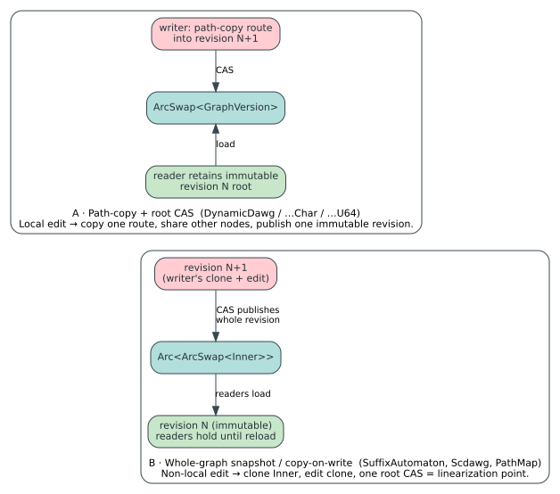

# Architecture of the in-memory dictionaries

This document explains how the volatile (RAM-resident, non-durable) dictionary backends are built:
the one-code-path-three-alphabets seam, the monomorphized cores that let each backend reuse a single
generic implementation, and the two lock-free concurrency strategies the mutable backends use. For a
task-oriented view see the [user guide](../user-guide/in-memory-dictionaries.md); for per-backend
detail see the [implementation guides](../algorithms/implementations/README.md). Notation follows
[`docs/notation.md`](../notation.md).

---

## 1. The alphabet seam: `CharUnit`

Every in-memory backend is generic over an **edge-label unit** `U: CharUnit`. The
[`CharUnit`](abstractions.md) trait ([`src/char_unit.rs`](../../src/char_unit.rs)) abstracts the
three alphabets behind a uniform interface — `from_str`, `to_string`, `iter_str`, `to_dat_offset` —
with implementations for:

- **`u8`** — one byte per edge (ASCII / Latin-1 / raw bytes).
- **`char`** — one Unicode scalar value per edge (correct character-level semantics).
- **`u64`** — one 64-bit token per edge (sequence / time-series labels).

A public backend such as `DynamicDawg` is then a thin monomorphization: `DynamicDawg` walks `u8`
edges, `DynamicDawgChar` walks `char` edges, and both are the *same code* specialized at compile
time. This is distinct from the persistent-side [`KeyEncoding`](abstractions.md) abstraction
(`ByteKey` / `CharKey` / `U64Key`), which models a durable *key* rather than an in-memory edge
label; the two are documented separately and are **not** synonyms.

## 2. Monomorphized cores

Rather than duplicate each algorithm per alphabet, each family implements it once over `(U, V)` in a
generic **core**, and the public byte/`char`/`u64` types are monomorphizations of that core. Every
core is generic over the unit `U: CharUnit` and the value `V: DictionaryValue` (default `()`):

| Family | Generic core | Public monomorphizations |
|--------|--------------|--------------------------|
| Double-array trie | `DATCoreShared<U, V>` — [`src/double_array_trie/core/shared.rs`](../../src/double_array_trie/core/shared.rs) | `DoubleArrayTrie`, `DoubleArrayTrieChar` |
| Dynamic DAWG | `DawgCore<U, V>` — [`src/dynamic_dawg/core.rs`](../../src/dynamic_dawg/core.rs) | `DynamicDawg`, `DynamicDawgChar` |
| Suffix automaton | `SuffixAutomatonInner<U, V>` — [`src/suffix_automaton/core/inner.rs`](../../src/suffix_automaton/core/inner.rs) | `SuffixAutomaton`, `SuffixAutomatonChar` |
| SCDAWG | `ScdawgCoreInner<U, V>` — [`src/scdawg/core/inner.rs`](../../src/scdawg/core/inner.rs) | `Scdawg`, `ScdawgChar` |
| PathMap | `TrieRefNode<V, R>` — [`src/pathmap/core.rs`](../../src/pathmap/core.rs) | `PathMapDictionary`, `…Char`, snapshot/ref variants |

`DynamicDawgU64` is the one deliberate exception: it does *not* reuse `DawgCore`, because a `u64`
alphabet invalidates the shared core's byte-expansion assumptions — see
[dynamic-dawg-u64.md](../algorithms/implementations/dynamic-dawg-u64.md#why-a-distinct-type-instead-of-dynamicdawg-over-u64).

Two structural notes that recur across the cores:

- **Arena, not pointers.** The DAWG, suffix-automaton, and SCDAWG cores store nodes in a flat
  `Vec<Node>` addressed by integer index, with edges holding `usize` child indices. There is **no**
  `Box`/`Arc` child chain and no manual `impl Drop`, so tearing down even a very deep structure is a
  non-recursive `Vec` drop — deep or long keys cannot overflow the stack. (This is also why the
  [security model](../security/untrusted-input.md) treats these backends as free of recursive-drop
  DoS.)
- **Adaptive child lookup.** Within a node, child edges are label-sorted and searched linearly below
  a small threshold (16 for the DAWG/suffix families) and by binary search at or above it — small
  nodes stay branch-predictable, large nodes stay logarithmic.

## 3. Two lock-free concurrency strategies

Every *mutable* in-memory backend gives readers a **wait-free** path (no lock, no spin) and writers
a **lock-free** path (CAS publication, no global mutation mutex). Publication rides
[`arc_swap`](https://docs.rs/arc-swap): a reader loads one immutable revision and a writer
`compare_and_swap`s a replacement root atomically.

### 3a. Path-copy plus root CAS — the DAWG family

`DynamicDawg`, `DynamicDawgChar`, and `DynamicDawgU64` share `LockFreeDawg`. Its
`GraphVersion` contains an immutable root and revision metadata behind one `ArcSwap`.
Published nodes contain plain immutable edge/finality/value fields
([`src/dynamic_dawg/lockfree.rs`](../../src/dynamic_dawg/lockfree.rs)).

A writer inserting, updating, or removing a term path-copies only the nodes **on that
route**, structurally shares every unchanged branch, then publishes the replacement
`GraphVersion` with one CAS (and `CasBackoff` retry). A reader retains its old root for
the full traversal, so a partially consumed iterator cannot mix revisions. Compaction
rebuilds a minimized root and uses the same publication point.

### 3b. Whole-graph copy-on-write — suffix automaton, SCDAWG, PathMap

The suffix automaton, SCDAWG, and PathMap families place the **entire structure** behind a single
`Arc<ArcSwap<Inner>>`: `LockFreeSuffixAutomaton` wraps `Arc<ArcSwap<SuffixAutomatonInner<U,V>>>`,
`LockFreeScdawg` wraps `Arc<ArcSwap<ScdawgCoreInner<U,V>>>`, and `PathMapDictionary` wraps
`Arc<ArcSwap<PathMapState<V>>>` (sources: `src/{suffix_automaton,scdawg,pathmap}/lockfree.rs` /
`core.rs`). A writer clones the inner structure, applies its edit to the clone, and CAS-publishes the
whole new revision. Readers hold a stable snapshot of the *previous* revision until they reload, so
they always see an internally consistent graph.

Why the whole-graph rebuild here rather than DAWG-style path copying? Because an edit to these structures is
**not** local: a suffix-automaton `extend` can clone-and-split a state and rewire suffix links across
the graph; an SCDAWG is built once; and PathMap is itself a persistent (structurally shared) trie
whose "clone" is an $`O(1)`$ shallow copy, so republishing the whole state is cheap. Snapshot
publication gives these families the simplest correct linearization point — the single CAS on the
root pointer.

### 3c. `BijectiveMap` composes two revisioned structures

[`BijectiveMap`](../algorithms/implementations/bijective.md) composes the two: its **forward**
direction is a `DynamicDawgChar<V>` (path-copy/root CAS), and its **reverse** direction is a
`HashMap<V, String>` behind `Arc<ArcSwap<…>>` (whole-map snapshot). A write mutates the forward DAWG
and CAS-publishes a new reverse map, with a rollback path that repairs the bijection invariant if a
concurrent writer wins the race.

### 3d. The immutable outlier: `DoubleArrayTrie`

`DoubleArrayTrie` / `…Char` have **no writer path** at all. After construction they are immutable:
the `BASE`, `CHECK`, `is_final`, `edges`, and `values` arrays are each an `Arc<Vec<…>>`, so a clone
is an $`O(1)`$ refcount bump and concurrent reads need no synchronization beyond the `Arc`. This is
why they report `sync_strategy() == Persistent` and are insert-only — mutation would mean rebuilding
the packed arrays.

## 4. Memory reclamation

Because readers hold `Arc` snapshots (a DAWG root revision or a whole inner structure), a node or
revision that a writer has replaced is freed automatically when the last reader `Arc` referencing it
drops. There is no manual epoch scheme in the volatile backends — `Arc` reference counting *is* the
reclamation mechanism, and it is safe precisely because the replaced data is immutable once
published. (The *persistent* ARTrie, by contrast, does use explicit epoch-based reclamation for its
raw-pointer overlay; see [`docs/persistence/`](../persistence/README.md).)

## 5. Where the unsafe is (there is almost none)

The volatile tree carries only **four** `unsafe` sites, all in `src/scdawg/{ascii,char}.rs`, and all
are `unsafe impl Send`/`Sync` thread-safety assertions for the SCDAWG node handle — not raw-pointer
or memory-layout unsafety. Every other volatile backend is entirely safe Rust over `Arc`/`ArcSwap`.
The concentration of `unsafe` (37 of 43 crate-wide sites) is in the persistent tree. See the
[security cluster](../security/unsafe-contracts.md) for the full boundary.

## Related

- [abstractions.md](abstractions.md) — `CharUnit` and `KeyEncoding` in depth.
- [design/volatile-concurrency.md](../design/volatile-concurrency.md) — the concurrency design
  rationale and the invariants the loom tests check.
- [implementation guides](../algorithms/implementations/README.md) — per-backend internals.
