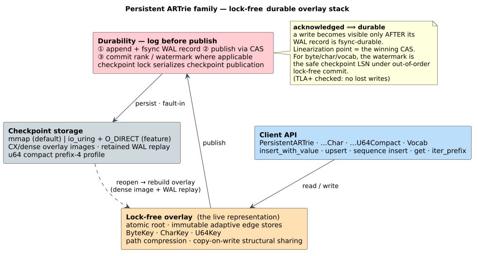

# Persistence Architecture

The `persistent-artrie` feature contains several disk-backed dictionaries. They
share one durability infrastructure but split into **two representation
families**: the **ARTrie family** (a lock-free copy-on-write *overlay* over the
trie, folded periodically into a dense checkpoint image) and the **suffix-graph
family** (immutable native substring graphs, rebuilt and republished per write).
Both log to a Write-Ahead Log (`WAL`) before a write is visible; they differ in
*what* they publish.

## Architecture At A Glance

The whole `persistent-artrie` family shares the same lock-free **durable overlay
stack** — a client API over an atomic-root overlay, gated by a log-before-publish
WAL, checkpointed into a dense image, and persisted by a pluggable block backend:



```text
Persistent ARTrie byte/char/u64/vocab
    Dictionary API
      -> immutable overlay nodes
      -> WAL-before-publish durability
      -> CX/dense checkpoint image

Persistent suffix automaton/tree/SCDAWG
    Dictionary + SubstringDictionary APIs
      -> immutable native graph snapshots
      -> prepared/commit operation-segment WAL
      -> CAS copy-on-write graph rebuild/publish
```

The implementation enforces this split with a **layering invariant** that is both
documented and grep-verified: the shared foundation (`core/` and `nodes/`) never
`use`s any variant, and the byte variant never `use`s char/vocab — so every
allowed `use` edge points *down* onto the foundation, and there is no upward edge
from `core` into a variant:


## ARTrie Family — overlay + checkpoint

The ARTrie family is the lock-free durable path. Each write appends a WAL record,
*then* publishes a new immutable overlay root; the successful compare-and-swap
(CAS) is the visibility point, which coincides with the linearization point.
Readers traverse the current published root and never take a global mutation
lock. Periodically a **checkpoint** folds the published overlay into a dense
CX image and advances the reclaimable WAL watermark (`checkpoint_lsn`); the
mechanics are detailed in
[the persistent storage architecture](../../persistence/mmap-architecture.md#checkpoint-flips).

Profiles:

- `PersistentARTrie<V>`: byte keys through `ByteKey` (`u8` units).
- `PersistentARTrieChar<V>`: Unicode scalar keys through `CharKey` (`u32` units).
- `PersistentARTrieU64Compact<V>`: native `u64` sequence keys through `U64Key`
  with the prefix-4 compact CX budget — the default for time-series/token data.
- `PersistentARTrieU64Prefix3Compat<V>`: prefix-3 u64 CX compatibility and
  benchmark baseline profile.
- `PersistentVocabARTrie`: specialized durable vocabulary with a forward
  `term → u64` overlay lookup and a reverse `u64 → term` map rebuilt on reopen.

The shared `AdaptiveEdgeStore` adapts to label width: byte keys use ART-style
dense `Node4/16/48/256` tiers for high fanout, while char and u64 keys retain
native labels and use inline, sorted, or sparse-indexed storage as fanout grows.

## Suffix Graph Family — native graph snapshots

The persistent suffix graph types provide durable substring APIs *without*
encoding suffixes as ARTrie keys — they persist native substring graphs instead
of a trie overlay:

- `PersistentSuffixAutomaton` / `PersistentSuffixAutomatonChar`
- `PersistentSuffixTree` / `PersistentSuffixTreeChar`
- `PersistentScdawg` / `PersistentScdawgChar`

Reads are snapshot-based and non-blocking with respect to graph mutation. A write
appends a *prepared* operation segment, rebuilds a candidate graph revision,
publishes it with pointer-identity CAS, and appends a *commit* segment before
acknowledging the caller; recovery ignores prepared records that lack a commit
marker and also accepts historical monolithic WAL files. Mapped
`update_or_insert` takes a retry-safe `Fn(&mut V)` updater so a CAS conflict can
recompute against the newest snapshot without taking a writer lock.

## Durability Model

The persistent APIs distinguish visibility from durability:

- ARTrie overlay writes log before publication, so acknowledged writes are not
  visible before they are durable.
- Checkpoints fold the published state into a dense image.
- Recovery loads the checkpoint and replays retained WAL records.
- Suffix graph checkpoints retain WAL records and skip operations at or below
  the checkpoint operation watermark; recovery ignores prepared records without
  commit markers. Under continuous writer churn, a suffix graph checkpoint may
  skip image publication and rely on retained WAL replay instead of blocking
  writers.

Do not describe the current u64 ARTrie as using the old native bincode
snapshot/WAL path. That implementation was removed from source; benchmark
controls for it should be taken from git history/worktrees.

## Operational Notes

- Use `target/bench-scratch` or another non-`/tmp` location for large
  persistence benchmarks; `/tmp` may be tmpfs.
- `group-commit` remains experimental and should be re-benchmarked before use.
- `io-uring-backend` is Linux-specific and requires an appropriate kernel.

## Related Docs

- [User backend guide](../../user-guide/backends.md)
- [Persistent storage architecture](../../persistence/mmap-architecture.md)
- [Persistent ARTrie design](../../theory/disk-tries/06-persistent-artrie-design.md)
- [Root README persistent section](../../../README.md#persistent-artrie--lock-free--durable)
