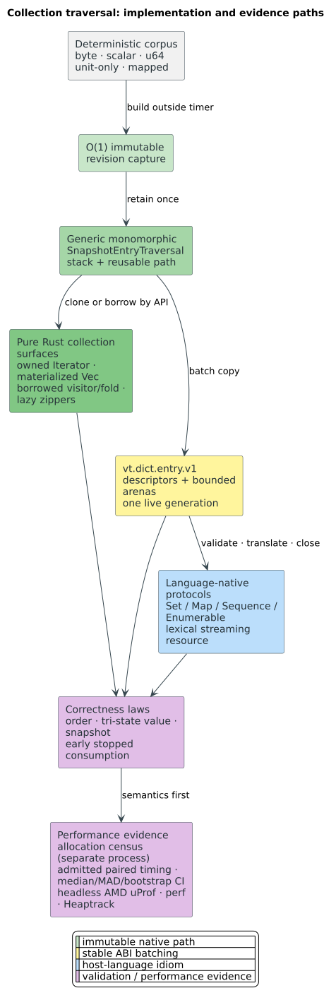

# Collection traversal and language-binding benchmark protocol

This protocol evaluates the collection engine shared by pure Rust dictionary
iteration and every foreign-language facade. It separates semantic validation,
allocation diagnosis, exploratory throughput, causal paired timing, and
profiling so instrumentation cannot masquerade as end-user performance.

An **entry** is a lossless key plus mapped state from one immutable dictionary
revision. A **materialized view** copies that revision into host-owned
collection objects. A **streaming view** retains the native revision and leases
one bounded batch at a time, so it requires deterministic lexical cleanup.



## Questions and hypotheses

The experiments answer four distinct questions:

1. What is the cost of ergonomic owned entries relative to an
   allocation-reusing visitor?
2. What boundary overhead remains after entries are transferred as bounded
   descriptor and arena batches rather than one foreign call per edge/key?
3. Does early termination release the snapshot in bounded work?
4. How much additional allocation and conversion is introduced by each
   language-native collection protocol?

The primary mechanisms are explicit. Owned iteration allocates the key that
escapes each `next` call. The visitor reuses one path arena. The ABI copies a
batch into contiguous unit/value arenas, amortizing validation and host calls.
An ordinary host `Set`, `Map`, `Sequence`, or `Enumerable` view intentionally
pays output-sized host allocation; its separate streaming form does not.

## Semantic gate

Timing is inadmissible until the common conformance fixtures prove:

- lexicographic unit order for bytes, Unicode scalars, and full-range `u64`
  tokens;
- exact distinction between absent keys, terminal keys without values, and
  terminal keys with `u64` values, including zero and `u64::MAX`;
- one revision per iterator despite insert, remove, value update, clear,
  compaction, checkpoint, or producer close;
- exact cursor-generation release, sticky idempotent cancellation, and bounded
  cleanup after early exit;
- fused exhaustion and truthful size metadata; and
- identical entry count and checksum for every compared arm.

The Rust law suites use `BTreeSet`/`BTreeMap` reference models. Each foreign
facade repeats the same fixture through its actual package API and additionally
tests its host protocols—for example Java `Set`/`Map` and try-with-resources,
C# `IReadOnlySet`/`IReadOnlyDictionary` and `using`, Python collection ABCs and
context managers, Go `iter.Seq`, Swift `Collection`, and Ruby `Enumerable`.

## Workload cells

The standalone driver uses deterministic keys of the form
`collection/PPPP/IIIIIIII/shared-suffix`, where `IIIIIIII` is a unique
hexadecimal index and `PPPP` creates controlled prefix sharing. Construction is
complete before timing. The committed cells use 4,096 entries for latency and
65,536 entries for steady traversal.

| Arm | Work included | Intended inference |
|---|---|---|
| `direct-owned` | Snapshot capture, graph walk, one owned key per entry, checksum | Idiomatic pure Rust iterator cost |
| `direct-visitor` | Snapshot capture, graph walk, reused path, checksum | Allocation-reusing native lower bound |
| `direct-materialized` | Owned iteration plus complete `Vec` retention | Cost paid by ordinary host-owned views |
| `abi-64`, `abi-256`, `abi-1024` | Interface discovery, cursor open, descriptor/arena batches, release, close | Foreign-boundary amortization curve |
| `direct-cancel-64` | First 64 owned entries then iterator drop | Native early-stop cost |
| `abi-cancel-64` | One 64-entry batch, release, cancel, close | Streaming early-stop cost |

For `$`N`$` entries and batch capacity `$`B`$`, a full ABI traversal performs
the following number of boundary operations:

```math
C_{\mathrm{full}}(N,B)=4+2\left\lceil\frac{N}{B}\right\rceil
```

The four fixed calls are interface discovery, open, the terminal `next`, and
close. Each non-empty batch adds one `next` and one exact-generation release.
The early-cancel cell consumes one batch and performs six calls: discovery,
open, `next`, release, cancel, and close.

## Exploratory Criterion matrix

Criterion rapidly detects shape changes across all arms and both sizes:

```bash
cargo bench --features bindings-core --bench collection_traversal_benchmarks
```

It reports full-traversal throughput against `$`N`$` entries and early-stop
throughput against the 64 entries actually consumed. Criterion results are
exploratory because its arms are not alternating topology-admitted pairs; they
locate useful batch regimes but do not supply the campaign's headline ratio.

The post-native-stream 2026-08-20 curve reported center estimates of
3.164/3.098/3.116 milliseconds for 4,096 entries and
57.206/58.025/57.438 milliseconds for 65,536 entries at batch capacities
64/256/1,024 respectively. The intervals overlap, so there is no evidence for
a monotone throughput benefit from ever-larger batches in this cell. The
default of 256 is a balanced memory/call-amortization policy, and the bounded
override remains public for hosts with different key sizes or allocation
constraints.

## Allocation census

Allocator instrumentation is isolated from timing:

```bash
cargo run --release --example collection_allocation_profile
```

The standalone process reports allocations, deallocations, allocated bytes,
and peak live bytes for owned iteration, the reusable visitor, and complete
materialization. Its assertions require the visitor to allocate fewer objects
and bytes than owned iteration and require complete materialization to retain
at least the owned iterator's peak. Atomic accounting perturbs execution, so
these rows explain memory behavior and are never used as latency samples.

## Admitted paired experiment

Build the single-arm driver once, then compare two arms from the same digest:

```bash
cargo build --release --features bindings-core --example collection_traversal_profile

../liblevenshtein-rust/benchmarks/causal/run-collection-traversal-experiment.sh \
  target/release/examples/collection_traversal_profile \
  EVIDENCE.csv direct-owned direct-visitor 65536 51 8 3

../liblevenshtein-rust/benchmarks/causal/analyze-collection-traversal.py \
  EVIDENCE.csv EVIDENCE-host-load.jsonl --output ANALYSIS.json
```

The runner pins one CPU, samples the selected CPU, its simultaneous-thread
sibling, and its complete last-level-cache group before and after every pair,
and alternates arm order. Warmups are excluded. The analyzer rejects incomplete
pairs, a changed binary digest/workload, checksum disagreement, or any rejected
host admission. It reports median, median absolute deviation (MAD), a
deterministic 95% bootstrap interval for each median, paired differences,
paired speedups, and the geometric mean ratio.

When a later gate rejects a busy cache complex, invoke the runner again with
the same arguments plus `--resume`. Strict resume revalidates the executable
digest and every committed pair, archives rejected or interrupted trailing
admission records separately, atomically reconstructs the accepted ledger, and
continues at the first uncommitted pair. A half pair is never retained, and an
executable or workload change requires a new output path.

The per-entry latency is `$`t_i/(P E)`$`, where `$`t_i`$` is elapsed
nanoseconds, `$`P`$` is the number of passes, and `$`E`$` is the number of
entries actually consumed per pass. A paired speedup above one means the
treatment is faster:

```math
s_i=\frac{t_{i,\mathrm{control}}}{t_{i,\mathrm{treatment}}}
```

## Headless causal profiles

Profiles explain an accepted timing difference; they do not replace it. Use
only the family headless wrapper:

```bash
../liblevenshtein-rust/benchmarks/causal/profile-headless.sh uprof OUTPUT \
  -- target/release/examples/collection_traversal_profile \
  --arm abi-256 --entries 65536 --passes 64

../liblevenshtein-rust/benchmarks/causal/profile-headless.sh heaptrack OUTPUT \
  -- target/release/examples/collection_traversal_profile \
  --arm direct-materialized --entries 65536 --passes 8
```

AMD uProf is invoked through `AMDuProfCLI`; Heaptrack records with
`--record-only` and is summarized by `heaptrack_print`. Neither workflow opens
a graphical window. Interpret frames in five categories: snapshot capture,
graph/transition traversal, key materialization, descriptor/arena copying, and
host allocation/conversion.

## Confirmed native-to-ABI mechanism

The 2026-08-20 admitted cohort found a 6.47× full-scan gap between the owned
Rust iterator and a 256-entry ABI cursor. The compared arms came from one
binary, consumed the same 65,536 entries eight times, had identical checksums,
and passed the selected-CPU and complete-cache-complex gates before and after
all 51 alternating pairs. The slowdown therefore could not be assigned to
host-language object allocation, a garbage collector, or different dictionary
semantics.

Headless AMD uProf attributed 76.11% of the ABI arm's sampled CPU time to
`TraversalSnapshot::copy_node`. The sequential entry cursor was using the
random-access ABI graph arena: every internal depth-first step translated a
node identifier through that arena even though no untrusted consumer node
identifier enters the entry-stream state machine.

The correction is capability-specific rather than backend-specific. Exact
dynamic and persistent snapshots install a generic entry factory backed by
`ExactSnapshotEntryIterator`. That iterator retains one immutable root and
selects the best compact graph, backend-native cursor, or owned-node fallback.
The graph interface still uses its validated arena, suffix/substring families
still enumerate their source records, and every unit domain shares the same
entry-stream adapter.

After the change, the admitted ABI median fell from 5,222.955 to 815.493
nanoseconds per entry, an 84.39% reduction. Direct Rust measured 794.779
nanoseconds per entry in the post-change cohort, leaving a 2.61% ABI premium by
the ratio of medians despite 4,128 lifecycle calls per invocation. Cancellation
after 64 entries fell from 904.314 to 576.112 nanoseconds per consumed entry;
its remaining 19.60% premium is the fixed six-call open/lease/release/cancel
lifecycle divided by very little useful work. A post-change uProf capture no
longer contains `copy_node`: native traversal and exact-iterator advancement
are dominant, while batch filling accounts for 6.09%.

The raw paired samples, host-admission ledgers, deterministic bootstrap
analyses, before/after Wolfram SVG, exact binary digests, and headless profile
reports are in the
[2026-08-20 causal evidence bundle](https://github.com/vinary-tree/liblevenshtein-rust/tree/master/benchmarks/causal/evidence/2026-08-20).
The earlier cohort is intentionally retained: it is the causal baseline that
links the profile mechanism to the measured improvement rather than an
obsolete result to erase.

## Foreign-facade measurements

Each language benchmark must construct the ordinary view and drain the
closeable stream through public package symbols; runtimes with a synchronous
fold/reducer also exercise that allocation-reusing path. It records wall time,
processed entries, checksum, batch size, native boundary calls where visible,
and runtime allocation/GC counters. The native driver is the control for the
same corpus and revision; startup, JIT warmup, module loading, and dictionary
construction occur outside the timed region.

Every package entrypoint emits one
`libdictenstein.host-collection-traversal.v1` JSON object. Its authoritative
[JSON Schema](https://github.com/vinary-tree/liblevenshtein-rust/blob/master/benchmarks/causal/schemas/host-collection-traversal-sample.schema.json)
keeps runtime, arm (`materialized`, `stream`, `stream-cancel`, or `reduce`),
cardinality, warmup, batch, cancellation, elapsed-time, and
checksum fields comparable without pretending that runtime-specific GC or
allocator counters are interchangeable. `batch_size` is null when a facade's
ordinary materializer does not expose its internal batch policy; a numeric
value means the public package API controlled it.

Do not compare languages by a single mixed-runtime wall clock. Report each
facade's overhead relative to the matching ABI arm and explain the residual in
profiles. Runtime-specific results are accepted only after their collection
conformance suite, deterministic-cleanup test, and package-level example pass.

## Threats and interpretation

- The synthetic corpus controls prefix sharing but does not replace the aspell,
  Unicode, packed-token, prefix-heavy, and suffix-heavy campaign corpora.
- Results on one batch size do not generalize across key lengths or runtimes;
  the 64/256/1,024 curve identifies the applicable regime.
- Materialization is an intentional semantic product, not an implementation
  defect. Compare it with streaming only when the application can accept a
  closeable iterator.
- A visitor is a lower-level Rust optimization surface. Foreign callbacks may
  reintroduce boundary calls, so managed facades should normally drain native
  batches instead.
- Host load outside the selected cache complex is recorded. Any thermal,
  frequency, memory-bandwidth, profiler, compiler, or integration-test overlap
  that violates admission invalidates the pair.

The general experimental rules, statistical rationale, and citations are in
liblevenshtein's
[optimization and profiling methodology](https://github.com/vinary-tree/liblevenshtein-rust/blob/master/docs/benchmarks/optimization-and-profiling-methodology.md).
