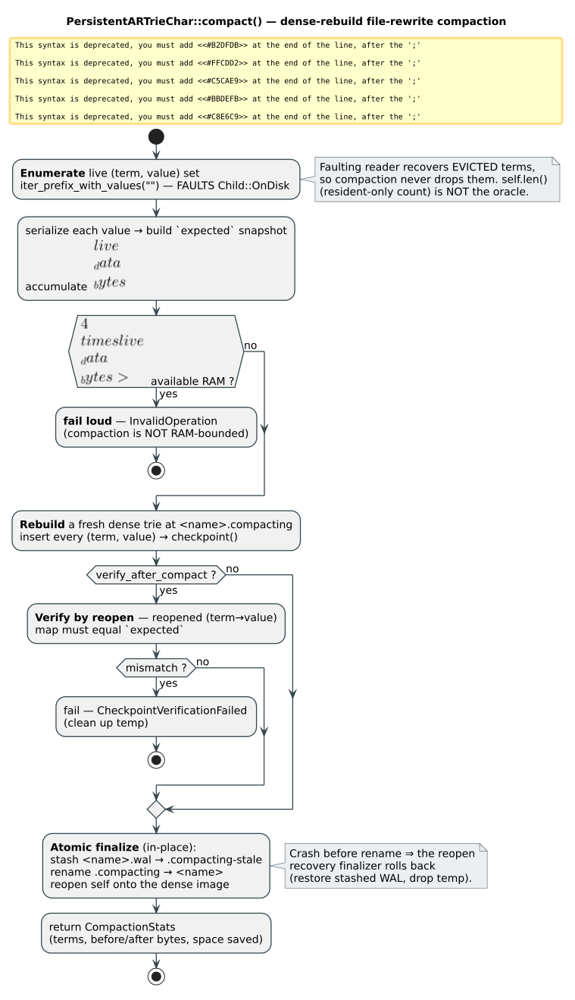

# Checkpoint growth & sequential-sibling fixes

*Two independent persistence defects surfaced by a workload that enables resident-budget eviction
and checkpoints **incrementally while inserting** — the pattern `pgmcp` uses to bound a large
fuzzy-index rebuild's RAM. This document reconstructs both defects, the fixes, the invariants the
fixes rest on, and the reclamation feature (`compact()`) they motivated.*

---

## Contents

1. [Context — the triggering workload](#context)
2. [§1 Sequential-sibling arena-convention off-by-one (the reported crash)](#s1)
3. [§2 Dirty-skip serialization (bounded checkpoint growth)](#s2)
4. [§3 Char `compact()` — dense-rebuild file-rewrite compaction](#s3)
5. [§4 Cross-checkpoint pointer stability (append-only invariant)](#s4)
6. [§5 What was deliberately NOT built (streaming compaction)](#s5)
7. [Verification](#verification)

---

<a name="context"></a>
## 1. Context — the triggering workload

A `PersistentARTrieChar<V>` with eviction enabled

```rust
trie.enable_eviction(EvictionConfig {
    resident_budget_bytes: Some(64 * 1024),
    enable_memory_pressure_monitor: false,
    ..EvictionConfig::default()
})?;
```

and `checkpoint()` called **repeatedly during a bulk load** (not once at the end) exercises two paths
that a single terminal checkpoint never does:

- a checkpoint's eviction tail moves cold subtrees to disk (`Child::OnDisk`) *mid-build*, so a later
  checkpoint re-serializes a parent whose children now live in an **earlier arena**; and
- every checkpoint re-serializes the resident overlay, so **dead space** accumulates across
  checkpoints.

The first path produced a hard error — `char v2 sequential child mismatch` — on a freshly-created
trie (§1). The second is a space/write-amplification problem that made the on-disk file grow without
bound (§2). Both are fixed; §3 adds the reclamation operation the second motivated; §4 records the
audited-safe invariant both rely on.

**Notation.** A trie has $`N`$ terms; incremental checkpointing performs $`C`$ checkpoints; the resident
(in-memory) overlay is bounded to $`B`$ bytes by `resident_budget_bytes`. Arena slots are addressed by
$`(\text{arena\_id}, \text{slot\_id})`$; the on-disk pointer stores a **block id** with

```math
\text{block\_id} = \text{arena\_id} + 1, \qquad \text{arena\_id} = \text{block\_id} - 1
```

because block $`0`$ is the file header (`core/swizzled_ptr.rs:451,466`).

---

<a name="s1"></a>
## 2. §1 — Sequential-sibling arena-convention off-by-one

### 2.1 The optimization

When a node's children occupy **contiguous** slots in **one** arena, the char v2 serializer encodes
them as a single `(first_child_slot, count)` reference instead of $`n`$ explicit child pointers
(the `FLAG_SEQUENTIAL_SIBLINGS` encoding, `char/serialization_char.rs:194`). The decoder reconstructs

```math
\text{child}_i = (\text{first\_child.arena\_id},\; \text{first\_child.slot\_id} + i), \quad 0 \le i < \text{count}
```

(`char/relative_encoding.rs:661`) and pairs $`\text{child}_i`$ with the $`i`$-th key **in key order**.

### 2.2 The defect

The *producer* of the encoding, `check_sequential_char_children` (`char/persist.rs:772`), read each
child's arena id straight from the on-disk `block_id` — **without** the canonical $`-1`$ — while the
*reader/validator* (`collect_char_child_slots` → `ptr_to_arena_slot`, `serialization_char.rs:1063`)
uses $`\text{arena\_id} = \text{block\_id} - 1`$. The two disagree by exactly one arena:

<p align="center">

</p>

Two consequences follow, and they explain why the bug hid for so long:

- **Common case (children in the parent's arena $`P`$):** the child's $`\text{block\_id} = P+1`$, which the
  buggy check compared against the parent's *canonical* arena $`P`$; since $`P+1 \ne P`$, it returned
  `None` and **silently declined** the optimization. So sequential encoding was effectively never used
  for correctly-same-arena siblings — no crash, just a missed optimization.
- **Boundary case (children one arena behind the parent):** when a parent is re-serialized into arena
  $`P+1`$ while its children remain in arena $`P`$ (exactly the layout eviction + incremental checkpointing
  produces), the child's $`\text{block\_id} = P+1`$ *equals* the parent's canonical arena $`P+1`$, so the
  check spuriously fired, emitting a `first_child` whose arena is one too high. The serializer's own
  `validate_v2_serialization_context` (`serialization_char.rs:1163`) then walks the freshly-collected
  (canonical) child slots, finds `child_slot.arena_id ≠ first_child.arena_id`, and raises the error —
  turning would-be silent corruption into a loud, fail-safe abort.

### 2.3 The fix

`check_sequential_char_children` now derives the canonical arena id and verifies consecutiveness **in
key order** (the order the decoder pairs), declining the optimization on any gap or cross-arena child
rather than sorting slots (which could mask a key-order $`\ne`$ slot-order mismatch):

```rust
let arena_id = loc.block_id.checked_sub(1)?;      // canonical (was: loc.block_id)
if arena_id != parent_arena_id { return None; }   // same arena as parent
...
// consecutive ascending IN KEY ORDER (do NOT sort by slot_id):
if slot.slot_id != first.slot_id.checked_add(i as u32)? { return None; }
```

The identical fix is applied to vocab's copy (`vocab/overlay_serialize.rs:632`, which reaches the
production `n_snapshot_compressed` path and reuses char's validator). Byte
(`disk_resolve.rs:139`) never had the arena bug — it uses `as_arena_slot()` (canonical) on both
sides — but it *did* share the key-order assumption and, unlike char, had **no** per-index contiguity
re-check, so a mis-selection would corrupt **silently**. Byte therefore gains the key-order-aware
check **and** char's per-index validator (`serialization.rs:773`) as defense-in-depth.

Because a cross-arena parent→child layout now correctly falls back to the relative/full encoding
(which handles cross-arena children via `FLAG_CROSS_ARENA`, `relative_encoding.rs:267`), this fix is a
**hard prerequisite** for §2 (dirty-skip makes cross-arena parent→child the *common* case).

---

<a name="s2"></a>
## 3. §2 — Dirty-skip serialization (bounded checkpoint growth)

### 3.1 The growth

The shared checkpoint serializer (`core/overlay/compressed_serialize.rs:174`) re-serialized **every**
resident node to a **fresh** appended arena slot on every checkpoint; the arena is a strictly
append-only bump allocator (`char/arena.rs:856`) that never reclaims a superseded slot, and the
retaining WAL never rotates. Per-checkpoint appends were therefore $`O(\text{resident set})`$, so the
on-disk file grew as

```math
\text{file size} \;\approx\; O\!\left(C \times B\right)
```

— unbounded in the number of checkpoints, even though the *live* data is $`O(N)`$ and the *resident* set
is bounded to $`B`$. For `pgmcp`'s incremental build this meant RAM stayed bounded but disk did not.

### 3.2 The fix — reuse the durable-clean node's slot

A node's `serial_disk_ptr` **stamp** records where its exact bytes were last serialized. The already
formally-verified **M-2a invariant** (`OverlayEvictionStale.tla`; every write path-copies its
ancestors, and every path-copy ctor clears the stamp — `core/overlay/node.rs`) gives:

> **Stamp lemma.** If `node.durable_stamp() ≠ 0`, then neither `node` nor any descendant has been
> modified since that stamp was written; hence the on-disk image at the stamped pointer is
> byte-identical to serializing `node` now, *including its child pointers* — because `node`'s children,
> being unmodified, are themselves reused with those same pointers.

So the serialize loop can **reuse** a clean node's slot instead of appending a fresh one:

<p align="center">

</p>

The reuse path is `register_reused` (a new seam on the `OverlayCompressedSerialize` trait, implemented
for char at `char/persist.rs` and byte at `overlay_checkpoint.rs`). It is gated on
`registry.is_some() && durable_stamp() ≠ 0`, so it is **inert** for eviction-off, `u64`, and vocab
(which never stamp) — a pure improvement with no behavior change there, and **zero new `unsafe`**.

### 3.3 Why the census stays faithful (the load-bearing subtlety)

`resident_budget_bytes` is enforced from the eviction registry census
$`\;\text{resident} = \sum_{\text{registered nodes}} \text{size\_bytes}\;`$ (`disk_registry.rs:442`). If
dirty-skip dropped clean nodes from that census, the estimate would under-count, eviction would
under-fire, and RAM would grow unbounded — defeating the purpose. So the reuse path keeps **full
registration**: it records the reused node with its **exact** on-disk size (an $`O(1)`$
`slot_data_range` lookup), identical to what a fresh serialize would have recorded. Only the
growth-causing `allocate` is elided. The census is therefore **bit-identical** to the pre-dirty-skip
behavior; the `dirty_skip_keeps_resident_bytes_within_budget_across_interleaved_checkpoints` test is the
arbiter.

### 3.4 Effect

Per-checkpoint growth drops to $`O(\text{dirty nodes})`$: the newly-inserted nodes plus the
eviction-churned spine. Idempotent re-checkpoints of an unchanged trie append **nothing** (every node
is clean → reused), which the `dirty_skip_bounds_growth_across_idempotent_checkpoints` test verifies as
a plateau — file size becomes *independent of checkpoint count*.

---

<a name="s3"></a>
## 4. §3 — Char `compact()` (dense-rebuild file-rewrite compaction)

Dirty-skip bounds *new* growth but does not reclaim *existing* dead space (the superseded slots from
repeatedly-re-dirtied upper nodes, and — for overwrite-heavy workloads — every superseded value
version). `PersistentARTrieChar::compact()` (`char/compaction_char.rs`) reclaims it by rebuilding a
dense image of the live term set and atomically swapping it in — the char twin of byte's
`compaction_impl`, sharing the path/recovery helpers (`compaction_paths.rs`).

<p align="center">
.compacting by inserting every term and checkpointing; verify by reopening and comparing the term→value map to expected; atomically finalize in place by stashing the original WAL to .compacting-stale, renaming .compacting over the original, and reopening self — a crash before the rename is rolled back by the reopen recovery finalizer; return CompactionStats." width="820">
</p>

Two properties are worth calling out:

- **Correct on evicted tries.** Enumeration uses the Phase-A *faulting* overlay reader, so evicted
  (`Child::OnDisk`) subtrees are recovered — no terms are lost. `self.len()` / `overlay_len` counts only
  *resident* finals and therefore **cannot** be used as a completeness oracle for an evicted trie; the
  faulting enumeration (proven complete by the Phase-A work and the `compact_evicted_trie_...` test) is
  the source of truth, and a value-faithful verify-by-reopen confirms the rebuilt image before the swap.
- **NOT RAM-bounded.** Compaction materializes the full live set in memory (enumeration + rebuilt trie
  + verify snapshots), so peak memory is a small multiple of the live-data size — it is **not** bounded
  by `resident_budget_bytes`. A post-enumeration guard fails loud (rather than OOM) when
  $`\;4 \times \text{live\_data\_bytes} > \text{available RAM}\;`$. Consequently `compact()` is an
  **explicit, caller-invoked** maintenance operation (never auto-triggered inside `checkpoint()`), and
  a trie whose *live* set exceeds RAM cannot be compacted via this path (see §5).

---

<a name="s4"></a>
## 5. §4 — Cross-checkpoint pointer stability (append-only invariant)

Both dirty-skip (§2) and the checkpoint's ordinary `Child::OnDisk` passthrough embed, in checkpoint
$`N{+}1`$'s image, pointers into arenas written by checkpoint $`N`$. This is safe **iff** those arenas are
never reused or overwritten while still referenced. An audit confirmed three independent guarantees:

1. the arena is a strictly append-only bump allocator with no free list (`char/arena.rs:856`);
2. the disk block layer's `free_list_head` is never populated on the char path, so `allocate_block`
   only ever bump-extends the file — block ids are never reused; and
3. `arena_count` is monotonic, so arena $`N`$'s blocks are always a subset of the range checkpoint
   $`N{+}1`$ publishes.

`core/version_gc.rs` is a purely logical reader-refcount registry with **zero** production callers and
touches no arena; its WAL record is ignored on replay. Reopen eager-loads the full image
(`char/f5_loader.rs:97`), so every evicted term is recovered. **Conclusion: the passthrough is safe;**
the accumulated superseded slots are pure space overhead (which §3 reclaims), not a correctness
hazard. This is covered end-to-end by the multi-checkpoint + eviction + reopen tests
(`overlay_eviction_driver_correspondence.rs` OE1/OE3/OE6, `phase7_...`, and the new
`interleaved_checkpoint_...` / `compact_evicted_trie_...` tests).

---

<a name="s5"></a>
## 6. §5 — Deliberately NOT built: streaming (RAM-bounded) compaction

A *streaming disk-to-disk* compactor that reclaims a trie **larger than RAM** in bounded memory was
considered and **not** built, on the evidence that it is unnecessary for the motivating workload:

- Dirty-skip keeps an **insert-workload** file essentially dense — the `compact_reclaims_dead_space`
  test needs deliberate *overwrites* to manufacture reclaimable dead space, whereas a pure bulk-insert
  build (pgmcp's case) leaves almost nothing to reclaim.
- §3's `compact()` already covers reclamation for any trie whose live set fits in RAM.

The residual case — reclaiming an **overwrite-heavy** trie whose *live* set exceeds RAM — is outside
the motivating workload. If it later becomes real, the building block exists
(`char/disk_io.rs:140 enumerate_char_terms_from_disk` walks the on-disk image node-by-node without
building the overlay), so a bounded-memory mark-compact can be added without disturbing the above.

---

<a name="verification"></a>
## 7. Verification

| Concern | Evidence |
|---------|----------|
| §1 decision fix (deterministic) | `persist::sequential_sibling_decision_tests` — 7 example + 1 property; the same-arena case returns `None` pre-fix (asserting `Some`) |
| §1 end-to-end (the pgmcp repro) | `interleaved_checkpoint_with_resident_budget_eviction_preserves_all_terms` (char + byte) + property twins |
| §2 growth bound | `dirty_skip_bounds_growth_across_idempotent_checkpoints` (plateau), `dirty_skip_growth_independent_of_checkpoint_count` (property), byte twin |
| §2 census faithfulness | `dirty_skip_keeps_resident_bytes_within_budget_across_interleaved_checkpoints` |
| §3 reclamation + evicted correctness | `compact_reclaims_dead_space`, `compact_evicted_trie_preserves_all_terms`, `compact_to_output_path_...`, `compact_crash_before_rename_recovers_on_reopen`, `compact_preserves_term_value_map` (property) |
| §4 pointer stability | OE1/OE3/OE6 + `phase7_*` + the new multi-checkpoint reopen tests |
| Regression / gates | full lib suite green, byte compaction+recovery integration green, `clippy` error-free, `cargo fmt` clean, unsafe-boundary inventory unchanged (**zero new `unsafe`**) |

All four code sites of §1 (`char/persist.rs`, `disk_resolve.rs`, `serialization.rs`,
`vocab/overlay_serialize.rs`), the dirty-skip loop (§2, `compressed_serialize.rs` + char/byte
`register_reused`), and `compact()` (§3) are safe Rust; the fixes add no `unsafe`, so the
formal-correspondence and unsafe-inventory gates pass unchanged.
