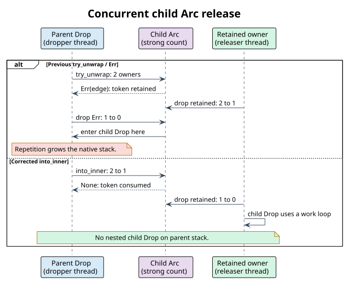

# Stack-safe dynamic-DAWG reclamation

The byte, Unicode-scalar, and u64 dynamic DAWGs share the
`LockFreeDawg<U, V>` node and destructor kernel. Each immutable node owns an
ordered vector of outgoing edges; each edge owns a distinct `Arc` strong token,
even when two edges target the same shared node. A published `GraphVersion`
owns a root token. A captured reader root owns another token and continues to
retain its old revision after a writer publishes a replacement.

This page describes reclamation of those library-owned graph tokens. It does
not specify how long an application retains a reader, nor does it place a key,
depth, fanout, or traversal-work limit on the library. The source is
[`LockFreeDawgNode::drop`](../../src/dynamic_dawg/lockfree.rs), and its
machine-checkable contract is
[`LockFreeDawgDropRace.tla`](../../formal-verification/tla+/LockFreeDawgDropRace.tla)
with the unbounded inductive laws in
[`LockFreeDawgDropSpec.v`](../../formal-verification/rocq/Spec/LockFreeDawgDropSpec.v).

## Why a shared edge needs a special release operation

`Arc::try_unwrap(edge)` returns `Err(edge)` when another strong owner exists.
The returned `Arc` still owns a token. If another thread releases the other
owner before that `Err` is dropped, dropping the `Err` can become the final
release and synchronously call the child's destructor under the parent's
destructor frame. Repeating the schedule down a long path defeats an otherwise
iterative worklist. The exact interleaving is shown here:



The [Rust `Arc` documentation](https://doc.rust-lang.org/std/sync/struct.Arc.html#method.into_inner)
explicitly contrasts this pattern with `Arc::into_inner` and gives a
concurrent, long-list destructor example. Its implementation consumes the
strong token during the operation: the `None` branch does not return an owning
`Arc` to be dropped later on the caller's native stack. If the edge was the
last owner, `Some(node)` transfers the payload to the worklist. If another
owner remains, `None` leaves that owner responsible for any eventual final
release. Competing ordinary `Arc` drops may cause the payload to be destroyed
on another thread; they cannot make the already-consumed edge token later
enter the child's destructor on the parent's stack.

The kernel performs the same operation for inline and spilled edge vectors and
for all three public alphabets. Its algorithm, omitting instrumentation, is:

```text
Drop(parent):
    pending := empty heap-backed vector of extracted nodes
    for each edge in take(parent.edges):
        if Arc::into_inner(edge.child) returns Some(child):
            pending.push(child)
    while pending is not empty:
        node := pending.pop()
        for each edge in take(node.edges):
            if Arc::into_inner(edge.child) returns Some(child):
                pending.push(child)
        release node after its edges have been detached
```

The last line can enter the now-edge-empty node's destructor once beneath the
active root destructor; it cannot recurse through the detached edges. Define
`N` as the number of simultaneously active library-owned
`LockFreeDawgNode::drop` frames on one thread. Under the source-correspondence
assumptions below, the formal bound is $`N \le 2`$ independently of graph
depth. The pending vector uses heap storage; its peak size depends on the
reclamation frontier and is not a fixed application policy budget.

## Formal scope and source correspondence

The TLA+ model treats each edge slot, current root, retained root, and public
handle as a separate token. It checks finite chain and shared-DAG instances,
including a concurrent last-owner release. The safe-policy configurations
check retention, edge and payload lifecycle, at-most-once destruction,
enabledness, and the two-frame bound. The `TryUnwrap` configuration is a
negative control: it must fail only the named recursive-drop bound.

TLC's finite instances are not a proof for arbitrary key depth. The Rocq
module instead proves rank decrease for an admitted finite acyclic graph,
token counting with shared targets, preservation of the native-frame bound for
arbitrarily long safe traces, strict descent of a ghost progress potential,
and no premature or double payload destruction for arbitrarily long modeled
lifecycle traces. The proof assumes that each concrete edge operation follows
the modeled `into_inner` transition and that all library-created edges remain
acyclic. The runtime tests and source audit check those correspondence seams;
the proofs alone do not verify the Rust compiler or implementation.

Progress is conditional: a retained application handle may keep a node alive
indefinitely. The liveness check assumes fair execution and eventual release
of those holders. The native-frame claim excludes arbitrary reentrancy from a
user-defined mapped value's `Drop`; it covers the library's own child-edge
reclamation. An allocation failure is not converted to a library resource
limit or an apparent successful reclamation.

The exhaustive theorem/predicate inventory, explicit assumptions, source
seams, and witness mapping are in
[`byte-dawg-drop-qualification-ledger.tsv`](../../formal-verification/rocq/byte-dawg-drop-qualification-ledger.tsv)
and
[`byte-dawg-drop-runtime-witnesses.tsv`](../../formal-verification/rocq/byte-dawg-drop-runtime-witnesses.tsv).
Run `scripts/verify-rsdict-byte-dawg-drop-formal.sh` under its memory cap to
check the models and `scripts/verify-rsdict-byte-dawg-drop-ledger.sh` to reject
missing, invented, or stale inventory rows. The actual-library test
`shared_edge_race_does_not_nest_child_drop_on_parent_stack` uses a channel
handshake to force the formerly failing schedule; its pre-fix log records two
nested frames, and the corrected source passes with one. Generated DAG tests
check exact-once destruction and retained-owner behavior; separate
100,000-depth tests exercise deep sequential reclamation. Passing tests are
implementation evidence, not a substitute for the abstract proofs or a
claim about arbitrary user callbacks.
