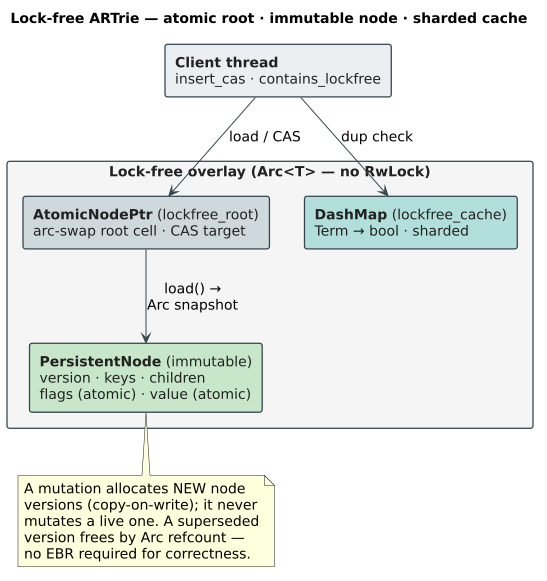
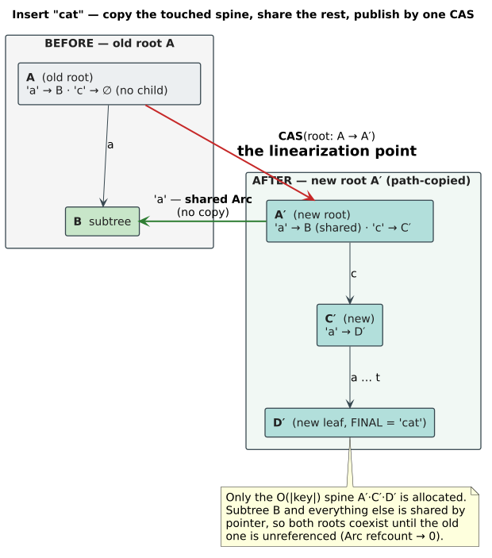
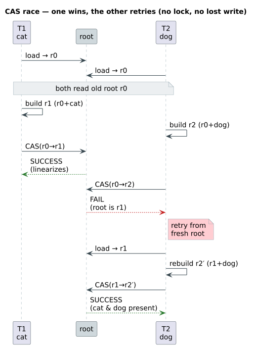
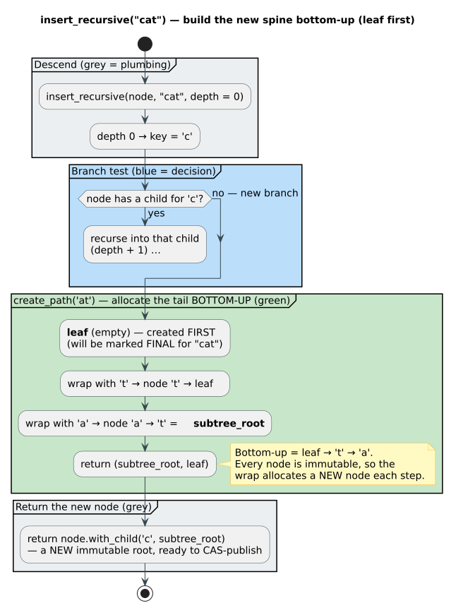
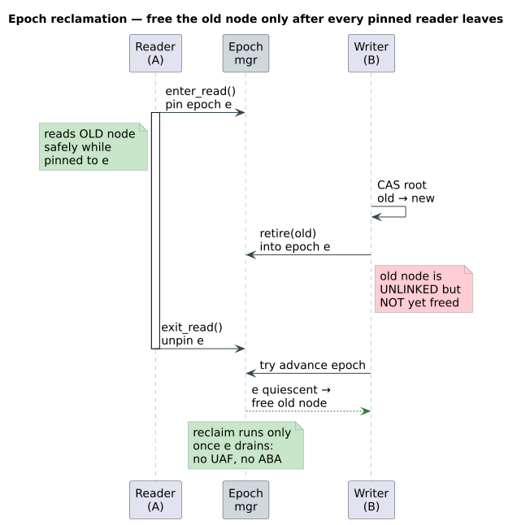
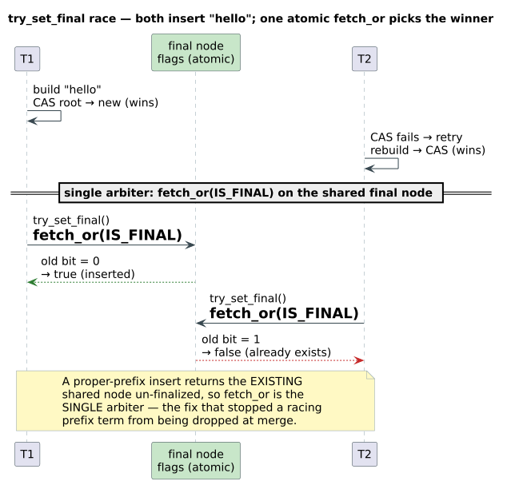
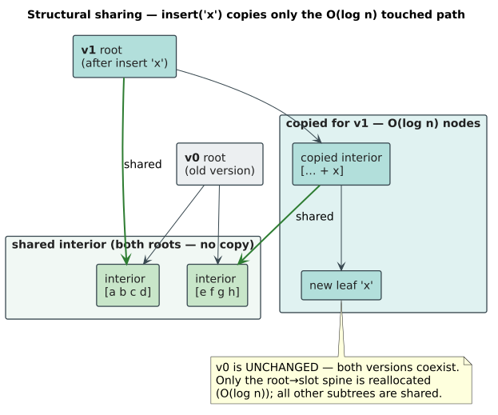
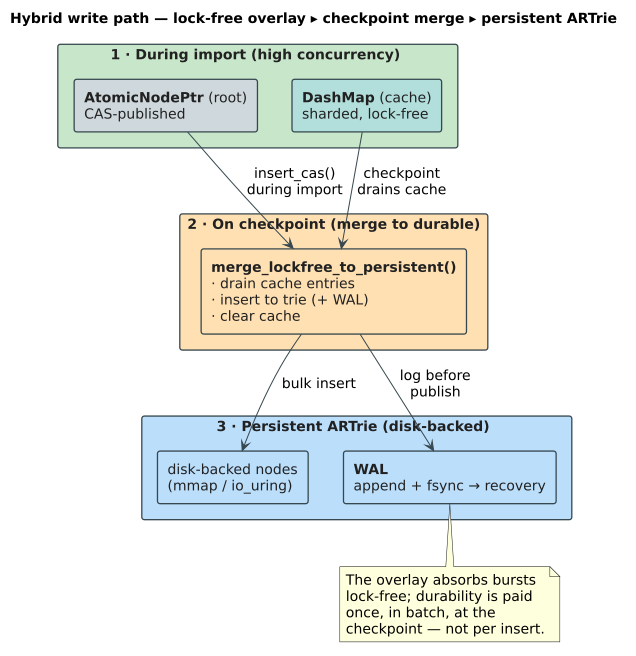

# Lock-Free CAS-Based ARTrie Design

**Synthesized in:** [The lock-free overlay — the live representation](../persistence/lock-free-overlay.md). That page is the current architecture-level account of the immutable, CAS-published overlay (arc-swap root, owned `Child` enum, zero `unsafe`). This record is the **foundational** mechanism design plus its Phase-A conversion notes; the older `im::Vector` / raw-`AtomicU64`-root sketch in the body below is **superseded** (see the Phase-A box) and kept for provenance.

This document describes the lock-free concurrent insert mechanism for `PersistentARTrie` and `PersistentARTrieChar` using persistent (immutable) data structures and Compare-And-Swap (CAS) operations.

## Overview

Traditional concurrent trie implementations use locks (RwLock) which serialize writes and can cause contention when many threads insert concurrently. This design uses **persistent data structures** combined with **CAS operations** to achieve truly lock-free concurrent inserts.

> ## ⚠️ Phase A — current state (supersedes the `im::Vector` / RwLock descriptions below)
>
> The sections after this box describe the *original* design. The **char overlay**
> (`PersistentCharNode`, used by both the char and vocab lock-free overlays) has
> since been made genuinely lock-free and leak-free; the byte overlay has received
> the correctness fix only (its owned-`Arc` conversion is a follow-on). Current
> reality, for reconstruction:
>
> 1. **Atomic root is genuinely atomic.** `AtomicNodePtr`
>    (now the shared `core/overlay/atomic_ptr.rs`) wraps `arc_swap::ArcSwapOption<PersistentCharNode>`,
>    **not** a `RwLock`. `load()` → `ArcSwapOption::load_full()` (lock-free,
>    hazard-protected, returns an owned `Arc` = an MVCC snapshot); `compare_exchange`
>    → `ArcSwapOption::compare_and_swap` + `Arc::ptr_eq` (pointer-identity CAS, no
>    spurious failure). An earlier stopgap stored a raw `Arc` in an `AtomicU64`
>    (unsound) and then retreated to a `RwLock` (a "lock-free root" that was a lock).
>    arc-swap is the sound *and* lock-free resolution.
>
> 2. **Children are owned, not smuggled (the leak fix).** `PersistentCharNode`'s
>    child slots are `Child = InMem(Arc<PersistentCharNode>) | OnDisk(SwizzledPtr)`
>    (now the shared `core/overlay/node.rs`), stored in a tiered `ChildStore`
>    ($Inline[\le 4]$ zero-alloc / `Heap[5+]`) — **not** `im::Vector`. Previously an
>    in-memory child was an `Arc::into_raw` pointer smuggled through `SwizzledPtr`'s
>    `u64`; because that `u64` has no `Drop`, **every superseded node version leaked
>    its children**. With owned `Child::InMem`, reclamation is ordinary `Arc`
>    refcounting (a node frees exactly when no live version — including reader
>    snapshots — references it). **No EBR is required for correctness**; it would
>    only batch refcount traffic. All overlay `unsafe` (the `Arc::from_raw` handoff
>    + the manual `unsafe impl Send/Sync`) is **removed**: `Send`/`Sync` now
>    auto-derive (the compiler proves what the manual impl asserted), and the
>    `formal-verification/UNSAFE_INVENTORY.tsv`/`UNSAFE_CONTRACTS.tsv` rows for those
>    blocks are deleted.
>
> 3. **Prefix-insert finalization (correctness fix).** At `depth == len`,
>    `build_path_recursive` returns the **existing (shared) node** un-finalized, so
>    `insert_cas`'s `try_set_final` (an atomic `fetch_or`) is the **single arbiter**
>    of the winner across racing inserters. The old code pre-finalized via
>    `node.as_final()`, which made `try_set_final` observe an already-final node and
>    wrongly report a *new* proper-prefix term (e.g. "d" after "da") as a duplicate —
>    returning `false` **and skipping the lock-free cache**, so the cache-only
>    `merge_lockfree_to_persistent` silently **dropped the term** (data loss). Fixed
>    in both the char and byte overlays. The **vocab** overlay commits final+value in
>    a single root-CAS-published path-copy and is already correct (it must **not**
>    receive this change).
>
> 4. **Verification.** `tests/persistent_lockfree_overlay_proptest.rs` (BTreeSet
>    oracle + contended finalization + post-*merge* data-loss witnesses),
>    `tests/persistent_lockfree_overlay_loom.rs` (no-lost-update, prefix single-
>    arbiter, reader-no-UAF), and an in-crate `reclaim_tests` module in
>    `lockfree_cas.rs` (`Arc::strong_count == 1` after drop $\Rightarrow$ no leaked references).
>
> **Scope:** char overlay = fully converted (atomic root + owned children + fix).
> **Byte overlay = now also fully converted** — `im::Vector` → tiered `ChildStore`
> (Inline/Heap, u8 keys), `SwizzledPtr` children → owned `Child`, `AtomicNodePtr`
> `RwLock` → `arc_swap::ArcSwapOption`, all overlay `unsafe` removed + `Send`/`Sync`
> auto-derived. This removed the crate's last `im` user, so the **`im` dependency is
> dropped from `Cargo.toml`**. Vocab overlay = already correct (shares
> `PersistentCharNode`; migrated alongside char). Both byte and char overlays now
> carry the `reclaim_tests` `strong_count == 1`-after-drop leak witness.

## Architecture



## Key Components

### 1. PersistentNode (Immutable Node)

Uses `im::Vector` for keys and children to enable O(log n) structural sharing:

```rust
pub struct PersistentNode {
    version: AtomicU64,           // Monotonic version counter
    keys: im::Vector<u8>,         // Sorted child keys
    children: im::Vector<SwizzledPtr>, // Child pointers
    flags: AtomicU8,              // IS_FINAL, HAS_VALUE, etc.
    value: AtomicU64,             // Value for final nodes
    prefix: Arc<[u8]>,            // Path compression
}
```

**Key property:** `with_child(key, child)` returns a NEW node, never mutates `self`.

### 2. AtomicNodePtr (CAS-able Pointer)

Wraps `Arc<PersistentNode>` for atomic compare-and-swap:

```rust
pub struct AtomicNodePtr {
    ptr: AtomicU64,  // Raw pointer stored as u64
}

impl AtomicNodePtr {
    fn compare_exchange(
        &self,
        expected: &Arc<PersistentNode>,
        new: Arc<PersistentNode>,
    ) -> Result<(), Arc<PersistentNode>>;
}
```

## Lock-Free Insert Algorithm

### Phase 1: Build New Tree Structure



### Phase 2: CAS at Root



### Recursive Path Building (Bottom-Up)

The algorithm builds the path from **leaf to root**:



## Memory Management

### Arc Reference Counting


### Epoch-Based Reclamation

The epoch manager protects against ABA problems:



## Finalization Race Handling

When multiple threads insert the same term:



The `try_set_final()` uses atomic `fetch_or`:

```rust
pub fn try_set_final(&self) -> bool {
    let old = self.flags.fetch_or(IS_FINAL, Ordering::AcqRel);
    (old & IS_FINAL) == 0  // Returns true only if THIS call set it
}
```

## Structural Sharing with im::Vector



## Performance Characteristics

| Operation | Complexity | Notes |
|-----------|------------|-------|
| Cache lookup | O(1) | DashMap sharded access |
| Tree traversal | O(k) | k = term length |
| Node modification | O(log n) | n = children count (structural sharing) |
| CAS retry | O(1) expected | Contention-dependent |

### CAS Retry Statistics

Under typical workloads with unique terms per thread:
- **Retry rate: < 1%** for unique terms
- **Retry rate: ~10-50%** when multiple threads insert same terms
- Tracked via `cas_retries` atomic counter

## Integration with Persistent Storage



## API Usage

### Enable Lock-Free Mode

```rust
let mut trie = PersistentARTrie::create("vocab.part")?;
trie.enable_lockfree();  // Must call before using CAS methods
```

### Concurrent Inserts (No Locks!)

```rust
let trie = Arc::new(trie);  // No RwLock needed!

let handles: Vec<_> = (0..12).map(|i| {
    let t = Arc::clone(&trie);
    thread::spawn(move || {
        for term in get_terms_for_thread(i) {
            t.insert_cas(term.as_bytes());
        }
    })
}).collect();
```

### Check Existence

```rust
if trie.contains_lockfree(b"hello") {
    println!("Found!");
}
```

### Merge to Persistent Storage

```rust
let merged_count = trie.merge_lockfree_to_persistent()?;
```

## Thread Safety Guarantees

| Component | Thread-Safe? | Mechanism |
|-----------|:------------:|-----------|
| `insert_cas()` | ✓ | CAS + retry loop |
| `contains_lockfree()` | ✓ | Immutable traversal |
| `try_set_final()` | ✓ | Atomic fetch_or |
| `lockfree_cache` | ✓ | DashMap (sharded) |
| `AtomicNodePtr` | ✓ | AtomicU64 + Arc |

## Files

| File | Description |
|------|-------------|
| `persistent_artrie/core/overlay/node.rs` | **canonical** shared `OverlayNode<K, V>` (post-G4) — the unified byte/char node body |
| `persistent_artrie/core/overlay/atomic_ptr.rs` | **canonical** shared `AtomicNodePtr<K, V>` (arc-swap root) |
| `persistent_artrie/nodes/persistent_node.rs` | byte `PersistentNode<V>` — now a `ByteKey` alias of the shared node |
| `persistent_artrie/nodes/atomic_ptr.rs` | byte `AtomicNodePtr` — alias of the shared root |
| `persistent_artrie/dict_impl.rs` | Lock-free methods for `PersistentARTrie` (byte) |
| `persistent_artrie/char/nodes/persistent_node.rs` | char `PersistentCharNode<V>` — `CharKey` alias of the shared node |
| `persistent_artrie/char/nodes/atomic_ptr.rs` | char `AtomicNodePtr` — alias of the shared root |
| `persistent_artrie/char/dict_impl_char.rs` | Lock-free methods for `PersistentARTrieChar` |
| `persistent_artrie/vocab/mutation_api.rs` | vocab lock-free insert with atomic index allocation (`next_index.fetch_add`) |

## References

- [im crate documentation](https://docs.rs/im/)
- [Epoch-based memory reclamation](https://www.cl.cam.ac.uk/techreports/UCAM-CL-TR-579.pdf)
- [ART: Adaptive Radix Tree](https://db.in.tum.de/~leis/papers/ART.pdf)
