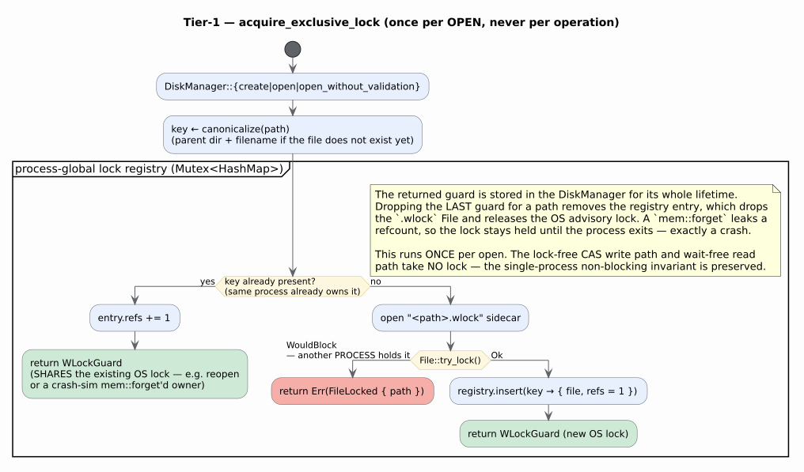

# Tier-1 — OS-Level Single-Owner File Lock

**Status:** IMPLEMENTED. Covers the byte, char, and vocab persistent ARTrie variants over both the
`mmap` and `io_uring` block-storage backends.
**Companion:** the [`swmr-multiprocess.md`](swmr-multiprocess.md) Tier-2 design builds directly on
this — Tier-1 is the exclusive-writer half of the SWMR lock protocol.

Related reading: [`f4-lock-collapse-implementation.md`](f4-lock-collapse-implementation.md) (the
intra-process lock-free handle this must not perturb) and
[`../persistence/storage-backends.md`](../persistence/storage-backends.md) (the block/header
layout the lock guards).

---

## 1. Why — the multi-process footgun

The persistent ARTrie family is **single-process by design**. Every concurrency primitive is
process-local heap: `AtomicNodePtr` holds a virtual address, and the `DashMap` caches,
`EpochManager`, and `next_lsn` / `commit_seq` counters live only in one process. Before this change
there was **no OS file locking anywhere** — two processes could each `open()` the same file
`read+write` and both succeed. The result is silent corruption: interleaved WAL records, in-place
checkpoint rewrites racing each other, and a peer's `mmap` taking `SIGBUS` on file growth. The only
pre-existing guard was **create-vs-create** (the WAL is created with `O_EXCL`); **open-vs-open was
entirely unguarded**.

Tier-1 closes that hole: a second opener is **rejected cleanly** with
`PersistentARTrieError::FileLocked` instead of silently corrupting the file.

---

## 2. Mechanism — a cross-platform advisory lock on a `.wlock` sidecar

At each of the **six** `DiskManager` construction chokepoints — the sole per-open sites —
`acquire_exclusive_lock` calls the non-blocking exclusive
[`std::fs::File::try_lock`](https://doc.rust-lang.org/stable/std/fs/struct.File.html#method.try_lock)
on a stable `"<path>.wlock"` sidecar file, **before** the write-ahead log (WAL) is opened:

| Backend | Chokepoints |
|---------|-------------|
| `MmapDiskManager` (`disk_manager.rs`) | `create`, `open`, `open_without_validation` |
| `IoUringDiskManager` (`io_uring_disk_manager.rs`) | `create`, `open`, `open_without_validation` (`create_with_ring_size`/`create_with_ring_pool_size` delegate to `create`) |

The standard library maps this operation to `flock(LOCK_EX | LOCK_NB)` on Unix and
`LockFileEx(LOCKFILE_EXCLUSIVE_LOCK | LOCKFILE_FAIL_IMMEDIATELY)` on Windows. The API has been
stable since Rust 1.89, below this crate's Rust 1.95 minimum supported Rust version (MSRV). It is
safe Rust, introduces no platform-specific dependency or `unsafe`, and returns the portable
`TryLockError::WouldBlock` contention signal. The returned guard is stored in the `DiskManager`
(`wlock: Option<WLockGuard>`) for the handle's whole lifetime.

### Why a sidecar, not the data inode

Tier-2's publication ([`swmr-multiprocess.md`](swmr-multiprocess.md) §4) atomically `rename`s a
*fresh* data inode over the canonical path each checkpoint. A lock on the **data inode** would
therefore fail to exclude a second writer that opens the *new* canonical inode. Locking a **stable
sidecar** composes with Tier-2 and is forward-compatible. On a fresh open the lock is acquired
before the data file is even opened, which additionally closes the create-vs-create double-`init`
race the old TOCTOU comment in `MmapDiskManager::create` wrongly dismissed.

---

## 3. Same-process reopen — the in-process registry

Operating-system re-lock behavior for a second file handle in the same process is platform-specific
and deliberately unspecified by `File::try_lock`. Two legitimate in-process patterns rely on
same-path reopen:

1. **Crash-recovery tests** create a handle, `std::mem::forget` it (to skip the `Drop`-checkpoint and
   leave un-checkpointed WAL records), then reopen the same path to exercise WAL replay. A real crash
   releases the OS lock on process death; `mem::forget` does not.
2. Ordinary sequential open → drop → reopen (fine on its own — the lock frees on drop).

Calling the platform lock again could wrongly reject case 1. The fix is a **process-global
refcounted registry** (`Mutex<HashMap<CanonicalPath, LockEntry>>`) consulted before
`File::try_lock`:

- **Key.** The path canonicalized (or its canonical parent + filename when the file does not exist
  yet, e.g. on create), so different spellings of one file map to one entry.
- **First acquire for a key.** Take the OS advisory lock (this is what excludes *other* processes) and
  insert `{ file, refs = 1 }`.
- **Subsequent acquire (same process).** Increment `refs` and return a guard that **shares** the one
  OS lock — no self-conflict.
- **Guard drop.** Decrement `refs`; when it reaches `0`, remove the entry, which drops the `.wlock`
  `File` and releases the OS lock. A `mem::forget` simply leaks a refcount, so the lock stays held
  until the process exits — matching a real crash.

Crucially, this does **not** re-open the *create-vs-create* hole: a second **create** at a live path
still fails at the WAL's `O_EXCL`, independent of the lock. So `test_concurrent_opens_same_path`
(which holds one handle and expects a second **create** to fail) and the crash-recovery **open**
tests are both satisfied. Let `P` be the set of processes and, for a fixed file, `n_p` the count of
live handles in process `p`; the OS lock is held **iff** $`\sum_{p \in P} n_p > 0`$ and is owned by
exactly the one process with `n_p > 0` — any *other* process observes
`TryLockError::WouldBlock`.

---

## 4. The single-process non-blocking invariant is preserved

The lock is acquired **once per open**, never per operation. The F4 lock-collapse hot paths — the
lock-free CAS write path and the wait-free (`ArcSwap`/`AtomicNodePtr`) read path — take **no** lock
and are byte-for-byte unchanged. The registry `Mutex` is touched only at open and at guard drop, so
intra-process multi-threaded reads and writes remain fully lock-free (see
[`f4-lock-collapse-implementation.md`](f4-lock-collapse-implementation.md)). Tier-1 changes *who may
open a file*, not *how operations execute*.

---

## 5. Crash semantics

The OS releases a process's advisory locks when it exits (normally or by crash), because all its
file descriptors or handles close. So a crashed owner's lock is freed automatically, and the next
process opens + recovers via
`open_with_recovery` + rank-aware WAL replay. Within a live process, a `mem::forget`'d handle is
treated as still-owning (its refcount leaks) — which is the correct in-process model of "the owner
is gone but its lock is not yet reclaimed". **Single host only**: remote-filesystem advisory-lock
semantics vary across Unix network file systems and Windows shares, which is out of scope (Tier-2
SWMR is single-host as well).

---

## 6. Testing

- **`tests/persistent_multiprocess_lock.rs`** (the crate's first true cross-process test) — the test
  binary re-invokes itself as a child via `current_exe`; the child reports its open outcome through
  the process exit code. It asserts a second **OS process** is rejected with `FileLocked` while the
  parent holds the handle, and opens successfully after the parent drops it.
- **Full suite (E4).** The whole `--features persistent-artrie` suite (2800+ tests, byte/char/vocab)
  passes with the lock in place — including `test_concurrent_opens_same_path` and the three
  `mem::forget`-based WAL-recovery tests — verifying the registry resolves same-process reopen
  without weakening the cross-process guarantee, uniformly across the family.

---

## 7. Relationship to Tier-2 SWMR

Tier-1 is the exclusive-writer half of the SWMR protocol. Tier-2 adds read-only reader processes
holding shared locks on a `.rlock` sidecar plus an atomically-`rename`d image and a background
`ArcSwap` refresh — see [`swmr-multiprocess.md`](swmr-multiprocess.md). Because Tier-1 already
locks a **stable sidecar** through a shared standard-library abstraction, no Tier-1 change is needed
to adopt Tier-2 on Unix or Windows.
