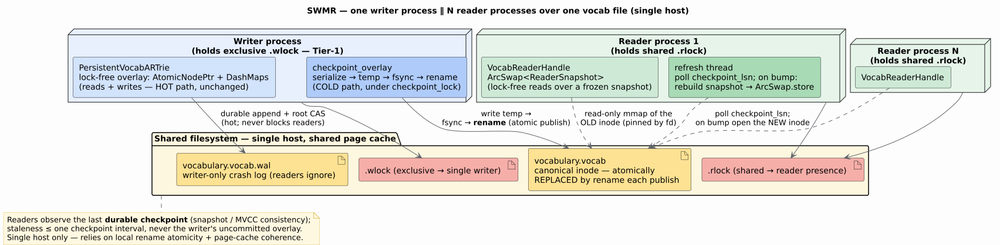
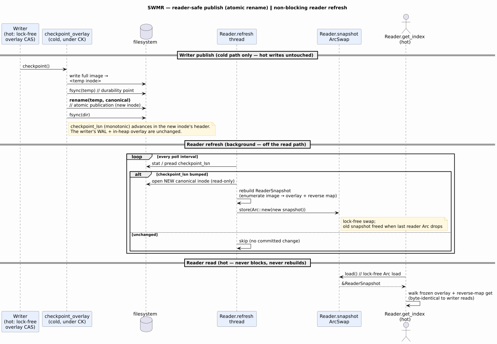

# Tier-2 SWMR — Single-Writer / Multi-Reader-Process Access

**Status:** DESIGN (approved; red-teamed). Implementation gated on owner go-ahead.
**Scope:** `PersistentVocabARTrie` first, generalizable to the byte/char persistent ARTrie
variants (they share the disk manager + overlay machinery).
**Prerequisite:** the **Tier-1** exclusive-owner lock (below), which turns silent cross-process
corruption into a clean error and is the `LOCK_EX` half of the SWMR protocol.

Related reading: [`f4-lock-collapse-implementation.md`](f4-lock-collapse-implementation.md)
(the intra-process lock-free handle this builds on), [`non-blocking-checkpoint.md`](non-blocking-checkpoint.md)
(the committed-watermark checkpoint), and [`../persistence/storage-backends.md`](../persistence/storage-backends.md)
(the block/arena/header layout).

---

## 1. Why — the problem this solves

The whole persistent-ARTrie family is **single-process by design**. Every concurrency primitive is
process-local heap: `AtomicNodePtr` holds a virtual address meaningless in another process, and the
`DashMap` caches, `EpochManager`, and `next_lsn` / `commit_seq` counters are per-process. There is
**no OS file locking**, the WAL append is serialized only by an in-process `Mutex`, and `mmap`
growth is uncoordinated across processes. Two processes that `open()` the same file both succeed
(both `read+write`) and corrupt the WAL + checkpoint image; a peer's `mmap` can `SIGBUS` on growth.
The theory docs already state the boundary
([`../theory/disk-tries/04-persistent-art.md`](../theory/disk-tries/04-persistent-art.md): pointers
are "process-specific", "cannot share files across processes"), but nothing *enforced* it.

This design adds two capabilities, in order:

- **Tier-1** — an exclusive-owner OS lock so a second opener is *rejected*, not silently corrupting.
- **Tier-2 (SWMR)** — one **writer** process plus $`N`$ **reader** processes over one file, where
  readers observe the last durable checkpoint (snapshot / MVCC consistency).

---

## 2. The hard invariant — intra-process reads/writes stay lock-free

**Non-negotiable:** neither Tier-1 nor Tier-2 adds any synchronization to the per-operation hot path
of the writer or any reader. The F4 lock-free CAS write path and wait-free read path are byte-for-byte
unchanged. All new synchronization lives in exactly three cold places:

1. **open time** — the advisory `flock` (once per handle, never per op);
2. **the writer's cold checkpoint** — reader-safe publication, already serialized by the pre-existing
   `checkpoint_lock`;
3. **the reader's background refresh** — a coarse poll + an `ArcSwap` swap, off the read path.

A proof sketch is given in [§7](#7-non-blocking-invariant--proof-sketch).

---

## 3. Tier-1 — the exclusive-owner lock

An advisory `flock(LOCK_EX | LOCK_NB)` on a **stable `"<path>.wlock"` sidecar** is acquired at the six
`DiskManager::{create, open, open_without_validation}` chokepoints (mmap + io_uring), before the WAL
is opened, covering byte/char/vocab uniformly. On contention it returns
`PersistentARTrieError::FileLocked { path }`. The lock fd is held for the trie's lifetime and released
automatically on drop.

**Why a sidecar, not the data inode.** Tier-2's publication ([§4](#4-reader-safe-publication--option-a))
`rename`s a *fresh* data inode over the path each checkpoint, so a lock on the data inode would fail
to exclude a second writer opening the *new* canonical inode. Locking a stable sidecar composes with
Tier-2 and is forward-compatible. See [`os-level-locking.md`](os-level-locking.md) for the Tier-1
implementation record.

---

## 4. Reader-safe publication — Option A (write-temp → fsync → rename)

Today's `checkpoint_overlay` rewrites header block 0 and the tail arena **in place** — not tear-free
for a concurrent reader. Option A instead publishes each checkpoint as an **immutable inode**:

1. serialize the overlay into a **fresh temp file** (reuse `serialize_overlay_snapshot_compressed`);
2. `fsync(temp)` — the durability point;
3. `rename(temp, canonical)` — the **atomic publication / linearization point** (a new inode);
4. `fsync(dir)`.

A reader holding an fd/`mmap` to the *old* inode keeps a stable, consistent snapshot; the OS reclaims
the old inode exactly when the last reader closes it — **cross-process snapshot lifetime for free**
via inode refcounting.

### Why A over B

The alternative — **B: seqlock header + immutable-arena discipline** (dual-slot header with a
monotonic `active` generation, and a checkpoint that never rewrites a published arena in place) —
keeps a single growing file and triggers refresh with a zero-syscall in-`mmap` atomic load, but adds
three invariants and needs an explicit generation-gated reclamation GC. Option A adds **one**
invariant (atomic `rename`) and gets reclamation for free. Because today's checkpoint already
re-serializes the full overlay, A's only added I/O per checkpoint is one `fsync` + `rename`. **A is
the MVP; B is documented as the efficiency evolution** (a drop-in publication swap sharing all the
reader machinery) if measurement shows A's write/inode churn dominates or a single-file artifact is
mandated.

---

## 5. Read-only reader path

A new `MmapDiskManager::open_readonly` (read-only fd + `MmapOptions::map`, no write, no create) backs
`PersistentVocabARTrie::open_readonly → VocabReaderHandle`: validate the CRC header, load arenas, and
reuse the read-only half of `reestablish_overlay_from_image`
(`enumerate_overlay_terms_from_disk` + `build_overlay_root_from_terms`) to build the overlay into the
reader's *own* `AtomicNodePtr` and materialize `reverse_term_map` — **with no WAL open and no writes**.
A `VocabRead` trait (`get_index` / `get_term` / `contains` / `len` / `iter_terms` / …) is implemented
for both the writer and the reader handle, so reader snapshot walks are byte-identical to writer
reads.

---

## 6. Non-blocking refresh + lock protocol + crash safety

**Refresh.** The reader holds `snapshot: ArcSwap<ReaderSnapshot>`; reads `load()` it (the same
lock-free primitive class as `AtomicNodePtr::load`) and serve entirely from the immutable snapshot. A
background thread polls the monotonic, CRC-covered `checkpoint_lsn` (via `stat`/`pread`, or
`inotify(IN_MOVED_TO)`); on a bump it rebuilds a fresh snapshot and `ArcSwap::store`s it — in-flight
reads keep serving the old one until the swap. Equal `checkpoint_lsn` ⇒ no committed change ⇒ refresh
correctly skipped. Reads never poll or rebuild.

**Lock protocol.** Writer holds `flock(.wlock, LOCK_EX)` (Tier-1); a second writer → `FileLocked`.
Readers hold `flock(.rlock, LOCK_SH)` for presence (optional GC gating; under A, inode refcounts
already guarantee correctness). A reader against a static file with no live writer simply never sees
a refresh. Readers and the writer never share a lock, so a live writer never blocks readers.

**Crash safety.** A writer crash mid-publish leaves an orphan temp; the canonical path still names the
last complete, `fsync`'d image, so no torn image is ever visible. Restart sweeps stale temps, then
`open_with_recovery` + rank-aware WAL replay. Readers are oblivious — they hold a prior inode. **Single
host only** (relies on local `rename` atomicity + shared page-cache coherence; NFS/multi-host is out of
scope).

---

## 7. Non-blocking invariant — proof sketch

**Claim.** No lock, atomic, or fence is added to the per-operation hot path of the writer or any
reader; new synchronization lives only at open (flock), in the cold checkpoint (under
`checkpoint_lock`), and in the background reader refresh.

**Writer hot path** (`insert`/`upsert`): durability gate → WAL append → `AtomicNodePtr::compare_exchange`
(arc-swap CAS) → commit-rank + watermark atomics — *unchanged*. Publication (temp+rename) runs inside
`checkpoint_overlay`, entered only under the pre-existing `checkpoint_lock`, which is not on the insert
path. Under Option A the writer serves reads from the in-heap overlay, never the data-file `mmap`, so
renaming its inode adds nothing to any op. Writer hot path is therefore byte-identical to today.

**Reader hot path** (`get`/`contains`/`len`/`iter`/`get_term`): `self.snapshot.load()` (hazard-protected
`load_full`, the same class of op as the writer's `AtomicNodePtr::load`) → pure immutable pointer
chasing over an `Arc<OverlayNode>` → sharded-map `get` for `get_term`. No new lock. The snapshot is
immutable after build, so reverse-map reads are uncontended.

**Cost.** Let $`c`$ be the checkpoint interval. A reader's staleness is bounded by $`c`$ (it sees the last
published checkpoint), i.e. the model is **snapshot-consistent, not cross-process-linearizable** — the
same trade LMDB and SQLite-WAL readers make. Refresh work is $`O(n)`$ per checkpoint on a background
thread (amortized $`O(n/c)`$ wall-time), never on a read; a read is $`O(L)`$ for a term of length $`L`$, the
same as intra-process. $`\blacksquare`$ (sketch)

Formal follow-through: model A's `rename` as one atomic state transition publishing an immutable image
(readers observe old-or-new, never partial); this fits the project's TLA+ harness alongside
`SharedPersistentConcurrency.tla`.

---

## 8. Red-team (adversarial scenarios → resolutions)

| # | Scenario | Resolution |
|---|----------|------------|
| R1 | Torn header/arena read | A: image only ever appears via atomic `rename` of an `fsync`'d temp — never partial. B: dual-slot + single aligned 8-byte `active` store + CRC over the header prefix. |
| R2 | `rename` atomicity + reader holding a deleted inode | POSIX same-dir `rename` is atomic; the old inode is unlinked but kept alive by the reader's open fd until it refreshes/closes. `fsync(dir)` makes the publish crash-durable. |
| R3 | flock on the churning data inode ⇒ two writers | **Lock the stable `.wlock` sidecar, never the data inode** — Tier-1's chosen design. |
| R4 | `checkpoint_lsn` equal across two publishes | Harmless: equal watermark ⇒ identical committed term set ⇒ skipping refresh is correct. (B's strictly-monotonic `active` additionally distinguishes byte-level republications.) |
| R5 | Reader rebuild racing a publish (half-written image?) | A: the reader opens a specific inode; the writer only ever publishes a *complete* inode via `rename`. B: the reader snapshots `(active, block_count, root_ptr)` from a CRC-valid header before enumerating. |
| R6 | mmap remap-on-growth for readers (B only) | Reader re-reads `block_count` and remaps read-only before trusting the new `root_ptr`; grow-only + immutable + fsync-before-flip ⇒ no SIGBUS. (N/A to A — fresh inode.) |
| R7 | Writer WAL retention vs readers | Readers never open the WAL (they read only the checkpoint image); the writer retains it for its own recovery, exactly as today. |
| R8 | fd/inode exhaustion under A (frequent checkpoints) | Each reader pins ≤ 2 inodes (current + one mid-refresh); the writer unlinks the prior canonical each `rename`. On-disk images $`= O(\#\text{readers} + 1)`$. Mitigated by the (accepted) coarse checkpoint cadence. |
| R9 | Long-lived reader vs reclamation | A: the OS retains exactly the pinned inode; self-correcting on close. B: old generations accumulate → compaction GC gated by the `.rlock` probe. |
| R10 | NFS / multi-host | **Single-host only** — A relies on local `rename`/open-unlink; B relies on cross-process page-cache coherence. Documented constraint. |
| R11 | Byte/char eviction: OnDisk overlay children a reader can't fault | The reader never uses the writer's buffer manager — it faults from its **own** read-only buffer manager over the frozen (immutable) image. Vocab never evicts, so its reader overlay is fully in-memory. |

---

## 9. Generalization to byte/char

`open_readonly`, the refresh/`ArcSwap` machinery, the sidecar locks, and Option-A publication are all
shared-core → they port to byte/char with `ByteRead`/`CharRead` analogues. Vocab-specific: the 96-byte
`VOCB` header + `start_index`/`next_index` + the `reverse_term_map`. Byte/char eviction can produce
`Child::OnDisk` overlay children, served by a **lazily-faulting reader** with its own read-only buffer
manager over the immutable image (R11).

---

## 10. Phased implementation + effort

| Phase | Work | Est. |
|-------|------|------|
| 0 | Locking substrate (flock wrapper + `.wlock`/`.rlock` sidecars; wire Tier-1) | 0.5 d |
| 1 | `MmapDiskManager::open_readonly` (RO fd + RO mmap) | 0.5 d |
| 2 | `VocabReaderHandle` + `VocabRead` trait; `open_readonly` reusing the image-enumeration path | 1.5 d |
| 3 | Option-A publication (temp+rename, stale-temp sweep) + multi-process reader∥writer consistency test | 2 d |
| 4 | `ArcSwap` refresh + background poll (+ `inotify`) + SWMR soak | 1.5 d |
| 5 | Byte/char generalization (+ lazily-faulting reader) | 2 d |
| 6 | *(optional)* Option-B evolution (seqlock + immutable arenas + generation GC) | 3–4 d |

**MVP (vocab, Phases 0–4, Option A): ≈ 6–7 engineer-days; full generalization ≈ 9 days.** Verify with
loom (refresh-vs-read), proptest (interleavings), and a TLA+ module (`rename` = atomic image
publication).
