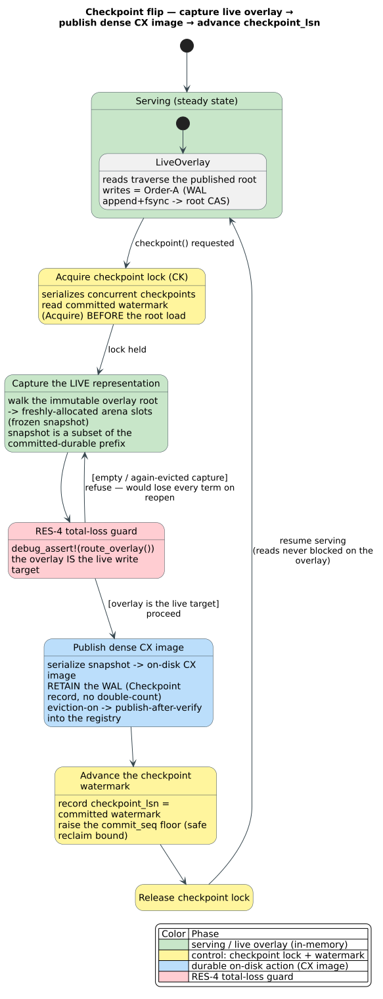

# Durability, checkpoints & crash recovery

**Navigation**: [↑ Persistence architecture](README.md) · [Lock-free overlay](lock-free-overlay.md) · [Concurrency model](concurrency-model.md) · [WAL format](wal-format.md)

This document is the durability contract of the persistent-ARTrie family: how a write
becomes durable *before* it becomes visible, why the committed **watermark** is the only
safe checkpoint bound, how a checkpoint folds the overlay into a dense image, and how a
crash is recovered — exactly, with no lost or invented writes.

## Terms of art (defined before first use)

| Term | Definition |
|------|-----------|
| **visibility** vs **durability** | A write is *visible* once its overlay root CAS lands; it is *durable* once its WAL record is `fsync`-ed. The invariant is that visibility never precedes durability. |
| **LSN** | Log-Sequence Number — a WAL record's monotone position. |
| **commit** | A write *commits* when its root CAS makes it visible. Under lock-free CAS, commits may happen **out of LSN order**. |
| **watermark** | The largest $L$ such that every LSN in $1..=L$ has committed. |
| **CommitRank** | A durable WAL record binding a data record's LSN to a monotone *commit generation*, so replay can order same-term writes by commit order rather than LSN order. |
| **image-coverage frontier** ($n$) | The max WAL LSN folded into the on-disk image, stamped in the block-0 header, so reopen skips $\text{LSN} \le n$ to avoid double-applying a checkpointed record. |

## Visibility vs durability

The public API distinguishes the two: under `DurabilityPolicy::Immediate` (the default) an
acknowledged write is **durable** (its WAL record is `fsync`-ed) *before* it is **visible**
(its overlay root CAS lands). Formally, writing $\mathrm{lsn}(x)$ for a write $x$'s WAL LSN
and $\mathrm{syncedLsn}$ for the durable frontier:

$$
\text{visible}(x) \;\implies\; \text{WAL-durable}(x)\ \text{at}\ \mathrm{lsn}(x) \le \mathrm{syncedLsn}
\qquad(\textbf{acknowledged} \implies \textbf{durable})
$$

This is the classic ARIES discipline (Mohan et al. 1992): a record that was `fsync`-ed is
replayed on recovery, and a record that was never `fsync`-ed was never acknowledged.

## The Order-A write protocol

Every durable write follows one fixed ordering — **Order-A** — encoded once as the default
methods of `DurableOverlayWrite` (`core/overlay/durable_write.rs`):

1. **Gate.** Reject any policy but `Immediate`/`GroupCommit`, so "acknowledged $\implies$ durable" holds.
2. **Present-hoist (non-faulting).** A membership pre-check; if the key is already present, no-op with **no WAL append** — never burn an LSN or punch a hole in the watermark. It must be *non-faulting* on the hot path: a faulting read here, racing a checkpoint/eviction that holds the buffer-manager lock, is the lock-ordering inversion that once deadlocked the soak for 75+ minutes.
3. **Append durable WAL** (Step 1). The data record is appended and synced, and its LSN returned, *before* any visibility. The **single append covers every CAS retry** — re-appending would burn LSNs and punch watermark holes.
4. **Publish via root CAS** (Step 2) — the path-copy + `compare_exchange` loop from [lock-free-overlay.md](lock-free-overlay.md#the-write-path--path-copy-then-publish-by-cas). The winning CAS is the **linearization point**.
5. **Commit-rank + mark watermark** (Step 3). Append a durable `CommitRank` binding the data LSN to a commit generation, then `mark_committed` both the data and rank LSNs. A refused write (insert-once on a present key, a failed compare-and-swap) is **burned** for watermark liveness but never ranked.

Its inverse, Order-B ("publish then log"), is *rejected*: it can expose a visible-but-not-durable write. The byte-level record framing is in [wal-format.md](wal-format.md#3-the-17-byte-record-frame).

## The committed watermark — the only safe `checkpoint_lsn`

Because writes commit out of LSN order, the appended/synced *frontier* is **not** a safe
reclaim bound. The `CommittedWatermark` (`core/committed_watermark.rs`) instead tracks the
**contiguous committed prefix**:

$$
\text{checkpoint\_lsn} \;=\; \text{watermark} \;=\; \max\{\,L : \forall\,\ell \in 1..=L,\ \text{committed}(\ell)\,\}
$$

`watermark()` is a lock-free `Acquire` read (never blocks writers or the capture);
`mark_committed` briefly serializes committers to close the prefix, but runs *after* the
root CAS has already published the write, so it is off the contended CAS-retry loop. The
`_Unsafe.cfg` of `LockFreeDurableCheckpoint.tla` exhibits the exact data loss a
frontier-bounded reclaim would cause; the watermark configuration is loss-free.

### CommitRank and replay order

Replaying the WAL tail in LSN order would pick the *wrong* last-writer for a term written
twice, because commit order $\ne$ LSN order under lock-free CAS. The durable `CommitRank`
records let recovery reconstruct commit order: `reconcile_lww` (`core/recovery.rs`) collects
`rank[data_lsn] = generation`, stamps each data record's generation, applies the
rank-regime drop-rule (an *unranked* record in the `Overlay` regime is a two-append orphan
and is dropped), and sorts survivors by $(\text{generation}, \text{lsn})$ = CAS /
commit-visibility order. See [wal-format.md §5](wal-format.md#5-the-rank-regime-replay-drop-rule).

## Checkpoint flips — folding the overlay into a dense image

A **checkpoint** captures the immutable overlay snapshot into a dense CX image, publishes
it, and advances the reclaimable watermark — under the checkpoint lock, so concurrent
checkpoints serialize:

The data-loss-critical rule is the **capture ordering**: read `watermark()` with `Acquire`
*before* loading the atomic root, so the captured snapshot is a subset of the
committed-durable prefix ($\text{visible} \subseteq \text{durable-prefix}$). The **RES-4
guard** refuses to publish a degenerate (empty/again-evicted) capture while the overlay is
the live write target. The image self-describes its coverage frontier $n$
(`image_checkpoint_lsn`), `fsync`-ed atomically with it.

## Crash recovery

Recovery is **redo-only** ARIES (`core/recovery.rs`): load the checkpoint image, replay the
durable WAL tail above the image frontier, reconcile to commit order, stop fail-closed at a
torn record:

 checkpoint_lsn, stopping at the first torn or un-fsync'd frame (CRC mismatch or short read = end of the durable prefix). Pass 1 collects CommitRank records into rank[data_lsn] = generation; Pass 2 stamps each data record's generation and applies the RankRegime drop-rule (Overlay + unranked = drop orphan); it sorts all survivors by (generation, lsn) = commit-visibility order; restores each term to its last committed value (green) while dropping writes that were never durable (red); and rebuilds the lock-free overlay from the ordered winners." width="90%"/>

The steps:

1. **Validate the header** — dual-magic + version; fail-closed on corruption or a too-new file.
2. **Load the image** — the dense CX snapshot becomes the base overlay.
3. **Scan the WAL tail** — records with $\text{LSN} > \text{checkpoint\_lsn}$, stopping at the first CRC mismatch / short read (the durable-prefix boundary — torn writes are never applied).
4. **Reconcile** — `reconcile_lww` orders survivors by $(\text{generation}, \text{lsn})$ and applies the regime drop-rule.
5. **Rebuild** — apply the ordered winners into a fresh overlay and resume.

### The reopen double-apply guard (#47 / #48 / #49)

A checkpointed record is already folded into the image, so replaying it again would
double-apply (fatal for `u64` counters). The block-0 header stamps the **image-coverage
frontier** $n$ (`image_checkpoint_lsn`), written atomically with the image; reopen drains
only $\text{LSN} > n$, taking $\max(\text{wal\_record}, n)$. Recovery-applied deltas are
folded into the *image* but were applied no-WAL, so the in-memory durability watermark
stays $0$ (the `image_coverage_lsn` field is decoupled from `contiguous` — the `#41`
capture-ordering assert $\text{watermark} \le \text{synced-frontier}$ holds), and the first
post-recovery checkpoint records $\text{checkpoint\_lsn} = \max(\text{watermark}, n)$ so the
archive deltas are dropped exactly once.

## Durability policies

| Policy | Guarantee | `fsync` frequency |
|--------|-----------|-------------------|
| `Immediate` (default) | Full ACID | before every public mutation/commit acknowledgement |
| `GroupCommit` | Full | batched when a coordinator is installed; blocking fallback otherwise |
| `Periodic` | Bounded loss | checkpoint boundaries only |
| `None` | None (testing) | never |

`DurabilityPolicy` (`core/durability.rs`) is backed by an `AtomicEnumCell` so the write path
reads it lock-free. Group commit is [experimental](group-commit.md).

## The guarantees, and their proofs

$$
\text{Recovered} \;=\; \text{durableCheckpoint} \,\cup\, \text{WAL-tail}[\,\text{walRetainedFrom},\ \mathrm{syncedLsn}\,] \;=\; \text{visible}
$$

— recovery reproduces *exactly* the visible-and-acknowledged pre-crash state, inventing
nothing and losing nothing. This, the watermark theorem, and the capture ordering are
model-checked in TLA⁺ (`SharedPersistentConcurrency.tla`, `LockFreeDurableCheckpoint.tla`,
`LockFreeOverlayDurableReplay.tla`, `StorageSyscallOutcome.tla`) and proved in Rocq
(`Spec/PublicDurabilityPolicySpec.v`, `Spec/PersistentWalAtomicitySpec.v`,
`Spec/PersistentCheckpointRetentionSpec.v`, `Spec/PersistentRecoveryReplayCompletenessSpec.v`);
see [formal-verification-map.md](formal-verification-map.md). The mechanism-level design
records are [`overlay-durable-architecture.md`](../design/overlay-durable-architecture.md)
and [`non-blocking-checkpoint.md`](../design/non-blocking-checkpoint.md).

## References

- C. Mohan, D. Haderle, B. Lindsay, H. Pirahesh, P. Schwarz. *ARIES: A Transaction Recovery
  Method Supporting Fine-Granularity Locking and Partial Rollbacks Using Write-Ahead
  Logging.* ACM TODS 17(1), 1992. [DOI:10.1145/128765.128770](https://doi.org/10.1145/128765.128770)
- J. Gray, A. Reuter. *Transaction Processing: Concepts and Techniques.* Morgan Kaufmann, 1993.
