# The durable-storage kernel — a reusable substrate for new persistent layers

**Navigation**: [↑ Persistence architecture](README.md) · [Lock-free overlay](lock-free-overlay.md) · [Durability & recovery](durability-and-recovery.md) · [Storage backends](storage-backends.md)

The persistent-ARTrie family is *one* application of a smaller, general engine: the
unit-agnostic code under `src/persistent_artrie/core/`. That engine — the **durable-storage
kernel** — knows nothing about dictionaries, radix tries, or Unicode. It knows how to make
an in-memory structure **durable, crash-safe, and lock-free** over a block device. This
document presents `core/` *as a substrate*: what it gives you, which seams you implement,
and how to build a **new persistent file layer** on it that is not a dictionary at all.

> **Thesis.** To make a new structure durable, you implement two small **seam** traits — a
> block-storage backend and a key/record model — and, if your structure is a copy-on-write
> tree, a handful of **Template-Method hooks**. In exchange you *inherit* the
> data-loss-critical machinery: the write-ahead log, the *Order-A* durability protocol, the
> committed-watermark checkpoint bound, crash recovery, the buffer pool, epoch-based
> reclamation, and memory-pressure eviction — each already **machine-checked**.

---

## Terms of art (defined before first use)

| Term | Definition |
|------|-----------|
| **seam** | A trait whose *implementation* you supply so generic kernel code can call into your structure. `BlockStorage` and `KeyEncoding` are seams. |
| **Template Method** | A design pattern (Gamma et al. 1994) where an invariant algorithm skeleton is fixed in a base and only named steps vary. The kernel fixes the *Order-A* write ordering and lets you vary the node-building step. |
| **Order-A** | The kernel's fixed durable-write ordering: *append+sync WAL $\to$ publish via CAS $\to$ commit-rank + mark watermark*. Its inverse, "publish then log" (Order-B), is rejected because it can expose a visible-but-not-durable write. |
| **LSN** | Log-Sequence Number — a WAL record's monotone position. |
| **watermark** | The largest LSN $L$ with every $\ell \in 1..=L$ committed — the only safe checkpoint bound under out-of-order commit. |
| **arc-swap** | A single-word atomic cell holding an `Arc<T>` that readers load without a lock and writers replace by CAS. |

---

## The substrate at a glance

**How a new layer rides the kernel** — a dashed grey box ④ *Your new persistent
layer* connects to the durable-storage kernel (`core/`)'s three service groups:



**The kernel's three groups in detail** — the modules inside each group:



---

## Seam 1 — `BlockStorage`: the storage backend

`BlockStorage` (`core/block_storage.rs`) is the interface every layer above is generic
over (`S: BlockStorage`). It abstracts a file as an array of fixed-size **blocks**:

- Block $0$ holds a 64-byte `FileHeader` (magic, version, root pointer, entry count,
  free-list head, checksum, and the image-coverage frontier `image_checkpoint_lsn`).
- Blocks $1..N$ each hold `BLOCK_SIZE` = $256\text{ KB}$ of data.
- Block IDs are 24-bit, so a single file addresses up to $2^{24}$ blocks $= 4\text{ TB}$.

The trait is `Send + Sync + 'static` (backends own their resources and carry no borrowed
lifetime, so a whole structure can be erased behind a `dyn` object). Its surface:

```rust
pub trait BlockStorage: Send + Sync + 'static {
    fn read_block(&self, block_id: u32, buf: &mut [u8; BLOCK_SIZE]) -> Result<()>;
    fn write_block(&self, block_id: u32, buf: &[u8; BLOCK_SIZE]) -> Result<()>;
    fn read_bytes(&self, block_id: u32, offset: usize, buf: &mut [u8]) -> Result<()>;
    fn write_bytes(&self, block_id: u32, offset: usize, data: &[u8]) -> Result<()>;
    fn allocate_block(&self) -> Result<u32>;      // must be safe to call concurrently
    fn free_block(&self, block_id: u32) -> Result<()>;
    fn read_header(&self) -> Result<FileHeader>;
    fn write_header(&self, header: &FileHeader) -> Result<()>;
    fn root_ptr(&self) -> Result<u64>;            // + set_root_ptr
    fn entry_count(&self) -> Result<u64>;         // + set_entry_count
    fn image_checkpoint_lsn(&self) -> Result<u64>;// + set_* (the #48 double-apply guard)
    // …read_header_bytes / write_header_bytes for custom (e.g. 96-byte) headers
}
```

Two backends ship — `MmapDiskManager` (default; page-cache, best for single-block I/O)
and `IoUringDiskManager` (`O_DIRECT` + ring pool, best for batch I/O and true durability).
I/O buffers are `AlignedBlock`s (`#[repr(C, align(4096))]`), so the same buffer pool serves
both mmap and `O_DIRECT`. **To bring your own storage** (an encrypted file, a network block
device, an in-memory mock for tests), implement these ~14 methods; everything above is
generic over the result. See [storage-backends.md](storage-backends.md).

---

## Seam 2 — the key / record model

For a **trie-shaped** layer, `KeyEncoding` (`core/key_encoding.rs`) is the model seam: it
fixes the storage `Unit`, the public traversal `Token`, the reconstructed `Term`, the
on-disk magics, and the path-compression cap, so one generic node type serves every
alphabet. The three shipped markers are `ByteKey`, `CharKey`, `U64Key<PREFIX>`; the design
is detailed in [abstractions.md](../architecture/abstractions.md).

For a **non-trie** layer, you do not need `KeyEncoding` at all — you define your own record
model and serialize it into blocks yourself, exactly as the suffix-graph family does with
its native graph representation. The kernel's durability services (below) operate on opaque
`WalRecord` payloads and `Lsn`s, not on trie keys.

---

## Seam 3 — the overlay Template-Method hooks (for copy-on-write trees)

If your structure is an **immutable, copy-on-write tree** published through an atomic root
(the ARTrie shape), you implement a short trait tower in `core/overlay/` and inherit the
entire durable-write control flow:

| Trait (file) | You supply (the seam hooks) | You inherit (the fixed skeleton) |
|--------------|-----------------------------|----------------------------------|
| `LockFreeOverlay` (`flip.rs`) | the atomic-root accessor, the read engine | routing, snapshot loads |
| `DurableOverlayWrite` (`durable_write.rs`) | the WAL-record builder, the value domain, the node-building CAS publish, the present-hoist | the **Order-A** skeleton, the durability-policy gate, the commit-rank + watermark tail |
| `OverlayCheckpoint` (`checkpoint.rs`) | how to serialize your node into arena slots | capture the immutable snapshot, publish the image, advance the watermark |

The **Order-A** skeleton is data-loss-critical and lives in exactly one place. In literate
pseudocode, the durable write the kernel performs for you is:

```text
durable_write(op):                              # DurableOverlayWrite default method
    require policy ∈ {Immediate, GroupCommit}   # gate: "acknowledged ⟹ durable"
    if present_hoist(op) is a no-op:            # NON-FAULTING on the membership hot path
        return Unchanged                        # do NOT burn an LSN / punch a watermark hole

    data_lsn ← append_durable_wal(op)           # STEP 1: WAL append + fsync, BEFORE visibility
                                                #         (one append covers every CAS retry)
    loop:                                        # STEP 2: publish via the atomic-root CAS
        root  ← atomic_root.load()               #   read the current immutable root
        root' ← path_copy(root, op)              #   your seam: build the new version
        if atomic_root.compare_exchange(root, root'):  break   # the LINEARIZATION point
                                                #   on conflict, re-read and retry
    rank_lsn ← append_commit_rank(data_lsn)     # STEP 3: bind commit generation, durable
    watermark.mark_committed(data_lsn)          #   advance the contiguous committed prefix
    watermark.mark_committed(rank_lsn)          #   …covering BOTH LSNs so it never stalls
    return Applied
```

Order-B (CAS then log) is rejected: it can expose a visible-but-not-durable write. The
single WAL append is never re-appended across retries (that would burn LSNs and punch holes
in the watermark). A refused write (insert-once on an already-present key, a failed
compare-and-swap) is **burned** for watermark liveness — `mark_committed_burned(data_lsn)` —
but never ranked, so replay treats it as a no-op.

If your structure is *not* a copy-on-write tree, skip this seam and drive the durability
services directly, as in [Recipe B](#recipe-b--a-non-tree-snapshot-layer) below.

---

## What you inherit — the ready-made services

| Service | Module | What it gives you |
|---------|--------|-------------------|
| **Write-ahead log** | `core/wal/` | append-only, `fsync`-durable, CRC-checked records (`WalRecord` + `Lsn`); a concurrent append path with pending-segment handoff during sync. |
| **Durability policy** | `core/durability.rs` | `DurabilityPolicy::{Immediate, GroupCommit, Periodic, None}` — the fsync-frequency vs. throughput dial, backed by an `AtomicEnumCell` for lock-free reads. |
| **Committed watermark** | `core/committed_watermark.rs` | the contiguous committed-prefix tracker that yields the only safe `checkpoint_lsn` under out-of-order lock-free commit. |
| **Recovery** | `core/recovery.rs` | load the checkpoint image, replay the WAL tail above the image-coverage frontier, reconcile per-record commit order, stop fail-closed at a torn record. |
| **Buffer manager** | `core/buffer_manager.rs` | a frame pool over `BlockStorage` with fault-in, pinning, and batched dirty-page flush. |
| **Epoch reclamation + MVCC** | `core/concurrency.rs`, `core/mvcc.rs` | `EpochManager` (safe memory reclamation under lock-free reads) and `ReadTransaction` (epoch-pinned snapshot reads). |
| **Eviction** | `core/eviction/` | memory-pressure-driven unswizzling of cold subtrees to disk and read-fault-back. |

### The guarantees these services enforce (and prove)

$$
\text{visible}(x) \;\implies\; \text{WAL-durable}(x)\ \text{at}\ \mathrm{lsn}(x) \le \mathrm{syncedLsn}
\qquad(\textbf{acknowledged} \implies \textbf{durable})
$$

$$
\text{checkpoint\_lsn} \;=\; \max\{\,L : \forall\,\ell \in 1..=L,\ \text{committed}(\ell)\,\}
\qquad(\text{a committed contiguous prefix})
$$

$$
\text{Recovered} \;=\; \text{durableCheckpoint} \,\cup\, \text{WAL-tail} \;=\; \text{visible}
\qquad(\text{no lost writes, no invented state})
$$

These hold for *any* client of the kernel, because the machinery that enforces them is
generic. They are model-checked in TLA⁺ (`LockFreeDurableCheckpoint.tla`,
`SharedPersistentConcurrency.tla`, `StorageSyscallOutcome.tla`, …) and proved in Rocq
(`Spec/PublicDurabilityPolicySpec.v`, `Spec/PersistentWalAtomicitySpec.v`,
`Spec/PersistentRecoveryReplayCompletenessSpec.v`, …); the full cross-reference is in
[formal-verification-map.md](formal-verification-map.md).

---

## Building a new persistent file layer — two recipes

### Recipe A — a copy-on-write tree (the ARTrie shape)

1. **Storage.** Reuse `MmapDiskManager`, or implement `BlockStorage` for your medium.
2. **Model.** Define a `KeyEncoding` marker (or reuse `ByteKey`/`CharKey`/`U64Key`) fixing
   your unit width, term reconstruction, and on-disk magics.
3. **Node.** Represent your tree as immutable nodes published through an `AtomicNodePtr`
   (arc-swap root); path-copy on mutation.
4. **Hooks.** Implement `LockFreeOverlay` + `DurableOverlayWrite` + `OverlayCheckpoint`,
   supplying only the node-building CAS publish, the `WalRecord` builder, and the
   node-serialization step.
5. **Done.** You now have lock-free reads, Order-A durable writes, watermark-bounded
   checkpoints, and crash recovery — verified — with no bespoke durability code.

The persistent ARTrie *is* this recipe; the entire byte/char/`u64`/vocab family shares one
copy of steps 3–4 via the generic `OverlayNode<K, V>`.

### Recipe B — a non-tree snapshot layer (the suffix-graph shape)

1. **Storage.** As above — implement or reuse `BlockStorage`.
2. **Snapshot.** Hold your whole structure as an immutable `Arc<T>` behind an
   `arc_swap::ArcSwapOption` root.
3. **Write.** Follow Order-A by hand: append a durable *prepared* operation segment, rebuild
   a candidate `Arc<T>` off to the side, publish it by pointer-identity CAS
   (`Arc::ptr_eq`), then append a durable *commit* segment before acknowledging.
4. **Recover.** On reopen, load the checkpoint image and replay the WAL tail, applying only
   prepared records whose commit marker is durable.

The suffix-graph family (`PersistentSuffixAutomaton`, `PersistentSuffixTree`,
`PersistentScdawg`) *is* this recipe — durable substring indexes with **no** trie overlay,
reusing the same WAL, checkpoint, watermark, and recovery services. See
[families.md](families.md#suffix-graph-family--native-graph-snapshots) and
[../algorithms/persistent-suffix-graphs.md](../algorithms/persistent-suffix-graphs.md).

---

## What is dictionary-specific vs. reusable

| Reusable (the kernel — `core/`) | Dictionary-specific (a client) |
|---------------------------------|--------------------------------|
| `BlockStorage`, `AlignedBlock`, `FileHeader` | the ART `Node4/16/48/256` layouts, `CharBucket` |
| WAL, `DurabilityPolicy`, `CommittedWatermark`, recovery | the `KeyEncoding` alphabets, term reconstruction |
| the Order-A `DurableOverlayWrite` skeleton | the per-op `WalRecord` payloads (`Insert`, `Increment`, …) |
| `BufferManager`, `EpochManager`, MVCC, eviction | the `Dictionary`/`MappedDictionary` trait surface |
| the overlay `AtomicNodePtr` + CAS-publish pattern | path compression, adaptive edge storage |

A new layer swaps the right-hand column and keeps the left. That separation — enforced by
the grep-verified [layering invariant](families.md#the-module-layering-invariant) — is what
makes `core/` a substrate rather than an implementation detail.

## References

- E. Gamma, R. Helm, R. Johnson, J. Vlissides. *Design Patterns: Elements of Reusable
  Object-Oriented Software* (Template Method, Strategy). Addison-Wesley, 1994.
- C. Mohan et al. *ARIES: A Transaction Recovery Method Supporting Fine-Granularity Locking…*
  ACM TODS 17(1), 1992. [DOI:10.1145/128765.128770](https://doi.org/10.1145/128765.128770)
- J. Driscoll, N. Sarnak, D. Sleator, R. Tarjan. *Making data structures persistent.*
  JCSS 38(1), 1989. [DOI:10.1016/0022-0000(89)90034-2](https://doi.org/10.1016/0022-0000(89)90034-2)
