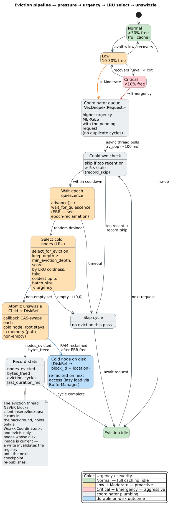
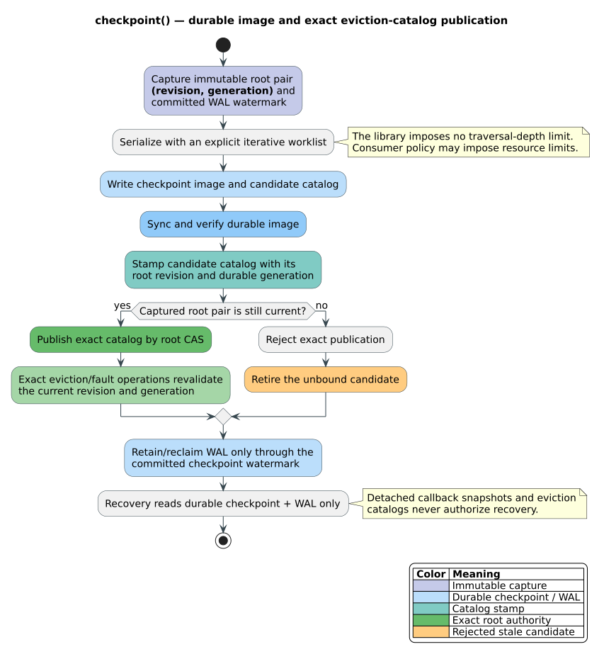
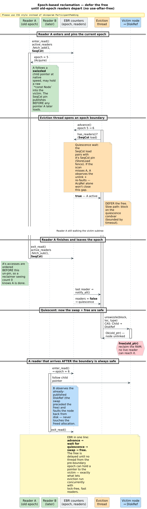
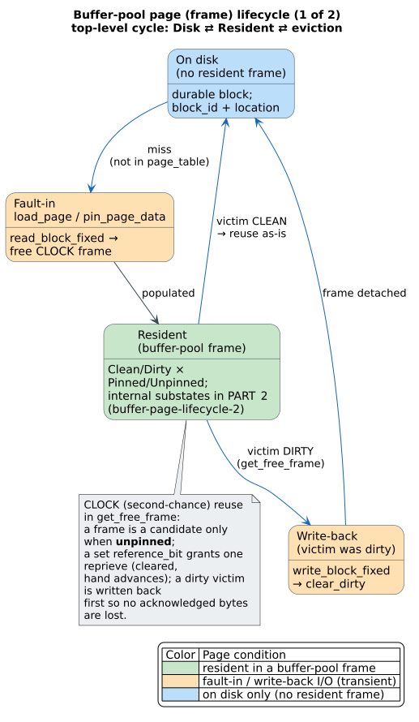
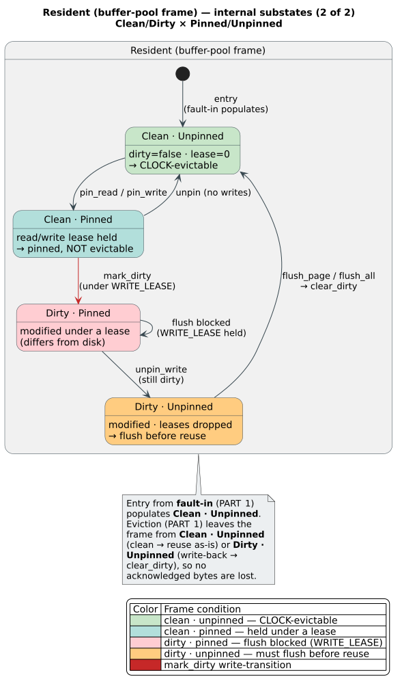

# Eviction Strategy for Persistent ARTrie

**Navigation**: [↑ Persistence architecture](README.md) · [Concurrency model](concurrency-model.md) · [Lock-free overlay](lock-free-overlay.md) · [Storage backends](storage-backends.md)

This document describes the memory pressure-driven eviction system for the persistent ARTrie (Adaptive Radix Trie) data structure: **what** each component is, **how** the pieces cooperate to reclaim RAM, and **why** the design is safe under lock-free concurrent reads.

### What eviction is, in one paragraph

The persistent ARTrie keeps hot dictionary entries resident in memory for native-speed reads, but a dictionary can be far larger than RAM. *Eviction* is the mechanism that bounds the resident set: when the operating system reports memory pressure, a background thread converts the coldest in-memory nodes back into compact on-disk references (`DiskRef`), freeing their RAM. The node's bytes are not lost — they were already written to disk at the last checkpoint, so a future access simply faults the node back in. The hard part is doing this **without blocking readers and without freeing memory a concurrent reader could still be dereferencing**; that safety property is delivered by *epoch-based reclamation* (EBR), defined below.

### Glossary (terms used throughout)

| Term | Definition |
|------|------------|
| **EBR** — epoch-based reclamation | A safe-memory-reclamation scheme. Readers announce they are active by entering a global *epoch*; a reclaimer that wants to free a node advances the epoch and then waits until every reader from the old epoch has departed before freeing, so no reader can hold a dangling pointer. Implemented by `EpochManager` in `core/concurrency.rs`. |
| **Quiescence** | The condition in which no reader from the pre-eviction epoch is still active (`active_readers == 0` after an `advance()`). Reaching quiescence is the precondition for freeing an evicted node. |
| **LRU** — least recently used | The selection policy that ranks nodes by *coldness* (a recency-and-frequency score) so the coldest nodes are evicted first and hot nodes stay resident. Implemented by `LruRegistry` in `core/eviction/lru_tracker.rs`. |
| **Urgency** | How aggressively a single eviction pass should run, derived from the memory-pressure level. The `EvictionUrgency` enum has three rungs — `Moderate`, `Urgent`, `Emergency` — that scale the batch size ($`\times 1`$/$`\times 2`$/$`\times 4`$). |
| **Swizzle / unswizzle** | A *swizzled* child pointer points at a live in-memory node (fast path); an *unswizzled* pointer is a compact `DiskRef` naming a `block_id` + location on disk. *Swizzling* faults a node in (disk → memory); *unswizzling* is the atomic swap eviction performs (memory → disk). Implemented by `SwizzledPtr` in `core/swizzled_ptr.rs`. |
| **Pin / unpin** | A buffer-pool *frame* is *pinned* while a lease (read or write) is held on it; a pinned frame may not be evicted from the pool. *Unpinning* releases the lease. |
| **Checkpoint** | The durable write of the trie to disk that (re)populates the `DiskLocationRegistry`. Only nodes registered by the most recent checkpoint are eligible for eviction. |

## Table of Contents

1. [Overview & Motivation](#overview--motivation)
2. [Architecture](#architecture)
3. [Component Documentation](#component-documentation)
4. [Data Flow](#data-flow)
5. [Concurrency & Safety](#concurrency--safety)
6. [Configuration Guide](#configuration-guide)
7. [API Reference](#api-reference)
8. [Edge Cases & Error Handling](#edge-cases--error-handling)
9. [Statistics & Monitoring](#statistics--monitoring)
10. [Source Files](#source-files)

---

## Overview & Motivation

### Problem Statement

The persistent ARTrie stores dictionary entries in memory for fast access. Without bounds on memory usage, large dictionaries can exhaust available RAM, leading to:

- Out-of-memory (OOM) crashes
- Excessive swapping and degraded performance
- Inability to process dictionaries larger than available RAM

### Solution: SQLite-Style Memory Management

The eviction system implements SQLite-style bounded memory operation:

1. **Memory pressure-driven** - Eviction is triggered by system memory pressure, not after every checkpoint
2. **Asynchronous** - Background eviction thread, non-blocking for client operations
3. **Epoch-based safety** - Uses `EpochManager` to safely evict nodes without blocking readers
4. **LRU-based selection** - Evicts "cold" (least recently used) nodes first, keeping hot data in memory

### Key Principles

| Principle | Description |
|-----------|-------------|
| **Non-blocking** | Client operations (insert, lookup, iterate) are never blocked by eviction |
| **Epoch-safe** | Nodes are only evicted after all old-epoch readers complete |
| **LRU-ordered** | Cold nodes evicted first; hot nodes stay in memory |
| **Checkpoint-aware** | Only nodes with valid disk representations can be evicted |
| **Configurable** | Thresholds, batch sizes, and timing are all tunable |

---

## Architecture

**What.** Four cooperating components, all owned by `PersistentARTrie<V>`: a `MemoryPressureMonitor` that watches the OS, an `EvictionCoordinator` that queues and serializes work, a background *eviction thread* that performs the reclamation, and two indices — the `LruRegistry` (which nodes are cold) and the `DiskLocationRegistry` (which nodes have a current disk image and may therefore be evicted).

**How.** The data flows in one direction: the monitor detects pressure and fires a callback; the callback maps the pressure *level* to an `EvictionUrgency` and enqueues a request; the eviction thread dequeues it, waits for epoch quiescence, asks the registries for the coldest evictable nodes, atomically unswizzles each ($`ChildNode \to DiskRef`$), and records statistics. The figure below traces that path end-to-end; the urgency bands are colored amber → red by severity.



*Figure 1 — The node-eviction pipeline. `MemoryPressureMonitor` classifies available RAM into `Normal`/`Low`/`Critical`; `request_eviction` maps `Low` $`\Rightarrow`$ `Moderate` and `Critical` $`\Rightarrow`$ `Emergency` (`Normal` is a no-op); the async `artrie-eviction` thread runs `cooldown → wait_for_quiescence → select_for_eviction (LRU) → atomic unswizzle → record stats`, after which the cold node lives on disk as a `DiskRef` and is re-faulted on next access.*

**Why this shape.** Detection, policy, and mechanism are separated so each can be tuned independently: the monitor's thresholds bound *when* eviction starts, the LRU policy decides *what* leaves first, and the epoch machinery makes the *mechanism* safe. Making the eviction thread asynchronous (rather than evicting inline after each checkpoint, the way naïve bounded caches do) keeps client `insert`/`lookup`/`iterate` latency off the eviction critical path.

> **Note — `MemoryPressureLevel` vs `EvictionUrgency`.** They are distinct enums. `MemoryPressureLevel` (`Normal`, `Low`, `Critical`) describes the *system*; `EvictionUrgency` (`Moderate`, `Urgent`, `Emergency`) describes *how hard a pass works*. The monitor callback in `coordinator.rs` performs the mapping: $`Normal \Rightarrow`$ no request, $`Low \Rightarrow Moderate`$, $`Critical \Rightarrow Emergency`$. (The `Urgent` rung exists for callers that invoke `request_eviction(EvictionUrgency::Urgent)` directly.)

---

## Component Documentation

### EvictionConfig

Configuration structure controlling eviction behavior.

| Field | Type | Default | Description |
|-------|------|---------|-------------|
| `enabled` | `bool` | `true` | Master switch for eviction |
| `target_memory_fraction` | `f64` | `0.70` | Target available memory after eviction (50%-90%) |
| `min_eviction_depth` | `usize` | `1` | Minimum trie depth for eviction (0=all, 1=keep root children) |
| `batch_size` | `usize` | `256` | Nodes processed per eviction cycle (16-4096) |
| `quiescence_timeout` | `Duration` | `100ms` | Max wait for epoch quiescence |
| `quiescence_poll_interval` | `Duration` | `100us` | Polling interval during quiescence wait |
| `cooldown_period` | `Duration` | `100ms` | Minimum time between eviction cycles |
| `use_lru_tracking` | `bool` | `true` | Enable LRU-based node selection |
| `enable_memory_pressure_monitor` | `bool` | `true` | Auto-start memory pressure monitoring |
| `memory_pressure_config` | `Option<MemoryPressureConfig>` | `None` | Custom memory pressure thresholds |

**Source:** `src/persistent_artrie/core/eviction/config.rs` (`EvictionConfig`)

### EvictionCoordinator

The central orchestrator for asynchronous, epoch-safe node eviction.

```rust
pub struct EvictionCoordinator {
    config: EvictionConfig,
    epoch_manager: Arc<EpochManager>,
    lru_registry: Arc<LruRegistry>,
    request_queue: Mutex<VecDeque<EvictionRequest>>, // polled by the Weak-driven worker; no condvar
    shutdown: AtomicBool,
    eviction_thread: Mutex<Option<JoinHandle<()>>>,
    stats: Arc<EvictionStatsAtomic>,
    last_eviction: AtomicU64,
    disk_registry: RwLock<DiskLocationRegistry>,
    running: AtomicBool,
    memory_monitor: RwLock<Option<Arc<MemoryPressureMonitor>>>,
}
```

The worker thread holds only a `Weak<EvictionCoordinator>` and polls `request_queue` ($`\approx`$`100 ms`), so the coordinator can be dropped promptly by its owning trie — the earlier `Condvar`-based design was removed because pinning a strong `Arc` in the worker leaked one OS thread per trie instance.

**Key Methods:**

| Method | Description |
|--------|-------------|
| `new(config, epoch_manager)` | Create coordinator in stopped state |
| `start(callback)` | Start eviction thread with byte-level callback |
| `start_char(callback)` | Start eviction thread with char-level callback |
| `start_memory_monitor()` | Enable automatic memory pressure monitoring |
| `request_eviction(urgency)` | Queue an eviction request |
| `force_eviction(target_bytes)` | Synchronous eviction for testing |
| `update_disk_registry(registry)` | Replace disk registry after checkpoint |
| `invalidate_registry()` | Mark registry invalid on write operations |
| `shutdown()` | Stop eviction thread and memory monitor |

**Source:** `src/persistent_artrie/core/eviction/coordinator.rs` (`EvictionCoordinator`)

### LruRegistry

Lock-free registry for tracking node access patterns using DashMap.

```rust
pub struct LruRegistry {
    trackers: DashMap<u64, AccessTracker>,
    epoch_start: Instant,
    max_entries: usize,
}
```

**Key Methods:**

| Method | Description |
|--------|-------------|
| `touch(path)` | Record access for a byte path |
| `touch_hash(hash)` | Record access with pre-computed hash |
| `coldness_score(path)` | Get coldness score (higher = evict first) |
| `coldness_score_hash(hash)` | Coldness score with pre-computed hash |
| `coldest_n(n)` | Get N coldest path hashes |
| `prune_to(target_size)` | Remove coldest entries to reach target |
| `path_hash(path)` | Compute FNV-1a hash for a path |

**Memory Overhead:** ~32 bytes per tracked node (8 bytes hash + 16 bytes tracker + 8 bytes DashMap overhead)

**Source:** `src/persistent_artrie/core/eviction/lru_tracker.rs` (`LruRegistry`)

### AccessTracker

Lightweight atomic tracker for individual node access patterns.

```rust
pub struct AccessTracker {
    last_access: AtomicU64,   // Epoch-relative microseconds
    access_count: AtomicU64,  // Total accesses (tie-breaker)
}
```

**Coldness Score Calculation:**

```
coldness = (now - last_access) / max(access_count, 1)
```

Higher coldness scores indicate nodes that should be evicted first (older, less frequently accessed).

**Source:** `src/persistent_artrie/core/eviction/lru_tracker.rs` (`AccessTracker`)

### DiskLocationRegistry

Maps node paths to their disk locations after checkpoint.

```rust
pub struct DiskLocationRegistry {
    locations: HashMap<u64, EvictableNode>,       // Byte-level nodes
    char_locations: HashMap<u64, EvictableCharNode>, // Char-level nodes
    total_size_bytes: usize,
    node_type_counts: HashMap<NodeType, usize>,
    valid: bool,
}
```

**EvictableNode Structure:**

| Field | Type | Description |
|-------|------|-------------|
| `path` | `Vec<u8>` | Path from root (edge labels) |
| `disk_ptr` | `SwizzledPtr` | Disk location from checkpoint |
| `size_bytes` | `usize` | Estimated memory size |
| `depth` | `usize` | Depth in trie (0 = root children) |
| `node_type` | `NodeType` | Node variant (Node4, Node16, etc.) |

**Key Methods:**

| Method | Description |
|--------|-------------|
| `register(path, ptr, size, depth, type)` | Record node's disk location |
| `select_for_eviction(target, lru, depth, max)` | Select cold nodes for eviction |
| `invalidate()` | Mark registry as invalid (on write ops) |
| `is_valid()` | Check if registry is usable |

**Memory Overhead:** ~50 bytes per node (path + 8 bytes ptr + 8 bytes size + 8 bytes depth + overhead)

**Source:** `src/persistent_artrie/core/eviction/disk_registry.rs` (`DiskLocationRegistry`)

### EpochManager

Coordinates reader/writer epochs for safe memory reclamation.

```rust
pub struct EpochManager {
    global_epoch: AtomicU64,
    active_readers: AtomicUsize,
}
```

**Key Methods:**

| Method | Description |
|--------|-------------|
| `enter_read()` | Increment reader count, return current epoch |
| `exit_read()` | Decrement reader count |
| `advance()` | Increment global epoch |
| `has_active_readers()` | Check if any readers are active |
| `wait_for_quiescence(timeout, poll)` | Wait for readers to drain |
| `try_quiescence()` | Non-blocking quiescence attempt |

**Source:** `src/persistent_artrie/core/concurrency.rs` (`EpochManager`)

---

## Data Flow

### Eviction Trigger to Completion

The end-to-end trigger-to-completion path is **Figure 1** above. In prose, the steps the async `artrie-eviction` thread performs per request are:

1. **Dequeue.** `MemoryPressureLevel::Low`/`Critical` $`\Rightarrow`$ `request_eviction(urgency)` pushes (or urgency-merges) an `EvictionRequest` onto the coordinator's `VecDeque`. The worker does **not** sleep on a condvar — it holds only a `Weak<EvictionCoordinator>`, upgrades once per iteration, and polls `try_pop_request` roughly every `100 ms`, dropping the strong reference before sleeping. (This `Weak`-driven poll replaced an earlier condvar design that leaked one OS thread per trie by keeping the coordinator alive; see `eviction_loop` in `core/eviction/coordinator.rs`.)
2. **Cooldown check.** Skip (and `record_skip`) if the request is older than `5 s` or arrives inside the cooldown window.
3. **Epoch quiescence.** `advance()` the epoch, then `wait_for_quiescence()`; on timeout, `record_quiescence_timeout` and skip the cycle.
4. **Select cold nodes.** Ask the `DiskLocationRegistry` for the coldest evictable candidates, scored by the `LruRegistry` (see the algorithm below).
5. **Unswizzle.** Invoke the callback, which atomically swaps each selected $`ChildNode \to DiskRef`$.
6. **Record statistics.** `record_eviction(nodes, bytes, duration_ms)`.

### Node Selection Algorithm

```
DiskLocationRegistry.select_for_eviction(target_bytes, lru, min_depth, max_count):

  1. FILTER: locations where depth >= min_depth

  2. SCORE: For each node, compute coldness via LruRegistry
     coldness = lru_registry.coldness_score_hash(path_hash)

  3. SORT: By coldness descending (coldest first)

  4. SELECT: Accumulate nodes until:
     - total_bytes >= target_bytes, OR
     - count >= max_count

  5. RETURN: Vec<(path_hash, EvictableNode)>
```

### Checkpoint Integration



---

## Concurrency & Safety

### Epoch-Based Reclamation (EBR)

**What.** EBR is the safe-memory-reclamation discipline that lets the eviction thread free a node while lock-free readers run concurrently, with no use-after-free. **How.** A reader brackets its traversal with `EpochManager::enter_read()` / `exit_read()`; the eviction thread calls `advance()` to open an epoch boundary, then `wait_for_quiescence()` to block until `active_readers` drains to zero, and only *then* performs the `unswizzle` swap and frees the old allocation. **Why.** Once a node pointer has been *swizzled* it is followed at native speed with no lock and no buffer-manager lookup; the only way to reclaim that node safely is to prove no reader can still hold the raw pointer — which is exactly what quiescence proves.



*Figure 2 — Epoch-based reclamation. `Reader A` pins epoch 5 and may hold a raw `*const Node` into the victim. The eviction thread `advance()`s to epoch 6 and, seeing `A` still active, **defers** the free. After `A` calls `exit_read()` and quiescence is reached, the thread `unswizzle`s the victim ($`ChildNode \to DiskRef`$) and frees it. `Reader B`, which entered after the boundary, observes the already-published `DiskRef` and faults the node back in — it never touches freed memory.*

**Guarantee:** a node is freed only after **all** readers from the pre-eviction epoch have completed. The ordering is $`advance \to wait for quiescence \to swap \to free`$.

**Memory-ordering note.** `enter_read`/`exit_read` use `SeqCst` on the `active_readers` counter, and the reclaimer's `has_active_readers()` check is also `SeqCst`. This is the StoreLoad barrier EBR requires: it guarantees that if the reclaimer's scan fails to observe a reader, that reader is guaranteed to observe the reclaimer's unlink (and re-fault a fresh node) rather than dereference a freed one. `AcqRel`/`Acquire` alone would permit the StoreLoad reordering and would **not** be sufficient (see the rationale comments on `EpochManager::enter_read` in `core/concurrency.rs`).

### Thread Safety Primitives

| Component | Primitive | Purpose |
|-----------|-----------|---------|
| `LruRegistry.trackers` | `DashMap` | Lock-free concurrent access tracking |
| `AccessTracker` fields | `AtomicU64` | Lock-free timestamp/count updates |
| `EpochManager.global_epoch` | `AtomicU64` | Lock-free epoch advancement |
| `EpochManager.active_readers` | `AtomicUsize` | Lock-free reader counting |
| `EvictionCoordinator.request_queue` | `Mutex` | Thread-safe request queueing (drained by the `Weak`-driven poll loop; no condvar) |
| `EvictionCoordinator.disk_registry` | `RwLock` | Concurrent registry access |

### The Buffer-Pool Layer Underneath (Page Lifecycle)

Node eviction (above) reclaims *trie nodes*; beneath it, the block-storage **buffer pool** manages fixed-size *pages* (256 KB frames) and is what physically reads a node in (*fault-in*) and writes a dirty node out (*flush*). Understanding the page lifecycle clarifies the $`DiskRef \to fault-in \to resident`$ round-trip that eviction reverses.

**What.** A buffer-pool frame's per-frame state (`FrameMetadata`, `core/buffer_manager.rs`) carries a `block_id`, a `lease_state` (a read-pin count or the exclusive `WRITE_LEASE`), a `dirty` flag, and a `reference_bit` for the CLOCK replacement algorithm. There is no single `enum PageState`; a page's condition is the product of $`\{\text{resident}, \text{on-disk}\} \times \{\text{clean}, \text{dirty}\} \times \{\text{pinned}, \text{unpinned}\}`$. **How.** `load_page`/`pin_page_data` fault a page in; `pin_read`/`pin_write` pin it; `mark_dirty` flags a write; `flush_page`/`flush_all` write it back and `clear_dirty`; and `get_free_frame` reuses an unpinned, unreferenced frame as a CLOCK victim. **Why.** Two invariants make this safe and are visible in the figure: a page is **never** a CLOCK victim while *pinned*, and a *dirty* page may **not** be flushed while a `WRITE_LEASE` is held (a dirty victim is written back before its frame is reused, so no acknowledged bytes are lost).




*Figure 3 — Buffer-pool page (frame) lifecycle. A page faults in from disk into a free frame, then cycles through `Clean ⇄ Dirty` (on write under a `WRITE_LEASE`) and `Pinned ⇄ Unpinned` (on lease acquire/release). A clean, unpinned frame whose `reference_bit` is clear is reused in place by the CLOCK algorithm; a dirty victim is written back (`clear_dirty`) first. In-memory states are green; the on-disk-only state is blue; fault-in / write-back I/O is amber.*

> This page-level CLOCK eviction (reclaiming a *frame* in the fixed buffer pool) is **distinct** from the node-level eviction subsystem documented above (reclaiming a cold *node*'s RAM via EBR + `DiskRef` swap). They operate at different layers and compose: node eviction turns a hot `ChildNode` into a `DiskRef`; a later access re-faults it through this buffer pool.

### Non-Blocking Guarantees

| Operation | Blocking Behavior |
|-----------|-------------------|
| `touch_node()` | Non-blocking (atomic DashMap ops) |
| `request_eviction()` | Non-blocking (brief `request_queue` mutex; no condvar) |
| `lookup()` / `contains()` | Non-blocking (epoch enter/exit) |
| `insert()` | Non-blocking (invalidates registry) |
| Actual eviction | Happens in background thread only |

---

## Configuration Guide

### Preset Configurations

| Profile | Use Case | `target_memory_fraction` | `min_eviction_depth` | `batch_size` |
|---------|----------|--------------------------|----------------------|--------------|
| `default()` | Balanced workloads | 0.70 | 1 | 256 |
| `memory_constrained()` | Limited RAM systems | 0.80 | 0 | 512 |
| `read_optimized()` | Read-heavy workloads | 0.50 | 3 | 128 |
| `disabled()` | Testing, unlimited RAM | N/A | N/A | N/A |
| `without_memory_monitor()` | Manual eviction only | 0.70 | 1 | 256 |

### Configuration Examples

**Default (Balanced):**
```rust
let config = EvictionConfig::default();
// enabled: true
// target_memory_fraction: 0.70
// min_eviction_depth: 1
// batch_size: 256
// use_lru_tracking: true
// enable_memory_pressure_monitor: true
```

**Memory-Constrained Environment:**
```rust
let config = EvictionConfig::memory_constrained();
// target_memory_fraction: 0.80 (more aggressive)
// min_eviction_depth: 0 (all nodes evictable)
// batch_size: 512 (larger batches)
// shorter timeouts and cooldowns
```

**Read-Heavy Workload:**
```rust
let config = EvictionConfig::read_optimized();
// target_memory_fraction: 0.50 (keep more in memory)
// min_eviction_depth: 3 (protect upper tree levels)
// batch_size: 128 (smaller, less disruptive)
// longer timeouts
```

**Custom Configuration:**
```rust
let config = EvictionConfig {
    enabled: true,
    target_memory_fraction: 0.75,
    min_eviction_depth: 2,
    batch_size: 512,
    quiescence_timeout: Duration::from_millis(200),
    quiescence_poll_interval: Duration::from_micros(50),
    cooldown_period: Duration::from_millis(50),
    use_lru_tracking: true,
    enable_memory_pressure_monitor: true,
    memory_pressure_config: Some(MemoryPressureConfig {
        low_memory_threshold: 0.25,      // 25% available triggers Low
        critical_memory_threshold: 0.10, // 10% available triggers Critical
        ..Default::default()
    }),
};
```

### Tuning Guidelines

| Scenario | Recommendation |
|----------|----------------|
| Large dictionary, limited RAM | Increase `batch_size`, decrease `min_eviction_depth` |
| Read-heavy workload | Increase `min_eviction_depth`, decrease `target_memory_fraction` |
| Write-heavy workload | Increase `cooldown_period` to reduce thrashing |
| Latency-sensitive | Decrease `batch_size`, increase `quiescence_timeout` |
| Memory spikes | Decrease `low_memory_threshold` for earlier eviction |

---

## API Reference

### EvictableARTrie Trait

```rust
pub trait EvictableARTrie: ARTrie {
    /// Enable memory pressure-driven eviction.
    ///
    /// Starts a background eviction thread that monitors memory pressure
    /// and evicts cold nodes to disk when pressure is detected.
    fn enable_eviction(&mut self, config: EvictionConfig) -> Result<()>;

    /// Disable eviction and release resources.
    ///
    /// Stops the background eviction thread. Nodes in memory remain
    /// in memory until the trie is closed.
    fn disable_eviction(&mut self) -> Result<()>;

    /// Check if eviction is currently enabled.
    fn eviction_enabled(&self) -> bool;

    /// Get eviction statistics snapshot.
    fn eviction_stats(&self) -> EvictionStats;

    /// Manually trigger eviction (for testing/debugging).
    ///
    /// Forces immediate eviction, bypassing memory pressure checks.
    /// Returns (nodes_evicted, bytes_freed).
    fn force_eviction(&mut self, target_bytes: usize) -> Result<(usize, usize)>;

    /// Record a node access for LRU tracking.
    ///
    /// Called internally during traversal. User code typically
    /// does not need to call this directly.
    fn touch_node(&self, path: &[Self::Unit]);
}
```

**Source:** `src/artrie_trait.rs:624`

### Usage Example

```rust
use libdictenstein::persistent_artrie::{PersistentARTrie, EvictionConfig};
use libdictenstein::EvictableARTrie;

// Create or open a trie
let mut trie = PersistentARTrie::<()>::create("words.part")?;

// Enable memory pressure-driven eviction
let config = EvictionConfig::default();
trie.enable_eviction(config)?;

// Normal operations continue...
trie.insert("hello");
trie.insert("world");

// Checkpoint to create disk representations
trie.checkpoint()?;

// Eviction happens automatically when memory pressure is detected
// Check stats for eviction activity
let stats = trie.eviction_stats();
println!("Nodes evicted: {}", stats.nodes_evicted);
println!("Bytes freed: {} MB", stats.bytes_freed / (1024 * 1024));
println!("Eviction cycles: {}", stats.eviction_cycles);

// Manual eviction for testing
let (nodes, bytes) = trie.force_eviction(1024 * 1024)?; // Target 1MB
println!("Manually evicted {} nodes ({} bytes)", nodes, bytes);

// Disable eviction when done
trie.disable_eviction()?;
```

---

## Edge Cases & Error Handling

### Root Node Protection

The root node is **never evicted**. This ensures:
- The trie always has a valid entry point
- Path navigation always starts from a valid in-memory node

```rust
fn evict_node_at_path(&mut self, path: &[u8], disk_ptr: SwizzledPtr) -> bool {
    if path.is_empty() {
        // Cannot evict root
        return false;
    }
    // ...
}
```

### Dirty Nodes (Modified After Checkpoint)

Nodes modified after the last checkpoint cannot be evicted because:
1. Their disk representation is stale
2. Evicting them would lose uncommitted changes

The `DiskLocationRegistry` is **invalidated** on any write operation:

```rust
pub fn invalidate_registry(&self) {
    self.disk_registry.write().invalidate();
}
```

Eviction is skipped when the registry is invalid:

```rust
if !disk_registry.is_valid() {
    return (0, 0);
}
```

### Concurrent Reads During Eviction

Epoch-based safety ensures readers are not affected:

1. **Before eviction:** Epoch is advanced
2. **During quiescence wait:** All old-epoch readers complete
3. **During eviction:** New readers see updated epoch, old readers have finished
4. **Result:** No reader observes a partially-evicted node

### Quiescence Timeout Handling

If readers don't drain within the timeout:

```rust
if !self.wait_for_quiescence() {
    self.stats.record_quiescence_timeout();
    continue; // Skip this eviction cycle
}
```

The eviction cycle is skipped (not retried with a longer timeout) to prevent indefinite blocking. The next memory pressure event will trigger another attempt.

### Registry Invalidation on Writes

Any write operation (insert, remove) invalidates the disk registry:

```rust
// In insert():
if let Some(coordinator) = &self.eviction_coordinator {
    coordinator.invalidate_registry();
}
```

A new registry is populated during the next checkpoint.

### Already-Evicted Nodes

Attempting to evict an already-evicted node (DiskRef) is a no-op:

```rust
match child {
    ChildNode::DiskRef { .. } => {
        // Already evicted
        return false;
    }
    ChildNode::Bucket(_) | ChildNode::ArtNode { .. } => {
        // Replace with DiskRef
        *child = ChildNode::DiskRef { ptr: disk_ptr };
        return true;
    }
}
```

---

## Statistics & Monitoring

### EvictionStats Structure

```rust
pub struct EvictionStats {
    pub nodes_evicted: u64,           // Total nodes evicted
    pub bytes_freed: u64,             // Total bytes freed
    pub eviction_cycles: u64,         // Completed eviction cycles
    pub last_eviction_duration_ms: u64, // Duration of last cycle
    pub eviction_requests: u64,       // Total eviction requests received
    pub skipped_evictions: u64,       // Skipped (cooldown/timeout)
    pub quiescence_timeouts: u64,     // Epoch quiescence timeouts
}
```

### Derived Metrics

| Metric | Formula | Meaning |
|--------|---------|---------|
| `nodes_per_cycle()` | `nodes_evicted / eviction_cycles` | Average eviction efficiency |
| `bytes_per_cycle()` | `bytes_freed / eviction_cycles` | Average memory freed per cycle |
| `skip_rate()` | `skipped_evictions / eviction_requests` | Fraction of skipped requests |

### Monitoring Example

```rust
let stats = trie.eviction_stats();

println!("=== Eviction Statistics ===");
println!("Total nodes evicted: {}", stats.nodes_evicted);
println!("Total bytes freed: {} MB", stats.bytes_freed / (1024 * 1024));
println!("Eviction cycles: {}", stats.eviction_cycles);
println!("Avg nodes/cycle: {:.1}", stats.nodes_per_cycle());
println!("Avg bytes/cycle: {:.1} KB", stats.bytes_per_cycle() / 1024.0);
println!("Last cycle duration: {} ms", stats.last_eviction_duration_ms);
println!("Skip rate: {:.1}%", stats.skip_rate() * 100.0);
println!("Quiescence timeouts: {}", stats.quiescence_timeouts);
```

### Health Indicators

| Indicator | Healthy Range | Action if Unhealthy |
|-----------|---------------|---------------------|
| Skip rate | < 30% | Increase `cooldown_period` |
| Quiescence timeouts | < 5% of cycles | Increase `quiescence_timeout` |
| Avg nodes/cycle | > batch_size * 0.5 | Check that checkpoint is being called |
| Last cycle duration | < 100ms | Decrease `batch_size` if latency-sensitive |

---

## Source Files

The eviction subsystem lives under the unit-agnostic `core/` of the persistent ARTrie crate (`src/persistent_artrie/core/`).

| File | Content |
|------|---------|
| `src/persistent_artrie/core/eviction/mod.rs` | Module structure, public exports (`EvictionConfig`, `EvictionCoordinator`, `DiskLocationRegistry`, `LruRegistry`, `AccessTracker`) |
| `src/persistent_artrie/core/eviction/config.rs` | `EvictionConfig` (incl. `resident_budget_bytes`), `EvictionUrgency` (`Moderate`/`Urgent`/`Emergency`), `EvictionStats`, `EvictionStatsAtomic` |
| `src/persistent_artrie/core/eviction/coordinator.rs` | `EvictionCoordinator` — request queue, `Weak`-driven async eviction loop, cooldown/quiescence, byte+char+resident-budget eviction arities |
| `src/persistent_artrie/core/eviction/lru_tracker.rs` | `LruRegistry`, `AccessTracker`, FNV-1a path hashing, coldness scoring |
| `src/persistent_artrie/core/eviction/disk_registry.rs` | `DiskLocationRegistry`, `EvictableNode`/`EvictableCharNode`, `select_for_eviction`, resident-estimate helpers |
| `src/persistent_artrie/core/memory_monitor.rs` | `MemoryPressureMonitor`, `MemoryPressureLevel` (`Normal`/`Low`/`Critical`), `MemoryPressureConfig`, `sysinfo`/PSI-based detection |
| `src/persistent_artrie/core/concurrency.rs` | `EpochManager` (EBR: `enter_read`/`exit_read`/`advance`/`wait_for_quiescence`) and `EpochGuard` |
| `src/persistent_artrie/core/swizzled_ptr.rs` | `SwizzledPtr` — atomic `swizzle`/`unswizzle`, `DiskLocation`, `NodeType` |
| `src/persistent_artrie/core/buffer_manager.rs` | Buffer-pool frame (`FrameMetadata`) lifecycle (pin/unpin, mark-dirty, flush, CLOCK eviction) |
| `src/artrie_trait.rs` | `EvictableARTrie` trait definition (`enable_eviction`, `force_eviction`, `eviction_stats`, `touch_node`) |

> The byte/char/vocab `EvictableARTrie` *implementations* are wired through each variant's Phase-6 eviction sub-modules (e.g. `src/persistent_artrie/*/eviction*.rs` and the `atomic_ops`/`persist` sub-modules), which adapt the shared `core/eviction` machinery to that variant's node type. Overlay eviction is functional and proven for the byte and char variants (the shared `OverlayEvictable` primitives in `core/overlay/evict.rs`, driven from the eviction coordinator and the checkpoint-integrated callback); the vocab variant installs a no-op eviction callback for API parity (its overlay-only vocabulary never evicts finals).

## Related documentation

- [Concurrency model](concurrency-model.md) — the F4 lock hierarchy (`EC` is the eviction-coordinator leaf), the `serial_disk_ptr` eviction-safety stamp, and epoch-based reclamation in full.
- [Lock-free overlay](lock-free-overlay.md) — the immutable `OverlayNode` whose cold subtrees eviction unswizzles into a `Child::OnDisk(SwizzledPtr)` (the on-disk *DiskRef* of this document), and the read-path fault-in.
- [Durability & recovery](durability-and-recovery.md) — the checkpoint that writes a node's bytes to disk *before* eviction can reclaim its RAM, so an evicted node is never lost.
- [Persistence architecture](README.md) — the whole stack, with eviction as a cross-cutting concern.

## References

- K. Fraser. *Practical Lock-Freedom.* PhD thesis, University of Cambridge, 2004 — epoch-based
  reclamation (EBR), the safe-memory-reclamation discipline used here. Technical Report
  [UCAM-CL-TR-579](https://www.cl.cam.ac.uk/techreports/UCAM-CL-TR-579.html).
- *Dynamic Memory Allocation in SQLite* — the bounded page-cache / capped-memory model this
  subsystem's `resident_budget_bytes` design follows. <https://www.sqlite.org/malloc.html>

*(The **CLOCK** second-chance victim selection and the **LRU** coldness heuristic are classical
page-cache algorithms, described mechanically in the sections above.)*
