# Persistent Storage Architecture

This document describes the current persistent storage architecture used by the
`persistent-artrie` feature. It covers the byte/char/u64 ARTrie family,
`PersistentVocabARTrie`, and the native persistent suffix graph variants.

## Terms Used In This Document

The following terms recur throughout; each is defined here at first use so the
rest of the document can rely on it.

| Term | Definition |
|------|------------|
| **mmap** | *Memory-mapped file I/O* (`mmap(2)`): the on-disk block file is mapped into the process address space, so the kernel page cache faults pages in on access and writes them back lazily. `MmapDiskManager` is the default backend built on this. |
| **`O_DIRECT`** | A Linux `open(2)` flag that bypasses the kernel page cache, transferring data directly between the device and aligned user buffers. `IoUringDiskManager` opens block files `O_DIRECT` so durability is device-level rather than page-cache-deferred. |
| **WAL** | *Write-Ahead Log* — an append-only durability journal. A mutation's record is appended (and, for immediate durability, `fsync`-ed) **before** the mutation becomes visible, so an acknowledged write can always be replayed after a crash. This is the classic ARIES discipline of Mohan et al. 1992 (https://doi.org/10.1145/128765.128770). |
| **CX image** | The *compacted/dense checkpoint image* — a self-contained on-disk projection of the live trie that a reopen can load in one pass, before replaying the WAL tail. "CX" denotes the path-compressed dense encoding the checkpoint emits. |
| **checkpoint** | The act of folding the currently published state into a fresh CX image and recording how far the WAL may be safely reclaimed (the `checkpoint_lsn`). See [Checkpoint Flips](#checkpoint-flips). |
| **overlay** | The lock-free, copy-on-write set of immutable nodes that is the **live representation** of every ARTrie variant. Readers traverse the published root; writers publish a modified path by atomic compare-and-swap (CAS). The structural sharing is the persistent-data-structure technique of Driscoll et al. 1989 (https://doi.org/10.1016/0022-0000(89)90034-2). |
| **LSN** | *Log Sequence Number* — the monotonically increasing identifier stamped on each WAL record; `checkpoint_lsn` is the largest LSN whose effects are captured in the CX image. |

## The Persistence Stack

Every persistent ARTrie variant is built from the same layered stack. A **write**
descends the stack — it must reach a durable WAL record *before* the overlay
publishes it — while a **read** traverses only the lock-free overlay and never
touches the WAL, buffer manager, or disk on the hot path.



The stack maps directly onto the source tree under
[`src/persistent_artrie/core/`](../../src/persistent_artrie/core/):

1. **Client API** — `PersistentARTrie` / `…Char` / `…U64Compact` / `PersistentVocabARTrie`.
2. **Lock-free overlay** (`core/overlay/`) — `flip.rs` (install overlay, atomic
   root), `cas_walk.rs` (copy-on-write path + child/root CAS), `durable_write.rs`
   (the Order-A write skeleton), `checkpoint.rs` (capture-live → publish CX image).
3. **WAL + durability** (`core/wal/`, `core/durability.rs`,
   `core/committed_watermark.rs`) — append/`fsync`, the `DurabilityPolicy`
   (`Immediate` vs `GroupCommit`), and the committed-watermark machinery that
   yields the only safe `checkpoint_lsn`.
4. **Buffer manager** (`core/buffer_manager.rs`, `core/dirty_tracker.rs`) — the
   frame pool, fault-in, and batched dirty-page flush (infrastructure).
5. **Disk manager** (`core/disk_manager.rs` = `MmapDiskManager` default,
   `core/io_uring_disk_manager.rs` = `IoUringDiskManager` + `O_DIRECT`).
6. **Arena / block storage** (`core/arena_slot.rs`, `core/block_storage.rs`,
   `core/swizzled_ptr.rs`) — `256 KB` blocks addressed by swizzled pointers.

This layout obeys a **layering invariant** that is both documented and
grep-verified: `core/` has zero `use` of the byte/char/vocab variants, and the
byte variant has zero `use` of char/vocab. See
[the persistence-architecture README](../architecture/persistence/README.md) for
the corresponding module-import graph.

## Current Persistent Families

| Family | Live representation | Durable image | Write concurrency |
|--------|---------------------|---------------|-------------------|
| `PersistentARTrie` / `PersistentARTrieChar` | Lock-free overlay nodes over `ByteKey` / `CharKey` | CX checkpoint image + WAL | WAL-before-CAS lock-free publication |
| `PersistentARTrieU64Compact` | Lock-free overlay nodes over native `U64Key` | u64 CX checkpoint image + shared WAL records | WAL-before-CAS lock-free publication |
| `PersistentVocabARTrie` | Lock-free char overlay at `V = u64` + reverse map | Dense char overlay checkpoint + WAL | WAL-before-CAS lock-free publication |
| `PersistentSuffixAutomaton` / `PersistentSuffixTree` / `PersistentScdawg` | Immutable native suffix graph snapshot | Native graph snapshot + operation-segment WAL, with legacy monolithic WAL replay | Rebuild candidate graph, CAS publish winner |

The older owned-tree/native-bincode snapshot paths are **not** the live
representation for the ARTrie family. The u64 ARTrie in particular no longer
keeps the removed bincode-based snapshot/WAL format in source; old formats can be
examined from git history when needed for benchmark controls. (This corrects an
earlier note that described the u64 path as "REJECTED" bincode — the honest
statement is that the bincode path was *removed*, not merely rejected, and the
overlay+CX path is what ships.)

## Files And Recovery

Persistent dictionaries store two kinds of files:

- A checkpoint image, usually at the path passed to `create`.
- A WAL beside it, usually with the `.wal` extension or variant-specific naming.

On open/recovery, the implementation loads the latest checkpoint image and
replays retained WAL records — specifically the tail with `LSN ≥ checkpoint_lsn`.
Checkpoints are conservative: they publish a dense image but retain enough WAL
state to recover acknowledged operations after a crash. Experimentation with WAL
truncation and compaction is documented in the benchmark/design ledgers, not
assumed by the public API.

## ARTrie Overlay And CX Checkpoints

The byte, char, vocab, and u64 ARTrie variants share the same core shape:

```text
client operation
    -> append durable WAL record        (Order-A: log before publish)
    -> clone/modify immutable overlay path
    -> publish new root by CAS           (the visibility = linearization point)
    -> checkpoint captures overlay as a dense CX image
```

Overlay nodes are immutable after publication. Writers allocate a modified copy
of the affected path — `O(|key|)` new nodes, with the rest of the structure
shared by pointer per Driscoll et al. 1989
(https://doi.org/10.1016/0022-0000(89)90034-2) — and attempt to publish it with
atomic root or child-pointer CAS. Readers traverse the currently published root
and do not take a global mutation lock.

Immediate durable writes still wait for WAL append/`fsync`, and the synchronous
WAL writer serializes file writes. The lock-free/non-blocking claim for the
ARTrie family is the overlay traversal and publication path: reads do not wait on
a mutation lock, and writers do not serialize through a trie-wide mutation lock
before publishing their immutable path copy. The crash contract is the ARIES
contract of Mohan et al. 1992 (https://doi.org/10.1145/128765.128770): a write is
acknowledged *iff* its record is durably in the WAL — `fsync`-ed records are
replayed on recovery, and a record that was never `fsync`-ed was never
acknowledged.

`KeyEncoding` selects the persistent key model:

- `ByteKey`: byte keys (`u8` units)
- `CharKey`: Unicode scalar keys stored as `u32` units
- `U64Key`: native `u64` sequence keys

The shared `AdaptiveEdgeStore` stores child edges without forcing all labels into
bytes. Byte labels use the ART-style Node4/16/48/256 tiers; char and u64 labels
use inline, sorted, and sparse-indexed native-label storage.

## Checkpoint Flips

A **checkpoint flip** folds the live overlay into a dense CX image and advances
the durable reclamation watermark — all under the checkpoint lock so concurrent
checkpoints are serialized. The data-loss-critical rule is that the checkpoint
must capture the **live representation** (the overlay), publish that as a dense
CX image, and only then advance the committed-watermark `checkpoint_lsn`.


The flow, mirroring
[`core/overlay/checkpoint.rs`](../../src/persistent_artrie/core/overlay/checkpoint.rs)
(`OverlayCheckpoint::checkpoint_route_split`):

1. **Acquire the checkpoint lock** and read the committed watermark with `Acquire`
   ordering *before* loading the root (the capture-ordering invariant: the
   snapshot is a subset of the committed-durable prefix).
2. **Capture the live representation** — walk the immutable overlay root into
   freshly-allocated arena slots, producing a frozen, self-consistent snapshot.
3. **RES-4 total-loss guard.** A checkpoint must never publish a degenerate
   capture (an empty or again-evicted tree) while the overlay is the live write
   target — doing so would silently lose every term on the next reopen.
   Historically this was a route-split footgun; since the owned tree was deleted,
   `route_overlay()` is universally true and the guard is the entry
   `debug_assert!(route_overlay())` that documents the invariant. It is modelled
   in the diagram as a guarded transition that refuses to publish an empty
   capture.
4. **Publish the dense CX image** — serialize the snapshot to the on-disk CX image
   and **retain** the WAL via a `Checkpoint` record (no double-counting); when an
   eviction coordinator is installed, this is a publish-after-verify into the
   eviction registry.
5. **Advance the watermark** — record `checkpoint_lsn = committed watermark` and
   raise the `commit_seq` floor (the only safe reclaim bound under out-of-order
   lock-free commit).
6. **Release the lock** and resume; reads were never blocked on the overlay.

## U64 Profile Formats

`PersistentARTrieU64Compact` is the default profile. It uses `U64Key` with a
prefix-4 CX budget and stores one native `u64` edge per transition. It is the
profile for new time-series or token-sequence data.

`PersistentARTrieU64Prefix3Compat` uses the prefix-3 CX budget. It exists for
opening prefix-3 images and for benchmark/control comparisons. New code should
name the compact alias unless it intentionally needs prefix-3 compatibility.

The u64 checkpoint format is a native u64 CX projection. It uses swizzled-pointer
raw tokens internally as node indexes in the checkpoint image, not as the old
native bincode tree snapshot.

## Persistent Suffix Graphs

Persistent suffix graph variants are not ARTrie overlays. They persist native
substring graph records:

- `PersistentSuffixAutomaton` stores a suffix automaton graph.
- `PersistentSuffixTree` stores a compact suffix-tree-compatible graph with
  handles for frequency and locations.
- `PersistentScdawg` stores a compact SCDAWG graph with bidirectional substring
  metadata.

Each byte/char pair stores active source or term records, appends prepared and
commit operation segment records, rebuilds a candidate graph revision for writes,
and publishes the winning revision by CAS. Recovery also accepts the historical
monolithic operation WAL. Reads traverse immutable graph snapshots without taking
a writer lock; writers may retry on CAS contention and still wait for WAL
durability before acknowledgement.

## Storage Backends

`MmapDiskManager` is the default block storage implementation. With
`io-uring-backend`, persistent constructors are also available over the Linux
`io_uring` block manager (`IoUringDiskManager`, opened `O_DIRECT`). The two
backends sit behind the same `BlockStorage` seam and present the same persistent
dictionary APIs; callers normally choose by type parameter or feature-gated
constructor.

The choice is workload-driven, and the difference is measured rather than
assumed: **mmap wins single-block I/O** because the kernel page cache absorbs the
fault (and `msync` only marks pages dirty — it is not an `fsync`), while
**`io_uring` + `O_DIRECT` wins batch I/O and true durability** because one
submission drains many requests and the transfer bypasses the page cache. The
side-by-side comparison and the full numeric evidence are in
[the io_uring migration results](../io_uring_migration/benchmark_results.md).

## Benchmark Evidence

Earlier fixed-sample u64 experiments used a seeded time-series workload and
Welch's unequal-variance t-test. The compact prefix-4 profile produced a
`656,679` byte checkpoint versus `1,585,249` bytes for byte-encoded `u64` keys,
and lookup averaged `350.72 ns/query` versus `455.01 ns/query` for the encoded
control. The prefix-4 checkpoint budget also reduced bytes per entry versus the
prefix-3 profile (`320.97` vs `336.74`). Raw samples were appended to pgmcp
artifacts `111` and `112`.

The post-watermark/CommitRank registered pgmcp run on 2026-06-13 appended new
evidence after native u64 was aligned with the byte/char Order-A WAL discipline.
The native prefix-4 profile beat byte-encoded u64 lookup (`357.25 ns/query` vs
`455.35`, `p = 2.82e-35`) and the eight-reader/one-writer read path
(`148.35 ns/read` vs `204.30`, `p = 4.42e-9`). Prefix-4 checkpoint density beat
prefix-3 (`453.98` vs `469.76` bytes/entry, `p = 4.61e-127`). The raw ledger is
[`docs/experiments/persistent-u64-watermark-commitrank-2026-06-13.md`](../experiments/persistent-u64-watermark-commitrank-2026-06-13.md);
pgmcp experiments `53`-`55` and artifact `132` hold the structured records.
