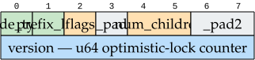
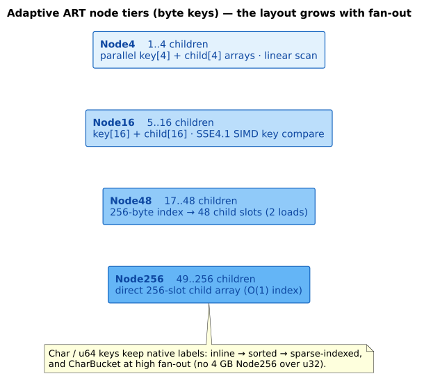

# Storage backends & the on-disk format

**Navigation**: [↑ Persistence architecture](README.md) · [Durable-storage kernel](durable-storage-kernel.md) · [WAL format](wal-format.md) · [Durability & recovery](durability-and-recovery.md)

This document covers the **bottom of the stack**: the `BlockStorage` seam, the two shipped
backends (`MmapDiskManager` and `IoUringDiskManager`), the buffer manager, and the exact
**on-disk byte format** — the block-0 `FileHeader`, arena pages, B-trie buckets, pointer
swizzling, and the adaptive edge storage that packs a node's children. The layers *above*
this — the overlay, durability, and checkpoint machinery — are in
[lock-free-overlay.md](lock-free-overlay.md) and
[durability-and-recovery.md](durability-and-recovery.md).

## Terms of art (defined before first use)

| Term | Definition |
|------|-----------|
| **mmap** | *Memory-mapped file I/O* (`mmap(2)`): the block file is mapped into the process address space, so the kernel page cache faults pages in on access and writes them back lazily. |
| **`O_DIRECT`** | A Linux `open(2)` flag that bypasses the kernel page cache, transferring data directly between device and aligned user buffers — so durability is device-level rather than page-cache-deferred. |
| **block** | The fixed I/O unit: $\text{BLOCK\_SIZE} = 256\text{ KB}$. Block $0$ is the header; blocks $1..N$ hold data. |
| **arena** | A block subdivided into fixed-size *slots* that pack many small nodes, amortizing per-node allocation and I/O. |
| **bucket** | A B-trie leaf page holding many short suffixes with binary search, so a subtree of tiny leaves collapses to one page (Askitis & Zobel 2009). |
| **swizzling** | Encoding a child link as *either* an in-memory pointer *or* an on-disk block location in one 64-bit word, so subtrees load lazily. |

## The `BlockStorage` seam

Everything above the disk is generic over `S: BlockStorage` (`core/block_storage.rs`), so a
trie runs unchanged over mmap, `io_uring`, or a custom backend (see
[durable-storage-kernel.md](durable-storage-kernel.md#seam-1--blockstorage-the-storage-backend)).
The seam models a file as blocks: block $0$ carries the 64-byte `FileHeader`; blocks
$1..N$ each hold $256\text{ KB}$; block IDs are 24-bit, so a single file addresses
$2^{24}$ blocks $= 4\text{ TB}$. All I/O buffers are `AlignedBlock`s
(`#[repr(C, align(4096))]`) — 4096-byte alignment satisfies `O_DIRECT`, and because
$256\text{ KB}$ is already a multiple of 4096 the alignment costs zero padding, so one
buffer pool serves both backends.

### The two backends — a workload-driven choice

| | `MmapDiskManager` (default) | `IoUringDiskManager` (feature `io-uring-backend`) |
|---|-----------------------------|---------------------------------------------------|
| Mechanism | `mmap` + kernel page cache | `io_uring` submission queue + `O_DIRECT` |
| Wins on | **single-block I/O** (page cache absorbs the fault) | **batch I/O + true durability** (one submission drains many; bypasses the cache) |
| Durability of a flush | `msync` marks pages dirty (not an `fsync`) | device-level on completion |

The difference is *measured, not assumed*: the full side-by-side numbers are in
[the io_uring migration results](../io_uring_migration/benchmark_results.md). Both backends
sit behind the same `BlockStorage` seam and present identical dictionary APIs; callers
choose by type parameter or feature-gated constructor.

## The buffer manager

`BufferManager<S>` (`core/buffer_manager.rs`) is the page cache between the trie and the
block backend. It pools fixed-size frames, faults a block in on first access, hands out
`PageReadGuard` / `PageWriteGuard`, and — paired with `DirtyTracker` — batches dirty-page
flushes so a checkpoint writes clean subtrees once. On `io_uring` it pre-registers its pool
for `ReadFixed`/`WriteFixed` and unregisters on `Drop`. Buffer-pool sizing can adapt to hit
rate and memory pressure via `AdaptivePoolController` (`core/adaptive_pool.rs`).

## The on-disk format

### Block 0 — the `FileHeader`

The first 64 bytes of block 0 are the `#[repr(C, align(64))]` `FileHeader`; the remaining
bytes of block 0 hold the durable checkpoint descriptor. Per-field layout:

| Field | Bytes | Meaning |
|-------|-------|---------|
| `magic` | 0–7 | `0x5041525400010000` = `"PART"` + v1.0. Variants stamp their own trie-file magic via `KeyEncoding::FILE_MAGIC` (`b"PART"`/`b"ARTC"`/`b"AR64"`). |
| `version` | 8–11 | `FORMAT_VERSION = 2`. A reader rejects a file whose version exceeds what it supports. |
| `flags` | 12–15 | reserved. |
| `root_ptr` | 16–23 | the swizzled root pointer (`AtomicU64`). |
| `block_count` | 24–27 | total allocated blocks (`AtomicU32`). |
| `_pad1` | 28–31 | alignment padding. |
| `free_list_head` | 32–39 | head of the free-block list (`0` = none). |
| `entry_count` | 40–47 | dictionary entry count. |
| `checksum` | 48–55 | CRC-64 of the header (excluding this field). |
| `image_checkpoint_lsn` | 56–63 | **#48** image-coverage frontier — the max WAL LSN folded into *this* image, written atomically with it, so reopen's $\max(\text{wal\_record}, \text{this})$ avoids double-apply. Folded into the checksum only for v2+ files, so v1 files still validate byte-identically. |

### Data blocks — arenas, buckets, and node headers

Interior nodes are packed into **arena pages** (`ArenaHeader` + fixed-size slots;
`ARENA_MAGIC` / `ARENA_MAGIC_V2`), so many small nodes share one 256 KB block and one I/O.
Each serialized node opens with a 16-byte `NodeHeader` (`node_type`, `prefix_len`, `flags`,
`num_children`, and a `u64` optimistic-lock `version`):

High-fan-out *string* leaves — a subtree of many short suffixes — collapse into a **B-trie
bucket** (`StringBucket` + `BucketHeader`; `BUCKET_MAGIC`, an 8192-byte page, up to 256
entries, binary-searched, split on overflow), the disk-based burst-trie leaf of Askitis &
Zobel 2009. Compact node encoding (`compact_encoding.rs`) and relative child-pointer
encoding (`relative_encoding.rs`, with `FLAG_RELATIVE_OFFSETS` / `FLAG_CROSS_ARENA` /
`FLAG_SEQUENTIAL_SIBLINGS`) shrink the on-disk footprint further.

### Pointer swizzling

A child link is a `SwizzledPtr` (`core/swizzled_ptr.rs`) — one 64-bit word that is *either*
an in-memory pointer *or* a `DiskLocation` block reference. Children start as disk
references and are *swizzled* to memory pointers on first access, so a large trie loads
lazily rather than all at once:

In the current lock-free overlay, swizzling appears only in the `Child::OnDisk(SwizzledPtr)`
arm of the owned `Child` enum — resident children are owned `Arc`s (see
[lock-free-overlay.md](lock-free-overlay.md)).

## Adaptive edge storage

A node stores its children in a shared `AdaptiveEdgeStore` (`core/adaptive_edge_store.rs`)
that adapts its representation to fan-out, so a node is never larger than its child count
demands. For **byte** keys this is the ART growth ladder of Leis et al. 2013; for **char**
and **`u64`** keys the labels stay native (a 256-slot dense array over `u32`/`u64` would be
absurd), using inline, sorted, or sparse-indexed storage instead:

| Fan-out | Byte keys (`ByteKey`) | Char / `u64` keys |
|---------|-----------------------|-------------------|
| tiny | `Node4` — parallel key/child arrays, linear scan | inline `SmallVec`, linear scan |
| small | `Node16` — **SIMD** key compare (SSE4.1 for `u8`, AVX2 for `u32`) | inline `SmallVec`, binary search |
| medium | `Node48` — 256-entry index → 48 child slots | sorted keys, binary search |
| dense | `Node256` — direct 256-slot array | `SparseIndexed` (positions + entries); char high fan-out uses `CharBucket` (no `Node256` — a `u32` dense array would be 4 GB) |

Path compression collapses single-child chains: a node stores a compressed prefix capped at
`KeyEncoding::MAX_PREFIX_LEN` — $12$ bytes for `ByteKey`, $6$ code points ($24$ bytes) for
`CharKey`, and `PREFIX` units for `U64Key<PREFIX>`. The theory is in
[disk-trie foundations](../theory/disk-tries/03-adaptive-radix-tree.md).

## `u64` profile formats

`PersistentARTrieU64Compact` (the default `u64` profile) uses `U64Key<4>` — a prefix-4 CX
checkpoint budget with one native `u64` edge per transition — for time-series and
token-sequence data. `PersistentARTrieU64Prefix3Compat` uses `U64Key<3>`, kept for opening
prefix-3 images and as a benchmark control. The `u64` checkpoint is a native `u64` CX
projection using swizzled raw tokens as node indexes — *not* the removed native-bincode tree
snapshot. See [native-u64-and-cx.md](../algorithms/native-u64-and-cx.md).

## Benchmark evidence

Fixed-sample `u64` experiments (seeded time-series workload, Welch's unequal-variance
$t$-test) measured the compact prefix-4 profile at a $656{,}679$-byte checkpoint versus
$1{,}585{,}249$ bytes for byte-encoded `u64` keys, and lookup at $350.72\text{ ns/query}$
versus $455.01\text{ ns/query}$ for the encoded control; prefix-4 also cut bytes-per-entry
versus prefix-3 ($320.97$ vs $336.74$). After native `u64` was aligned with the byte/char
Order-A WAL discipline, the 2026-06-13 registered run reconfirmed the native prefix-4
profile beating byte-encoded `u64` lookup ($357.25$ vs $455.35\text{ ns/query}$,
$p = 2.82\times10^{-35}$) and the 8-reader/1-writer read path
($148.35$ vs $204.30\text{ ns/read}$, $p = 4.42\times10^{-9}$), with prefix-4 checkpoint
density beating prefix-3 ($453.98$ vs $469.76$ bytes/entry, $p = 4.61\times10^{-127}$). Raw
ledger: [`persistent-u64-watermark-commitrank-2026-06-13.md`](../experiments/persistent-u64-watermark-commitrank-2026-06-13.md).

## References

- N. Askitis, J. Zobel. *B-tries for disk-based string management.* The VLDB Journal 18(1),
  2009. [DOI:10.1007/s00778-008-0094-1](https://doi.org/10.1007/s00778-008-0094-1)
- V. Leis, A. Kemper, T. Neumann. *The Adaptive Radix Tree.* ICDE 2013.
  [DOI:10.1109/ICDE.2013.6544812](https://doi.org/10.1109/ICDE.2013.6544812)
