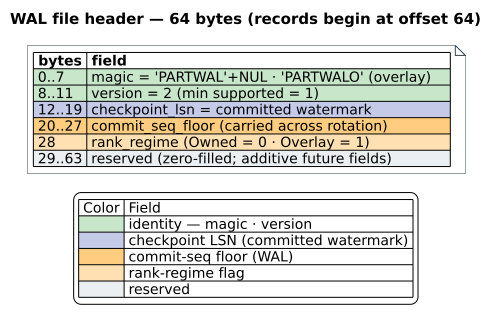
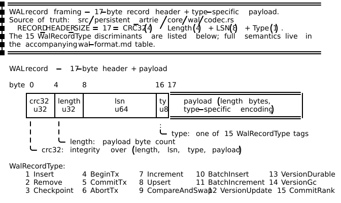
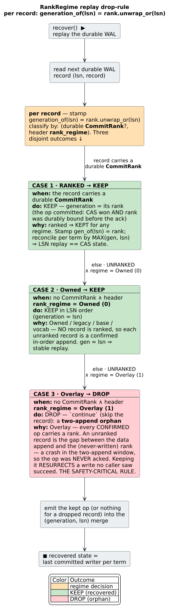
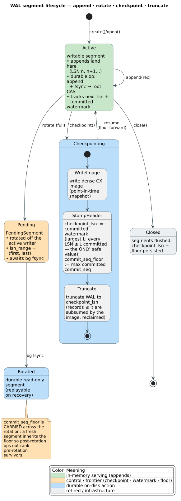
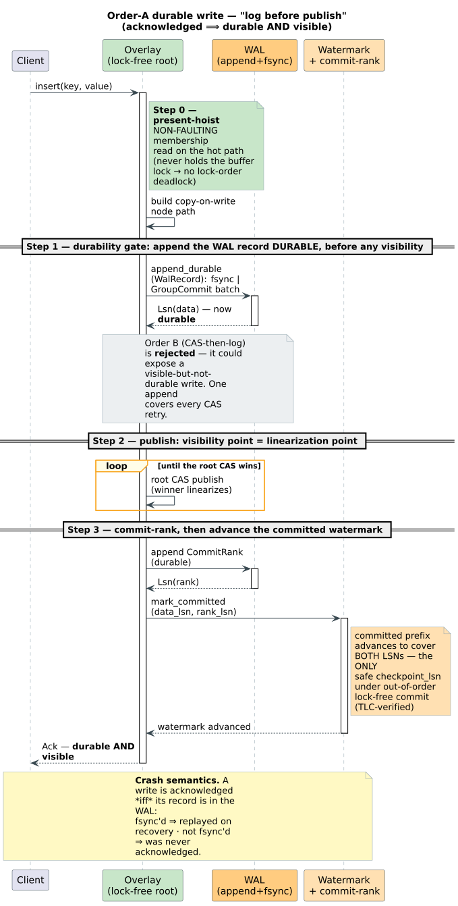
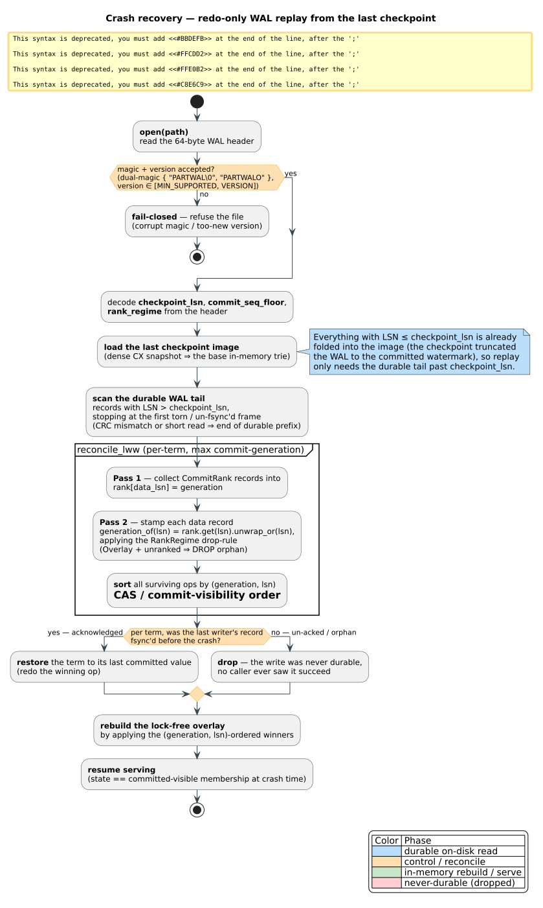
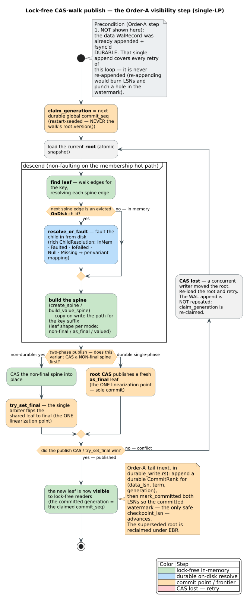

# The Write-Ahead Log (WAL) on-disk format

**Navigation**: [↑ Persistence architecture](README.md) · [Durability & recovery](durability-and-recovery.md) · [Lock-free overlay](lock-free-overlay.md) · [Storage backends](storage-backends.md)

> Scope: the **byte-level on-disk format** of the `libdictenstein` Persistent
> ARTrie write-ahead log — the 64-byte file header, the 17-byte record frame, the
> 15 record types, the forward-compatibility tripwires (dual-magic + version), the
> rank-regime replay drop-rule, the segment lifecycle, the **Order-A** write
> ordering, crash recovery, and the lock-free CAS-walk publish. The companion
> *theory* of buffer management, checkpointing, and ARIES recovery lives in
> [`../theory/disk-tries/05-buffer-management.md`](../theory/disk-tries/05-buffer-management.md);
> the prose summary of the durability contract is in the
> [README "Durable writes: the Order-A protocol"](../../README.md#durable-writes-the-order-a-protocol)
> section. This document is the **format reference** those two point at.

---

## Definitions (read first)

These symbols and acronyms are used throughout; each is defined here before use.

| Term | Definition |
|------|------------|
| **WAL** (Write-Ahead Log) | A durable, append-only file of *intended* changes written **before** the change is made visible, so a crash can be repaired by replaying the log. The reconciling invariant of the whole subsystem is $acknowledged \implies durable$. |
| **LSN** (Log Sequence Number) | A monotonically increasing `u64` stamped on each WAL record. LSNs are globally monotone across segment rotation, so one global sort over `LSN` is a valid total order. |
| **CRC** (Cyclic Redundancy Check) | A 32-bit checksum (`crc32`) over a record's `(length, lsn, type, payload)`. A mismatch marks the record (and everything after it) as a torn, non-durable tail. |
| **Order-A** | The durability protocol "**log before publish**": append + fsync the WAL record **durable** *before* the visibility-publishing root CAS. Its antagonist, **Order-B** (CAS-then-log), is rejected — it can expose a visible-but-not-durable write. |
| **Watermark** (committed prefix) | The largest LSN `L` such that **every** $LSN \le L$ is committed. Under out-of-order lock-free commit this contiguous frontier is the **only** safe `checkpoint_lsn`. |
| **CAS** (Compare-And-Swap) | The atomic root-pointer swap that publishes a new trie version. The winning CAS is the **linearization point** (the single visibility instant) of a write. |
| **EBR** (Epoch-Based Reclamation) | Memory for a superseded node is freed only after every reader that *could* hold a pointer to it has departed its epoch — lock-free, bounded-latency, free of use-after-free. |
| **Rank-regime** | A per-file marker (`Owned` / `Overlay`) recorded in header byte 28 that selects the **replay drop-rule** for *unranked* records. See [§5](#5-the-rank-regime-replay-drop-rule). |
| **Commit-rank** | A durable `CommitRank` record binding a data record's LSN to the commit **generation** it published at, so LSN-ordered replay reproduces CAS-order committed-visible membership. |

The on-disk encoding is **fixed little-endian** (`to_le_bytes` / `from_le_bytes`)
for every multi-byte integer; the format is therefore identical across
endianness of the running machine.

---

## 1. Purpose and intuition

The Persistent ARTrie is **lock-free** — readers and writers never block on a
global mutation lock — yet **crash-durable** — an acknowledged write survives
power loss. These two goals are in tension: lock-freedom means writes become
*visible* the instant a root CAS wins, but durability means a write must be on
stable storage *before* anyone is told it succeeded. The WAL is the bridge. Every
state-changing operation first appends a record describing its intent and fsyncs
it, *then* publishes the in-memory change. Recovery re-derives the committed state
by replaying the durable tail of this log.

The format is deliberately small and self-describing:

- a **64-byte header** identifies the file, its format version, the last
  checkpoint position, and the replay regime;
- a stream of **self-framed records**, each a 17-byte fixed header (CRC, length,
  LSN, type) followed by a type-specific payload, so a reader can walk the log
  record-by-record and stop cleanly at the first torn frame.

Two forward-compatibility tripwires (a **dual magic** and a **fail-closed version
ceiling**) ensure an *older* binary refuses a file it would mis-interpret rather
than silently corrupting recovery. The whole design follows the ARIES discipline
(Mohan et al. 1992, [doi:10.1145/128765.128770](https://doi.org/10.1145/128765.128770)),
specialized here to a **redo-only** log.

Source of truth: [`src/persistent_artrie/core/wal/`](../../src/persistent_artrie/core/wal/)
(`header.rs`, `codec.rs`, `writer.rs`, `reader.rs`, `pending_segment.rs`),
[`core/overlay/durable_write.rs`](../../src/persistent_artrie/core/overlay/durable_write.rs),
[`core/overlay/cas_walk.rs`](../../src/persistent_artrie/core/overlay/cas_walk.rs),
and [`core/recovery.rs`](../../src/persistent_artrie/core/recovery.rs).

---

## 2. The 64-byte file header

Every WAL file opens with a fixed **64-byte** header (`WalHeader`,
`SIZE = 64`): **29 bytes used**, **35 reserved** (zero-filled). Records begin at
byte offset 64.



| Offset | Size | Field | Meaning |
|-------:|-----:|-------|---------|
| `0` | 8 | `magic: [u8; 8]` | `"PARTWAL\0"` (Owned regime) **or** `"PARTWALO"` (Overlay regime). The dual-magic tripwire — see [§4](#4-forward-compatibility-dual-magic--version). |
| `8` | 4 | `version: u32` (LE) | Format version. Current `VERSION = 2`; `MIN_SUPPORTED_VERSION = 1`. |
| `12` | 8 | `checkpoint_lsn: u64` (LE) | LSN up to which all committed data is folded into the checkpoint image; replay starts strictly **after** this. Must equal the committed **watermark** (never the appended frontier). |
| `20` | 8 | `commit_seq_floor: u64` (LE) | The maximum `commit_seq` subsumed by the last checkpoint. Seeds the global commit-sequence counter on open so post-checkpoint ops out-rank pre-checkpoint survivors; **carried across** rotation/truncate. `0` = no floor. |
| `28` | 1 | `rank_regime: u8` | `Owned = 0` / `Overlay = 1`. Selects the replay drop-rule for unranked records ([§5](#5-the-rank-regime-replay-drop-rule)). An unknown byte decodes to `Owned` (fail-safe = "keep everything"). |
| `29` | 35 | `reserved: [u8; 35]` | Zero-filled; available for additive future fields. |

**Why these last three fields are additive and reversible.** A pre-existing
(or older-binary-written) header zero-fills bytes `20..64`, which decode to
`commit_seq_floor = 0` and `rank_regime = Owned` — exactly the legacy behavior.
The `commit_seq_floor` and `rank_regime` fields were carved out of what was
formerly the reserved region **without** a version bump, so every base / vocab /
char file produced before they existed still reads back identically. This is the
key reason the replay drop-rule is keyed on the per-file `rank_regime` byte and
**not** on a global version bump (a version bump would have bricked the
base/vocab/char on-disk formats).

The header round-trips through `to_bytes` / `from_bytes`; `from_bytes` is the
**single gate** that validates magic and version on open.

---

## 3. The 17-byte record frame

After the header, the file is a stream of self-framed records. Each record is a
fixed **17-byte header** (`RECORD_HEADER_SIZE = 17`) followed by a
type-specific payload of `length` bytes.



| Offset | Size | Field | Meaning |
|-------:|-----:|-------|---------|
| `0` | 4 | `crc32: u32` (LE) | Checksum over the remaining frame bytes `(length, lsn, type, payload)`. |
| `4` | 4 | `length: u32` (LE) | **Total** frame length in bytes (`17 + payload_len`). |
| `8` | 8 | `lsn: u64` (LE) | The record's Log Sequence Number. |
| `16` | 1 | `type: u8` | One of the 15 `WalRecordType` discriminants ([§3.1](#31-record-types)). |
| `17` | `length − 17` | payload | Type-specific encoding (see each type below). |

**Reading discipline.** A reader (`WalReader`) seeks past the 64-byte header,
then repeatedly: read 17 header bytes (EOF here ends the log cleanly); reject a
`length < 17`; read the `length − 17` payload bytes (a short read here is a
**torn tail** → stop); recompute the CRC over `header_bytes[4..] ‖ payload` and
compare against the stored `crc32` (mismatch → torn/corrupt → stop). A torn or
CRC-failing frame and everything after it is treated as **never durable** — this
is precisely how the "durable prefix" is delimited on recovery.

### 3.1 Record types

The `type` byte is a `WalRecordType` (`#[repr(u8)]`). All 15 discriminants:

| Code | Variant | One-line semantics |
|-----:|---------|--------------------|
| `1` | `Insert` | Insert a term (UTF-8 bytes) with an optional serialized value. |
| `2` | `Remove` | Remove a term. |
| `3` | `Checkpoint` | Checkpoint marker: carries the `checkpoint_lsn` durable in the main image + a timestamp. **Replay no-op** (bookkeeping only). |
| `4` | `BeginTx` | Begin a transaction (carries `tx_id`); brackets a group that replays atomically. |
| `5` | `CommitTx` | Commit the bracketed transaction — only then do its buffered ops become replayable. |
| `6` | `AbortTx` | Abort the bracketed transaction — its ops are discarded on replay. |
| `7` | `Increment` | Atomic increment of a term's `u64` counter by a delta. |
| `8` | `Upsert` | Atomic update-if-present / insert-if-absent (last-writer-wins value). |
| `9` | `CompareAndSwap` | Atomic conditional write: set the value only if the current value matches `expected` (compared as bincode **bytes**). |
| `10` | `BatchInsert` | Multiple inserts in one record (amortizes the 17-byte frame over a whole batch). |
| `11` | `BatchIncrement` | Multiple increments in one record (accumulating deltas; used by document transactions). |
| `12` | `VersionUpdate` | Records a new structural **version** of the trie (replaces N mutation records for point-in-time recovery). |
| `13` | `VersionDurable` | Marks a version as fully persisted (safe to recover to). |
| `14` | `VersionGc` | Records versions reclaimed by garbage collection (skipped on replay). |
| `15` | `CommitRank` | **Order-A commit-generation marker.** Binds a data record's `data_lsn` to the commit `generation` (the published leaf's `version`) it committed at, in CAS order. **Replay no-op** for membership; it only supplies `generation_of`. Layout: `data_lsn(u64 LE) ‖ term_len(u32 LE) ‖ term ‖ generation(u64 LE)`. Additive in **v2**. |

> An unknown type byte (e.g. `0xff`) is rejected as `InvalidRecordType` — the
> reader never guesses.

---

## 4. Forward compatibility: dual-magic + version

Two independent tripwires keep an **older** binary from silently mis-reading a
**newer** file. Both fail *closed* (refuse to open) rather than fail *open*
(corrupt recovery).

**Dual-magic (the regime tripwire).** The standard magic `"PARTWAL\0"` denotes
an Owned-regime file; the lock-free-overlay flip stamps `"PARTWALO"` (alongside
`rank_regime = Overlay`) on a fresh active file. A **new** binary accepts the set
`{ "PARTWAL\0", "PARTWALO" }`, so it reads Overlay files freely. An **old**
binary knows only `"PARTWAL\0"`, so it **fail-closes** on an Overlay file's magic
mismatch — instead of reading the Overlay file's ranked records under the Owned
drop-rule, which would resurrect two-append orphans (the silent-mis-recovery gap
a backup / monitoring / mixed-deploy reader would otherwise hit). Crucially this
is **additive**: every existing `"PARTWAL\0"` file parses exactly as before, so
base / vocab / un-flipped-char recovery is unchanged, with **no** global version
bump.

**Version ceiling (the format tripwire).** `from_bytes` accepts only
`version ∈ [MIN_SUPPORTED_VERSION, VERSION] = [1, 2]`. A too-**new** file
(`version > VERSION`) is refused fail-closed; a too-**old** file
(`version < MIN_SUPPORTED_VERSION`) is unreadable. The $1 \to 2$ bump marks the
additive arrival of the `CommitRank = 15` record. **Backward compatibility** is
free: a v1 WAL contains no `CommitRank`, so replay falls back to
`generation_of(lsn) = lsn` — byte-for-byte the pre-fix in-order behavior. No
migration is required.

> Note the division of labor: the **version** governs the *record vocabulary*
> (whether `CommitRank` may appear); the **magic + `rank_regime` byte** govern the
> *replay drop-rule*. The latter is intentionally a per-file property, not a
> format version, so it never bricks the sibling formats.

---

## 5. The rank-regime replay drop-rule

This is the **safety-critical** rule of the format. On replay, a recovering
reader decides, for **every** record, whether it contributes to the recovered
state. The decision is keyed on whether the record carries a durable `CommitRank`
and on the file/segment's `rank_regime`.



The reconciler stamps every data record with

```text
generation_of(lsn) = rank.get(lsn).unwrap_or(lsn)
```

and emits the surviving ops in `(generation, lsn)` order — which is exactly
CAS / commit-visibility order. Two ops on the same term are thereby reconciled by
**max** `(generation, lsn)` = the last committed writer. The `unwrap_or(lsn)`
branch is where the regime matters:

- **Owned (`= 0`) — KEEP unranked records in LSN order.** The owned / legacy /
  base / vocab producer never ranks anything, so *every* unranked record is a
  confirmed in-order append. `generation_of(lsn) = lsn`, and the `(generation,
  lsn)` sort degenerates to a stable LSN order — the pre-fix behavior, exactly.

- **Overlay (`= 1`) — DROP an unranked record as a two-append orphan.** The
  overlay producer ranks *every* confirmed op (a `CommitRank` is durably bound
  before the op is acknowledged). An **unranked** record is therefore the gap
  between the data append and the *never-written* rank: a crash landed inside the
  two-append window, so the op was **never acknowledged**. Keeping it would
  resurrect a write no caller ever saw succeed — so recovery `continue`s past it
  (drops it).

A **ranked** record is kept regardless of regime. A multi-segment archive rebuild
that spans an $Owned \to Overlay$ flip passes a *per-segment* regime lookup, so an
Owned segment's unranked records are kept while an Overlay segment's unranked
orphans are dropped — under one global `(generation, lsn)` order (LSNs are
monotone across rotation). This is the `A2` correctness fix: it prevents an
Overlay segment's never-acked orphans from being resurrected during a post-flip
rebuild.

---

## 6. Segment lifecycle

A WAL is served from an **active** segment that accepts appends. The async writer
may **rotate** a full segment into a `PendingSegment` (carrying its path, LSN
range `(first_lsn, last_lsn)`, file handle, rotation timestamp, and size) that
still awaits its background fsync; once fsync'd it becomes a durable, read-only,
replayable segment. A **checkpoint** writes the dense image, stamps
`checkpoint_lsn` to the committed watermark, advances `commit_seq_floor`, and
**truncates** the WAL to `checkpoint_lsn` (the records it subsumes are reclaimed).
`commit_seq_floor` is **carried across** every rotation and truncation so
post-rotation ops keep out-ranking pre-rotation survivors.



The invariant tying this together: the WAL only ever shrinks at the **committed
watermark**, never at the (possibly-ahead) appended frontier — see
[§7](#7-order-a-write-ordering-and-the-watermark).

---

## 7. Order-A write ordering and the watermark

Every durable operation obeys **Order-A** — "log before publish" — in this exact
order (`durable_write.rs`, the `DurableOverlayWrite` Template-Method skeleton):

1. **Append + fsync the WAL record durable** — *before* any visibility. A crash
   thus either replays the record (it was acknowledged) or never had it (it was
   not). **Order-B** (CAS-then-log) is rejected: it can expose a
   visible-but-not-durable write. The **single** append covers every CAS retry of
   step 2 — it is never re-appended (re-appending would burn LSNs and punch a hole
   in the watermark).
2. **Publish via the root CAS** — the visibility point = the linearization point
   ([§8](#8-the-lock-free-cas-walk-publish)).
3. **Bind the commit rank durable, then `mark_committed`.** Append a `CommitRank`
   for `(data_lsn, term, generation)`, then advance the committed **watermark** to
   cover **both** the data LSN and the rank LSN, so the contiguous committed prefix
   does not stall. Only now is the write acknowledged.

The accompanying sequence diagram (shared with the README) shows the full
exchange:



**Why the watermark is the only safe `checkpoint_lsn`.** Under out-of-order
lock-free commit, LSN `N+1` can reach disk before LSN `N`. A checkpoint may
therefore only declare durable the largest `L` such that **every** $LSN \le L$ is
committed — the contiguous prefix. Stamping the *appended* frontier instead would
checkpoint past a hole and lose the missing write. This watermark discipline ("no
lost writes") is model-checked in
[`formal-verification/tla+/LockFreeDurableCheckpoint.tla`](../../formal-verification/tla+/LockFreeDurableCheckpoint.tla).

A subtle but load-bearing detail: the **present-hoist** (step 0, the membership
pre-check before the append) must stay **non-faulting** on the hot path — it must
never take the buffer-manager lock while a checkpoint/eviction holds it, or the
lock-ordering inversion deadlocks. The Order-A skeleton fixes only the
*hoist-before-append order*; the per-variant hoist supplies the non-faulting read.

---

## 8. Crash recovery

Recovery is **redo-only** ARIES (Mohan et al. 1992,
[doi:10.1145/128765.128770](https://doi.org/10.1145/128765.128770)): open → load
the last checkpoint image → scan the durable WAL tail from `checkpoint_lsn` →
reconcile per-term by max commit-generation → rebuild the overlay → resume.



Step by step:

1. **Open + validate the header.** Reject a bad magic or an out-of-range version
   fail-closed (this is the dual-magic / version ceiling of [§4](#4-forward-compatibility-dual-magic--version)).
   Decode `checkpoint_lsn`, `commit_seq_floor`, and `rank_regime`.
2. **Load the checkpoint image.** Everything with `LSN ≤ checkpoint_lsn` is
   already folded into the dense image, so replay only needs the tail.
3. **Scan the durable WAL tail** (`LSN > checkpoint_lsn`), stopping at the first
   torn / CRC-failing frame — that frame delimits the durable prefix.
4. **`reconcile_lww`** in two passes: Pass 1 collects `CommitRank` records into a
   `rank[data_lsn] = generation` map; Pass 2 stamps each data record
   `generation_of(lsn) = rank.get(lsn).unwrap_or(lsn)`, **applying the regime
   drop-rule** (an unranked record from an Overlay file/segment is dropped as an
   orphan), then sorts all survivors by `(generation, lsn)` = CAS order. Keys are
   compared as **raw bytes** so two distinct keys that lossy-decode to the same
   `String` never collide into one winner bucket.
5. **Acked vs. un-acked.** For each term, the last writer whose record was fsync'd
   before the crash is restored; a write that never reached stable storage was, by
   construction, never acknowledged and is dropped.
6. **Rebuild + resume.** Apply the `(generation, lsn)`-ordered winners to rebuild
   the lock-free overlay; the resulting state equals the committed-visible
   membership at crash time (`ReplayEqualsCommittedVisible`).

---

## 9. The lock-free CAS-walk publish

Step 2 of Order-A — the in-memory publish — is a **lock-free CAS-walk**
(`cas_walk.rs`): a copy-on-write descent that resolves (and, if an edge was
evicted to disk, faults in) the path for the key, builds the spine, and publishes
the new leaf via a root CAS. The walk **retries** on CAS failure; because the
data record was already appended durable in step 1, the **single** append covers
every retry — the walk is never re-logged.



Salient points:

- The descent on the **membership hot path** uses the **non-faulting** point-read
  walk (`find_leaf_lockfree`, never the faulting variant) — see the deadlock note
  in [§7](#7-order-a-write-ordering-and-the-watermark). An evicted `OnDisk` child
  is resolved by `resolve_or_fault`, whose rich `ChildResolution` outcome
  (`InMem` · `Faulted` · `IoFailed` · `Null` · `Missing`) lets each
  (variant $\times$ method) keep its own error mapping.
- The byte variant uses a **two-phase** publish (CAS a non-final spine, then a
  single `try_set_final` arbiter flips the shared leaf final — the one
  linearization point); the durable single-phase publish bakes `as_final()` into a
  fresh leaf published **only** via the root CAS (its sole commit point). The
  durable arm never inherits `try_set_final`, because a second commit point would
  break single-LP.
- The committed **generation** that flows into `reconcile_lww` is the durable
  global `commit_seq` (restart-seeded via `claim_generation`), **never** the walk's
  `root.version()` — reading the walk's version post-restart would re-introduce a
  cross-restart resurrection bug (the `A2` hazard).
- A superseded root is reclaimed under **EBR** once no reader can still hold it.

---

## See also

- [`../theory/disk-tries/05-buffer-management.md`](../theory/disk-tries/05-buffer-management.md)
  — the buffer manager, WAL theory, ARIES recovery, and checkpoint management
  ([crash-recovery section](../theory/disk-tries/05-buffer-management.md#crash-recovery)).
- [README — "Durable writes: the Order-A protocol"](../../README.md#durable-writes-the-order-a-protocol)
  — the prose summary of the $acknowledged \implies durable$ contract.
- [`storage-backends.md`](storage-backends.md) — the storage substrate the WAL is written
  to (`mmap` default, `io_uring` + `O_DIRECT` alternative) and the on-disk block format.
- [`durability-and-recovery.md`](durability-and-recovery.md) — the architecture-level
  durability model: Order-A, checkpoint flips, the committed-watermark theorem, and recovery.
- [`lock-free-overlay.md`](lock-free-overlay.md) — the immutable overlay the CAS-walk
  publishes into · [`concurrency-model.md`](concurrency-model.md) — the F4 lock hierarchy.
- Source: [`src/persistent_artrie/core/wal/`](../../src/persistent_artrie/core/wal/),
  [`core/overlay/durable_write.rs`](../../src/persistent_artrie/core/overlay/durable_write.rs),
  [`core/overlay/cas_walk.rs`](../../src/persistent_artrie/core/overlay/cas_walk.rs),
  [`core/recovery.rs`](../../src/persistent_artrie/core/recovery.rs).

### References

- Mohan, C., Haderle, D., Lindsay, B., Pirahesh, H., & Schwarz, P. (1992).
  *ARIES: A Transaction Recovery Method Supporting Fine-Granularity Locking and
  Partial Rollbacks Using Write-Ahead Logging.* ACM Transactions on Database
  Systems 17(1), 94–162. [doi:10.1145/128765.128770](https://doi.org/10.1145/128765.128770)
