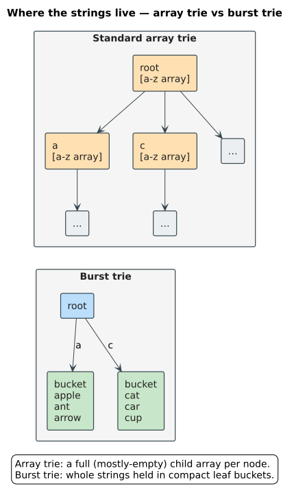
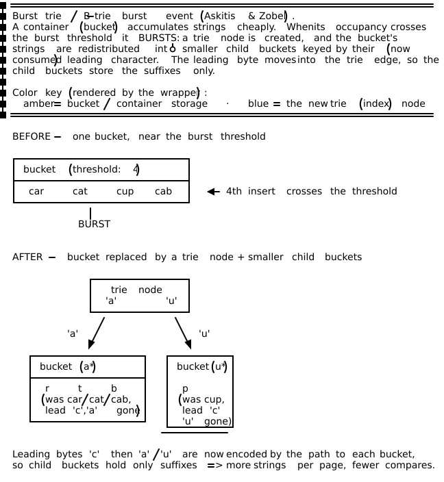
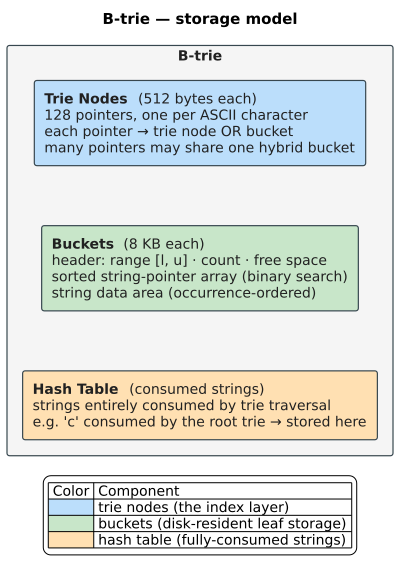
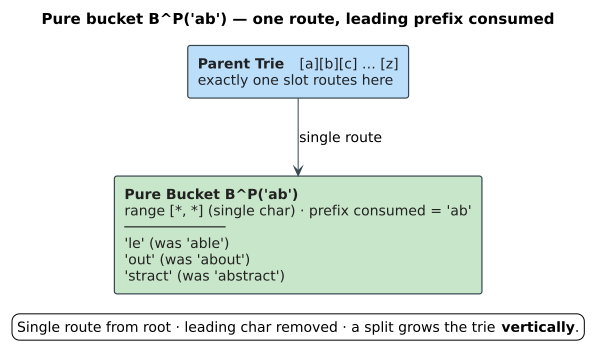
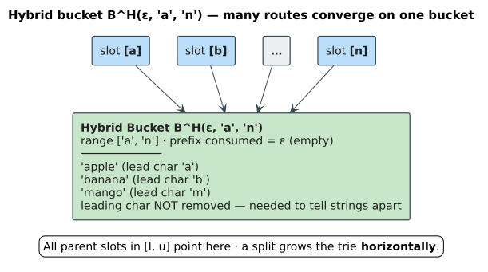
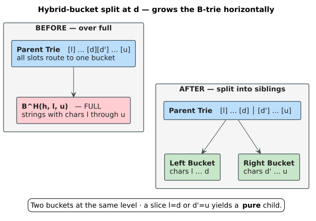
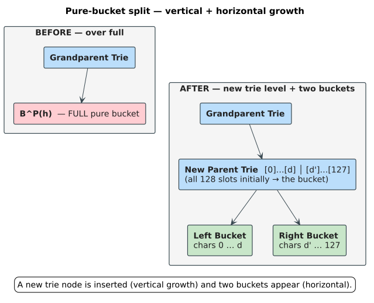
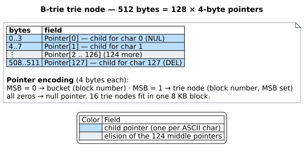
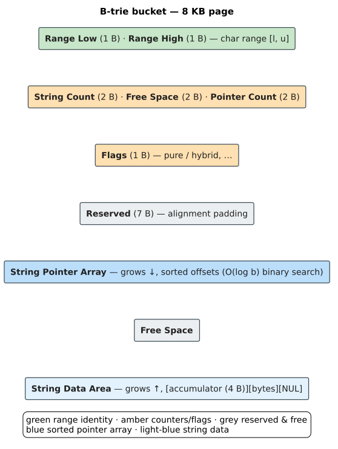

# B-trie: Disk-Based Burst Trie

This document presents the **B-trie** data structure from Askitis & Zobel (2009, [DOI: 10.1007/s00778-008-0094-1](https://doi.org/10.1007/s00778-008-0094-1)) — a disk-based adaptation of the *burst trie* that achieves `5–50%` better performance than B+-trees for string indexing. Throughout, $`\Sigma`$ is the alphabet, $`\mid \Sigma \mid`$ its size, `m` a string's length, `b` the number of strings per bucket, and `h` the trie height.

## Table of Contents

1. [Background: The Burst Trie](#background-the-burst-trie)
2. [B-trie Architecture](#b-trie-architecture)
3. [Bucket Types: Pure vs. Hybrid](#bucket-types-pure-vs-hybrid)
4. [Splitting Algorithms](#splitting-algorithms)
5. [Core Operations](#core-operations)
6. [Page Layout and Implementation](#page-layout-and-implementation)
7. [Performance Characteristics](#performance-characteristics)
8. [Lessons for Our Design](#lessons-for-our-design)

---

## Background: The Burst Trie

### In-Memory Burst Trie (Heinz et al. 2002)

The **burst trie** was designed to solve the space inefficiency of standard tries while maintaining fast access. Instead of creating a trie node for every character, it stores strings in **buckets** (containers) and only "bursts" them into trie structure when necessary.



### Bursting Heuristics

When a bucket becomes full (or frequently accessed), it **bursts**: a trie node replaces the bucket and the strings are redistributed into smaller child buckets keyed by their leading character. The figure shows one burst event.



*Figure: a burst event (Askitis & Zobel). The leading byte moves into the trie edge, so the child buckets store only suffixes — packing more strings per page and shortening comparisons.*

In detail, a burst:

1. Creates a new trie node with up to $`\mid \Sigma \mid`$ child pointers (128 for ASCII)
2. Distributes strings from the bucket into up to $`\mid \Sigma \mid`$ new buckets based on their leading character
3. Removes the leading character from each string (it is now encoded in the trie edge)

**Problem for disk**: bursting can create up to 128 new buckets, each requiring a separate disk block. This wastes space and causes excessive random I/O during the burst operation — the very problem the B-trie's binary *split* (below) is designed to avoid.

---

## B-trie Architecture

The B-trie adapts the burst trie for disk by introducing a **controlled splitting** mechanism that limits bucket creation.

### Key Insight

Instead of bursting into $`\mid \Sigma \mid`$ buckets, the B-trie **splits** a bucket into exactly two new buckets, similar to B-tree node splitting. This:
- Minimizes disk space waste
- Avoids the random I/O of creating many buckets
- Maintains B-tree-like space utilization (`~69%` average)

### Structure Components



### Formal Definition

A B-trie over alphabet $`\Sigma`$ is a directed acyclic graph where:

1. **Node `N`** = set of pointers `{p_c ∣ c ∈ Σ}`, one per character
2. **Route `R`** = chain `N₁ →c₁ N₂ →c₂ … →c_m B` terminating at bucket `B`
3. **Sequence `s(R)`** = string `c₁c₂…c_m` represented by route `R`

Buckets come in two types:
- **Pure bucket** $`B^P(h) = {t \mid s = h\cdot t \in V}`$ — single route, prefix `h` removed
- **Hybrid bucket** $`B^H(h,l,u) = {c\cdot t \mid s = h\cdot c\cdot t \in V, c \in [l,u]}`$ — multiple routes

Where `V` is the vocabulary (set of all stored strings) and `[l,u]` is the character range.

---

## Bucket Types: Pure vs. Hybrid

The distinction between pure and hybrid buckets is the key innovation enabling efficient disk storage.

### Pure Buckets

A **pure bucket** contains strings that all share the same leading character, which has been removed (consumed by the parent trie).



**Properties:**
- Single route from root (all strings share exact prefix)
- Leading character removed from stored strings
- When split, creates a new parent trie node (grows vertically)

### Hybrid Buckets

A **hybrid bucket** contains strings with different leading characters. Multiple trie pointers reference the same bucket.



**Properties:**
- Multiple routes from parent (pointers in range [l,u] all point here)
- Leading character NOT removed (needed to distinguish strings)
- When split, creates sibling bucket (grows horizontally)

### Bucket Invariants

The B-trie maintains these invariants:

1. There is only a single route to each pure bucket
2. There is only a single route from root to any trie node
3. For pure bucket `B^P(h)`, the route sequence `s(R) = h`
4. For hybrid bucket `B^H(h,l,u)`, the route sequence $`s(R) = h\cdot c`$ where $`c \in [l,u]`$
5. In a hybrid bucket, $`l \ne u`$ (otherwise it would be pure)
6. All pointers in range `[l,u]` of the parent trie point to the same hybrid bucket

---

## Splitting Algorithms

### Split Point Selection

When a bucket is full, we must choose a **split point** character d that divides strings approximately evenly.

**Algorithm:**

```
function find_split_point(bucket):
    // Count occurrences of each leading character
    counts[128] = {0}
    for string in bucket:
        counts[string[0]] += 1

    // Find split point achieving ~75% distribution ratio
    total = bucket.string_count
    moved = 0

    for c from bucket.range_low to bucket.range_high:
        moved += counts[c]
        ratio = moved / (total - moved)

        if ratio >= 0.75:
            return c  // Split point found

    // If threshold not achievable, use second-to-last character
    return second_last_nonempty_char(counts)
```

The **0.75 distribution ratio** was determined empirically to provide good balance while ensuring neither bucket is empty.

### Splitting a Hybrid Bucket

When hybrid bucket B^H(h, l, u) splits at point d:



**Rules for resulting bucket types:**

| Condition | Left Bucket | Right Bucket |
|-----------|-------------|--------------|
| l = d | Pure B^P(h·l) | Depends on d' = u |
| l $`\ne`$ d | Hybrid B^H(h, l, d) | Depends on d' = u |
| d' = u | — | Pure B^P(h·u) |
| d' $`\ne`$ u | — | Hybrid B^H(h, d', u) |

**Key insight**: Splitting a hybrid bucket grows the B-trie **horizontally** (more buckets at same level).

### Splitting a Pure Bucket

When pure bucket B^P(h) splits:

1. Create a new parent trie node
2. Assign all 128 pointers to the pure bucket (temporarily)
3. The bucket becomes hybrid B^H(h, 0, 127)
4. Proceed with hybrid split algorithm



**Key insight**: Splitting a pure bucket grows the B-trie **vertically** (new trie level) AND horizontally (two new buckets).

### Split Propagation

If a split creates a bucket that is still full, splitting continues recursively:

```
function split_bucket(bucket, parent_trie):
    d = find_split_point(bucket)

    if bucket.is_pure():
        // Create new parent trie, convert to hybrid
        new_trie = create_trie_node()
        for c in 0..127:
            new_trie[c] = bucket
        bucket.convert_to_hybrid(0, 127)
        parent_trie = new_trie

    // Create new sibling bucket
    sibling = create_bucket()

    // Distribute strings
    for string in bucket:
        if string[0] > d:
            move string to sibling

    // Update bucket ranges
    bucket.range_high = d
    sibling.range_low = d + 1
    sibling.range_high = original_range_high

    // Update parent trie pointers
    for c in (d+1)..original_range_high:
        parent_trie[c] = sibling

    // Check for pure bucket conversion
    if bucket.range_low == bucket.range_high:
        bucket.convert_to_pure()
        strip_leading_char_from_all_strings(bucket)

    // Recursive split if still full
    if bucket.is_full():
        split_bucket(bucket, parent_trie)
    if sibling.is_full():
        split_bucket(sibling, parent_trie)

    // Write to disk
    write_to_disk(bucket, sibling, parent_trie)
```

---

## Core Operations

### Search (Equality Match)

```
function search(query Q):
    current = root_trie

    while Q is not empty:
        c = Q[0]  // Leading character
        child = current[c]

        if child is null:
            return NOT_FOUND

        if child is trie_node:
            Q = Q[1:]  // Consume character
            current = child

        else if child is pure_bucket:
            Q = Q[1:]  // Consume character
            if Q is empty:
                return hash_table.search(original_query)
            return binary_search(child, Q)

        else:  // Hybrid bucket
            return binary_search(child, Q)

    // Query consumed entirely by trie
    return hash_table.search(original_query)
```

**Complexity**: `O(m)` trie traversals + `O(log b)` binary search, where `m` = string length and `b` = strings per bucket.

### Insert

```
function insert(string S):
    (bucket, parent, suffix) = search_path(S)

    if suffix is empty:
        // String consumed by trie
        hash_table.insert(S)
        return

    if bucket is null:
        // Create new bucket for null pointer
        bucket = create_bucket_for_null_range(parent, suffix[0])

    if bucket.has_space():
        bucket.insert_sorted(suffix)
        write_to_disk(bucket)
    else:
        split_bucket(bucket, parent)
        insert(S)  // Retry after split
```

### Delete (Lazy)

The B-trie uses **lazy deletion** for efficiency:

```
function delete(string S):
    (bucket, parent, suffix) = search_path(S)

    if suffix is empty:
        hash_table.delete(S)
        return

    if bucket is null:
        return NOT_FOUND

    if bucket.remove(suffix):
        // String found and removed
        bucket.reorganize()  // Eliminate internal fragmentation

        if bucket.is_empty():
            // Mark for reuse, don't physically delete
            address_pool.add(bucket.address)
            nullify_parent_pointers(parent, bucket)

            if parent.all_null():
                // Propagate deletion up
                delete_trie_node(parent)

        write_to_disk(bucket)
```

Lazy deletion avoids expensive bucket merging. Empty bucket addresses are reused for new buckets.

---

## Page Layout and Implementation

### Trie Node Layout (512 bytes)



### Bucket Layout (8192 bytes / 8KB)



**Design rationale:**
- String pointers kept sorted for `O(log b)` binary search
- String data stored in insertion order (fast append)
- Initial allocation: 128 pointers, grow as needed
- 1KB oversize region when loaded into memory (delays splits)

### Block Size Selection

The paper uses **8KB blocks** based on empirical studies showing good performance. This is:
- A typical disk block size
- Large enough to hold many strings
- Small enough to minimize wasted space

Trie nodes are 512 bytes, so **16 trie nodes fit in one 8KB block**, improving spatial locality.

---

## Performance Characteristics

### Experimental Results (from paper)

Compared against standard B+-tree, prefix B+-tree, and Berkeley DB B+-tree:

| Metric | B-trie vs B+-trees |
|--------|-------------------|
| Build time | 5-15% faster |
| Search time | 5-15% faster |
| Skewed search | Up to 50% faster |
| Disk space | 7% less (large datasets) |
| Index buffer | ~10 MB for 29M strings |

### Complexity Analysis

| Operation | Trie Traversal | Binary Search | Disk I/Os |
|-----------|----------------|---------------|-----------|
| Lookup | `O(m)` | `O(log b)` | `O(h) + 1` |
| Insert | `O(m)` | `O(log b)` | `O(h) + 1` write |
| Delete | `O(m)` | `O(log b)` | `O(h) + 1` write |

Where:
- `m` = string length
- `b` = strings per bucket (`~100–500`)
- `h` = trie height (depends on data, typically 3-5 for text)

### Why B-trie Outperforms B+-tree

1. **No binary search of index**: Trie traversal uses character as array index (`O(1)` per level)
2. **Smaller index nodes**: 512-byte trie nodes vs 8KB B+-tree nodes → better cache utilization
3. **Prefix elimination**: Strings in buckets have prefixes removed → more strings per bucket
4. **Implicit cost-adaptivity**: Frequent strings often consumed by trie → no disk access
5. **Reduced comparisons**: Binary search only on suffixes, not full strings

### When B+-tree Wins

- Very long strings (>30 chars) with long unique prefixes → deep trie
- Uniform access patterns → trie cost-adaptivity not beneficial
- Without index buffer → unbalanced trie causes more I/O

---

## Lessons for Our Design

The B-trie paper provides key insights for our Persistent ARTrie design:

### What to Adopt

1. **Bucket-based leaf storage**: Store multiple strings per disk page
2. **Controlled splitting**: Split into two children, not $`\mid \Sigma \mid`$ children
3. **Pure/hybrid distinction**: Track whether prefix is consumed
4. **Lazy deletion**: Don't physically delete, reuse addresses
5. **Distribution ratio**: Use ~0.75 threshold for split point selection
6. **Index buffering**: Keep trie/index nodes in memory

### What to Improve

1. **Fixed alphabet assumption**: B-trie uses 128-entry arrays; ART adapts node size
2. **No path compression**: B-trie traverses character-by-character; ART compresses paths
3. **Fixed node size**: B-trie uses 512-byte nodes; ART uses 4 different sizes
4. **No SIMD**: B-trie uses array indexing; ART Node16 uses SIMD search

### Hybrid Approach Rationale

Our design combines:
- **ART's adaptive nodes** for the index layer (efficient fanout handling)
- **B-trie's buckets** for the leaf layer (efficient disk I/O)

This gives the best of both worlds: ART's cache-efficient traversal with B-trie's disk-efficient storage.

---

## Summary

The B-trie demonstrates that trie-based structures can outperform B-trees for string indexing when properly adapted for disk:

1. **Controlled splitting** limits bucket creation to two per split
2. **Pure/hybrid distinction** enables prefix elimination in buckets
3. **Character-indexed access** eliminates binary search in index traversal
4. **Index buffering** masks the cost of unbalanced trie structure
5. **`5–50%` improvement** over B+-trees in practice

The key innovation is recognizing that the burst trie's "burst into $`\mid \Sigma \mid`$ buckets" is inappropriate for disk, and replacing it with B-tree-style binary splitting while maintaining trie properties.

---

## References

1. Askitis, N. & Zobel, J. (2009). "B-tries for disk-based string management." *The VLDB Journal*, 18(1), 157-179. [DOI: 10.1007/s00778-008-0094-1](https://doi.org/10.1007/s00778-008-0094-1)
2. Heinz, S., Zobel, J., & Williams, H.E. (2002). "Burst tries: A fast, efficient data structure for string keys." *ACM TOIS*, 20(2), 192-223. [DOI: 10.1145/506309.506312](https://doi.org/10.1145/506309.506312)
3. Bayer, R. & Unterauer, K. (1977). "Prefix B-trees." *ACM TODS*, 2(1), 11-26. [DOI: 10.1145/320521.320530](https://doi.org/10.1145/320521.320530)
