# The Adaptive Radix Tree (ART)

This document presents the **Adaptive Radix Tree (ART)** — an in-memory trie whose nodes change their internal representation according to how many children they hold — introduced by Leis, Kemper, and Neumann (2013, [DOI: 10.1109/ICDE.2013.6544812](https://doi.org/10.1109/ICDE.2013.6544812)). ART achieves both excellent space efficiency and lookup performance, making it an ideal foundation for our persistent trie design.

Throughout, **SIMD** (Single Instruction, Multiple Data) denotes CPU vector instructions that apply one operation to several lanes of a register in parallel; ART uses SIMD to compare many child keys at once. We write key length as `m` (bytes), alphabet as $`\Sigma`$, and alphabet size as $`\mid \Sigma \mid`$.

## Table of Contents

1. [Motivation](#motivation)
2. [Radix Tree Fundamentals](#radix-tree-fundamentals)
3. [Adaptive Node Types](#adaptive-node-types)
4. [Path Compression](#path-compression)
5. [Node Operations](#node-operations)
6. [SIMD Optimization](#simd-optimization)
7. [Space and Time Analysis](#space-and-time-analysis)
8. [Lessons for Persistent ARTrie](#lessons-for-persistent-artrie)

---

## Motivation

### The Space Problem with Traditional Radix Trees

A radix tree (also called radix trie) uses a fixed span—the number of bits examined at each level—to determine the branching factor. For byte-keyed data:

| Span | Bits per Level | Children per Node | Space per Node |
|------|----------------|-------------------|----------------|
| 1 | 1 bit | 2 | 16 bytes |
| 2 | 2 bits | 4 | 32 bytes |
| 4 | 4 bits | 16 | 128 bytes |
| 8 | 8 bits | 256 | 2048 bytes |

The choice of span presents a fundamental trade-off:

**Small span (1-4 bits):**
- Space-efficient for sparse data
- Deeper trees require more pointer traversals
- Poor cache behavior

**Large span (8 bits):**
- Shallow trees (one level per byte)
- Excellent for dense data
- Wastes space when nodes have few children

### ART's Solution: Adaptive Nodes

ART resolves this trade-off by using different node types depending on the actual number of children:

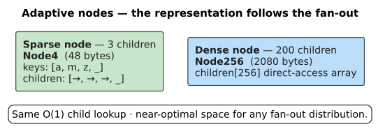

This adaptivity provides near-optimal space for any fanout distribution while maintaining the `O(1)` child lookup that makes radix trees fast.

---

## Radix Tree Fundamentals

### Definition

A radix tree with span `s` processes keys `s` bits at a time. For span-8 (byte keys), each node has at most 256 children, and a key of `m` bytes requires at most `m` levels to reach a leaf.

### Comparison with Comparison-Based Trees

| Aspect | Radix Tree | Comparison Tree (B-tree) |
|--------|------------|--------------------------|
| Key comparison | Never compares keys | `O(log n)` comparisons |
| Height | `O(m)` where `m` = key length | `O(log n)` |
| Cache behavior | One cacheline per level | Multiple per node |
| SIMD potential | High (byte matching) | Limited |
| Space efficiency | Variable | Generally good |

### The Span Trade-off Visualized

Consider storing the keys {10, 25, 31} (as 8-bit values):

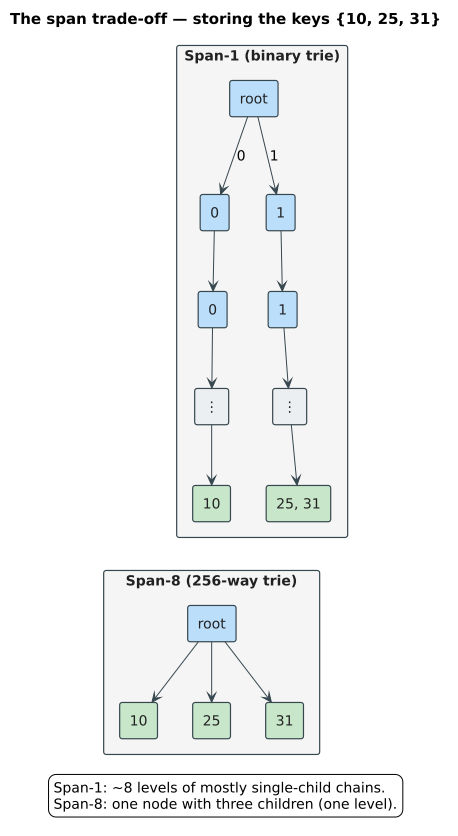

ART uses span-8 for shallow trees but avoids the 256-pointer waste through adaptive nodes.

---

## Adaptive Node Types

ART defines four node types, each optimized for a different fanout range. Every type carries the same fixed 16-byte `NodeHeader` (node identity, mutable child counter and flags, alignment padding, and an optimistic-lock version counter); the figure below shows that shared header, and the one after it shows the four storage bodies side by side.


*Figure: the 16-byte `NodeHeader` carried by Node4, Node16, Node48, and Node256 alike.*


*Figure: byte-ART node bodies and their search methods. The character variants (`PersistentARTrieChar`, `u32` keys) parallel these but diverge in three ways — `CharNode16` compares 8 `u32` lanes with AVX2 (`_mm256_cmpeq_epi32`) instead of 16 `u8` lanes with SSE, `CharNode48` uses binary search over sorted `u32` keys instead of a 256-byte index, and the dense tier is a HashMap-like `CharBucket` rather than a `CharNode256` (a direct `u32`-indexed array would need 4 GB).*

The four types are detailed below.

### Node4 (1-4 children)

The smallest node type for very sparse regions of the tree.

**Structure:**
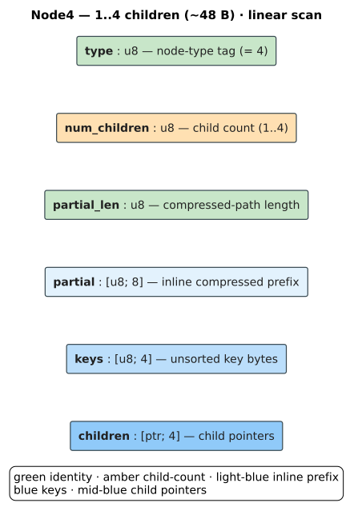

**Lookup:** Linear scan of keys array (4 comparisons max).

```rust
fn find_child_node4(node: &Node4, key: u8) -> Option<&Node> {
    for i in 0..node.num_children {
        if node.keys[i] == key {
            return Some(&node.children[i]);
        }
    }
    None
}
```

**Why unsorted?** For only 4 elements, linear scan is faster than binary search due to:
- No branch mispredictions from binary search
- All keys fit in one cache line
- Simple loop amenable to compiler optimization

### Node16 (5-16 children)

Optimized for SIMD parallel comparison.

**Structure:**
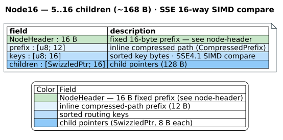

**Lookup:** SIMD parallel comparison finds the key in one instruction.

```rust
fn find_child_node16_simd(node: &Node16, key: u8) -> Option<&Node> {
    // SSE4.1: Compare key against all 16 keys simultaneously
    let cmp = _mm_cmpeq_epi8(
        _mm_set1_epi8(key as i8),
        _mm_loadu_si128(node.keys.as_ptr() as *const __m128i)
    );
    // Create bitmask of matching positions
    let mask = _mm_movemask_epi8(cmp) & ((1 << node.num_children) - 1);
    if mask != 0 {
        let idx = mask.trailing_zeros() as usize;
        Some(&node.children[idx])
    } else {
        None
    }
}
```

**Why sorted?** Even though SIMD finds the match, sorted order enables:
- Efficient in-order iteration
- Binary search fallback on non-SIMD platforms
- Predictable memory access patterns

### Node48 (17-48 children)

Uses an index array for `O(1)` lookup without storing 256 pointers.

**Structure:**
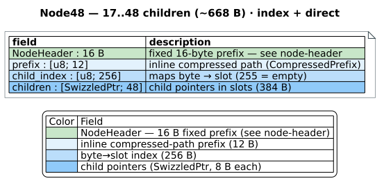

**Lookup:** Two array accesses with no searching.

```rust
fn find_child_node48(node: &Node48, key: u8) -> Option<&Node> {
    let idx = node.child_index[key as usize];
    if idx != 255 {
        Some(&node.children[idx as usize])
    } else {
        None
    }
}
```

**Space analysis** (child storage):
- 256-byte index array + $`48 \times 8 = 384`$ bytes of pointers $`= 640`$ bytes of child storage
  (the whole node is $`\approx 668`$ B once the 16-byte `NodeHeader` + 12-byte `CompressedPrefix` are added)
- A full `Node256` child array would need $`256 \times 8 = 2048`$ bytes
- Savings: `~69%` on child storage for nodes with 17-48 children ($`640`$ vs $`2048`$)

### Node256 (49-256 children)

Direct array indexing for dense nodes.

**Structure:**
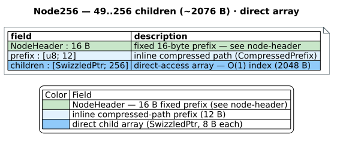

**Lookup:** Single array access.

```rust
fn find_child_node256(node: &Node256, key: u8) -> Option<&Node> {
    let child = node.children[key as usize];
    if !child.is_null() {
        Some(child)
    } else {
        None
    }
}
```

### Summary of Node Types

| Type | Children | Keys Storage | Lookup Method | Size |
|------|----------|--------------|---------------|------|
| Node4 | 1-4 | [u8; 4] sorted | Linear scan | ~64 B |
| Node16 | 5-16 | [u8; 16] sorted | SIMD compare | ~168 B |
| Node48 | 17-48 | [u8; 256] index | Index + direct | ~668 B |
| Node256 | 49-256 | (implicit) | Direct array | ~2076 B |

Sizes are the crate's `#[repr(C)]` structs: a **16-byte `NodeHeader`** (`node_type`,
`prefix_len`, `flags`, `num_children:u16`, `version:u64`) + a **12-byte `CompressedPrefix`**
+ the per-tier keys/index and `[SwizzledPtr; N]` children (8 B each) —
`src/persistent_artrie/nodes/node{4,16,48,256}.rs`.

---

## Path Compression

Path compression eliminates chains of single-child nodes, reducing tree height and improving lookup speed. The figure contrasts the uncompressed unary chain with the single inline-prefix node ART stores instead.

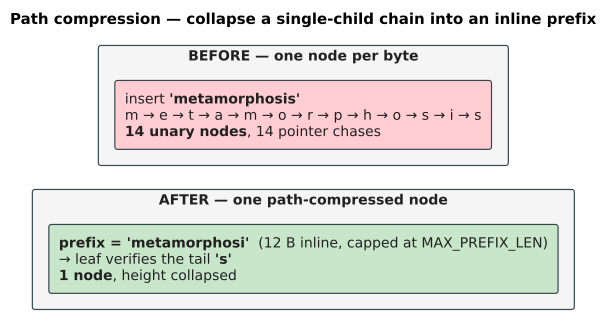

*Figure: path compression for `"metamorphosis"`. Collapsing the unary chain turns up to 14 page faults (one per node) into one read. In this crate the byte variant stores up to **12 inline prefix bytes** per node (`MAX_PREFIX_LEN = 12`); all 12 are compared pessimistically during descent and any tail beyond the inline cap is verified at the leaf. A run longer than the inline cap is split into $`\lceil len / 13\rceil`$ such nodes rather than degenerating back into a per-byte chain.*

### The Problem with Uncompressed Tries

Consider storing only the key `"metamorphosis"`. Uncompressed, the trie is a chain of 14 single-child nodes — one per byte — even though there is no branching to justify them.

### Pessimistic vs. Optimistic Path Compression

ART supports two strategies:

**Pessimistic (store full prefix):**
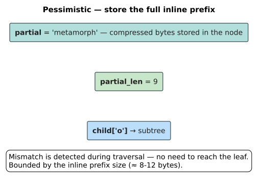
- Comparison during traversal
- No need to reach leaf for mismatch detection
- Limited by partial array size (typically 8 bytes)

**Optimistic (store length only):**
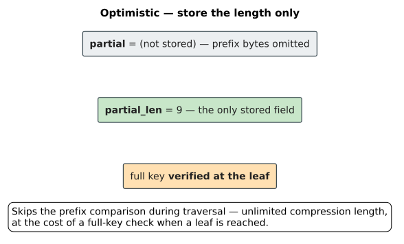
- Skip partial comparison during traversal
- Must verify full key at leaf node
- Unlimited compression length

### Hybrid Approach

ART uses a hybrid: store a bounded inline prefix and, for longer compressions, verify the tail at the leaf. The original paper inlines 8 bytes; this crate inlines up to 12 (`MAX_PREFIX_LEN = 12` for byte nodes, 6 `u32` characters for char nodes) and compares all of them pessimistically during descent.

```rust
fn check_prefix(node: &Node, key: &[u8], depth: usize) -> PrefixMatch {
    let prefix_len = min(node.partial_len, MAX_PREFIX_LEN);

    // Check stored prefix bytes
    for i in 0..prefix_len {
        if key.get(depth + i) != Some(&node.partial[i]) {
            return PrefixMatch::Mismatch(i);
        }
    }

    // If prefix was truncated, optimistically continue
    // (will verify at leaf)
    if node.partial_len > MAX_PREFIX_LEN {
        return PrefixMatch::Optimistic(node.partial_len);
    }

    PrefixMatch::Match(prefix_len)
}
```

### Path Compression During Insert

When inserting a key that diverges from an existing compressed path:

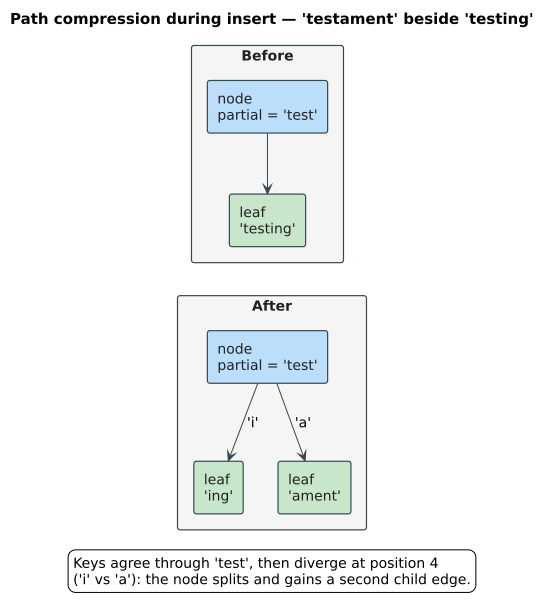

---

## Node Operations

### Lookup Algorithm

```rust
fn lookup(root: &Node, key: &[u8]) -> Option<&Value> {
    let mut node = root;
    let mut depth = 0;

    while depth < key.len() {
        // Check path compression
        if node.partial_len > 0 {
            let prefix_len = check_prefix(node, key, depth);
            if prefix_len != node.partial_len {
                return None;  // Mismatch in compressed path
            }
            depth += prefix_len;
        }

        // Find child for next byte
        let child = match node.node_type {
            Node4 => find_child_node4(node, key[depth]),
            Node16 => find_child_node16(node, key[depth]),
            Node48 => find_child_node48(node, key[depth]),
            Node256 => find_child_node256(node, key[depth]),
        };

        match child {
            Some(c) if c.is_leaf() => {
                // Verify full key at leaf (for optimistic compression)
                return if c.key() == key { Some(c.value()) } else { None };
            }
            Some(c) => {
                node = c;
                depth += 1;
            }
            None => return None,
        }
    }

    // Key exactly matches a prefix
    if node.is_final() { Some(node.value()) } else { None }
}
```

### Insert Algorithm

```rust
fn insert(root: &mut Node, key: &[u8], value: Value) -> Option<Value> {
    let mut node = root;
    let mut depth = 0;

    loop {
        // Handle path compression mismatch
        if node.partial_len > 0 {
            let mismatch = find_mismatch(node, key, depth);
            if mismatch < node.partial_len {
                // Split the node
                let new_node = split_node(node, mismatch);
                // Continue insertion in new structure
                node = new_node;
            }
            depth += node.partial_len;
        }

        if depth >= key.len() {
            // Key ends at this node
            return node.set_value(value);
        }

        // Find or create child
        let byte = key[depth];
        match find_child_mut(node, byte) {
            Some(child) => {
                node = child;
                depth += 1;
            }
            None => {
                // Add new child (may trigger node growth)
                add_child(node, byte, Leaf::new(&key[depth..], value));
                return None;
            }
        }
    }
}
```

### Node Growth (Expand)

A node holds exactly one tier at a time and migrates between tiers as its child count crosses the capacity thresholds 4 / 16 / 48. The state diagram shows the full grow/shrink cycle.

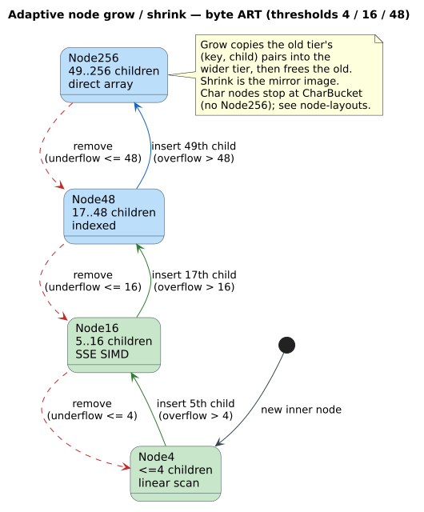

*Figure: adaptive grow (solid, insert-overflow) and shrink (dashed, remove-underflow) across the byte-ART tiers. Char nodes follow the same thresholds but stop at `CharBucket` instead of growing a `Node256`.*

When a node exceeds its capacity, it transforms to the next larger type:

```rust
fn add_child(node: &mut Node, key: u8, child: Node) {
    match node.node_type {
        Node4 if node.num_children == 4 => {
            let new_node = grow_to_node16(node);
            add_child_node16(new_node, key, child);
        }
        Node16 if node.num_children == 16 => {
            let new_node = grow_to_node48(node);
            add_child_node48(new_node, key, child);
        }
        Node48 if node.num_children == 48 => {
            let new_node = grow_to_node256(node);
            add_child_node256(new_node, key, child);
        }
        // Normal insertion
        _ => add_child_to_node(node, key, child),
    }
}
```

**Growth complexity:**
| Transition | Copy Cost | Frequency |
|------------|-----------|-----------|
| Node4 → Node16 | `O(1)` | Common |
| Node16 → Node48 | `O(1)` | Less common |
| Node48 → Node256 | `O(48)` | Rare |

### Node Shrink (Contract)

When children are removed, nodes may shrink to save space:

```rust
fn remove_child(node: &mut Node, key: u8) {
    // Remove the child
    remove_child_from_node(node, key);

    // Check if we should shrink
    match node.node_type {
        Node256 if node.num_children <= 48 => {
            *node = shrink_to_node48(node);
        }
        Node48 if node.num_children <= 16 => {
            *node = shrink_to_node16(node);
        }
        Node16 if node.num_children <= 4 => {
            *node = shrink_to_node4(node);
        }
        _ => {}
    }
}
```

---

## SIMD Optimization

Node16's key lookup is the primary beneficiary of SIMD instructions. **SSE4.1** (Streaming SIMD Extensions 4.1) operates on 128-bit vectors — 16 lanes of `u8` — and **AVX2** (Advanced Vector Extensions 2) on 256-bit vectors — 32 lanes of `u8` or 8 lanes of `u32`. The byte Node16 uses SSE to test all 16 keys in one instruction; the char `CharNode16` uses AVX2 to test 8 `u32` keys at once.

### SSE4.1 Implementation

```rust
#[cfg(target_arch = "x86_64")]
use std::arch::x86_64::*;

fn find_child_node16_sse(node: &Node16, key: u8) -> Option<usize> {
    unsafe {
        // Broadcast search key to all 16 lanes
        let search_key = _mm_set1_epi8(key as i8);

        // Load all 16 keys (aligned load)
        let keys = _mm_load_si128(node.keys.as_ptr() as *const __m128i);

        // Compare all lanes simultaneously
        let cmp = _mm_cmpeq_epi8(search_key, keys);

        // Convert to bitmask (bit i is set if lane i matched)
        let mask = _mm_movemask_epi8(cmp);

        // Mask out unused positions
        let valid_mask = mask & ((1 << node.num_children) - 1);

        if valid_mask != 0 {
            // First set bit indicates matching position
            Some(valid_mask.trailing_zeros() as usize)
        } else {
            None
        }
    }
}
```

### Performance Impact

| Method | Latency | Throughput |
|--------|---------|------------|
| Linear scan (16 keys) | ~16 cycles | 1 key/cycle |
| Binary search | ~12 cycles | Variable |
| SIMD (SSE4.1) | ~3 cycles | 16 keys/cycle |

### AVX2 Extension

With AVX2, we can process 32 bytes at once, enabling:
- Node32 type with 32-way SIMD comparison
- Faster Node48 index lookup

```rust
#[cfg(all(target_arch = "x86_64", target_feature = "avx2"))]
fn find_child_node32_avx2(node: &Node32, key: u8) -> Option<usize> {
    unsafe {
        let search_key = _mm256_set1_epi8(key as i8);
        let keys = _mm256_load_si256(node.keys.as_ptr() as *const __m256i);
        let cmp = _mm256_cmpeq_epi8(search_key, keys);
        let mask = _mm256_movemask_epi8(cmp);
        // ... similar to SSE version
    }
}
```

---

## Space and Time Analysis

### Space Efficiency

**Bytes per pointer** — a conceptual per-pointer amortization of the ART design (Leis et al.);
the *exact* crate `#[repr(C)]` struct sizes (which add the 16-byte `NodeHeader` and 12-byte
`CompressedPrefix`) are the **Summary of Node Types** table above.

| Node Type | Overhead | Per Pointer | At Capacity |
|-----------|----------|-------------|-------------|
| Node4 | 16 B | 12 B | 8 B |
| Node16 | 32 B | 10 B | 8 B |
| Node48 | 272 B | 14 B | 8.7 B |
| Node256 | 32 B | 8 B | 8 B |

For comparison:
- Hash table: ~16 bytes per entry (with chaining)
- B-tree: ~12 bytes per entry
- Sorted array: 8 bytes per pointer

### Real-World Space Usage

Analysis from Leis et al. on various datasets:

| Dataset | Entries | ART Size | Bytes/Key |
|---------|---------|----------|-----------|
| Integers | 16M | 227 MB | 14.2 |
| UUIDs | 16M | 1.9 GB | 119 |
| URLs | 16M | 1.1 GB | 69 |
| Words | 234K | 8.4 MB | 35.9 |

### Lookup Performance

Operations per second (millions) on dense integer keys:

| Structure | Point Lookup | Range Scan |
|-----------|--------------|------------|
| ART | 14.8 M/s | 49 M/s |
| Red-Black Tree | 5.2 M/s | 4.2 M/s |
| Hash Table | 21.1 M/s | N/A |
| B-tree | 6.1 M/s | 15 M/s |

ART is competitive with hash tables for point lookups while supporting ordered operations.

### Memory Access Patterns

| Operation | Cache Lines Touched | Branch Predictions |
|-----------|---------------------|-------------------|
| Node4 lookup | 1 | `O(1)` |
| Node16 lookup (SIMD) | 1 | `O(1)` |
| Node48 lookup | 2 | `O(1)` |
| Node256 lookup | 1 | `O(1)` |

All node types have excellent cache behavior, typically requiring just 1-2 cache line reads.

---

## Lessons for Persistent ARTrie

The ART design provides several principles we'll apply to our persistent structure:

### 1. Adaptive Node Selection Works Well

The distribution of children in real-world string data is typically:
- Many nodes with 1-4 children (use Node4)
- Moderate nodes with 5-16 children (use Node16)
- Few nodes with 17+ children (use Node48/256)

This matches natural language patterns where certain character transitions are rare.

### 2. SIMD is Worth the Complexity

Node16 with SIMD lookup provides:
- $`~5\times`$ speedup over linear scan
- Better than binary search for $`\le 16`$ elements
- Critical for inner loop performance

For persistent storage, we'll ensure Node16 keys are 16-byte aligned in page layouts.

### 3. Path Compression is Essential

Without path compression:
- Height `=` key length (many I/Os for disk-based)
- Many single-child nodes waste space

With compression:
- Height $`\approx`$ number of branching points
- Dramatic reduction for string keys with shared prefixes

### 4. Node Type Field Enables Polymorphism

The explicit type field in each node header allows:
- Safe casting in memory
- Type-tagged serialization on disk
- Runtime dispatch without virtual function overhead

### 5. Growth/Shrink Hysteresis May Be Needed

For persistent storage, we may want hysteresis in shrink decisions:
- Only shrink when well below threshold (not exactly at it)
- Avoid thrashing between types on insert/delete patterns

### 6. Dense Leaves Reduce I/O

In ART, leaves often store single values. For disk-based storage, we'll use B-trie-style buckets at the leaves:
- Multiple strings per leaf page
- Amortize disk I/O across insertions
- Better space utilization

### Where these lessons are realized

In the shipping engine the adaptive-node principle (lessons 1, 4) becomes a single
generic `AdaptiveEdgeStore` inside `OverlayNode<K: KeyEncoding, V>`, monomorphized
once per alphabet: byte keys use ART-style dense `Node4/16/48/256` tiers, while char
and `u64` keys keep native labels and use inline / sorted / sparse-indexed storage as
fan-out grows. The tiers are specified in
[storage-backends.md § Adaptive edge storage](../../persistence/storage-backends.md#adaptive-edge-storage),
and the "one implementation, three alphabets" layering is in
[families.md](../../persistence/families.md#one-implementation-three-alphabets).

---

## Summary

The Adaptive Radix Tree provides:

1. **Adaptive structure**: Four node types optimize for actual fanout
2. **`O(m)` lookup**: Performance independent of tree size
3. **Path compression**: Reduces height for common prefix sharing
4. **SIMD acceleration**: Node16 uses parallel byte comparison
5. **Cache efficiency**: Most operations touch 1-2 cache lines

These properties make ART an excellent foundation for our Persistent ARTrie design. The next document explores how to adapt these structures for disk-based storage.

---

## References

1. Leis, V., Kemper, A., & Neumann, T. (2013). "The Adaptive Radix Tree: ARTful Indexing for Main-Memory Databases." *ICDE*. [DOI: 10.1109/ICDE.2013.6544812](https://doi.org/10.1109/ICDE.2013.6544812) · [PDF](https://db.in.tum.de/~leis/papers/ART.pdf)

2. Binna, R., Zangerle, E., Pichl, M., Specht, G., & Leis, V. (2018). "HOT: A Height Optimized Trie Index for Main-Memory Database Systems." *SIGMOD*. [DOI: 10.1145/3183713.3196896](https://doi.org/10.1145/3183713.3196896)

3. Alvarez, V., Richter, S., Chen, X., & Dittrich, J. (2015). "A Comparison of Adaptive Radix Trees and Hash Tables." *ICDE*. [DOI: 10.1109/ICDE.2015.7113370](https://doi.org/10.1109/ICDE.2015.7113370)

4. Mao, Y., Kohler, E., & Morris, R. T. (2012). "Cache Craftiness for Fast Multicore Key-Value Storage." *EuroSys*. [DOI: 10.1145/2168836.2168855](https://doi.org/10.1145/2168836.2168855)
