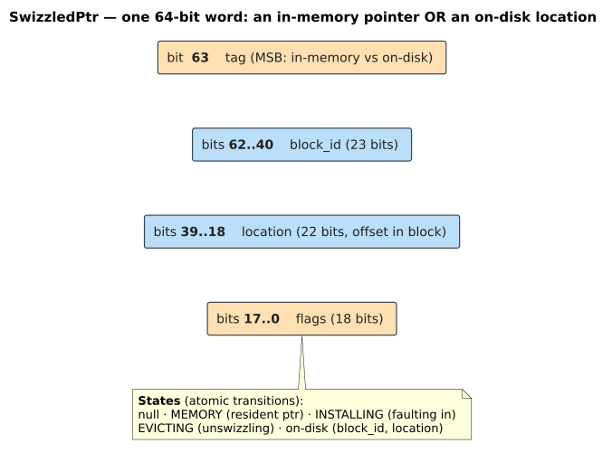
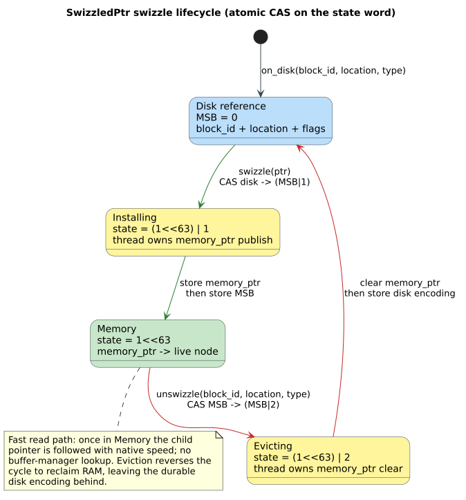
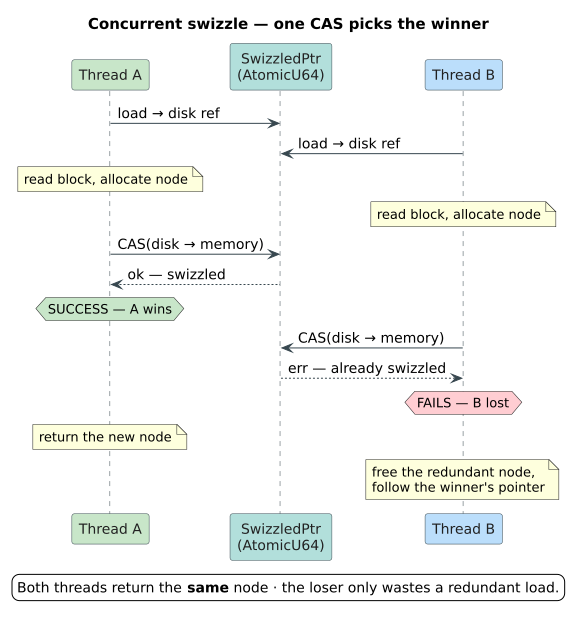
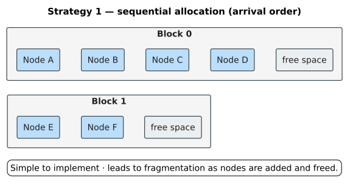
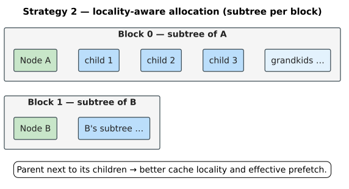
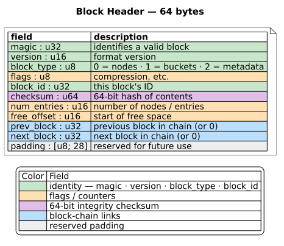
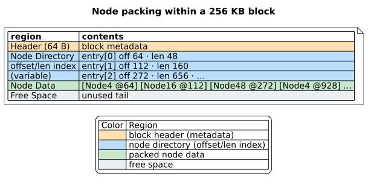

# Persistent ART: Disk Storage Techniques

This document examines techniques for persisting Adaptive Radix Trees to disk storage. We focus on pointer swizzling, serialization strategies, and on-demand loading—techniques developed by DuckDB and refined by subsequent research.

## Table of Contents

1. [The Persistence Challenge](#the-persistence-challenge)
2. [Pointer Swizzling](#pointer-swizzling)
3. [Serialization Strategy](#serialization-strategy)
4. [On-Demand Loading](#on-demand-loading)
5. [Block Layout](#block-layout)
6. [Concurrency Considerations](#concurrency-considerations)
7. [Lessons for Persistent ARTrie](#lessons-for-persistent-artrie)

---

## The Persistence Challenge

### Memory Pointers vs. Disk Offsets

In-memory ART nodes contain raw pointers to child nodes:

```rust
struct Node16 {
    // ... header fields ...
    children: [*mut Node; 16],  // Raw memory pointers
}
```

These pointers are:
- **Process-specific**: Valid only within one process's address space
- **Session-specific**: Invalid after process restart
- **Non-portable**: Different across machines

To persist ART to disk, we need to:
1. Convert memory pointers to disk locations
2. Reconstruct pointers when loading from disk
3. Handle partial loading (not everything fits in RAM)

### Naive Approaches and Their Problems

**Approach 1: Full serialization**
```
Write entire tree to disk → Read entire tree on startup
```
Problems:
- Startup time proportional to tree size
- RAM must hold entire tree
- Changes require rewriting entire structure

**Approach 2: Pointer-to-offset translation**
```
Write nodes with disk offsets → Translate on every access
```
Problems:
- Extra indirection on every child access
- Cannot use native memory operations
- Poor cache behavior

**Approach 3: Address space persistence (mmap)**
```
mmap file at fixed address → Use raw pointers
```
Problems:
- Requires ASLR disabled (security risk)
- Cannot share files across processes
- Fragile across OS updates

---

## Pointer Swizzling

Pointer swizzling — the term is due to the object-database literature for converting a persistent identifier into a direct in-memory pointer the first time it is followed — provides an elegant solution: a single 64-bit atomic **state word** that represents either a live in-memory node or an on-disk reference.

### The Swizzled Pointer Design

This crate's `SwizzledPtr` (source of truth: `src/persistent_artrie/core/swizzled_ptr.rs`) keeps the discriminant and the on-disk encoding in an `AtomicU64` state word, and keeps the *live* pointer in a **separate** `AtomicPtr` slot so that Rust pointer provenance is never destroyed by packing an address into an integer. The bit layout below is exact. The systems-level treatment — how a swizzled reference sits inside the on-disk block/arena format alongside the `FileHeader` and node headers — is in [storage-backends.md](../../persistence/storage-backends.md#pointer-swizzling).



*Figure: the `SwizzledPtr` state word plus its companion `memory_ptr` slot. When the MSB is `0` the word is an on-disk reference: bits `62..40` (23 bits) are the `block_id` ($`\le 8M - 1`$), bits `39..18` (22 bits) are a `location` field (a byte offset for raw references, or an arena slot id for arena-backed byte nodes), and bits `17..0` (18 bits) are flags that include the `NodeType`. When the MSB is `1` the word carries no address at all — the live pointer is read from the separate `memory_ptr: AtomicPtr` slot.*

### Why the MSB Works

On modern 64-bit systems:
- Virtual addresses use at most 48 bits (AMD64) or 57 bits (Intel 5-level paging)
- User-space addresses typically have bit `63 = 0`
- Kernel addresses have bit `63 = 1`, but we never store kernel pointers

So the MSB is free to act as the swizzle discriminant. Note that, unlike the textbook "stash the address in the low 63 bits" trick, this implementation never packs the address into the state word — it sets the MSB purely as a flag and reads the real pointer from `memory_ptr`, which preserves provenance and keeps `block_id`/`location`/`flags` available for the on-disk case.

### Rust Implementation

The following sketch is **illustrative**: it packs the address into the low bits and uses a 40/24 split to keep the example self-contained. The shipping `SwizzledPtr` differs in two ways already described above — it stores the live pointer in a separate `memory_ptr` slot (preserving provenance) and uses the exact 23/22/18-bit on-disk split `(block_id, location, flags)`. Treat this snippet as a conceptual model of the atomic CAS protocol, not the literal field layout.

```rust
use std::sync::atomic::{AtomicU64, Ordering};

const SWIZZLE_FLAG: u64 = 1 << 63;
const PTR_MASK: u64 = !SWIZZLE_FLAG;

#[repr(transparent)]
pub struct SwizzledPtr(AtomicU64);

impl SwizzledPtr {
    /// Create a new unswizzled (on-disk) pointer
    pub fn on_disk(block_id: u32, offset: u32) -> Self {
        let encoded = ((block_id as u64) << 24) | (offset as u64);
        debug_assert!(encoded & SWIZZLE_FLAG == 0);
        Self(AtomicU64::new(encoded))
    }

    /// Create a new swizzled (in-memory) pointer
    pub fn in_memory(ptr: *mut Node) -> Self {
        let addr = ptr as u64;
        debug_assert!(addr & SWIZZLE_FLAG == 0, "High bit must be clear");
        Self(AtomicU64::new(addr | SWIZZLE_FLAG))
    }

    /// Check if pointer is swizzled (in memory)
    pub fn is_swizzled(&self) -> bool {
        self.0.load(Ordering::Acquire) & SWIZZLE_FLAG != 0
    }

    /// Get memory pointer (panics if not swizzled)
    pub fn as_ptr(&self) -> *mut Node {
        let val = self.0.load(Ordering::Acquire);
        assert!(val & SWIZZLE_FLAG != 0, "Pointer not swizzled");
        (val & PTR_MASK) as *mut Node
    }

    /// Get disk location (panics if swizzled)
    pub fn disk_location(&self) -> (u32, u32) {
        let val = self.0.load(Ordering::Acquire);
        assert!(val & SWIZZLE_FLAG == 0, "Pointer is swizzled");
        let block_id = (val >> 24) as u32;
        let offset = (val & 0xFFFFFF) as u32;
        (block_id, offset)
    }

    /// Atomically swizzle: replace disk ref with memory pointer
    pub fn swizzle(&self, ptr: *mut Node) -> bool {
        let old = self.0.load(Ordering::Acquire);
        if old & SWIZZLE_FLAG != 0 {
            return false;  // Already swizzled
        }
        let new = (ptr as u64) | SWIZZLE_FLAG;
        self.0.compare_exchange(old, new, Ordering::AcqRel, Ordering::Acquire).is_ok()
    }

    /// Atomically unswizzle: replace memory pointer with disk ref
    pub fn unswizzle(&self, block_id: u32, offset: u32) -> Option<*mut Node> {
        let old = self.0.load(Ordering::Acquire);
        if old & SWIZZLE_FLAG == 0 {
            return None;  // Already unswizzled
        }
        let new = ((block_id as u64) << 24) | (offset as u64);
        if self.0.compare_exchange(old, new, Ordering::AcqRel, Ordering::Acquire).is_ok() {
            Some((old & PTR_MASK) as *mut Node)
        } else {
            None
        }
    }
}
```

### Atomic Swizzling for Concurrency

The state word moves through four states over its lifetime — an on-disk reference, two short transitional states while a single thread publishes or clears the `memory_ptr` slot, and the stable in-memory state — with every edge a single lock-free compare-and-swap.



*Figure: the swizzle lifecycle. `Installing` (`state = (1<<63) | 1`) and `Evicting` (`state = (1<<63) | 2`) are the transitional states that let exactly one thread own publication or removal of `memory_ptr`; readers that lose the race simply observe the winner's final state. The reverse path (Memory → Evicting → Disk reference) is how eviction reclaims RAM while leaving the durable on-disk encoding behind.*

The `compare_exchange` ensures only one thread successfully swizzles a pointer:



Both threads get the same node; the losing thread just does redundant work.

---

## Serialization Strategy

### Post-Order Traversal

To serialize an ART, we use post-order traversal: children are written before their parents. This ensures that when writing a parent, all child offsets are known.

```rust
fn serialize_tree(root: &Node, writer: &mut BlockWriter) -> DiskRef {
    match root {
        Node::Leaf(leaf) => {
            writer.write_leaf(leaf)
        }
        Node::Inner(inner) => {
            // First, serialize all children
            let child_refs: Vec<DiskRef> = inner.children()
                .map(|child| serialize_tree(child, writer))
                .collect();

            // Then write this node with child references
            writer.write_inner_node(inner, &child_refs)
        }
    }
}
```

### Block Allocation Strategies

**Strategy 1: Sequential allocation**


Simple but leads to fragmentation over time.

**Strategy 2: Locality-aware allocation**

Place parent near children for better cache/prefetch behavior:



### Variable-Size Node Serialization

ART nodes have different sizes. We serialize with type tags:

```rust
fn serialize_node(node: &Node, buffer: &mut Vec<u8>) -> usize {
    let start = buffer.len();

    // Write type tag
    buffer.push(node.node_type() as u8);

    // Write common header
    buffer.push(node.partial_len());
    buffer.extend_from_slice(&node.partial()[..node.partial_len()]);

    // Write type-specific data
    match node {
        Node::Node4(n) => {
            buffer.push(n.num_children);
            buffer.extend_from_slice(&n.keys[..n.num_children]);
            for i in 0..n.num_children {
                serialize_swizzled_ptr(&n.children[i], buffer);
            }
        }
        Node::Node16(n) => {
            buffer.push(n.num_children);
            buffer.extend_from_slice(&n.keys[..16]);  // Full 16 for alignment
            for i in 0..n.num_children {
                serialize_swizzled_ptr(&n.children[i], buffer);
            }
        }
        // ... Node48, Node256 ...
    }

    buffer.len() - start
}
```

---

## On-Demand Loading

### Lazy Swizzling

The key insight: don't load the entire tree. Load nodes on-demand during traversal.

```rust
fn get_child(&self, key: u8, buffer_mgr: &BufferManager) -> Option<&Node> {
    let child_ptr = self.find_child_ptr(key)?;

    if child_ptr.is_swizzled() {
        // Fast path: already in memory
        Some(unsafe { &*child_ptr.as_ptr() })
    } else {
        // Slow path: load from disk
        let (block_id, offset) = child_ptr.disk_location();
        let node = buffer_mgr.load_node(block_id, offset);
        child_ptr.swizzle(node);  // Atomic; might fail if another thread swizzled
        Some(unsafe { &*child_ptr.as_ptr() })
    }
}
```

### Pinning During Traversal

When traversing, pin pages to prevent eviction:

```rust
fn lookup(&self, key: &[u8]) -> Option<&Value> {
    let mut pins: Vec<PagePin> = Vec::new();
    let mut node = &self.root;
    let mut depth = 0;

    while depth < key.len() {
        // Pin current page
        if !node.is_in_root_page() {
            pins.push(self.buffer_mgr.pin(node.page_id()));
        }

        // Navigate to child
        match node.get_child(key[depth], &self.buffer_mgr) {
            Some(child) => {
                node = child;
                depth += 1;
            }
            None => return None,
        }

        // Optionally release old pins to limit memory
        if pins.len() > MAX_PIN_DEPTH {
            pins.remove(0);  // Unpin oldest
        }
    }

    node.value()
    // Pins released when `pins` drops
}
```

### Prefetching

For predictable access patterns (e.g., DFS for Levenshtein automata), prefetch children:

```rust
fn prefetch_children(&self, buffer_mgr: &BufferManager) {
    for child_ptr in self.child_pointers() {
        if !child_ptr.is_swizzled() {
            let (block_id, offset) = child_ptr.disk_location();
            buffer_mgr.prefetch_async(block_id);
        }
    }
}

// During Levenshtein traversal
fn traverse_with_prefetch(&self, ...) {
    // Prefetch children of current node while processing
    self.prefetch_children(buffer_mgr);

    for (label, child) in self.edges() {
        if automaton.can_match(label) {
            traverse_with_prefetch(child, ...);
        }
    }
}
```

---

## Block Layout

### Block Size Selection

| Block Size | Pros | Cons |
|------------|------|------|
| 4 KB | Matches OS page size, fine-grained | More blocks, more metadata |
| 16 KB | Good for SSDs | Moderate overhead |
| 64 KB | Reduced metadata | May waste space |
| 256 KB | Matches NVMe optimal I/O | Large minimum allocation |

For NVMe SSDs with 128KB-256KB optimal I/O size, larger blocks amortize the per-I/O overhead.

### Block Header



### Node Packing Within Blocks



### Alignment Considerations

For SIMD operations (Node16), ensure 16-byte alignment:

```rust
fn allocate_in_block(block: &mut Block, size: usize, align: usize) -> Option<u32> {
    let current = block.free_offset as usize;
    let aligned = (current + align - 1) & !(align - 1);
    let end = aligned + size;

    if end > block.capacity() {
        return None;
    }

    block.free_offset = end as u16;
    Some(aligned as u32)
}

// For Node16, request 16-byte alignment
let offset = allocate_in_block(&mut block, size_of::<Node16>(), 16)?;
```

---

## Concurrency Considerations

### Read-Only Swizzling

Multiple readers can safely swizzle simultaneously:

```rust
// Safe: multiple threads may race to swizzle the same pointer
// Worst case: some threads load redundantly, but all get correct result
fn concurrent_lookup(&self, key: &[u8]) -> Option<&Value> {
    let node = self.get_child_swizzling(key[0])?;  // May race
    // ...
}
```

### Writes Require Coordination

For insert/delete with concurrent readers:

**Option 1: Copy-on-write** — the *path-copying* form of making a data structure persistent in the sense of Driscoll et al. (1989, [DOI:10.1016/0022-0000(89)90034-2](https://doi.org/10.1016/0022-0000(89)90034-2)): a mutation clones only the affected node (and, transitively, its ancestors), leaving the old version intact for in-flight readers.
```
1. Create modified copy of node
2. Atomically swap parent's child pointer
3. Old node becomes garbage (collect later)
```

**Option 2: Optimistic lock coupling**
```
1. Acquire version lock on parent
2. Modify child pointer
3. Increment version, release lock
4. Readers retry if version changed mid-read
```

**Option 3: Epoch-based reclamation (EBR)** — a deferred-reclamation scheme in which time is divided into *epochs*; memory unlinked in one epoch is only physically freed once every thread has advanced past it, guaranteeing no reader still holds a reference.
```
1. Readers register in current epoch
2. Writers defer frees to "safe" epoch
3. Reclaim when no readers in old epochs
```

### DuckDB's Approach

DuckDB uses copy-on-write for its ART:

```rust
fn insert_cow(&mut self, key: &[u8], value: Value) -> Result<()> {
    let mut path: Vec<(*mut Node, usize)> = Vec::new();

    // Traverse, recording path
    let mut node = &mut self.root;
    let mut depth = 0;
    while depth < key.len() {
        path.push((node as *mut _, depth));
        node = node.get_child_mut(key[depth])?;
        depth += 1;
    }

    // Modify leaf, propagate copies upward
    let mut new_node = node.clone_with_modification(...);
    for (parent, d) in path.into_iter().rev() {
        let parent = unsafe { &mut *parent };
        let new_parent = parent.clone_with_child_replaced(key[d], new_node);
        new_node = new_parent;
    }

    self.root = new_node;
    Ok(())
}
```

---

## Lessons for Persistent ARTrie

### 1. Swizzled Pointers Enable Lazy Loading

The MSB-flag technique gives us:
- Native pointer performance when swizzled
- Compact on-disk representation
- Atomic swizzle operations for concurrent readers

### 2. Block Size Matters for I/O Efficiency

For SSDs:
- 256 KB blocks match optimal NVMe I/O
- Larger blocks amortize header overhead
- Pack multiple small nodes per block

### 3. Locality-Aware Allocation Improves Prefetching

When serializing:
- Keep subtrees together in blocks
- Parent nodes near children
- Enables effective prefetching during traversal

### 4. Copy-on-Write Simplifies Concurrency

For our use case:
- Levenshtein traversal is mostly read-only
- Inserts can use COW without blocking readers
- Epoch-based reclamation handles deferred frees

### 5. Checksum Everything

For crash recovery:
- Block-level checksums detect corruption
- Log checksums validate WAL entries
- Enables safe recovery after crash

### 6. Separate Index and Leaf Storage

Following B-trie lessons:
- ART nodes for index (inner) layer
- B-trie-style buckets for leaves
- Amortize leaf I/O across multiple strings

### Where these lessons are realized

The shipping engine applies each lesson above; the systems-tier corpus documents
how:

- **Swizzled pointers & block layout** (lessons 1–3, 6) — the `BlockStorage` seam,
  the on-disk `FileHeader`/arena/node-header format, and pointer swizzling:
  [storage-backends.md](../../persistence/storage-backends.md#the-on-disk-format).
- **Copy-on-write with lock-free readers** (lesson 4) — the immutable overlay node,
  the path-copy write path, and the CAS-published root:
  [lock-free-overlay.md](../../persistence/lock-free-overlay.md).
- **Epoch-based reclamation** (lesson 4) — the deferred-free discipline that lets
  evicted RAM be reclaimed while in-flight readers finish:
  [concurrency-model.md](../../persistence/concurrency-model.md#eviction-safety--the-serial_disk_ptr-stamp).
- **Checksums & crash recovery** (lesson 5) — the WAL frame and ARIES-style
  redo replay: [durability-and-recovery.md](../../persistence/durability-and-recovery.md).

The design that composes them is [06-persistent-artrie-design](06-persistent-artrie-design.md).

---

## Summary

Persisting ART to disk requires:

1. **Swizzled pointers**: Single 64-bit value for memory or disk reference
2. **Post-order serialization**: Write children before parents
3. **On-demand loading**: Lazy swizzle during traversal
4. **Block-based storage**: Pack nodes into large I/O units
5. **Concurrency handling**: Atomic swizzle, COW for writes

The next document covers buffer management: the page cache, LRU eviction, and crash recovery mechanisms that complete our storage layer.

---

## References

1. DuckDB Team. (2022). "Persistent Storage of Adaptive Radix Trees in DuckDB." [Blog Post](https://duckdb.org/2022/07/27/art-storage)

2. Driscoll, J. R., Sarnak, N., Sleator, D. D., & Tarjan, R. E. (1989). "Making Data Structures Persistent." *Journal of Computer and System Sciences*, 38(1), 86-124. [DOI:10.1016/0022-0000(89)90034-2](https://doi.org/10.1016/0022-0000(89)90034-2)

3. Luo, X., Zuo, P., Shen, J., Gu, J., Wang, X., Lyu, M. R., & Zhou, Y. (2023). "SMART: A High-Performance Adaptive Radix Tree for Disaggregated Memory." *OSDI*. [PDF](https://www.usenix.org/system/files/osdi23-luo.pdf)

4. Graefe, G. (2011). "Modern B-Tree Techniques." *Foundations and Trends in Databases*, 3(4), 203-402. [DOI:10.1561/1900000028](https://doi.org/10.1561/1900000028)

5. Leis, V., Haubenschild, M., Kemper, A., & Neumann, T. (2018). "LeanStore: In-Memory Data Management Beyond Main Memory." *ICDE*.

6. Neumann, T. & Leis, V. (2020). "Umbra: A Disk-Based System with In-Memory Performance." *CIDR*.
