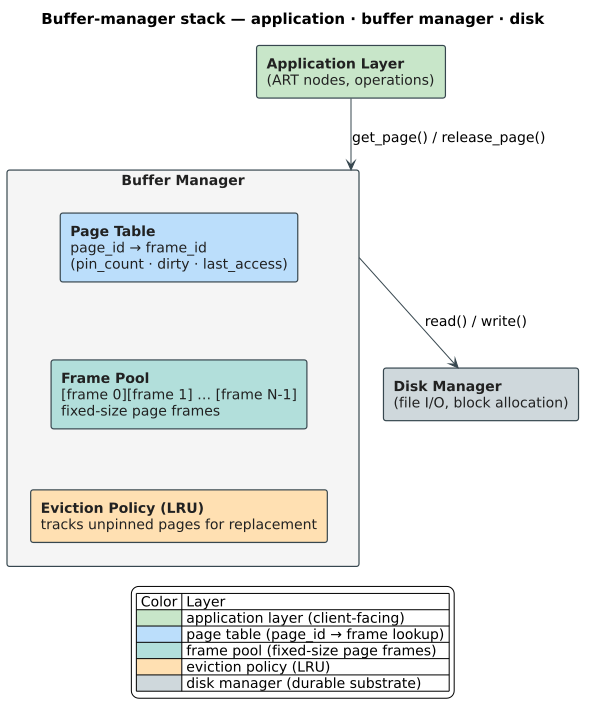

# Buffer Management

This document covers the storage layer components that enable efficient disk-based trie operations: the buffer manager (page cache), the **write-ahead log (WAL)** — a durable, append-only record of intended changes written *before* the corresponding data pages, so a crash can be repaired by replaying the log — and crash recovery. These components form the foundation for durability and performance in our Persistent ARTrie. Two acronyms recur: **LSN** (Log Sequence Number, a monotonically increasing identifier stamped on each log record and on the page it last modified) and **ARIES** (Algorithms for Recovery and Isolation Exploiting Semantics; Mohan et al. 1992, [DOI:10.1145/128765.128770](https://doi.org/10.1145/128765.128770)), the canonical WAL-based recovery protocol.

## Table of Contents

1. [Buffer Manager Overview](#buffer-manager-overview)
2. [Page Cache Design](#page-cache-design)
3. [Memory-Mapped I/O](#memory-mapped-io)
4. [Write-Ahead Logging](#write-ahead-logging)
5. [Crash Recovery](#crash-recovery)
6. [Checkpoint Management](#checkpoint-management)
7. [Lessons for Persistent ARTrie](#lessons-for-persistent-artrie)

---

## Buffer Manager Overview

The buffer manager mediates all access between the trie and disk storage, providing:

1. **Page caching**: Keep frequently-accessed pages in memory
2. **Eviction policy**: Decide which pages to remove when memory is full
3. **Pin management**: Prevent eviction of pages in active use
4. **Dirty tracking**: Track modified pages for write-back
5. **I/O scheduling**: Batch and prioritize disk operations

The crate's shipping buffer manager — a pinning page cache over the `BlockStorage`
seam — is documented in
[storage-backends.md § The buffer manager](../../persistence/storage-backends.md#the-buffer-manager).

### Architecture



### Core API

```rust
pub trait BufferManager {
    /// Fetch a page, loading from disk if necessary
    fn get_page(&self, page_id: PageId) -> Result<PageGuard, Error>;

    /// Create a new page
    fn new_page(&self) -> Result<(PageId, PageGuard), Error>;

    /// Delete a page
    fn delete_page(&self, page_id: PageId) -> Result<(), Error>;

    /// Flush dirty pages to disk
    fn flush(&self) -> Result<(), Error>;

    /// Prefetch pages asynchronously
    fn prefetch(&self, page_ids: &[PageId]);
}
```

---

## Page Cache Design

### Frame Pool

The frame pool is a fixed-size array of memory frames, each sized to hold one page:

```rust
pub struct FramePool {
    frames: Vec<Frame>,
    frame_size: usize,  // Typically 4KB, 16KB, or 256KB
}

pub struct Frame {
    data: Box<[u8]>,
    page_id: Option<PageId>,
    pin_count: AtomicU32,
    dirty: AtomicBool,
    last_access: AtomicU64,
}
```

### Page Table

Maps page IDs to frame locations:

```rust
pub struct PageTable {
    table: DashMap<PageId, FrameId>,  // Concurrent hash map
}

impl PageTable {
    fn lookup(&self, page_id: PageId) -> Option<FrameId> {
        self.table.get(&page_id).map(|r| *r)
    }

    fn insert(&self, page_id: PageId, frame_id: FrameId) {
        self.table.insert(page_id, frame_id);
    }

    fn remove(&self, page_id: PageId) -> Option<FrameId> {
        self.table.remove(&page_id).map(|(_, v)| v)
    }
}
```

### Pin Management

Pinning prevents eviction while a page is in use:

```rust
pub struct PageGuard<'a> {
    buffer_mgr: &'a BufferManagerImpl,
    frame_id: FrameId,
    page_id: PageId,
}

impl<'a> PageGuard<'a> {
    pub fn data(&self) -> &[u8] {
        self.buffer_mgr.frame_data(self.frame_id)
    }

    pub fn data_mut(&mut self) -> &mut [u8] {
        self.buffer_mgr.mark_dirty(self.frame_id);
        self.buffer_mgr.frame_data_mut(self.frame_id)
    }
}

impl<'a> Drop for PageGuard<'a> {
    fn drop(&mut self) {
        self.buffer_mgr.unpin(self.frame_id);
    }
}
```

### LRU Eviction

When all frames are occupied and we need space:

```rust
pub struct LRUReplacer {
    list: Mutex<LinkedList<FrameId>>,  // Front = most recently used
    positions: DashMap<FrameId, *mut Node>,
}

impl LRUReplacer {
    /// Mark frame as recently used
    fn access(&self, frame_id: FrameId) {
        let mut list = self.list.lock();
        if let Some(node) = self.positions.get(&frame_id) {
            // Move to front
            list.remove(node);
            list.push_front(frame_id);
            self.positions.insert(frame_id, list.front_node());
        }
    }

    /// Get victim frame for eviction
    fn victim(&self) -> Option<FrameId> {
        let mut list = self.list.lock();
        // Find unpinned frame from back (least recently used)
        // Return None if all frames are pinned
        list.pop_back()
    }

    /// Pin frame (remove from eviction candidates)
    fn pin(&self, frame_id: FrameId) {
        let mut list = self.list.lock();
        if let Some(node) = self.positions.remove(&frame_id) {
            list.remove(node);
        }
    }

    /// Unpin frame (add back to eviction candidates)
    fn unpin(&self, frame_id: FrameId) {
        let mut list = self.list.lock();
        list.push_front(frame_id);
        self.positions.insert(frame_id, list.front_node());
    }
}
```

### Clock Algorithm Alternative

For better performance, the **CLOCK** algorithm (also called *second-chance*) approximates **LRU** (Least Recently Used) eviction with far lower bookkeeping: it sweeps a circular array of per-frame reference bits like a clock hand, giving any recently-touched frame a "second chance" before evicting it.

```rust
pub struct ClockReplacer {
    frames: Vec<AtomicBool>,  // Reference bits
    hand: AtomicUsize,        // Current position
}

impl ClockReplacer {
    fn victim(&self) -> Option<FrameId> {
        let n = self.frames.len();
        let start = self.hand.load(Ordering::Relaxed);

        for _ in 0..2 * n {  // At most two passes
            let pos = self.hand.fetch_add(1, Ordering::Relaxed) % n;
            let ref_bit = &self.frames[pos];

            if ref_bit.compare_exchange(
                false, true,
                Ordering::AcqRel, Ordering::Relaxed
            ).is_ok() {
                return Some(FrameId(pos as u32));
            } else {
                // Second chance: clear the bit
                ref_bit.store(false, Ordering::Release);
            }
        }
        None  // All frames pinned
    }

    fn access(&self, frame_id: FrameId) {
        self.frames[frame_id.0 as usize].store(true, Ordering::Release);
    }
}
```

---

## Memory-Mapped I/O

As an alternative to explicit read/write calls, memory mapping provides direct access:

### mmap Basics

```rust
use memmap2::{MmapMut, MmapOptions};

pub struct MappedFile {
    mmap: MmapMut,
    len: usize,
}

impl MappedFile {
    pub fn open(path: &Path, size: usize) -> Result<Self, Error> {
        let file = OpenOptions::new()
            .read(true)
            .write(true)
            .create(true)
            .open(path)?;
        file.set_len(size as u64)?;

        let mmap = unsafe { MmapOptions::new().map_mut(&file)? };
        Ok(Self { mmap, len: size })
    }

    pub fn get_page(&self, page_id: PageId, page_size: usize) -> &[u8] {
        let offset = page_id.0 as usize * page_size;
        &self.mmap[offset..offset + page_size]
    }

    pub fn get_page_mut(&mut self, page_id: PageId, page_size: usize) -> &mut [u8] {
        let offset = page_id.0 as usize * page_size;
        &mut self.mmap[offset..offset + page_size]
    }

    pub fn sync(&self) -> Result<(), Error> {
        self.mmap.flush()?;
        Ok(())
    }
}
```

### Trade-offs: mmap vs. Explicit I/O

| Aspect | mmap | Explicit I/O |
|--------|------|--------------|
| Simplicity | High (OS manages caching) | Low (manual cache) |
| Control | Limited | Full |
| Eviction | OS decides | Application decides |
| Prefetching | madvise hints | Explicit async I/O |
| Error handling | SIGBUS signals | Result types |
| Portability | Good | Excellent |

### Hybrid Approach

Use mmap for read-heavy workloads, explicit I/O for write-heavy. The crate makes
exactly this choice concrete behind the `BlockStorage` trait: an `mmap` backend
(default) and an `io_uring` + `O_DIRECT` backend, selected by workload — see
[storage-backends.md § The two backends](../../persistence/storage-backends.md#the-two-backends--a-workload-driven-choice):

```rust
pub enum IoStrategy {
    Mmap(MappedFile),
    Buffered(BufferManagerImpl),
}

impl BufferManager for IoStrategy {
    fn get_page(&self, page_id: PageId) -> Result<PageGuard, Error> {
        match self {
            IoStrategy::Mmap(f) => {
                // Direct access, "pin" is no-op
                Ok(PageGuard::mapped(f.get_page(page_id, PAGE_SIZE)))
            }
            IoStrategy::Buffered(bm) => {
                bm.get_page(page_id)
            }
        }
    }
}
```

---

## Write-Ahead Logging

WAL ensures durability by logging changes before applying them:

> **Theory vs. this crate.** The `LogRecord` sketched below is the classical ARIES
> **page-diff** model (before/after images per page). The shipping ARTrie WAL instead
> frames each change as a compact **operation** record — a 17-byte frame plus payload,
> with typed records (`Insert`, `Remove`, `Increment`, `CommitRank`, `Checkpoint`, …) —
> and publishes under the **Order-A** "log-before-publish" rule. The exact on-disk frame
> is in [wal-format.md](../../persistence/wal-format.md); the write ordering and
> committed-watermark discipline are in
> [durability-and-recovery.md](../../persistence/durability-and-recovery.md#the-order-a-write-protocol).

### WAL Guarantee

**The WAL protocol:**
1. Log the intended change to the WAL
2. Ensure the log record is durable (fsync)
3. Apply the change to the data page
4. (Later) Write the data page to disk

If crash occurs:
- After step 2: Redo from log
- After step 3: Redo recreates the change
- After step 4: No recovery needed

### Log Record Format

```rust
#[repr(C)]
pub struct LogRecord {
    lsn: u64,                    // Log Sequence Number
    prev_lsn: u64,               // Previous LSN (for undo chain)
    txn_id: u64,                 // Transaction ID (0 for none)
    record_type: LogRecordType,  // Insert, Update, Delete, etc.
    page_id: PageId,             // Affected page
    offset: u16,                 // Offset within page
    before_len: u16,             // Length of before-image
    after_len: u16,              // Length of after-image
    // followed by: before_image, after_image
}

#[repr(u8)]
pub enum LogRecordType {
    BeginCheckpoint = 1,
    EndCheckpoint = 2,
    PageInsert = 10,
    PageUpdate = 11,
    PageDelete = 12,
    NodeSplit = 20,
    NodeMerge = 21,
}
```

### WAL Writer

```rust
pub struct WalWriter {
    file: File,
    buffer: Mutex<Vec<u8>>,
    current_lsn: AtomicU64,
    flushed_lsn: AtomicU64,
}

impl WalWriter {
    pub fn log(&self, record: &LogRecord, before: &[u8], after: &[u8]) -> u64 {
        let mut buffer = self.buffer.lock();

        let lsn = self.current_lsn.fetch_add(1, Ordering::SeqCst);

        // Write header
        buffer.extend_from_slice(record.as_bytes());
        buffer.extend_from_slice(before);
        buffer.extend_from_slice(after);

        lsn
    }

    pub fn flush(&self) -> Result<u64, Error> {
        let mut buffer = self.buffer.lock();

        if buffer.is_empty() {
            return Ok(self.flushed_lsn.load(Ordering::Acquire));
        }

        // Write to file
        self.file.write_all(&buffer)?;
        self.file.sync_data()?;

        let lsn = self.current_lsn.load(Ordering::Acquire);
        self.flushed_lsn.store(lsn, Ordering::Release);

        buffer.clear();
        Ok(lsn)
    }
}
```

### Group Commit

Amortize fsync cost across multiple operations. The crate ships a group-commit
coordinator behind the `group-commit` feature, but it is **experimental**: on NVMe,
per-record `fsync` currently matches or beats it, so it is off by default — the
measured trade-off is in [group-commit.md](../../persistence/group-commit.md).

```rust
pub struct GroupCommit {
    pending: Mutex<Vec<(u64, oneshot::Sender<()>)>>,
    flush_trigger: Condvar,
}

impl GroupCommit {
    pub async fn commit(&self, lsn: u64) {
        let (tx, rx) = oneshot::channel();

        {
            let mut pending = self.pending.lock();
            pending.push((lsn, tx));

            // Trigger flush if enough pending or timeout
            if pending.len() >= GROUP_SIZE || self.timeout_elapsed() {
                self.flush_trigger.notify_one();
            }
        }

        rx.await.expect("flush failed");
    }

    fn flush_loop(&self, wal: &WalWriter) {
        loop {
            let to_notify = {
                let mut pending = self.pending.lock();
                self.flush_trigger.wait(&mut pending);

                std::mem::take(&mut *pending)
            };

            if to_notify.is_empty() {
                continue;
            }

            // Single fsync for all pending commits
            if let Ok(flushed_lsn) = wal.flush() {
                for (lsn, tx) in to_notify {
                    if lsn <= flushed_lsn {
                        let _ = tx.send(());
                    }
                }
            }
        }
    }
}
```

---

## Crash Recovery

### ARIES Recovery Protocol

ARIES (defined above) is the standard WAL-based recovery algorithm. It proceeds in three phases:
1. **Analysis**: Scan log to determine state at crash
2. **Redo**: Replay all changes since last checkpoint
3. **Undo**: Rollback incomplete transactions

The crate's shipping recovery follows this redo-only shape — load the checkpoint
image, then replay the durable WAL tail past the committed watermark in
commit-generation order, guarded against reopen double-apply — and is specified in
[durability-and-recovery.md § Crash recovery](../../persistence/durability-and-recovery.md#crash-recovery).

For our single-writer trie, we simplify to redo-only recovery:

```rust
pub fn recover(wal: &WalReader, buffer_mgr: &BufferManager) -> Result<(), Error> {
    // Find last checkpoint
    let checkpoint_lsn = wal.find_last_checkpoint()?;

    // Redo all records after checkpoint
    for record in wal.records_since(checkpoint_lsn) {
        match record.record_type {
            LogRecordType::PageInsert |
            LogRecordType::PageUpdate => {
                let page = buffer_mgr.get_page(record.page_id)?;

                // Check if page already has this change (idempotent)
                let page_lsn = page.lsn();
                if page_lsn < record.lsn {
                    // Apply the after-image
                    apply_redo(&mut page, &record);
                }
            }
            LogRecordType::PageDelete => {
                buffer_mgr.delete_page(record.page_id)?;
            }
            _ => {}
        }
    }

    Ok(())
}

fn apply_redo(page: &mut PageGuard, record: &LogRecord) {
    let after = record.after_image();
    let offset = record.offset as usize;
    page.data_mut()[offset..offset + after.len()].copy_from_slice(after);
    page.set_lsn(record.lsn);
}
```

### Page LSN

Each page stores the `LSN` of the last log record that modified it. Comparing a record's `LSN` against the page's stored `LSN` is what makes redo **idempotent**: a change is reapplied only when `page_lsn < record.lsn`, so replaying the log twice is harmless.

```rust
#[repr(C)]
pub struct PageHeader {
    page_id: PageId,
    lsn: u64,          // Last modification LSN
    checksum: u64,     // CRC of page contents
    // ...
}
```

This enables:
- **Idempotent redo**: Skip already-applied changes
- **Recovery optimization**: Only redo if page is stale

---

## Checkpoint Management

Checkpoints limit recovery time by establishing known-good points:

### Fuzzy Checkpoints

A fuzzy checkpoint doesn't stop all operations:

```rust
pub fn fuzzy_checkpoint(
    buffer_mgr: &BufferManager,
    wal: &WalWriter,
) -> Result<(), Error> {
    // 1. Record checkpoint start
    let begin_lsn = wal.log_checkpoint_begin()?;

    // 2. Collect dirty pages (snapshot of current state)
    let dirty_pages: Vec<PageId> = buffer_mgr.dirty_pages();

    // 3. Flush dirty pages (may take time)
    for page_id in &dirty_pages {
        buffer_mgr.flush_page(*page_id)?;
    }

    // 4. Record checkpoint end with dirty page list
    wal.log_checkpoint_end(begin_lsn, &dirty_pages)?;
    wal.flush()?;

    Ok(())
}
```

### Checkpoint Frequency

Trade-off between checkpoint overhead and recovery time:

| Checkpoint Interval | Recovery Time | Checkpoint Overhead |
|---------------------|---------------|---------------------|
| 1 minute | Very short | High (frequent I/O) |
| 10 minutes | Short | Moderate |
| 1 hour | Long | Low |

### Log Truncation

After checkpoint, old log records can be discarded:

```rust
pub fn truncate_log(
    wal: &WalWriter,
    last_checkpoint_lsn: u64,
) -> Result<(), Error> {
    // Find oldest required LSN (minimum of checkpoint and active transactions)
    let min_required = last_checkpoint_lsn;

    // Remove log records before min_required
    wal.truncate_before(min_required)?;

    Ok(())
}
```

---

## Lessons for Persistent ARTrie

### 1. Page Size Selection

For NVMe SSDs:
- **256 KB pages**: Match optimal I/O size, reduce metadata overhead
- Amortize header cost across more data
- Fit multiple ART nodes per page

### 2. LRU with Pinning

ART traversal pins nodes along the path:
- Root node should be permanently pinned
- Upper-level nodes have high hit rates
- Leaf buckets may have lower locality

Consider a **tiered cache**:
- Tier 1: Pinned (root, hot nodes)
- Tier 2: LRU for frequently accessed
- Tier 3: On-disk only

### 3. Simplified WAL for Our Use Case

Single-writer, read-mostly workload allows:
- No undo logging (complete or abort before commit)
- Redo-only recovery
- Infrequent checkpoints (lower write amplification)

### 4. mmap for Read-Heavy Workloads

Levenshtein queries are read-heavy:
- mmap provides zero-copy access
- OS manages page eviction
- Use madvise for prefetch hints

### 5. Checksum Everything

For data integrity:
- Page-level checksums detect corruption
- Log record checksums validate recovery
- Block checksums on serialized nodes

### 6. Prefetch Strategy for Levenshtein

DFS traversal has predictable patterns:
- Prefetch children when visiting parent
- Use async I/O or madvise(MADV_WILLNEED)
- Limit prefetch depth to avoid waste

### Where these lessons are realized

Each component in this chapter has a systems-tier counterpart:

- **Page cache & the two backends** (lessons 1, 2, 4) —
  [storage-backends.md](../../persistence/storage-backends.md#the-buffer-manager):
  the pinning buffer manager over `BlockStorage`, with the `mmap` (default) and
  `io_uring` + `O_DIRECT` backends.
- **Write-ahead log** (lesson 3) —
  [wal-format.md](../../persistence/wal-format.md): the compact 17-byte record frame
  and the rank-regime replay rule, plus the Order-A ordering in
  [durability-and-recovery.md](../../persistence/durability-and-recovery.md#the-order-a-write-protocol).
- **Crash recovery & checkpoints** (lessons 3, 5) —
  [durability-and-recovery.md](../../persistence/durability-and-recovery.md): redo-only
  replay, the committed watermark, checkpoint flips, and the reopen double-apply guard.
- **Group commit** — [group-commit.md](../../persistence/group-commit.md): the
  experimental coordinator and why per-record `fsync` currently wins on NVMe.

The design that assembles these is [06-persistent-artrie-design](06-persistent-artrie-design.md).

---

## Summary

Buffer management provides the foundation for disk-based tries:

1. **Page cache**: LRU/CLOCK eviction with pin management
2. **Memory mapping**: Zero-copy access for read-heavy workloads
3. **Write-ahead log**: Durability with group commit
4. **Crash recovery**: Redo-only for our simplified use case
5. **Checkpoints**: Balance recovery time vs. overhead

The final document brings these components together in our Persistent ARTrie design.

---

## References

1. Graefe, G. (2010). "A Survey of B-Tree Locking Techniques." *ACM TODS*, 35(3), 16:1-16:26. [DOI:10.1145/1806907.1806908](https://doi.org/10.1145/1806907.1806908)

2. Mohan, C., Haderle, D., Lindsay, B., Pirahesh, H., & Schwarz, P. (1992). "ARIES: A Transaction Recovery Method Supporting Fine-Granularity Locking and Partial Rollbacks Using Write-Ahead Logging." *ACM TODS*, 17(1), 94-162. [DOI:10.1145/128765.128770](https://doi.org/10.1145/128765.128770)

3. O'Neil, E. J., O'Neil, P. E., & Weikum, G. (1993). "The LRU-K Page Replacement Algorithm for Database Disk Buffering." *SIGMOD*.

4. Leis, V., Haubenschild, M., & Neumann, T. (2019). "Optimistic Lock Coupling: A Scalable and Efficient General-Purpose Synchronization Method." *IEEE Data Engineering Bulletin*.

5. Neumann, T., & Leis, V. (2020). "Umbra: A Disk-Based System with In-Memory Performance." *CIDR*.
