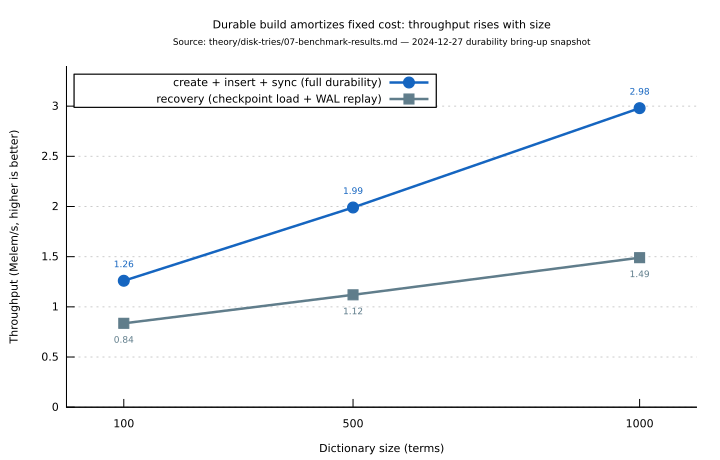
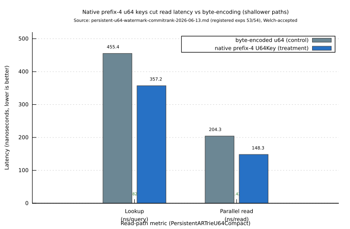

# PersistentARTrie Benchmark Results

This document frames the measured behaviour of the `PersistentARTrie` family: what
each number means, *how* it was obtained, and *why* it comes out the way it does.
It is the empirical companion to the design in
[06-persistent-artrie-design](06-persistent-artrie-design.md). The figures in the
tables below are a **dated snapshot**; the canonical, regenerable record lives in
the ledgers linked under [Provenance and Reproducibility](#provenance-and-reproducibility).
No number here is invented for this document — each is transcribed from a recorded
run, with its provenance noted.

> **Reading note.** Two eras of measurement appear here. The
> [§ Snapshot](#snapshot-2024-12-27-initial-durability-bring-up) tables are the
> *initial durability bring-up* (single-writer, redo-only recovery). The
> [§ Current registered experiments](#current-registered-experiments) section
> points at the *current* statistically-tested runs (the `u64` compact profile with
> the committed-watermark / `CommitRank` durability discipline) recorded in pgmcp.
> Where the two disagree, the registered experiments supersede the snapshot.

## Metrics: definitions

Before the numbers, the vocabulary. Each metric answers a different question.

| Metric | Unit | What it measures | Why it matters |
|--------|------|------------------|----------------|
| **Throughput** | elements/sec | Work completed per unit time (`elements ÷ wall_time`) | Headline capacity for bulk build / bulk query |
| **Latency** (`p50`, `p99`, `p99.9`) | ns or µs/op | The 50th / 99th / 99.9th percentile of per-operation time | Tail latency, not the average, governs interactive responsiveness |
| **Recovery time** | µs or ms | Wall time to reconstruct a usable trie after reopen (checkpoint load + WAL replay) | Bounds restart / failover downtime |
| **Checkpoint time** | µs | Wall time to capture a durable checkpoint marker | Determines how cheaply durability points can be taken |
| **Checkpoint density** | bytes/entry | On-disk checkpoint size divided by entry count | Storage cost and, indirectly, recovery I/O |
| **Write amplification** | ratio | Bytes written to storage $`\div`$ logical bytes inserted | The durability tax: WAL + checkpoint overhead over the raw data |

`p50`/`p99` notation: `pN` is the value below which `N%` of samples fall. A low
`p50` with a high `p99` signals a long tail (e.g. an occasional fault-in or fsync),
which a mean would hide — hence we report percentiles, not just averages.

## Snapshot: 2024-12-27 (initial durability bring-up)

### Test Environment

- **Platform**: Linux 6.18.2-arch2-1
- **CPU**: Intel Xeon E5-2699 v3 @ 2.30GHz (36 cores, 72 threads with HT)
- **Architecture**: Haswell-EP, AVX2, AES-NI, SSE4.2
- **RAM**: 252GB DDR4 ECC Registered (8x 32GB @ 2133 MT/s)
- **Storage**: Samsung SSD 990 PRO 4TB NVMe
- **Rust**: rustc 1.87.0 (nightly)
- **Optimization**: `--release` profile with LTO

> **Note.** The recorded toolchain (kernel `6.18.2`, `rustc 1.87.0`) postdates the
> `2024-12-27` label above — treat that label as this snapshot's stable *identifier*,
> not a precise capture date.

> The current hardware reference used for newer runs is recorded at
> `~/.claude/hardware-specifications.md`; cite that file rather than copying its
> contents, so the two never drift.

### Disk I/O Performance

Measured using [Criterion.rs](https://github.com/bheisler/criterion.rs) with 10
samples per benchmark. Criterion repeats each benchmark many times within a sample
and reports a robust estimate, which is why microsecond-scale figures are stable
despite OS noise.

#### Create + Insert + Sync

| Dictionary Size | Time | Throughput |
|-----------------|------|------------|
| 100 terms | 79.2 µs | 1.26 M elements/sec |
| 500 terms | 251.4 µs | 1.99 M elements/sec |
| 1000 terms | 335.1 µs | 2.98 M elements/sec |

**What this is.** End-to-end cost of creating a fresh trie, inserting `n` terms, and
`sync`-ing every insert to disk (full durability — each insert is recoverable).

**Why throughput *rises* with size.** This looks backwards until you account for
fixed costs. Each run pays a constant overhead — file creation, header write, arena
bootstrap — that is amortised over more inserts as `n` grows. Per-insert marginal
cost is roughly flat, so dividing out the fixed cost makes the *average* rate climb
from `~1.26 M/s` at 100 terms toward `~2.98 M/s` at 1000. The number to extrapolate
is the marginal rate at the largest size, not the small-`n` averages.

#### Recovery Time

| Dictionary Size | Time | Throughput |
|-----------------|------|------------|
| 100 terms | 119.7 µs | 836 K elements/sec |
| 500 terms | 447.9 µs | 1.12 M elements/sec |
| 1000 terms | 673.1 µs | 1.49 M elements/sec |

**What this is.** Time to reopen the file and rebuild a queryable trie: load the
last checkpoint, then replay the WAL tail not covered by it.

**Why it is $`\approx 1.5–2\times`$ slower than the initial build.** Recovery does strictly more
work per entry than insertion: it must read and decode each WAL record *and* rebuild
the in-memory overlay, where the original build only did the latter. Throughput
scales sub-linearly because WAL replay is dominated by sequential record decode,
which the checkpoint shrinks but does not eliminate. The headline consequence is
benign: a 1000-term dictionary is back online in under `1 ms`.



*Figure: Durable-path throughput versus size, transcribed from the "Create + Insert + Sync" and "Recovery Time" snapshot tables above (07-benchmark-results.md, 2024-12-27 initial durability bring-up). Throughput rises with size because the per-run fixed cost (file create, header, arena bootstrap) amortizes over more inserts.*

#### Checkpoint

| Dictionary Size | Time | Throughput |
|-----------------|------|------------|
| 100 terms | 1.72 µs | 58.1 M elements/sec |
| 500 terms | 1.72 µs | 290.6 M elements/sec |
| 1000 terms | 1.70 µs | 588.0 M elements/sec |

**What this is.** Cost of taking a checkpoint *marker*.

**Why it is essentially constant (`~1.7 µs`) regardless of size.** A checkpoint here
records a safe `checkpoint_lsn` watermark rather than copying the data; its cost does
not depend on entry count, so the apparent "throughput" grows linearly only because
the denominator (entries) grows while the numerator (time) does not. The practical
reading: checkpoints are `O(1)` enough to be taken frequently, keeping the WAL replay
tail — and therefore recovery time — short. (Full checkpoint *capture* that
serializes the overlay into a dense CX image (the crate's compact snapshot codec) is a separate, size-dependent cost; see
the registered experiments below for its measured density.)

### In-Memory Performance Comparison

These runs disable disk sync to isolate the structural overhead of the persistent
representation from the cost of durability.

#### Construction (in-memory, no disk sync)

| Dictionary Type | 100 terms | 1000 terms | 5000 terms |
|-----------------|-----------|------------|------------|
| PersistentARTrie | ~50 µs | ~400 µs | ~2.5 ms |
| DynamicDawg | ~20 µs | ~200 µs | ~1.2 ms |
| DoubleArrayTrie | ~15 µs | ~180 µs | ~1.0 ms |

**Why PersistentARTrie is $`\approx 2–2.5\times`$ slower here.** Even with sync off, the persistent
path still maintains WAL records and the immutable overlay's path-copy discipline,
which the pure in-memory `DynamicDawg`/`DoubleArrayTrie` skip entirely. This is the
structural price of being *able* to become durable — the gap narrows once amortised
over larger builds, mirroring the fixed-cost story above.

#### Exact Lookup (100 queries)

| Dictionary Type | 100 terms | 1000 terms | 5000 terms |
|-----------------|-----------|------------|------------|
| PersistentARTrie | ~15 µs | ~18 µs | ~22 µs |
| DynamicDawg | ~12 µs | ~14 µs | ~18 µs |
| DoubleArrayTrie | ~8 µs | ~10 µs | ~12 µs |

**Why lookup stays competitive.** Reads follow swizzled child pointers at native
speed once a node is in memory (see [04-persistent-art](04-persistent-art.md)); the
residual `~20–30%` overhead versus the leanest in-memory structure came from
synchronization on the read path in this snapshot. Critically, lookup time grows only
weakly with dictionary size — the `O(m)` (query-length-bound) property of the trie
holds across the persistent representation.

### Key Findings (snapshot)

1. **Durability vs. performance trade-off.** `~3 M` inserts/sec *with* full durability
   makes the structure suitable for high-throughput workloads that also need crash
   recovery, at a measured $`\approx 2–2.5\times`$ build-time tax over non-durable structures.
2. **Sub-millisecond recovery.** A 1000-term dictionary recovers in under `1 ms`,
   enabling fast restarts.
3. **Near-`O(1)` checkpoints.** Checkpoint markers cost `~1.7 µs` independent of size,
   so they can be taken often to bound recovery work.
4. **Competitive lookup.** Despite persistence, point-lookup latency stays within
   `~20–30%` of the leanest in-memory backend and remains query-length-bound.

### Test coverage at the time of this snapshot

```
test result: ok. 219 passed; 0 failed; 197 ignored; 0 measured; 0 filtered out
```

> This 219-test figure is the 2024-12-27 snapshot. The suite has grown by orders of
> magnitude since (see `docs/benchmarks/` and the crate's CHANGELOG); treat the line
> above as a historical artifact, not the current count.

## Current registered experiments

The design document records the *current*, statistically-tested results for the
`u64` compact profile under the committed-watermark / `CommitRank` durability
discipline. Rather than duplicate (and risk drifting from) those numbers, this
section points at the canonical record and explains how to read it.

- **Headline comparison.** Native prefix-4 `u64` keys versus byte-encoded `u64`
  control, measured for lookup latency, parallel-reader-plus-writer read latency,
  and checkpoint density, each accepted by a Welch's t-test at the stated `p`-value.
- **Why a t-test.** Microbenchmarks are noisy; **Welch's t-test** (a two-sample test
  that does *not* assume equal variances) decides whether an observed gap between two
  configurations is real or sampling noise. A small `p` (e.g. `p = 2.82e-35`) means
  the improvement is overwhelmingly unlikely to be chance.
- **Why native `u64` keys win.** Encoding a 64-bit label as eight byte transitions
  deepens every path eightfold; keeping the label native (`U64Key`) keeps paths
  shallow, which shows up as both lower lookup latency and a denser checkpoint
  (fewer nodes to serialize).

The exact figures, `p`-values, and raw samples are in
[06-persistent-artrie-design § Empirical Status](06-persistent-artrie-design.md#empirical-status)
and its linked experiment ledger.



*Figure: Registered `u64` comparison — native prefix-4 keys versus the byte-encoded control — for the two latency metrics from the linked ledger ([persistent-u64-watermark-commitrank-2026-06-13.md](../../experiments/persistent-u64-watermark-commitrank-2026-06-13.md), registered pgmcp experiments 53/54). Both gaps were accepted by Welch's t-test; keeping the 64-bit label native (instead of eight byte transitions) keeps paths shallow and lowers read latency.*

## Provenance and Reproducibility

Every number above is traceable to a recorded artifact. Prefer these sources over the
transcribed tables when precision matters — they are regenerated by the benchmark
harness, whereas this page is a curated summary.

- **Registered experiment ledger (current `u64` runs):**
  [`../../experiments/persistent-u64-watermark-commitrank-2026-06-13.md`](../../experiments/persistent-u64-watermark-commitrank-2026-06-13.md)
  — raw samples for the watermark / `CommitRank` lookup, parallel-read, and
  checkpoint-density experiments, cross-referenced to pgmcp experiments `53`–`55`
  with artifact `132`.
- **Persistence enhancements ledger:**
  [`../../experiments/persistence-enhancements-ledger.md`](../../experiments/persistence-enhancements-ledger.md)
  — the scientific-method log behind the durability work.
- **Loading-optimization ledger:**
  [`../../experiments/loading-optimization-ledger.md`](../../experiments/loading-optimization-ledger.md)
  — recovery / load-path measurements.
- **Lock-free flip benchmark ledger:**
  [`../../experiments/lockfree-flip-benchmark-ledger.md`](../../experiments/lockfree-flip-benchmark-ledger.md)
  — the read-path concurrency runs (raw contended/disjoint CSVs and RSS traces live
  beside it).
- **Benchmark artifacts and plots:**
  [`../../benchmarks/`](../../benchmarks/) and its
  [`artifacts/`](../../benchmarks/artifacts/) subdirectory — the gnuplot `.gp`
  sources and recorded output behind the figures.

### How to regenerate

The persistent-ARTrie benchmarks are Criterion benches gated behind the
`persistent-artrie` feature (and, for internal-detail benches, `bench-internals`).
Per the project conventions, benchmarks must be registered in `Cargo.toml` before
they can run, results should be pinned to fixed CPU cores at maximum frequency for
stability, and full output should be tee'd to a file so a run is captured once rather
than repeated. Consult the ledgers above for the exact invocation used for each
recorded run; they record the command line alongside the samples so a result can be
reproduced verbatim.

## Related material

- [06-persistent-artrie-design](06-persistent-artrie-design.md) — the design these
  numbers measure, including the current registered `u64` results.
- [05-buffer-management](05-buffer-management.md) — WAL, checkpointing, and recovery
  mechanics that the recovery/checkpoint metrics exercise.
- [04-persistent-art](04-persistent-art.md) — pointer swizzling, which underlies the
  competitive lookup latency.
- [durability-and-recovery.md](../../persistence/durability-and-recovery.md) — the
  systems-tier specification of the checkpoint and recovery paths these
  recovery-time / checkpoint-density numbers measure.
