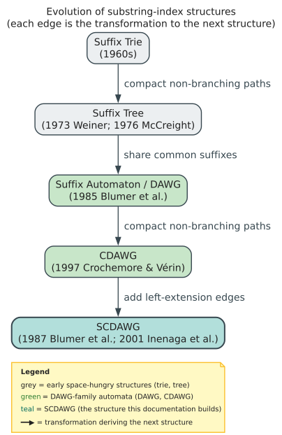
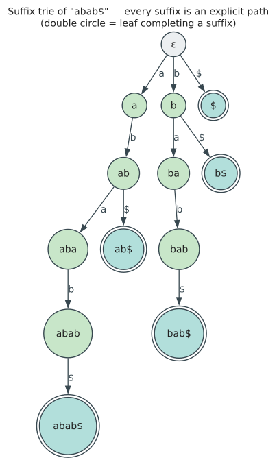
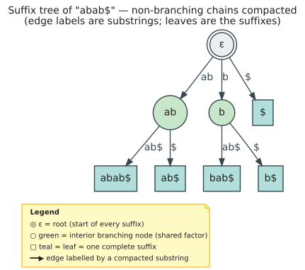
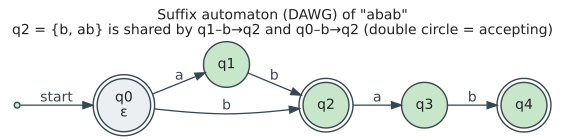
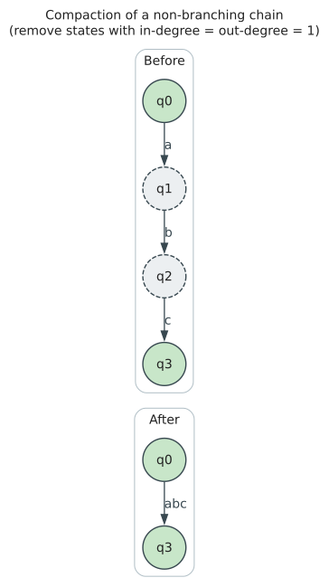
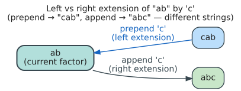

# Introduction: The Substring Search Problem

## Motivation

Consider a dictionary containing 88,000 words. Given a query string, we want to find all dictionary entries that contain that query as a substring. For example:

- Query: "cat" → matches "catalog", "concatenate", "scatter", "cat"
- Query: "tion" → matches "action", "nation", "ration", "option", ...

The naive approach compares the query against every position in every dictionary word:

```
For each word w in dictionary:
    For each position i in w:
        If w[i..i+m] == query:
            Report match
```

**Complexity**: $`O(N \times m)`$ where `N` = total characters in the dictionary, `m` = query length.

For our 88,000-word dictionary (~800,000 total characters), searching for a 5-character query performs ~4 million character comparisons. This is unacceptable for interactive applications.

## The Goal: O(|pattern|) Search

We want a data structure that answers substring queries in time proportional to the query length alone:

| Approach | Query Time | Space |
|----------|------------|-------|
| Naive scan | $`O(N \times m)`$ | $`O(N)`$ |
| Build index once, query many | **$`O(m)`$** | $`O(N)`$ |

The SCDAWG achieves this by precomputing all possible substrings into a graph structure where:
- Each node represents an equivalence class of substrings
- Following edges spells out the query character by character
- Reaching a node confirms the query exists as a substring

## Why "Bidirectional"?

Many applications need more than simple substring existence. The **WallBreaker algorithm** (Gerdjikov et al. 2013; see [07-references](07-references.md)) for fuzzy dictionary matching requires:

1. **(1a) Substring check**: Is V a substring of some dictionary word?
2. **(1b) Right extension**: Given V is a substring, navigate to $`V \cdot \sigma`$ (append character)
3. **(1c) Left extension**: Given V is a substring, navigate to $`\sigma \cdot V`$ (prepend character)

The WallBreaker algorithm works by:
1. Finding all dictionary substrings matching a query segment
2. Extending matches left and right to discover fuzzy matches
3. Using edit distance thresholds to prune the search space

Standard substring indices (suffix trees, suffix arrays) support (1a) and (1b) efficiently, but (1c) requires the "symmetric" structure of the SCDAWG.

## Evolution of Substring Structures

The SCDAWG represents the culmination of decades of research into space-efficient substring indexing:



The load-bearing references on this path, with verified DOIs, are: the suffix
automaton / DAWG (Blumer et al. 1985, [10.1016/0304-3975(85)90157-4](https://doi.org/10.1016/0304-3975(85)90157-4);
factor-transducer view, Crochemore 1986, [10.1016/0304-3975(86)90041-1](https://doi.org/10.1016/0304-3975(86)90041-1)),
the CDAWG (Crochemore & Vérin 1997, [10.1007/3-540-63220-4_55](https://doi.org/10.1007/3-540-63220-4_55)),
and the SCDAWG (Blumer et al. 1987, [10.1145/28869.28873](https://doi.org/10.1145/28869.28873);
on-line construction, Inenaga et al. 2001, [10.1109/SPIRE.2001.989743](https://doi.org/10.1109/SPIRE.2001.989743)).
Weiner (1973) and McCreight (1976) are listed author-year in
[07-references](07-references.md). Full citations for every work appear there.

### Suffix Trie

The suffix trie explicitly stores every suffix of the input:



**Problem**: $`O(n^2)`$ space for an `n`-length input. The string "aaa...a" (`n` copies of 'a') requires $`n + (n-1) + \dots + 1 = O(n^2)`$ nodes.

### Suffix Tree

The suffix tree compacts chains of single-child nodes:



**Improvement**: $`O(n)`$ nodes and edges by storing edge labels as `(start, end)` pairs into the original string.

**Problem**: Doesn't share common substrings between different suffixes. The substrings "ab" appearing in "abab\$" at positions 0 and 2 lead to separate tree locations.

### Suffix Automaton (DAWG)

The Directed Acyclic Word Graph shares common **prefixes** of suffixes:



Key insight: states represent **equivalence classes** of substrings sharing the same set of ending positions (`endpos` sets).

**Space**: At most $`2n - 1`$ states, $`3n - 4`$ edges for an `n`-length input.

### CDAWG

The Compact DAWG further compacts the suffix automaton by removing states with exactly one incoming and one outgoing edge:



**Space**: At most $`n + 1`$ states, $`2n - 2`$ edges.

### SCDAWG

The Symmetric Compact DAWG adds **left extension edges** to the CDAWG:



This enables bidirectional navigation required by algorithms like WallBreaker.

**Space**: At most $`n + 1`$ states, $`4n - 4`$ edges (doubled due to left edges).

## Our Running Example: "abcabcab"

Throughout this documentation, we trace the string **w = "abcabcab"** through each structure:

```
String: a  b  c  a  b  c  a  b
Index:  0  1  2  3  4  5  6  7
```

### Substrings and Their Occurrences

| Substring | Occurrences (start positions) | Count |
|-----------|------------------------------|-------|
| a | 0, 3, 6 | 3 |
| b | 1, 4, 7 | 3 |
| c | 2, 5 | 2 |
| ab | 0, 3, 6 | 3 |
| bc | 1, 4 | 2 |
| ca | 2, 5 | 2 |
| abc | 0, 3 | 2 |
| bca | 1, 4 | 2 |
| cab | 2, 5 | 2 |
| abca | 0, 3 | 2 |
| bcab | 1, 4 | 2 |
| cabc | 2 | 1 |
| abcab | 0, 3 | 2 |
| bcabc | 1 | 1 |
| cabca | 2 | 1 |
| abcabc | 0 | 1 |
| bcabca | 1 | 1 |
| cabcab | 2 | 1 |
| abcabca | 0 | 1 |
| bcabcab | 1 | 1 |
| abcabcab | 0 | 1 |

### Equivalence Classes Preview

Substrings are grouped by their **end-position sets**:

| End-positions | Substrings in Class |
|---------------|---------------------|
| {1, 4, 7} | "a" |
| {2, 5, 8} | "b", "ab" |
| {3, 6} | "c", "bc", "abc" |
| {4, 7} | "a", "ca", "bca", "abca" |
| {5, 8} | "b", "ab", "cab", "bcab", "abcab" |
| {6} | "c", "bc", "abc", "cabc", "bcabc", "abcabc" |
| {7} | "a", "ca", "bca", "abca", "cabca", "bcabca", "abcabca" |
| {8} | "b", "ab", "cab", "bcab", "abcab", "cabcab", "bcabcab", "abcabcab" |

Note how different-length strings can share the same equivalence class (same end-positions).

## What's Next

The following documents develop the theory systematically:

1. **[02-suffix-automaton](02-suffix-automaton.md)**: Defines equivalence classes, suffix links, and the DAWG structure formally
2. **[03-cdawg](03-cdawg.md)**: Shows how to compact the DAWG while preserving functionality
3. **[04-scdawg](04-scdawg.md)**: Adds left extension edges and defines prime subwords
4. **[05-construction](05-construction.md)**: Presents the on-line O(n) construction algorithm
5. **[06-operations](06-operations.md)**: Describes substring search and IS (Inverted File) features
