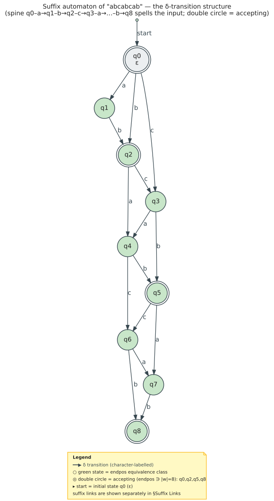
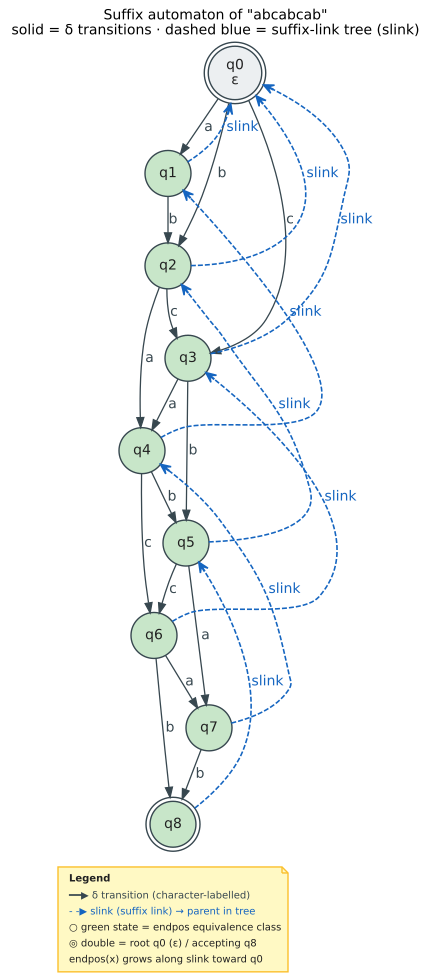
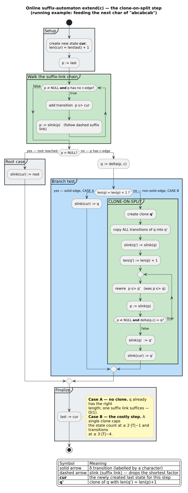

# Suffix Automaton (DAWG) Theory

The **Suffix Automaton**, also called **DAWG** (Directed Acyclic Word Graph), is the minimal deterministic finite automaton that accepts exactly the suffixes of a string. More importantly for our purposes, it can be modified to accept all **substrings** of the string, forming the foundation for the SCDAWG.

## Preliminaries

### Notation

Let $`w`$ be a string over alphabet $`\Sigma`$.

- $`\lvert w\rvert`$ denotes the **length** of $`w`$
- $`w[i]`$ denotes the **character** at position $`i`$ (0-indexed)
- $`w[i..j]`$ denotes the **substring** from position $`i`$ to $`j-1`$ (exclusive end)
- $`\varepsilon`$ denotes the **empty string** (length 0)
- $`w \cdot x`$ or $`wx`$ denotes **concatenation** of $`w`$ and $`x`$
- $`\Sigma^{*}`$ denotes the set of all strings over $`\Sigma`$ (including $`\varepsilon`$)

### Factors and Subwords

A **factor** (or **subword**) of $`w`$ is any substring $`w[i..j]`$ where $`0 \le i \le j \le \lvert w\rvert`$.

**Definition (Factor Set)**: $`F(w) = \{\, w[i..j] : 0 \le i \le j \le \lvert w\rvert \,\}`$

For our running example w = "abcabcab":

```math
F(w) = \{\varepsilon, a, b, c, ab, bc, ca, abc, bca, cab, abca, bcab, cabc,
\\ abcab, bcabc, cabca, abcabc, bcabca, cabcab, abcabca, bcabcab, abcabcab\}
```

### End-Position Set

The **end-position set** of a factor x in w is the set of positions immediately after each occurrence of x:

**Definition (End-Position Set)**:
```math
\text{end-pos}(x) = \{\, i : w[i-\lvert x\rvert..i] = x,\ \lvert x\rvert \le i \le \lvert w\rvert \,\}
```

Note: We use 1-indexed end positions (positions 1 through $`\lvert w\rvert`$) to match standard notation.

**Example** for w = "abcabcab":

| Factor x | Occurrences (start) | end-pos(x) |
|----------|---------------------|------------|
| $`\varepsilon`$ | everywhere | $`\{0,1,2,3,4,5,6,7,8\}`$ |
| a | 0, 3, 6 | $`\{1, 4, 7\}`$ |
| b | 1, 4, 7 | $`\{2, 5, 8\}`$ |
| c | 2, 5 | $`\{3, 6\}`$ |
| ab | 0, 3, 6 | $`\{2, 5, 8\}`$ |
| bc | 1, 4 | $`\{3, 6\}`$ |
| abc | 0, 3 | $`\{3, 6\}`$ |
| cab | 2, 5 | $`\{5, 8\}`$ |
| abcab | 0, 3 | $`\{5, 8\}`$ |
| abcabcab | 0 | $`\{8\}`$ |

**Key Observation**: Factors "b" and "ab" have the same end-position set `{2, 5, 8}`. Similarly, "c", "bc", and "abc" share `{3, 6}`. Distinct-length factors thus collapse into one state precisely when their `endpos` sets coincide.

## Equivalence Classes

### The Right-Context Equivalence

Two factors are **equivalent** if and only if they have the same end-position set:

**Definition (Factor Equivalence)**:
```math
x \equiv y \iff \text{end-pos}(x) = \text{end-pos}(y)
```

This is indeed an equivalence relation (reflexive, symmetric, transitive), partitioning `F(w)` into equivalence classes.

**Theorem 1** (Blumer et al. 1985, [10.1016/0304-3975(85)90157-4](https://doi.org/10.1016/0304-3975(85)90157-4)): The number of equivalence classes is at most $`2\cdot \lvert w\rvert - 1`$.

*Proof sketch*: Each new character can create at most 2 new equivalence classes — one for the new suffix, and possibly one more when an existing class is **split** (the clone-on-split step illustrated below). This per-character budget of 2 is exactly what yields the $`\le 2\cdot \lvert w\rvert - 1`$ bound on the state count.

### Equivalence Classes for "abcabcab"

Grouping factors by their end-position sets:

| Class ID | end-pos | Factors | Size |
|----------|---------|---------|------|
| $`q_0`$ | $`\{0..8\}`$ | $`\{\varepsilon\}`$ | 1 |
| $`q_1`$ | $`\{1,4,7\}`$ | $`\{a\}`$ | 1 |
| $`q_2`$ | $`\{2,5,8\}`$ | $`\{b, ab\}`$ | 2 |
| $`q_3`$ | $`\{3,6\}`$ | $`\{c, bc, abc\}`$ | 3 |
| $`q_4`$ | $`\{4,7\}`$ | $`\{ca, bca, abca\}`$ | 3 |
| $`q_5`$ | $`\{5,8\}`$ | $`\{cab, bcab, abcab\}`$ | 3 |
| $`q_6`$ | $`\{6\}`$ | $`\{cabc, bcabc, abcabc\}`$ | 3 |
| $`q_7`$ | $`\{7\}`$ | $`\{cabca, bcabca, abcabca\}`$ | 3 |
| $`q_8`$ | $`\{8\}`$ | $`\{cabcab, bcabcab, abcabcab\}`$ | 3 |

**Total**: 9 equivalence classes for a string of length 8 ($`\le 2\times 8 - 1 = 15`$).

### Class Structure

Each equivalence class [x] has important structural properties:

**Lemma 1 (Suffix Chain)**: If $`x \equiv y`$ and $`\lvert x\rvert < \lvert y\rvert`$, then `x` is a suffix of `y`.

*Proof*: Since `end-pos(x) = end-pos(y)`, every occurrence of `y` ends where some occurrence of `x` ends. Since `y` is longer, `y` must contain `x` as a suffix.

**Corollary**: Each equivalence class forms a **suffix chain** - a sequence of strings where each is a suffix of the next:
```math
\text{shortest} \subset \dots \subset \text{longest}
```

For class $`q_3 = \{c, bc, abc\}`$:
```math
c \subset bc \subset abc
```
Here "c" is a suffix of "bc", and "bc" is a suffix of "abc".

### Longest and Shortest Representatives

For each equivalence class [x]:
- **longest(x)**: The longest string in the class
- **shortest(x)**: The shortest string in the class

The strings in $`[x]`$ are exactly those with lengths in $`[\lvert \text{shortest}(x)\rvert, \lvert \text{longest}(x)\rvert]`$ that are suffixes of $`\text{longest}(x)`$.

## The Suffix Automaton

### Definition

The **Suffix Automaton** (or **DAWG**) of w is the deterministic finite automaton:

$`SA(w) = (Q, \Sigma, \delta, q_0, F)`$ where:
- $`Q`$ = set of equivalence classes $`\{\, [x] : x \in F(w) \,\}`$
- $`\Sigma`$ = alphabet
- $`\delta([x], a) = [xa]`$ if $`xa \in F(w)`$, undefined otherwise
- $`q_0 = [\varepsilon]`$ (initial state)
- $`F = \{\, [x] : \text{longest}(x) \text{ is a suffix of } w \,\}`$ (accepting states)

### Transition Function

The transition function $`\delta`$ maps (state, character) to the next state:

```math
\delta([x], a) = [xa]
```

This works because if $`x_1 \equiv x_2`$ (same end-positions), then $`x_1 a \equiv x_2 a`$ (appending the same character preserves the relationship).

### Graphical Representation

For $`w = `$ "abcabcab", the suffix automaton is:



The same transition function $`\delta`$ in compact adjacency-table form:

| From | a | b | c |
|------|---|---|---|
| $`q_0`$ | $`q_1`$ | $`q_2`$ | $`q_3`$ |
| $`q_1`$ | - | $`q_2`$ | - |
| $`q_2`$ | $`q_4`$ | - | $`q_3`$ |
| $`q_3`$ | $`q_4`$ | $`q_5`$ | - |
| $`q_4`$ | - | $`q_5`$ | $`q_6`$ |
| $`q_5`$ | $`q_7`$ | - | $`q_6`$ |
| $`q_6`$ | $`q_7`$ | $`q_8`$ | - |
| $`q_7`$ | - | $`q_8`$ | - |
| $`q_8`$ | - | - | - |

Where `-` indicates no transition (character doesn't extend any factor in that class).

## Suffix Links

### Definition

The **suffix link** `slink([x])` of a state `[x]` points to the state of its longest proper suffix that forms a *different* equivalence class. Intuitively, a suffix link "drops" the shortest factor of a class and lands in the class one `endpos`-level up:

**Definition (Suffix Link)**:
```
slink([x]) = [y] where y is the longest proper suffix of longest(x) such that [y] ≠ [x]
```

Equivalently: `slink([x]) = [z]` where `z` has length $`\lvert \text{shortest}(x)\rvert - 1`$.

### Intuition

The suffix link "drops" the shortest string from the equivalence class:
- State $`q_3 = \{c, bc, abc\}`$, shortest $`= c`$
- Suffix link goes to the state containing the suffix of "c" of length |c|-1 = 0
- That is $`\varepsilon`$, so $`\text{slink}(q_3) = q_0`$

For state $`q_4 = \{ca, bca, abca\}`$, shortest $`= ca`$:
- Suffix link goes to the state containing "a" (suffix of "ca" of length 1)
- $`\text{slink}(q_4) = q_1`$

### Suffix Link Tree

Because every suffix link strictly shortens the shortest representative, the links are acyclic and converge on $`q_0`$; they therefore form a **tree** rooted at $`q_0`$. The figure below overlays that suffix-link tree (dashed blue) on the automaton's transitions (solid) for the running example `abcabcab`. Reversing the suffix links — i.e. reading the tree top-down — recovers, for any matched factor, every state whose factors end where it ends, which is precisely what powers substring and occurrence (`endpos`) queries.



Tracing the suffix links explicitly for `abcabcab`:

| State | Shortest | Suffix of length |shortest|-1 | Suffix Link Target |
|-------|----------|----------------------------------|-------------------|
| $`q_1`$ | a | $`\varepsilon`$ | $`q_0`$ |
| $`q_2`$ | b | $`\varepsilon`$ | $`q_0`$ |
| $`q_3`$ | c | $`\varepsilon`$ | $`q_0`$ |
| $`q_4`$ | ca | a | $`q_1`$ |
| $`q_5`$ | cab | ab | $`q_2`$ |
| $`q_6`$ | cabc | abc | $`q_3`$ |
| $`q_7`$ | cabca | abca | $`q_4`$ |
| $`q_8`$ | cabcab | abcab | $`q_5`$ |

### Properties of Suffix Links

**Lemma 2**: Following suffix links from any state eventually reaches $`q_0`$.

**Lemma 3**: For states `[x]` and `[y]` with `slink([x]) = [y]`:
```
end-pos(x) ⊂ end-pos(y)  (strict subset)
```

*Proof*: Shorter strings have (weakly) more occurrences. Since `[y]` represents shorter strings than `[x]`, and they are different classes, the inclusion must be strict.

**Lemma 4**: The suffix link tree has depth at most $`\lvert w\rvert`$.

*Proof*: Each suffix link reduces the shortest representative's length by at least 1, so a root-to-leaf path can have at most $`\lvert w\rvert`$ edges.

## Right Contexts

The **right context** of a factor `x` is the set of characters that can follow `x`:

**Definition (Right Context)**:
```
right-context(x) = {a ∈ Σ : xa ∈ F(w)}
```

**Key Property**: All strings in an equivalence class have the **same** right context.

*Proof*: If `end-pos(x) = end-pos(y)`, then `x` and `y` can be extended by exactly the same characters (those that appear after their shared ending positions over the alphabet $`\Sigma`$).

This property is what makes the suffix automaton deterministic: the next state depends only on the current equivalence class, not which specific string led to it.

## Construction Complexity

**Theorem 2** (Blumer et al. 1985, [10.1016/0304-3975(85)90157-4](https://doi.org/10.1016/0304-3975(85)90157-4)): The suffix automaton of a string `w` can be constructed in $`O(\lvert w\rvert )`$ time and space.

The construction algorithm is **online** (left-to-right):
1. Process characters left-to-right.
2. For each new character `c`, walk the suffix-link chain from the previous last state, adding `c`-transitions, and create at most 2 new states.
3. Update transitions and suffix links incrementally.

The single non-trivial step is **clone-on-split**: when the suffix-link walk reaches a state `p` whose existing `c`-edge leads to a state `q` reached by a *non-solid* edge (`len(q) > len(p) + 1`), the algorithm clones `q` as `q′`, copies its transitions and suffix link, sets `len(q′) = len(p) + 1`, and rewires the affected `c`-edges and suffix links. This is exactly the per-character "second state" of the budget in Theorem 1, and capping it at one clone per step is what keeps the totals at $`\le 2\cdot \lvert w\rvert - 1`$ states and $`\le 3\cdot \lvert w\rvert - 4`$ transitions.



The resulting automaton has:
- At most $`2\cdot \lvert w\rvert - 1`$ states.
- At most $`3\cdot \lvert w\rvert - 4`$ transitions.

## What's Missing?

The suffix automaton is efficient but has limitations:

1. **Non-compact edges**: Single-character transitions between all adjacent states, even when the path is deterministic.

2. **No left extensions**: The automaton only supports appending characters (right extension), not prepending (left extension).

3. **All factors vs. prime factors**: Every factor has representation, but many are redundant for substring searching.

These limitations motivate the CDAWG (compacting) and SCDAWG (adding symmetry), covered in the next documents.

## Summary

| Concept | Definition |
|---------|------------|
| Factor | Any substring w[i..j] |
| end-pos(x) | Set of positions where x ends in w |
| Equivalence | x $`\equiv`$ y $`\iff`$ end-pos(x) = end-pos(y) |
| State | Equivalence class of factors |
| Transition | $`\delta([x], a) = [xa]`$ |
| Suffix link | Points to longest proper suffix in different class |
| Right context | Characters that can follow a factor |

**Key insight**: The suffix automaton groups factors by their ending positions, creating a minimal DFA for substring recognition.

**Next**: [03-cdawg](03-cdawg.md) - Compacting the suffix automaton
