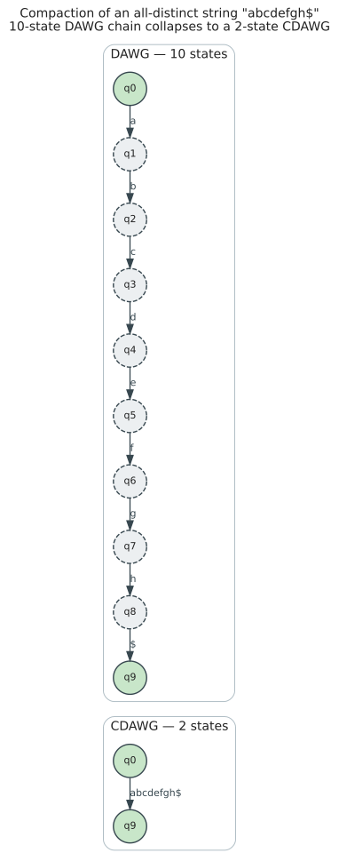

# Compact DAWG (CDAWG) Theory

The **Compact DAWG** (CDAWG), also called the **Compact Suffix Automaton**, reduces the suffix automaton's space by merging non-branching paths. This mirrors how suffix trees compact suffix tries.

## Motivation for Compaction

The suffix automaton has up to $`3n - 4`$ transitions for a string of length $`n`$. Many of these transitions form linear chains with no branching:

```math
\text{Before:}\quad q_0 \xrightarrow{a} q_1 \xrightarrow{b} q_2 \xrightarrow{c} q_3
\qquad\Longrightarrow\qquad
\text{After:}\quad q_0 \xrightarrow{abc} q_3
```

The intermediate states $`q_1`$ and $`q_2`$ serve no purpose if:
- They have exactly one incoming edge
- They have exactly one outgoing edge

By eliminating such states and replacing single-character edges with multi-character edges, we create the CDAWG.

## Primary and Secondary Edges

Not all edges can be compacted. We distinguish:

### Primary Edges

An edge from state `[x]` to `[xa]` is **primary** if `xa` is the **longest** string in class `[xa]`.

**Definition (Primary Edge)**:
```math
\text{Edge } [x] \xrightarrow{a} [xa] \text{ is primary} \iff xa = \text{longest}([xa])
```

Primary edges represent the "canonical" path to reach a state.

### Secondary Edges

An edge is **secondary** if it leads to a state where `xa` is NOT the longest string:

**Definition (Secondary Edge)**:
```math
\text{Edge } [x] \xrightarrow{a} [xa] \text{ is secondary} \iff xa \ne \text{longest}([xa])
```

Secondary edges "jump into" an equivalence class at a shorter string.

### Example: "abcabcab"

Consider state $`q_2 = \{b, ab\}`$ with $`\text{longest} = ab`$:

| Source | Edge | Target | xa | longest([xa]) | Type |
|--------|------|--------|-------|---------------|------|
| $`q_0`$ | b | $`q_2`$ | b | ab | Secondary |
| $`q_1`$ | b | $`q_2`$ | ab | ab | Primary |

The edge from $`q_0`$ labeled 'b' is secondary because $`b \ne ab = \text{longest}(q_2)`$.
The edge from $`q_1`$ labeled 'b' is primary because $`ab = ab = \text{longest}(q_2)`$.

### Properties of Primary Edges

**Lemma 1**: Each state (except the initial state) has exactly one incoming primary edge.

*Proof*: The longest string in each class is unique and has a unique predecessor.

**Lemma 2**: Primary edges form a spanning tree of the DAWG rooted at $`q_0`$.

This spanning tree corresponds to the **suffix tree** of the string!

## The Compaction Process

### Which States to Keep?

A state [x] is kept in the CDAWG if and only if:

1. It is the initial state $`q_0`$, OR
2. It is a **branching state**: has multiple outgoing edges, OR
3. It is an **accepting state**: represents a suffix of w, OR
4. It is a **merge point**: has multiple incoming edges (primary + secondaries)

Equivalently, a state is **removed** if it has exactly one incoming edge (primary) and exactly one outgoing edge (`in-degree = out-degree = 1`).

**Definition (CDAWG States)**:
```math
V_{\text{CDAWG}} = \{\, q \in Q_{\text{DAWG}} : \text{out-degree}(q) \ne 1 \text{ OR } \text{in-degree}(q) \ne 1 \text{ OR } q \text{ is accepting} \,\}
```

### Compacting Edges

When removing intermediate states, we concatenate edge labels:

```math
\text{Before:}\quad q_i \xrightarrow{a} q_j \xrightarrow{b} q_k \xrightarrow{c} q_l \quad (q_j, q_k \text{ non-branching})
\qquad\Longrightarrow\qquad
\text{After:}\quad q_i \xrightarrow{abc} q_l
```

Edge labels become **strings** rather than single characters.

### Edge Label Representation

To avoid O(n²) space for long labels, we represent each label as a pair (start, end) referencing the original string:

```
struct Edge {
    start: usize,   // Start position in original string
    end: usize,     // End position (exclusive)
    target: usize,  // Target state
}

// Label is w[start..end]
```

This maintains O(n) total space.

## CDAWG for "abcabcab"

Let's trace the compaction for w = "abcabcab\$" (with end marker):

### DAWG States

| State | end-pos | Factors | Branching? | Accepting? |
|-------|---------|---------|------------|------------|
| $`q_0`$ | $`\{0..9\}`$ | $`\{\varepsilon\}`$ | Yes (a,b,c) | No |
| $`q_1`$ | $`\{1,4,7\}`$ | $`\{a\}`$ | Yes (b,c) | No |
| $`q_2`$ | $`\{2,5,8\}`$ | $`\{b, ab\}`$ | Yes (c,\$) | No |
| $`q_3`$ | $`\{3,6\}`$ | $`\{c, bc, abc\}`$ | Yes (a,\$) | No |
| $`q_4`$ | $`\{4,7\}`$ | $`\{ca, bca, abca\}`$ | Yes (b,\$) | No |
| $`q_5`$ | $`\{5,8\}`$ | $`\{cab, bcab, abcab\}`$ | Yes (c,\$) | No |
| $`q_6`$ | $`\{6\}`$ | $`\{cabc, bcabc, abcabc\}`$ | Yes (a,\$) | No |
| $`q_7`$ | $`\{7\}`$ | $`\{cabca, bcabca, abcabca\}`$ | Yes (b,\$) | No |
| $`q_8`$ | $`\{8\}`$ | $`\{cabcab, bcabcab, abcabcab\}`$ | Yes (\$) | No |
| $`q_9`$ | $`\{9\}`$ | $`\{`$ `$`, `b$`, `ab$`, ... $`\}`$ | No | Yes |

In this example, most states have multiple outgoing edges (branching), so few can be removed.

### When Compaction Helps Most

Compaction provides the most benefit for strings with long non-repeating segments:



For highly repetitive strings (like our "abcabcab"), compaction provides less benefit.

## Formal CDAWG Definition

**Definition (CDAWG)**:

The CDAWG of string w is the directed graph **CDAWG(w) = (V, E)** where:

- $`V = \{\, [x] \in Q_{\text{DAWG}} : [x] \text{ satisfies the branching/accepting/merge condition} \,\}`$

- **E** = {([x], label, [y]) : there exists a path from [x] to [y] in DAWG
           where all intermediate states are non-branching}

- **label** = concatenation of edge labels along the compacted path

### Edge Types in CDAWG

Edges are still classified as primary or secondary:

- **Primary edge**: The path follows only primary DAWG edges
- **Secondary edge**: The path starts with a secondary DAWG edge

Secondary edges in CDAWG are represented differently:

```
Secondary CDAWG edge from [x] to [y]:
  - Target: [y]
  - Start position: same as if we followed primary path
  - Length: full string length (same as primary)
  - Offset: how far into the edge we "jump"
```

Alternatively, secondary edges can store their own (start, end) pair directly.

## Complexity Analysis

**Theorem 1** (Crochemore & Vérin 1997, [10.1007/3-540-63220-4_55](https://doi.org/10.1007/3-540-63220-4_55)):
For a string `w` of length `n`:
- `CDAWG(w)` has at most **`n + 1` nodes**.
- `CDAWG(w)` has at most **`2n − 2` edges**.

Compare to the DAWG's `2n − 1` nodes and `3n − 4` edges.

**Proof sketch**:
- Each CDAWG node corresponds to a branching point in the suffix tree.
- The suffix tree of `w` has exactly `n` leaves (one per suffix).
- A tree with `n` leaves has at most `n − 1` internal nodes.
- Adding the root yields at most `n` nodes for the internal structure, hence $`\le n + 1`$ overall.
- Each edge in the CDAWG corresponds to an edge in the suffix tree: at most `2n − 2`.

## Source and Sink

The CDAWG has two distinguished nodes:

### Source (Root)

The **source** represents the empty string $`\varepsilon`$:
- Initial state for all traversals
- Has no incoming edges
- Has outgoing edges for each character that starts some factor

### Sink

The **sink** represents the longest string (w itself with end marker):
- Final state representing the complete string
- Has no outgoing edges (or only self-loops for repeated suffixes)
- Reached by following the longest path from source

## Suffix Links in CDAWG

Suffix links are preserved but may "jump over" compacted states:

**Definition (CDAWG Suffix Link)**:
```math
\text{slink}_{\text{CDAWG}}([x]) = [y] \text{ where } [y] \text{ is the CDAWG node containing the suffix of } \text{shortest}([x])
```

If the original suffix link target was compacted away, we follow to the next CDAWG node.

### Example

If the DAWG has $`\text{slink}(q_3) = q_0`$,

and $`q_3`$ is kept in the CDAWG but $`q_0`$ is compacted into a longer path (unlikely for $`q_0`$, but possible for other states).

In practice, $`q_0`$ is always kept (it is the source), so suffix links usually point to CDAWG nodes directly.

## LRS (Longest Repeating Suffix) Property

A key property used in on-line construction:

**Definition (LRS)**: For a string `w`, the **longest repeating suffix** is the longest suffix of `w` that occurs more than once in `w`.

**Theorem 2**: In CDAWG(w), the node containing LRS(w) is exactly where:
- Suffix links from the sink node lead
- Or: the deepest node on the suffix link path from sink that isn't the sink itself

This property enables efficient on-line updates when adding characters.

## CDAWG vs Suffix Tree

The CDAWG and suffix tree are closely related:

| Property | Suffix Tree | CDAWG |
|----------|-------------|-------|
| Node count | $`\le 2n`$ | $`\le n + 1`$ |
| Edge count | $`\le 2n`$ | $`\le 2n - 2`$ |
| Edge labels | Substrings | Substrings |
| Suffix links | Yes | Yes |
| Factors recognized | All suffixes | All substrings |
| Deterministic | Yes | Yes |

The CDAWG is essentially the **minimal automaton** for the set of all substrings.

**Key Difference**:
- Suffix tree: each leaf = one suffix, internal nodes = branching points
- CDAWG: states = equivalence classes of factors, includes ALL substrings

## What's Still Missing?

The CDAWG supports efficient:
- Substring search (follow edges)
- Right extension (follow outgoing edge)

But it does NOT support:
- **Left extension**: prepending characters to navigate to longer strings

For bidirectional traversal, we need the **Symmetric** Compact DAWG (SCDAWG), covered next.

## Summary

| Concept | Definition |
|---------|------------|
| Primary edge | Edge where target's longest = source's longest + label |
| Secondary edge | Edge jumping into equivalence class at shorter string |
| Compaction | Remove states with `in-degree = out-degree = 1` |
| CDAWG node count | At most $`n + 1`$ |
| CDAWG edge count | At most $`2n - 2`$ |
| Source | Node for empty string |
| Sink | Node for complete string |

**Key insight**: Compaction reduces space while preserving the ability to recognize all substrings in $`O(\lvert \text{pattern}\rvert)`$ time.

**Next**: [04-scdawg](04-scdawg.md) - Adding left extensions for bidirectional search
