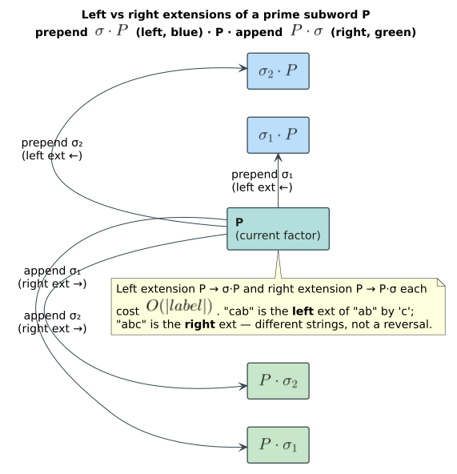
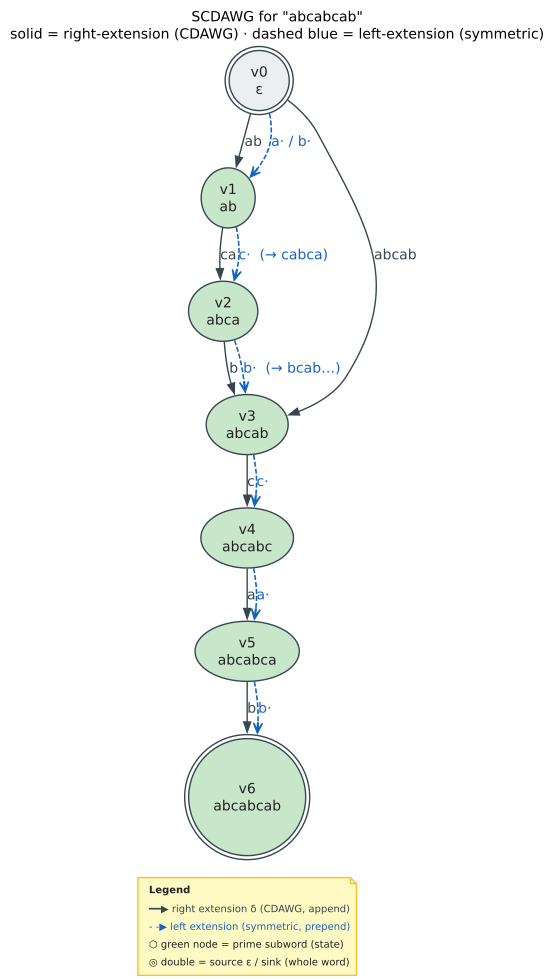
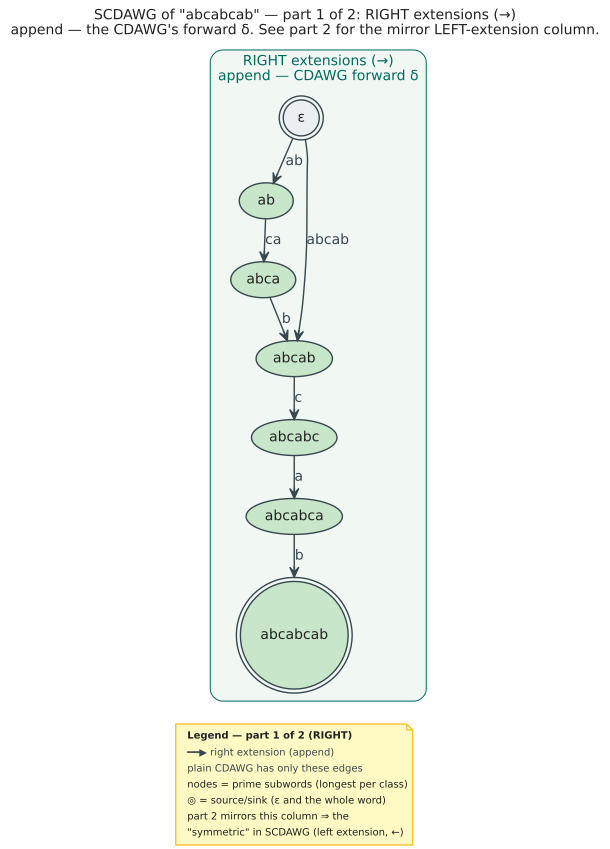
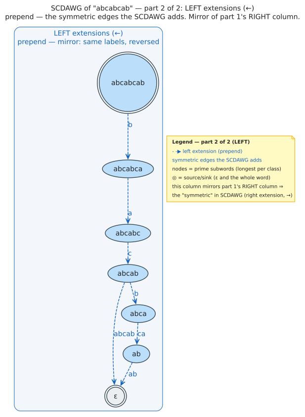

# Symmetric Compact DAWG (SCDAWG) Theory

The **Symmetric Compact DAWG** (SCDAWG), also called **C2S** (Compact Symmetric), extends the CDAWG with **left extension edges**, enabling bidirectional pattern navigation. This document covers the theoretical foundations of the SCDAWG as defined by Blumer et al. (1987, [10.1145/28869.28873](https://doi.org/10.1145/28869.28873)).

## Motivation: Bidirectional Search

The CDAWG supports efficient right extension:
```math
\text{Given pattern } V, \text{ navigate to } V \cdot \sigma \quad (\text{append character } \sigma)
```

But many algorithms need **left extension**:
```math
\text{Given pattern } V, \text{ navigate to } \sigma \cdot V \quad (\text{prepend character } \sigma)
```

### WallBreaker Example

The WallBreaker algorithm (Gerdjikov et al. 2013; see [07-references](07-references.md)) for fuzzy dictionary matching requires:

1. **Substring check**: Is V a substring of some dictionary word?
2. **Right extension**: from $`V`$, reach $`V \cdot \sigma`$
3. **Left extension**: from $`V`$, reach $`\sigma \cdot V`$

Without left extension, WallBreaker cannot efficiently grow pattern matches toward the left, limiting its applicability.

## Left Context and Right Context

The two contexts below are sometimes called the **right language** and **left language** of a factor — the sets of words that may legally follow it (append) or precede it (prepend) inside `w`. Right contexts drive standard (right-extension) navigation; left contexts are what the SCDAWG additionally indexes, over the alphabet $`\Sigma`$.

### Right Context (Review)

The **right context** (right language) of factor `x` is the set of strings that can follow `x`:

**Definition**:
```math
\text{right-context}(x) = \{\, y \in \Sigma^{*} : xy \in F(w) \,\}
```

For single characters:
```math
\text{right-context}_1(x) = \{\, a \in \Sigma : xa \in F(w) \,\}
```

### Left Context

The **left context** (left language) of factor `x` is the set of strings that can precede `x`:

**Definition**:
```math
\text{left-context}(x) = \{\, y \in \Sigma^{*} : yx \in F(w) \,\}
```

For single characters:
```math
\text{left-context}_1(x) = \{\, a \in \Sigma : ax \in F(w) \,\}
```

### Example for "abcabcab"

| Factor $`x`$ | $`\text{left-context}_1(x)`$ | $`\text{right-context}_1(x)`$ |
|----------|------------------|-------------------|
| a | $`\{\varepsilon, c\}`$ | $`\{b\}`$ |
| b | $`\{a\}`$ | $`\{c, \$\}`$ |
| c | $`\{b\}`$ | $`\{a, \$\}`$ |
| ab | $`\{\varepsilon, c\}`$ | $`\{c, \$\}`$ |
| bc | $`\{a\}`$ | $`\{a, \$\}`$ |
| ca | $`\{b\}`$ | $`\{b\}`$ |
| abc | $`\{\varepsilon, c\}`$ | $`\{a, \$\}`$ |

Where $`\varepsilon`$ represents the empty context (factor at string boundary).

## Prime Subwords and Implications

### Implication (imps)

For any factor x, its **implication** is the maximal string where every occurrence of x is embedded:

**Definition (Implication)**:
$`\text{imps}(x) = \gamma x \beta`$, where:
- $`\gamma`$ is the longest string such that, if $`x`$ occurs at position $`i`$, then $`\gamma`$ occurs at position $`i - \lvert \gamma\rvert`$
- $`\beta`$ is the longest string such that, if $`x`$ occurs at position $`i`$, then $`\beta`$ occurs at position $`i + \lvert x\rvert`$

In other words, $`\text{imps}(x)`$ is the longest string that occurs exactly where $`x`$ occurs.

### Properties of Implications

**Lemma 1**: `imps(x)` is unique and well-defined.

**Lemma 2**: `end-pos(x) = end-pos(imps(x))`

*Proof*: By definition, `imps(x)` occurs exactly where `x` occurs, so they have identical end-positions (`endpos` sets).

**Lemma 3**: $`\lvert \text{imps}(x)\rvert \ge \lvert x\rvert`$

*Proof*: `imps(x)` contains `x` ($`\gamma x\beta \supseteq x`$).

### Example: Implications for "abcabcab"

| Factor $`x`$ | Occurrences | $`\gamma`$ | $`\beta`$ | $`\text{imps}(x)`$ |
|----------|-------------|---|---|---------|
| a | 0,3,6 | $`\varepsilon`$ | b | ab |
| b | 1,4,7 | a | $`\varepsilon`$ | ab |
| ab | 0,3,6 | $`\varepsilon`$ | $`\varepsilon`$ | ab |
| c | 2,5 | ab | ab | abcab |
| bc | 1,4 | a | a | abca |
| abc | 0,3 | $`\varepsilon`$ | a | abca |
| ca | 2,5 | ab | b | abcab |

**Observation**: "a", "b", and "ab" all have $`\text{imps} = ab`$. This is because:
- Every 'a' is followed by 'b'
- Every 'b' is preceded by 'a'
- So $`\text{imps}(a) = \text{imps}(b) = \text{imps}(ab) = ab`$

### Prime Subwords

A factor `x` is a **prime subword** (or simply **prime**) if it equals its own implication — equivalently, it is the *longest* representative of its equivalence class and cannot be extended on either side without changing its `endpos` set:

**Definition (Prime Subword)**:
```math
x \text{ is prime} \iff \text{imps}(x) = x
```

**Definition (Prime Set)**:
```math
P(w) = \{\, x \in F(w) : x \text{ is prime} \,\} = \{\, \text{imps}(y) : y \in F(w) \,\}
```

### Properties of Prime Subwords

**Lemma 4**: The prime subwords are exactly the **longest representatives** of equivalence classes in the CDAWG.

*Proof*:
- If `x = longest([x])`, then no extension of `x` shares the same end-positions.
- Therefore $`\gamma = \beta = \epsilon`$ in the implication.
- So `imps(x) = x`, making `x` prime.

**Lemma 5**: $`\lvert P(w)\rvert \le \lvert w\rvert + 1`$ (same bound as CDAWG nodes).

**Lemma 6**: For any factor `x`, $`\text{imps}(x) \in P(w)`$.

### Prime Subwords for "abcabcab"

| Prime Subword | Equivalence Class |
|---------------|-------------------|
| $`\varepsilon`$ | $`\{\varepsilon\}`$ |
| ab | $`\{a, b, ab\}`$ |
| abca | $`\{bc, abc, bca, abca\}`$ |
| abcab | $`\{c, ca, cab, bcab, abcab\}`$ |
| abcabc | $`\{cabc, bcabc, abcabc\}`$ |
| abcabca | $`\{cabca, bcabca, abcabca\}`$ |
| abcabcab | $`\{cabcab, bcabcab, abcabcab\}`$ |

Each prime subword is the longest (and maximal) representative of its class.

## SCDAWG Definition

### Formal Definition

**Definition (SCDAWG)** from Blumer et al. (1987):

The **Symmetric Compact DAWG** of string w is the structure **C2S(w) = (V, E_R, E_L)** where:

- **V = P(w)** = set of prime subwords

- $`E_R`$ — right-extension edges: $`E_R = \{\, (x, \text{imps}(xa)) : x \in P(w),\ a \in \Sigma,\ xa \in F(w) \,\}`$; label derived from the transition (first character + suffix)

- $`E_L`$ — left-extension edges: $`E_L = \{\, (x, \text{imps}(ax)) : x \in P(w),\ a \in \Sigma,\ ax \in F(w) \,\}`$; label derived from the transition (prefix + first character)

### Edge Labels

Edge labels in the SCDAWG are not single characters but **substrings**.

**Right Extension Edge** from x to y = imps(xa):
```
Label = a || β_y

where β_y is the right context suffix added by imps
```

More precisely: if $`x \cdot a`$ leads to $`\text{imps}(xa) = \gamma (xa) \beta`$, then the label captures the transition.

**Left Extension Edge** from x to y = imps(ax):
```
Label = γ_y || a

where γ_y is the left context prefix added by imps
```

### Visual Representation

For a prime subword P, its edges form:



Each prime subword has:
- Right edges for each valid right extension character.
- Left edges for each valid left extension character.

The figure below renders the full SCDAWG for the running example `abcabcab`. Solid dark edges are the CDAWG's right-extension transitions; the dashed blue edges are the **symmetric left-extension edges** the SCDAWG adds. Together they let a matched factor be grown to the right (append) or to the left (prepend) in $`O(\lvert \text{label}\rvert )`$ per step — the bidirectional capability the plain CDAWG lacks.



## The Symmetry Property

The SCDAWG is "symmetric" in a precise sense:

**Theorem 1 (Symmetry)**:
```math
\text{CDAWG}(w) \text{ with left-extension edges} = \text{CDAWG}(w^{\text{rev}}) \text{ with reversed edge direction}
```

Where w^rev is the reversal of w.

### Sext Links = CDAWG(w^rev) Edges

**Definition (Sext Link)**: The **shortest extension link** (sext link) from node `x` is the edge in `CDAWG(wʳᵉᵛ)` that corresponds to `x`, where `wʳᵉᵛ` denotes the reversal of `w`.

**Theorem 2** (Inenaga et al. 2001, [10.1109/SPIRE.2001.989743](https://doi.org/10.1109/SPIRE.2001.989743)):
```math
\text{Left-extension edges of CDAWG}(w) = \text{Edges of CDAWG}(w^{\text{rev}}) \text{ (with reversed direction)}
```

This is a crucial insight: **we can derive left extension edges from the CDAWG of the reversed string**.

### Implications for Construction

This symmetry means:
1. Build CDAWG(w) normally
2. Left extension edges can be derived from suffix link structure
3. No need to explicitly build CDAWG(w^rev)

## Connection to Suffix Links

### Reversed Suffix Links

**Lemma 7**: If `slink(x) = y` in the CDAWG, then there exists a left extension edge from `y` to `x`.

*Proof sketch*:
- `slink(x) = y` means `y` is a suffix of `x`.
- $`x = \alpha \cdot y`$ for some non-empty $`\alpha`$.
- The first character of $`\alpha`$ provides the left extension from `y` to `x`.

### Building Left Extensions from Suffix Links

For each suffix link slink(x) = y:
```
x = α · y  (for some prefix α)

Left extension edge: y --first(α)--> x
```

Where $`\text{first}(\alpha)`$ is the first character of $`\alpha`$.

**Algorithm**:
```
for each node x in CDAWG:
    if slink(x) = y exists:
        α = x[0..|x|-|y|]  // prefix dropped by suffix link
        add left_edge(y, first(α)) = x
```

## SCDAWG for "abcabcab"

### Nodes (Prime Subwords)

| Node | Prime Subword | Length |
|------|---------------|--------|
| $`v_0`$ | $`\varepsilon`$ | 0 |
| $`v_1`$ | ab | 2 |
| $`v_2`$ | abca | 4 |
| $`v_3`$ | abcab | 5 |
| $`v_4`$ | abcabc | 6 |
| $`v_5`$ | abcabca | 7 |
| $`v_6`$ | abcabcab | 8 |

### Right Extension Edges

| From | Char | To | Label |
|------|------|----|-------|
| $`v_0`$ | a | $`v_1`$ | ab |
| $`v_0`$ | b | $`v_1`$ | ab |
| $`v_0`$ | c | $`v_3`$ | abcab |
| $`v_1`$ | c | $`v_2`$ | ca |
| $`v_2`$ | b | $`v_3`$ | b |
| $`v_3`$ | c | $`v_4`$ | c |
| $`v_4`$ | a | $`v_5`$ | a |
| $`v_5`$ | b | $`v_6`$ | b |

### Left Extension Edges

| From | Char | To | Label |
|------|------|----|-------|
| $`v_0`$ | a | $`v_1`$ | ab |
| $`v_0`$ | b | $`v_1`$ | ab |
| $`v_0`$ | c | $`v_3`$ | abcab |
| $`v_1`$ | c | $`v_2`$ | ca |
| $`v_2`$ | b | $`v_3`$ | b |
| $`v_3`$ | c | $`v_4`$ | c |
| $`v_4`$ | a | $`v_5`$ | a |
| $`v_5`$ | b | $`v_6`$ | b |

Note: For this particular string, right and left extensions have similar structure due to its repetitive nature.

### The Two Extension Graphs




## Complexity Analysis

**Theorem 3** (Blumer et al. 1987, [10.1145/28869.28873](https://doi.org/10.1145/28869.28873)):
For string `w` of length `n`:
- `SCDAWG(w)` has at most **`n + 1` nodes**.
- `SCDAWG(w)` has at most **`4n − 4` edges** (`2n − 2` right + `2n − 2` left).

Space is $`O(n)`$, same as the CDAWG but with a doubled edge count.

## Comparison: Left Extension vs Backward Edges

A common implementation mistake is confusing **left extension edges** with **backward edges** (reverse of forward edges):

### Backward Edges (WRONG for bidirectional search)

If we have forward edge A →c→ B:
```
Backward edge: B →c→ A
```

This just reverses the forward path. It does NOT implement left extension.

### Left Extension Edges (CORRECT)

Left extension edge from $`A`$ to $`B`$ with label $`\sigma`$:
```
A represents pattern "xyz"
B represents pattern "σxyz" (σ prepended, NOT appended)
```

This is a fundamentally different operation.

### Example

Consider pattern "ab" (node for prime "ab"):
- **Right extension** 'c': leads to pattern "abc"
- **Left extension** 'c': leads to pattern "cab"
- **Backward edge** (wrong): would try to go "back" to 'a' or 'b'

Backward edges traverse the same strings in reverse. Left extensions navigate to DIFFERENT strings with characters prepended.

## WallBreaker Requirements Satisfied

The SCDAWG satisfies all WallBreaker requirements from Gerdjikov et al. (2013, see [07-references](07-references.md)):

| Requirement | Operation | SCDAWG Support |
|-------------|-----------|----------------|
| **(1a)** | Is V a substring? | Follow right edges from root; success = found |
| **(1b)** | Right extend $`V \to V \cdot \sigma`$ | Follow the right-extension edge labelled $`\sigma`$ |
| **(1c)** | Left extend $`V \to \sigma \cdot V`$ | Follow the left-extension edge labelled $`\sigma`$ |

All operations complete in $`O(\lvert \text{label}\rvert )`$ time, where `label` is the edge-label length.

## Summary

| Concept | Definition |
|---------|------------|
| Left context | Characters that can precede a factor |
| Right context | Characters that can follow a factor |
| Implication $`\text{imps}(x)`$ | Maximal $`\gamma x \beta`$ with the same occurrences as $`x`$ |
| Prime subword | Factor equal to its implication |
| Right extension edge | From x to imps(xa), appending |
| Left extension edge | From x to imps(ax), prepending |
| Symmetry | Left edges = CDAWG(w^rev) edges |

**Key insight**: The SCDAWG enables bidirectional pattern growth by adding left extension edges derived from the suffix link structure.

**Next**: [05-construction](05-construction.md) - On-line algorithm to build the SCDAWG
