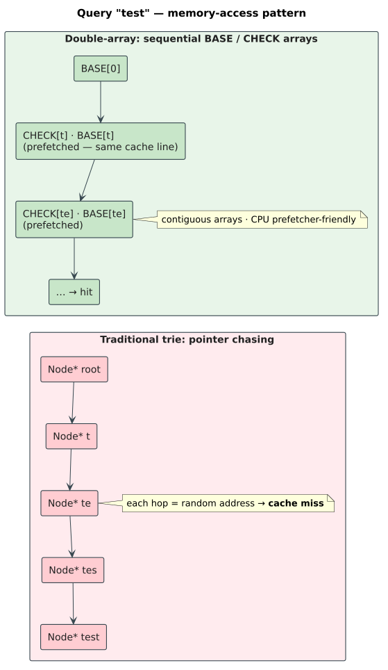

# Double-array tries

**Navigation**: [← DAWG minimization](01-dawg-minimization.md) · [Bloom filters →](03-bloom-filters.md)

A **double-array trie** (DAT) stores a trie in two parallel integer arrays so that a transition is an
array index, not a pointer chase. It is the theory behind libdictenstein's fastest, most compact
read-mostly backend ([double-array-trie.md](../../algorithms/implementations/double-array-trie.md)).
This document develops the `BASE`/`CHECK` representation, the arithmetic transition, collision
resolution during construction, and the compact refinement the crate's layout draws on. Notation
follows [`docs/notation.md`](../../notation.md).

## The representation

Number the trie states $`0, 1, 2, \dots`$. A double-array trie keeps two integer arrays indexed by
state:

- $`\mathrm{BASE}[s]`$ — a per-state offset into the arrays.
- $`\mathrm{CHECK}[t]`$ — the state that "owns" slot `t`, used to validate a transition.

For a unit `c` with numeric code $`\mathrm{code}(c)`$ (its `to_dat_offset`), the child of state `s`
on `c` is found **arithmetically**:

```math
t = \mathrm{BASE}[s] + \mathrm{code}(c), \qquad
s \xrightarrow{c} t \iff \mathrm{CHECK}[t] = s
```

There is no child list to search and no pointer to dereference: compute `t`, read one `CHECK` slot,
compare. The invariant $`\mathrm{CHECK}[t] = s`$ is what distinguishes a real edge from an array slot
that merely happens to fall at index `t` for some *other* parent — it is the guard that makes the
shared arrays unambiguous.



## Why it is fast

Because $`\mathrm{BASE}[s]`$ and the candidate slot $`t = \mathrm{BASE}[s] + \mathrm{code}(c)`$ live
in the same contiguous arrays, a transition typically touches a **single cache line** and is
prefetcher-friendly, whereas a pointer-based trie chases a fresh, likely-uncached address at every
level. Empirically this is several times faster on lookups, at roughly **8 bytes per state** (two
32-bit array entries). Membership is $`O(\lvert q\rvert)`$ with an $`O(1)`$, branch-light step per
unit — the defining appeal of the structure (Aoe 1989,
[10.1109/32.31365](https://doi.org/10.1109/32.31365)).

## Construction and collision resolution

The difficulty is *placing* states: choosing each $`\mathrm{BASE}[s]`$ so that the children of `s`
land in currently-free slots without clobbering slots owned by another parent. For a state `s` with
child-unit set $`C = \{c_1, \dots, c_k\}`$, a base value `b` is **admissible** iff every target slot
is free:

```math
\forall\, c \in C : \big(b + \mathrm{code}(c) \ge 0\big) \ \wedge\ \mathrm{slot}\ b + \mathrm{code}(c)\ \text{is unused}
```

Construction searches for an admissible `b` — exactly the open-addressing problem of a hash table.
When no `b` leaves all `k` targets free, the builder **relocates**: it picks a new base, moves the
already-placed children to the slots the new base implies, and fixes up their `CHECK` entries and
their own subtrees' parent references. Choosing bases that minimize both collisions and the total
array length is what makes construction the expensive phase; the crate builds from a **sorted,
de-duplicated** term list to make placement regular (see
[double-array-trie.md](../../algorithms/implementations/double-array-trie.md#construction-algorithm)).

Because relocation rewrites already-placed structure, the double-array trie is **insert-only**: adding
a term at runtime is cheap, but *removing* one would require reclaiming and possibly relocating slots,
so deletion is not supported — use a [DAWG](01-dawg-minimization.md) when you need runtime removal.

## Keeping character codes compact (Yata et al.)

A naive double array indexes slots by the raw unit code, which for a large alphabet (Unicode scalar
values, up to $`\mathrm{0x10FFFF}`$) can spread the arrays across a huge index range. Yata et al.
(2007, [10.1016/j.ipm.2006.04.004](https://doi.org/10.1016/j.ipm.2006.04.004)) give a **compact
static** double-array that keeps the character codes densely, which is the refinement libdictenstein's
read-mostly `char` layout draws on. The practical consequence — and a security note — is that
building a `char` DAT from adversarially high-codepoint keys still costs arena space proportional to
the codepoint range; see
[security/untrusted-input.md](../../security/untrusted-input.md#the-one-real-amplification-char-double-array-construction).
Reads remain safe regardless: the transition computes $`\mathrm{BASE}[s] + \mathrm{code}(c)`$ with a
wrapping add and then bounds-checks against the array length, so an out-of-range index yields a
rejected transition, never an out-of-bounds access.

## Complexity summary

Let `N` be the number of terms and `n` the total units.

| Operation | Cost |
|-----------|------|
| Lookup (`contains`, one transition per unit) | $`O(\lvert q\rvert)`$, $`O(1)`$ per step |
| Construction (`from_terms`) | $`O(N \log N)`$ to sort, plus placement/relocation |
| Space | $`\approx 8`$ bytes/state (two 32-bit arrays), plus per-state edge/value side data |
| Remove | unsupported (insert-only) |

## In this crate

The generic core is `DATCoreShared<U, V>`
([`src/double_array_trie/core/shared.rs`](../../../src/double_array_trie/core/shared.rs)): five
`Arc<Vec<…>>` arrays (`base`, `check`, `is_final`, an explicit per-state `edges` list to avoid
scanning the whole code range, and `values`). The `Arc` sharing makes a clone $`O(1)`$ and lets
readers run without synchronization — the DAT has no writer path and is immutable after construction
(see [architecture §3d](../../architecture/in-memory-dictionaries.md#3d-the-immutable-outlier-doublearraytrie)).

## References

- Aoe, J. (1989). *An Efficient Digital Search Algorithm by Using a Double-Array Structure.* IEEE
  Transactions on Software Engineering 15(9). [10.1109/32.31365](https://doi.org/10.1109/32.31365)
- Yata, S., et al. (2007). *A Compact Static Double-Array Keeping Character Codes.* Information
  Processing & Management 43(1). [10.1016/j.ipm.2006.04.004](https://doi.org/10.1016/j.ipm.2006.04.004)
- Fredkin, E. (1960). *Trie Memory.* Communications of the ACM 3(9).
  [10.1145/367390.367400](https://doi.org/10.1145/367390.367400)
