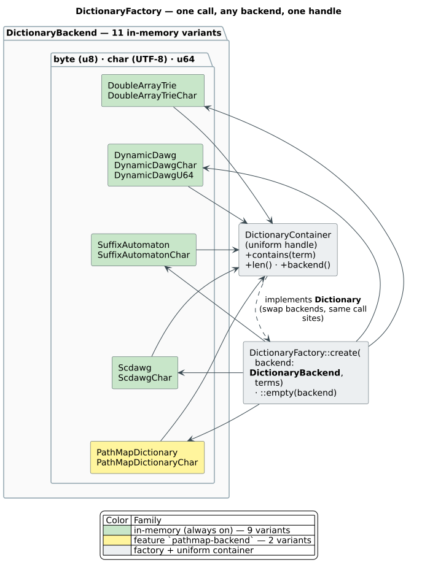
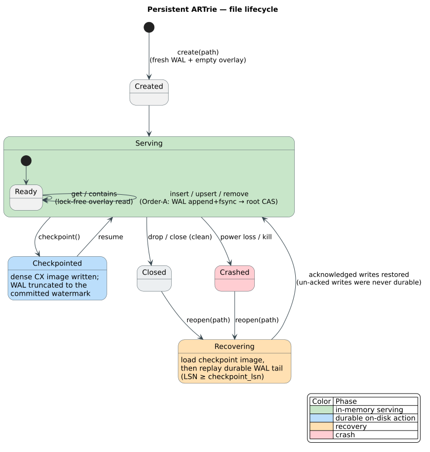

# Dictionary Backend Guide

This guide explains the dictionary backends provided by **libdictenstein** and
how to choose between them. libdictenstein is the container layer: it stores and
traverses dictionaries. Fuzzy matching is supplied by a caller or by the
companion `liblevenshtein` crate, which can walk any `Dictionary` implementation.

## Selection Summary

| Need | Recommended backend |
|------|---------------------|
| Fastest static/read-mostly exact traversal | `DoubleArrayTrie` or `DoubleArrayTrieChar` |
| Runtime insert and remove | `DynamicDawg`, `DynamicDawgChar`, or `PathMapDictionary` |
| Runtime token/time-series labels | `DynamicDawgU64` |
| In-memory substring search | `SuffixAutomaton` / `SuffixAutomatonChar` |
| Compact bidirectional substring index | `Scdawg` / `ScdawgChar` |
| Durable key/value dictionary | `PersistentARTrie` / `PersistentARTrieChar` |
| Durable native `u64` sequence keys | `PersistentARTrieU64Compact` |
| Durable term-to-id vocabulary | `PersistentVocabARTrie` |
| Durable substring index | `PersistentSuffixAutomaton`, `PersistentSuffixTree`, or `PersistentScdawg` |

Use byte-level backends for ASCII, byte protocols, and maximum compactness. Use
`Char` variants when edit/traversal units must be Unicode scalar values. Use
`u64` variants for token streams or time-series labels that should not be
expanded into bytes.

## In-Memory Backends

All in-memory backends are constructed through one call,
[`DictionaryFactory::create`](../../src/factory.rs) (or `::empty`), which selects a
backend by the [`DictionaryBackend`](../../src/factory.rs) enum and returns a uniform
`DictionaryContainer` handle — so call sites can swap backends without changing code:



### DoubleArrayTrie / DoubleArrayTrieChar

Double-array tries pack the trie into BASE/CHECK arrays. They are the default
choice for static or append-mostly dictionaries because transition lookup is
cache-friendly and compact.

```rust
use libdictenstein::double_array_trie::DoubleArrayTrie;
use libdictenstein::Dictionary;

let dict = DoubleArrayTrie::from_terms(vec!["test", "testing", "tester"]);
assert!(dict.contains("testing"));
```

Choose this when the dictionary is read-heavy and you do not need full removal.
Choose `DoubleArrayTrieChar` for Unicode scalar traversal.

### DynamicDawg / DynamicDawgChar / DynamicDawgU64

Dynamic DAWGs support insert and remove while sharing suffixes. They are the
general mutable in-memory choice.

```rust
use libdictenstein::dynamic_dawg::DynamicDawg;
use libdictenstein::{Dictionary, MutableDictionary};

let dict = DynamicDawg::new();
dict.insert("testing");
dict.remove("testing");
assert!(!dict.contains("testing"));
```

`DynamicDawgU64` uses native `u64` edge labels for token sequences and
time-series-style keys.

### SuffixAutomaton / SuffixAutomatonChar

Suffix automata index substrings, not only terms from the root. Use them when a
query should match inside stored text.

```rust
use libdictenstein::suffix_automaton::SuffixAutomaton;

let index = SuffixAutomaton::from_source_text("contest testing");
assert!(index.contains_substring("test"));
```

### Scdawg / ScdawgChar

SCDAWG variants are compact symmetric suffix indexes with bidirectional
substring operations. They are useful for static substring workloads that care
about compact graph structure and left/right extension metadata.

### PathMapDictionary / PathMapDictionaryChar

Enable `pathmap-backend` for structurally shared mutable tries. PathMap
snapshots are useful when the caller already owns a `pathmap` trie and wants to
query it through libdictenstein traits without copying.

## Persistent Backends

Enable the `persistent-artrie` feature for disk-backed dictionaries. Persistent
backends expose `create`, `open`, `open_with_recovery`, and `checkpoint` APIs
because file lifecycle and recovery are part of their contract.



The same lifecycle holds for every persistent family (ARTrie, vocabulary, and the
native suffix graphs): a clean `close` and a `crash` both recover through
`open`/`open_with_recovery`, which loads the last checkpoint image and replays the
durable WAL tail — acknowledged writes survive, un-acknowledged writes were never
durable.

### PersistentARTrie / PersistentARTrieChar

These are crash-durable key/value tries backed by a lock-free overlay, a
write-ahead log, and CX checkpoint images. Writers append the WAL record before
publishing through root CAS; readers traverse the published overlay without a
global mutation lock.

```rust,no_run
use libdictenstein::persistent_artrie::char::PersistentARTrieChar;

# fn main() -> Result<(), Box<dyn std::error::Error>> {
let trie = PersistentARTrieChar::<u64>::create("words.artc")?;
trie.upsert("alpha", 1)?;
trie.checkpoint()?;

let reopened = PersistentARTrieChar::<u64>::open("words.artc")?;
assert_eq!(reopened.get("alpha"), Some(1));
# Ok(())
# }
```

### PersistentARTrieU64Compact / PersistentARTrieU64Prefix3Compat

`PersistentARTrieU64Compact` is the default native `u64` sequence-key profile.
It uses `U64Key`, shared overlay nodes, shared WAL records, and a prefix-4 CX
checkpoint budget. It is intended for token streams and time-series keys where a
single label is already 64 bits, including `f64::to_bits()` payloads.

`PersistentARTrieU64Prefix3Compat` opens prefix-3 CX images and provides a
stable benchmark/control profile. Prefer `PersistentARTrieU64Compact` for new
data.

```rust,no_run
use libdictenstein::persistent_artrie::PersistentARTrieU64Compact;

# fn main() -> Result<(), Box<dyn std::error::Error>> {
let trie = PersistentARTrieU64Compact::<u64>::create("series.ar64")?;
let key = [42, 1_700_000_000_000_000_000, f64::to_bits(7.25)];
trie.insert_sequence_with_value(&key, f64::to_bits(7.25));
trie.checkpoint()?;
assert!(PersistentARTrieU64Compact::<u64>::open("series.ar64")?.contains_sequence(&key));
# Ok(())
# }
```

### PersistentVocabARTrie

`PersistentVocabARTrie` is a durable UTF-8 vocabulary. Forward lookup maps
`term -> u64` through the lock-free char overlay; reverse lookup maps
`u64 -> term` through an in-memory reverse map rebuilt from checkpoint and WAL
state on reopen.

### Persistent Suffix Graphs

The persistent suffix family stores native substring graphs instead of encoding
suffixes as artificial ARTrie keys.

| Backend | Use when | Representation |
|---------|----------|----------------|
| `PersistentSuffixAutomaton` / `Char` | You want the suffix-automaton API on disk | Native suffix graph snapshot + operation-segment WAL |
| `PersistentSuffixTree` / `Char` | You want suffix-tree-compatible handles, frequencies, and locations | Path-compressed suffix tree snapshot + operation-segment WAL |
| `PersistentScdawg` / `Char` | You want compact SCDAWG substring locations | Native compact SCDAWG snapshot + operation-segment WAL |

Reads traverse immutable snapshots without taking a writer lock. Writes rebuild
a graph revision, publish the winning copy by CAS, and wait for WAL durability
before acknowledgement.

```rust,no_run
use libdictenstein::persistent_artrie::PersistentScdawgChar;

# fn main() -> Result<(), Box<dyn std::error::Error>> {
let index = PersistentScdawgChar::<u64>::create("docs.pscdawg")?;
index.insert_with_value("the quick brown fox", 7);
assert!(index.contains_substring("quick"));
assert_eq!(index.locations("brown"), vec![("the quick brown fox".to_string(), 10)]);
index.checkpoint()?;
# Ok(())
# }
```

## Feature Flags

```toml
[dependencies]
libdictenstein = { version = "0.1", features = ["persistent-artrie"] }
```

| Feature | Effect |
|---------|--------|
| `default` | Enables `parking_lot` synchronization support |
| `pathmap-backend` | Enables `PathMapDictionary` and `PathMapDictionaryChar` |
| `serialization` | Enables Serde and compact bincode helpers |
| `protobuf` | Enables portable Protocol Buffers persistence |
| `compression` | Enables gzip around bincode or protobuf |
| `persistent-artrie` | Enables all disk-backed ARTrie, vocab, and suffix graph backends |
| `io-uring-backend` | Adds Linux `io_uring` block storage for persistent backends |
| `parallel-merge` | Enables Rayon-backed merge helpers |
| `group-commit` | Experimental WAL batching; re-benchmark before use |
| `bench-internals` | Exposes internal APIs for benchmarks only |

## Decision Notes

- Use `PersistentARTrieChar` for durable Unicode key/value dictionaries.
- Use `PersistentARTrieU64Compact` for durable token or time-series sequences.
- Use persistent suffix graph variants for durable substring search.
- Use `PersistentVocabARTrie` only when the value space is the vocabulary id;
  for arbitrary values, use `PersistentARTrieChar<V>`.
- Do not describe persistent suffix graph writes as wait-free: their reads are
  snapshot/non-blocking, while writes rebuild and CAS-publish a graph revision
  after durable operation logging.

## Related Documentation

- [README persistent section](../../README.md#persistent-artrie--lock-free--durable)
- [Persistence architecture](../persistence/README.md)
- [Persistent ARTrie theory](../theory/disk-tries/06-persistent-artrie-design.md)
- [Benchmark ledgers](../experiments/)
